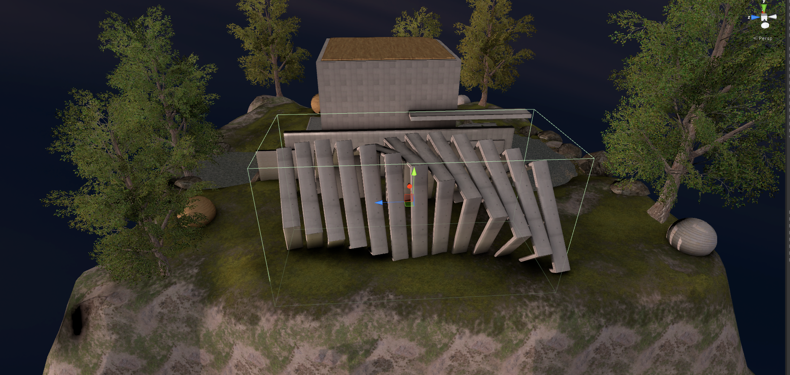

# Introduction to acoustics
The Unity plugin developed as part of Project Acoustics provides occlusion, obstruction, reverberation, and spatialization. A new way to design dynamic acoustics. Experience smooth wave effects, true occlusion, and portaling without drawing reverb zones, tedious markup, or run-time ray tracing.

## Today's approach to acoustics
Let's revisit today's common approach to acoustics. In the existing approach, you draw reverb volumes:

Then you tweak parameters for each zone:

Then you may have to create and align some box-colliders to turn reverb zones off and on, usually to prevent bleed from one reverb zone to another:

Finally, engage the developer team to add ray-tracing logic to get the right occlusion/obstruction filtering throughout the scene.

## Physics-based design
With our approach, you provide a static scene’s shape and its materials. A simplified or watertight acoustics mesh is not required. Azure then analyzes and "bakes" the scene’s acoustics using numerous volumetric wave simulations. At runtime, for a dynamic source and listener location, we lookup the baked data for occlusion, obstruction, direction, and reverberation parameters. The effects can be used as-is, or designed using our tools to meet your artistic goals.

This Designer Preview is your portal to materials-based design for your Unity title. Its design process helps you scale faster to large scenes, respond quickly to level-design changes, and achieve greater player immersion through more detailed designs.

## Next steps
Try out acoustics [here](GettingStarted.md).