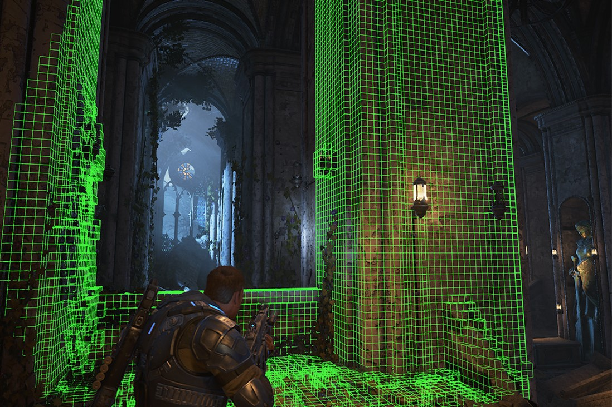

# What is Project Acoustics?
Project Acoustics is a wave acoustics engine for 3D interactive experiences. It models wave effects like diffraction, portaling and reverb effects in complex scenes without requiring manual zone markup. It also includes game engine and audio middleware integration. Project Acoustics' philosophy is similar to static lighting: bake detailed physics offline to provide a physical baseline, and use a lightweight runtime with expressive design controls to meet your artistic goals.

## Using wave physics for interactive acoustics
Ray-based acoustics methods can check for occlusion using a single source-to-listener ray cast, or drive reverb by estimating local scene volume with a few rays. But these techniques can be unreliable because a pebble occludes as much as a boulder. Rays don't account for the way sound bends around objects, a phenomenon known as diffraction. Project Acoustics' simulation captures these effects using a wave-based simulation. The result is more predictable and reliable.

Project Acoustics' key innovation is to couple acoustic simulation with traditional sound design concepts. It translates simulation results into traditional audio DSP parameters for occlusion, portaling and reverb. The designer uses controls over this translation process. For more details on the core technologies behind Project Acoustics, visit the [research project page](https://www.microsoft.com/en-us/research/project/project-triton/).

## Setup
[Project Acoustics Unity integration](unity-integration.md) is drag-and-drop and includes a Unity audio engine plugin. Augment the Unity audio source controls by attaching a Project Acoustics C# controls component to each audio object.

[Project Acoustics Unreal integration](unreal-integration.md) includes editor and game plugins for Unreal, and a Wwise mixer plugin. A custom audio component extends familiar Wwise functionality within Unreal with live acoustics design controls. Design controls are also exposed in Wwise on the mixer plugin.

## Workflow
* **Pre-bake:** Start with setting up the bake by selecting which geometry responds to acoustics, by, for example, ignoring light shafts. Then edit automatic material assignments and selecting navigation areas to guide listener sampling. There's no manual markup for reverb/portal/room zones.
* **Bake:** An analysis step is run locally, which does voxelization and other geometric analysis on the scene based on selections above. Results are visualized in editor to verify scene setup. On bake submission, voxel data is sent off to Azure and you get back an acoustics game asset.
* **Runtime:** Load the asset into your level, and you're ready to listen to acoustics in your level. Design the acoustics live in editor using granular per-source controls. The controls can also be driven from level scripting.

## Platforms
The Project Acoustics runtime plugins can currently be deployed to the following platforms:
* Windows
* Android
* Xbox One

## Download
* [Project Acoustics Unity plugin and samples](https://www.microsoft.com/en-us/download/details.aspx?id=57346)
* [Project Acoustics Unreal & Wwise plugins and samples](https://www.microsoft.com/download/details.aspx?id=58090)
  * For Xbox binaries and support, contact us via the Sign Up form below

## Contact us
* [Project Acoustics discussion and issue reporting](https://github.com/microsoft/ProjectAcoustics/issues)
* [Sign up to receive updates on Project Acoustics](https://forms.office.com/Pages/ResponsePage.aspx?id=v4j5cvGGr0GRqy180BHbRwMoAEhDCLJNqtVIPwQN6rpUOFRZREJRR0NIQllDOTQ1U0JMNVc4OFNFSy4u)

## Next steps
* Try a [Project Acoustics quickstart for Unity](unity-quickstart.md) or for [Unreal](unreal-quickstart.md)
* Explore the [sound design philosophy of Project Acoustics](design-process.md)

