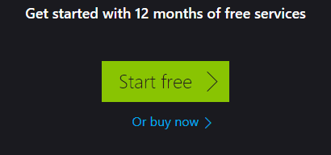
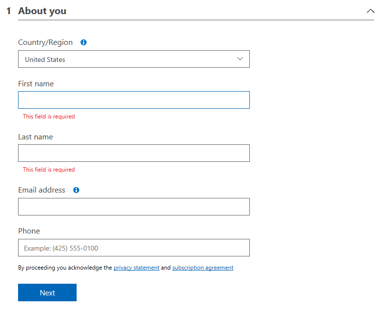
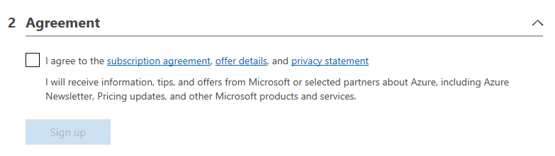
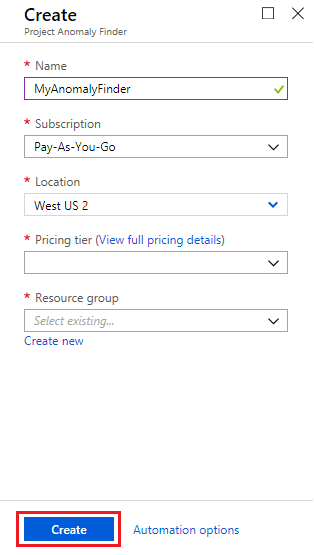

# Try Anomaly Finder for free

Getting started with Anomaly Finder is easy and free. You can sign up for a Microsoft Azure account—it comes with a $200  service credit that you can apply toward an Anomaly Finder subscription for up to 30 days.

Addtionally, Anomaly Finder offers a free, low-volume tier that's suitable for developing applications. You can keep this free subscription even after your service credit expires.

## New Azure account

> ### If you already have an Azure account, please go to the next step: [Create an Anomaly Finder Resource](#jump)

New Azure accounts receive a $200 service credit that is available for up to 30 days. You can use this credit to further explore the Anomaly Finder service or to begin application development.

To sign up for a new Azure account:

1. Go to the [Azure sign-up page](https://azure.microsoft.com/free/ai/). 

1. Select **Start free**.

    

1. Sign in with your Microsoft account. If you don't have one:

    * Go to the [Microsoft account portal](https://account.microsoft.com/account).
    * Select **Sign in with Microsoft**.
    * When asked to sign in, select **Create one.**
    * In the steps that follow, enter your e-mail address or phone number, assign a password, and follow the instructions to verify your new Microsoft account.

1. Enter the remaining requested information to sign up for an account. Specify your country and your name and provide a phone number and e-mail address.

    

    Verify your identity by phone and by providing a credit card number. (Your credit card will not be billed.) Then, accept the Azure user agreement. 

    

Your free Azure account is created. Follow the steps in the next section to start a subscription to the Anomaly Finder service.

##  Create an Anomaly Finder resource in Azure

To add an Anomaly Finder resource to your Azure account:

1. Because of the nature of private preview, your Azure subscription needs to be manually whitelisted by us. Contact kenshoteam@microsoft.com for this, if you have not already done so.

2. Use this link: [http://aka.ms/anomaly-finder](http://aka.ms/anomaly-finder) and sign in with your Microsoft account.

3. Under **Create** blade, enter:

    * A name for the new resource. The name helps you distinguish among multiple subscriptions to the same service.
    * Choose the Azure subscription that the new resource is associated with to determine how fees are billed. **Select the subscription that has been whitelisted.**
    * Choose the region where the resource will be used. Currently, the Anomaly Finder service is ONLY available in **West US 2** region.
    * Choose the pricing tier, either F0 (limited free subscription, only 1 resource per subscription is allowed). Select **View full pricing details** for complete information about pricing and usage quotas for each tier.
    * Create a new resource group for this Anomaly Finder subscription or assign the subscription to an existing resource group. Resource groups help you keep your various Azure subscriptions organized.
    * For convenient access to your subscription, select the **Pin to dashboard** check box on the top-right of the notification.
    * Select **Create.**

    

    It can take a few minutes to create and deploy your new Anomaly Finder resource. You can view the progress by clicking 'Notifications' on the top-right of navigation bar. When deployment is successful, select **Go to resource** to see information about your new resource.

    

4. Under **Quickstart**, select the **Keys** link under step 1 to display your subscription keys. Each subscription has two keys; you can use either key in your application. Select the button next to each key to copy it to the clipboard for pasting into your code.

> [!NOTE]
> You can create an unlimited number of standard-tier subscriptions in one or multiple regions. However, you can create only one free-tier subscription.

## Next steps

If you have 5 minutes and want to see a demo, we have a web hosted Jupyter notebook to let you run the sample code and see how the APIs work. Please click [https://notebooks.azure.com/AzureAnomalyDetection/projects/anomalyfinder](https://notebooks.azure.com/AzureAnomalyDetection/projects/anomalyfinder) and complete the following steps.

1.	Sign in
2.	Clone
3.	In your cloned project space, click “Run on free compute”
4.	Open one of the notebook, for example, Anomaly Finder API Example Private Preview (Batch Method).ipynb
5.	Fill in the key in cell containing:  subscription_key = '' #Here you have to paste your primary key. You can get the key following the instructions on [obtaining a subscription key](How-to/get-subscription-key.md)
6.	In the Notebook main menu, Cell->run all

## What else you can do

Get your hands dirty with the e2e tutorials for different programming languages:

* [python-app](../tutorials/python-tutorial.md)
* [C# app](../tutorials/csharp-tutorial.md)
* [Java app](../tutorials/java-tutorial.md)
* [JavaScript app](../tutorials/javascript-tutorial.md)

