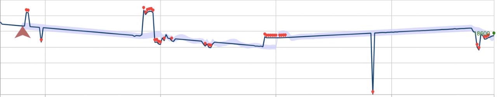
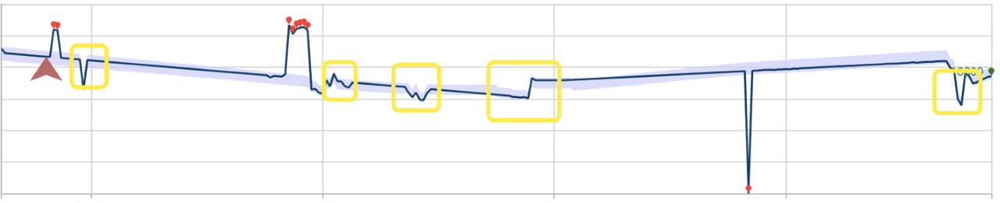

# Best practices for using the Anomaly Detector API

The Anomaly Detector API is a stateless anomaly detection service. The accuracy and performance of its results can be impacted by:

* How your time series data is prepared.
* The Anomaly Detector API parameters that were used.
* The number of data points in your API request. 

Use this article to learn about best practices for using the API getting the best results for your data. 

## When to use batch (entire) or latest (last) point anomaly detection

The Anomaly Detector API's batch detection endpoint lets you detect anomalies through your entire times series data. In this detection mode, a single statistical model is created and applied to each point in the data set. If your time series has the below characteristics, we recommend using batch detection to preview your data in one API call.

* A seasonal time series, with occasional anomalies.
* A flat trend time series, with occasional spikes/dips. 

We don't recommend using batch anomaly detection for real-time data monitoring, or using it on time series data that doesn't have above characteristics. 

* Batch detection creates and applies only one model, the detection for each point is done in the context of whole series. If the time series data trends up and down without seasonality, some points of change (dips and spikes in the data) may be missed by the model. Similarly, some points of change that are less significant than ones later in the data set may not be counted as significant enough to be incorporated into the model.

* Batch detection is slower than detecting the anomaly status of the latest point when doing real-time data monitoring, because of the number of points being analyzed.

For real-time data monitoring, we recommend detecting the anomaly status of your latest data point only. By continuously applying latest point detection, streaming data monitoring can be done more efficiently and accurately.

The example below describes the impact these detection modes can have on performance. The first picture shows the result of continuously detecting the anomaly status latest point along 28 previously seen data points. The red points are anomalies.



Below is the same data set using batch anomaly detection. The model built for the operation has ignored several anomalies, marked by rectangles.



## Data preparation

The Anomaly Detector API accepts time series data formatted into a JSON request object. A time series can be any numerical data recorded over time in sequential order. You can send windows of your time series data to the Anomaly Detector API endpoint to improve the API's performance. The minimum number of data points you can send is 12, and the maximum is 8640 points. [Granularity](https://docs.microsoft.com/dotnet/api/microsoft.azure.cognitiveservices.anomalydetector.models.granularity?view=azure-dotnet-preview) is defined as the rate that your data is sampled at. 

Data points sent to the Anomaly Detector API must have a valid Coordinated Universal Time (UTC) timestamp, and numerical value. 

```json
{
    "granularity": "daily",
    "series": [
      {
        "timestamp": "2018-03-01T00:00:00Z",
        "value": 32858923
      },
      {
        "timestamp": "2018-03-02T00:00:00Z",
        "value": 29615278
      },
    ]
}
```

If your data is sampled at a non-standard time interval, you can specify it by adding the `customInterval` attribute in your request. For example, if your series is sampled every 5 minutes, you can add the following to your JSON request:

```json
{
    "granularity" : "minutely", 
    "customInterval" : 5
}
```

### Missing data points

Missing data points are common in evenly distributed time series data sets, especially ones with a fine granularity (A small sampling interval. For example, data sampled every few minutes). Missing less than 10% of the expected number of points in your data shouldn't have a negative impact on your detection results. Consider filling gaps in your data based on its characteristics like substituting data points from an earlier period, linear interpolation, or a moving average.

### Aggregate distributed data

The Anomaly Detector API works best on an evenly distributed time series. If your data is randomly distributed, you should aggregate it by a unit of time, such as Per-minute, hourly, or daily for example.

## Anomaly detection on data with seasonal patterns

If you know that your time series data has a seasonal pattern (one that occurs at regular intervals), you can improve the accuracy and API response time. 

Specifying a `period` when you construct your JSON request can reduce anomaly detection latency by up to 50%. The `period` is an integer that specifies roughly how many data points the time series takes to repeat a pattern. For example, a time series with one data point per day would have a `period` as `7`, and a time series with one point per hour (with the same weekly pattern) would have a `period` of  `7*24`. If you're unsure of your data's patterns, you don't have to specify this parameter.

For best results, provide 4 `period`'s worth of data point, plus an additional one. For example, hourly data with a weekly pattern as described above should provide 673 data points in the request body (`7 * 24 * 4 + 1`).

### Sampling data for real-time monitoring

If your streaming data is sampled at a short interval (for example seconds or minutes), sending the recommended number of data points may exceed the Anomaly Detector API's maximum number allowed (8640 data points). If your data shows a stable seasonal pattern, consider sending a sample of your time series data at a larger time interval, like hours. Sampling your data in this way can also noticeably improve the API response time. 

## Next steps

* [What is the Anomaly Detector API?](../overview.md)
* [Quickstart: Detect anomalies in your time series data using the Anomaly Detector REST API](../quickstarts/detect-data-anomalies-csharp.md)
