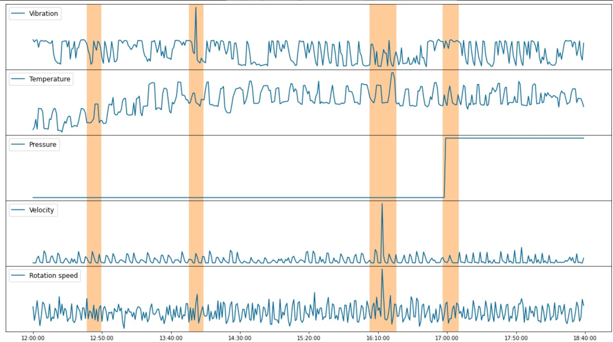

# Multivariate time series Anomaly Detection (preview)

The new **multivariate anomaly detection** APIs further enable developers by easily integrating advanced AI for detecting anomalies from groups of metrics, without the need for machine learning knowledge or labeled data. Dependencies and inter-correlations between up to 300 different signals are now automatically counted as key factors. This new capability helps you to proactively protect your complex systems such as software applications, servers, factory machines, spacecraft, or even your business, from failures.

Imagine 20 sensors from an auto engine generating 20 different signals like vibration, temperature, fuel pressure, etc. The readings of those signals individually may not tell you much about system level issues, but together they can represent the health of the engine. When the interaction of those signals deviates outside the usual range, the multivariate anomaly detection feature can sense the anomaly like a seasoned expert. The underlying AI models are trained and customized using your data such that it understands the unique needs of your business. With the new APIs in Anomaly Detector, developers can now easily integrate the multivariate time series anomaly detection capabilities into predictive maintenance solutions, AIOps monitoring solutions for complex enterprise software, or business intelligence tools.

## When to use **multivariate** versus **univariate**

If your goal is to detect anomalies out of a normal pattern on each individual time series purely based on their own historical data, use univariate anomaly detection APIs. For example, you want to detect daily revenue anomalies based on revenue data itself, or you want to detect a CPU spike purely based on CPU data.

If your goal is to detect system level anomalies from a group of time series data, use multivariate anomaly detection APIs. Particularly, when any individual time series won't tell you much, and you have to look at all signals (a group of time series) holistically to determine a system level issue. For example, you have an expensive physical asset like aircraft, equipment on an oil rig, or a satellite. Each of these assets has tens or hundreds of different types of sensors. You would have to look at all those time series signals from those sensors to decide whether there is system level issue.

## Notebook

To learn how to call the Anomaly Detector API (multivariate), try this [Notebook](https://github.com/Azure-Samples/AnomalyDetector/blob/master/ipython-notebook/Multivariate%20API%20Demo%20Notebook.ipynb). This Jupyter Notebook shows you how to send an API request and visualize the result.

To run the Notebook, you should get a valid Anomaly Detector API **subscription key** and an **API endpoint**. In the notebook, add your valid Anomaly Detector API subscription key to the `subscription_key` variable, and change the `endpoint` variable to your endpoint.

## Region support

The preview of Anomaly Detector multivariate is currently available in 10 Azure regions: Southeast Asia, Australia East, Canada Central, North Europe, West Europe, East US, East US 2, South Central US, West US 2, and UK South.

## Algorithms

See the following technical documents for information about the algorithms used:

* Blog: [Introducing Multivariate Anomaly Detection](https://techcommunity.microsoft.com/t5/azure-ai/introducing-multivariate-anomaly-detection/ba-p/2260679)
* Paper: [Multivariate time series Anomaly Detection via Graph Attention Network](https://arxiv.org/abs/2009.02040)

> [!VIDEO https://www.youtube.com/embed/FwuI02edclQ]

## Join the Anomaly Detector community

- Join the [Anomaly Detector Advisors group on Microsoft Teams](https://aka.ms/AdAdvisorsJoin)

## Next steps

- [Tutorial](./tutorials/learn-multivariate-anomaly-detection.md): This article is an end-to-end tutorial of how to use the multivariate APIs.
- [Quickstarts](./quickstarts/client-libraries-multivariate.md).
- [Best Practices](./concepts/best-practices-multivariate.md): This article is about recommended patterns to use with the multivariate APIs.
