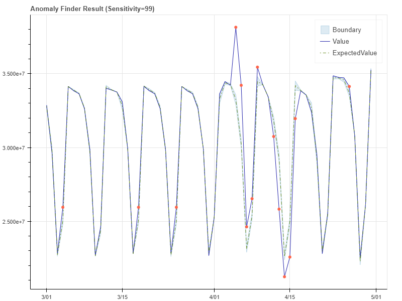
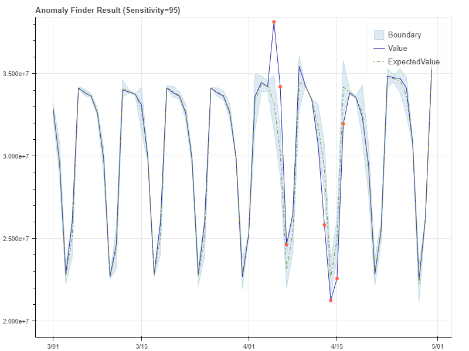
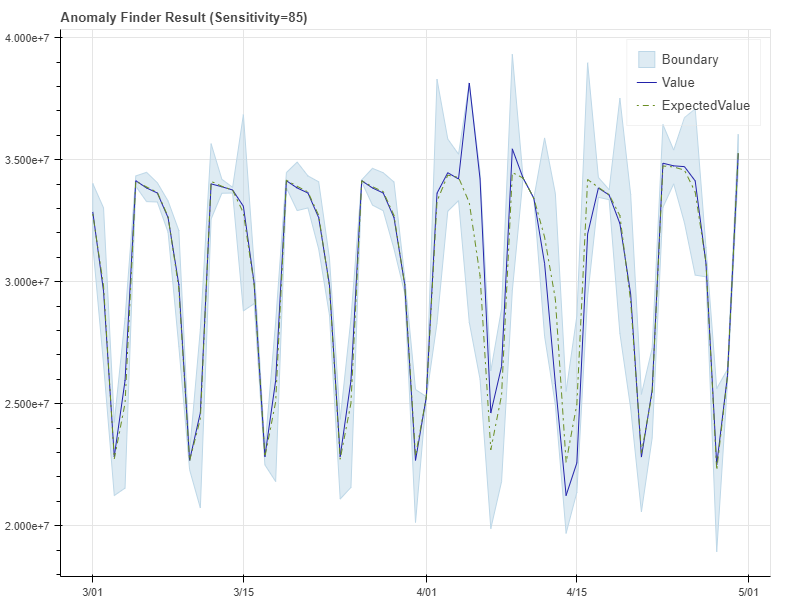

--- 
title: What is Anomaly Detector? | Microsoft Docs 
titleSuffix: Azure Cognitive Services
description: Use the Anomaly Detector's advanced algorithms to identify anomalies in your time series data. 
services: cognitive-services 
author: aahill
ms.service: cognitive-services 
ms.technology: anomaly-detection 
ms.topic: article
ms.date: 02/26/2019 
ms.author: aahi
--- 
 
# What is Anomaly Detector?

Anomaly Finder enables you to monitor data over time and detect anomalies with machine learning that adapts to your unique data by automatically applying the right statistical model regardless of industry, scenario, or data volume. Use a time series as input, the Anomaly Finder API returns whether a data point is an anomaly, determines the expected value, and upper and lower bounds for visualization. 

As a prebuilt AI service, Anomaly Finder does not require any machine learning expertise beyond understanding how to use a RESTful API. This means development simple and versatile, as it works with any time series data and can also be built into streaming data systems. Anomaly Finder encompasses a broad span of use cases – for instance, financial tools for managing fraud, theft, changing markets, and potential business incidents, or monitoring IoT device traffic while preserving anonymity. This solution can also be monetized as part of a service for end-customers to understand changes in data, spending, return on investment, or user activity.
Try out the Anomaly Finder API and gain deeper understanding of your data. 

Anomaly Finder provides two APIs for two scenarios: batch and streaming modes.
 
* If you would like to detect anomalies for a *batch* of data points over a given time range and get a response in one single API call, use batch API: **'/timeseries/entire/detect'**. It is commonly used in interactive mode, e.g., you are doing ad-hoc data analysis for time series data like DAU and want to understand if the data is out of historical pattern.

* If you would like to continuously detect anomalies on streaming data, use streaming API: **'/timeseries/last/detect'**. This API is commonly used for monitoring scenarios and alerting users on real time anomalies in time series data.

You can build following with this API:

* Learn to predict the expected values based on historical data in the time series
* Detect whether a data point is an anomaly out of historical pattern
* Generate a band to visualize the range of "normal" values

 

Fig. 1: Detect anomalies in sales revenues

Fig. 2: Detect pattern changes in service requests

## Requirements

The following preparation is required for your data.

- Minimum data for input time series: Minimum of 13 data points for time series without clear periodicity, minimum of four cycles of data points for the time series with known periodicity.
- Data integrity: time series data points are separated in the same interval and no missing points.

## Identify anomalies

Using [Anomaly Finder API](https://westus2.dev.cognitive.microsoft.com/docs/services/AnomalyFinderV2/operations/post-timeseries-entire-detect), you can select the most appropriate method to match your scenario. The detection model returns anomaly results along with expectedValue, upperMargin and lowerMargin. ExpectedValue, UpperMargin and LowerMargin can be used to generate a band around actual time series to visualize the range of normal values in the client's side. Any values out of the boundary are detected aas anomalies. 

## Adjusting lower and upper bounds in post processing on the response

Anomaly Finder API returns default results on whether a data point is anomaly or not, and the upper and lower bound can be calculated from ExpectedValue and UpperMargin/LowerMargin. Default values work fine for most cases. However, some scenarios require different bounds than the default ones. The recommend practice is applying a MarginScale on the UpperMargin or LowerMargin to adjust the dynamic bounds. UpperBoundary equals to ExpectedValue + (100 - MarginScale)\*UpperMargin, lowerBoundary equals to ExpectedValue - (100 - MarginScale)\*LowerMargin

### Examples with 99/95/85 as sensitivity

Request with sample data

[Sample Request](./includes/request.md)

Sample JSON response

[Sample Response](./includes/response.md)

## How to use the APIs to do continuous monitoring 

Anomaly finder APIs is a stateless services. To enable contious monitoring on streaming data, for example, in the following scenario, your have KPIs such as "Daily active users" to monitor, you have to post to the API endpoint a window of time series of DAU and get a response on whether the latest point is an anomaly or not. When a new data point is available, you complete the API post again with a moving window of time series to get the response. When this process is repeated every time a new data point is available to detect, continous monitoring is achieved on streaming data.

This applies not only to daily time series like DAU, but also to time series with hourly or minute level intervals.
