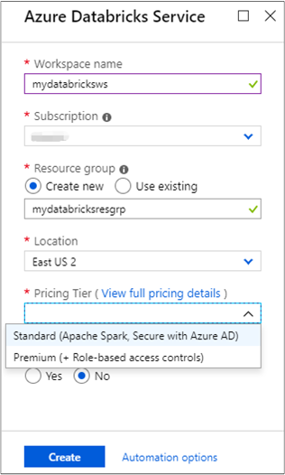
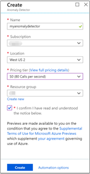
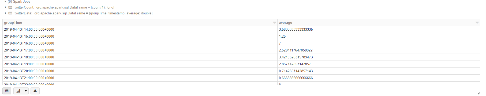
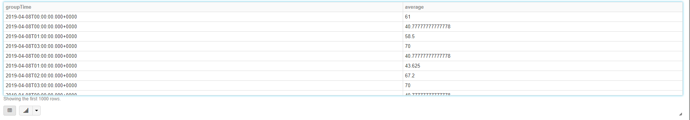
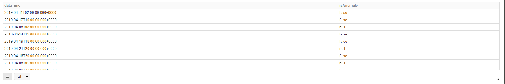

# Tutorial: Anomaly detection on streaming data using Azure Databricks

> [!Note]
> This tutorial introduces an approach to implement the recommended solution architecture of Anomaly Detector on [Identifying problems with Anomaly Detector](https://azure.microsoft.com/en-us/solutions/architecture/anomaly-detector-process/).

In this tutorial, you learn how to run anomaly detection on a stream of data using Azure Databricks in near real time. You set up data ingestion system using Azure Event Hubs. You consume the messages from Event Hubs into Azure Databricks using the Spark Event Hubs connector. Finally, you use Microsoft Cognitive Service APIs to run anomaly detection on the streamed data.

By the end of this tutorial, you would have streamed tweets from Twitter that have the term "Azure" in them and ran anomaly detection on the tweets.

The following illustration shows the application flow:


This tutorial covers the following tasks:

> [!div class="checklist"]
> * Create an Azure Databricks workspace
> * Create a Spark cluster in Azure Databricks
> * Create a Twitter app to access streaming data
> * Create notebooks in Azure Databricks
> * Attach libraries for Event Hubs and Twitter API
> * Create an Anomaly Detector resource and retrieve the access key
> * Send tweets to Event Hubs
> * Read tweets from Event Hubs
> * Run anomaly detection on tweets

If you don't have an Azure subscription, [create a free account](https://azure.microsoft.com/free/) before you begin.

> [!Note]
> This tutorial cannot be carried out using **Azure Free Trial Subscription**.
> To use a free account to create the Azure Databricks cluster, before creating the cluster, go to your profile and change your subscription to **pay-as-you-go**. For more information, see [Azure free account](https://azure.microsoft.com/free/).

## Prerequisites

Before you start with this tutorial, make sure to meet the following requirements:
- An Azure Event Hubs namespace.
- An Event Hub within the namespace.
- Connection string to access the Event Hubs namespace. The connection string should have a format similar to `Endpoint=sb://<namespace>.servicebus.windows.net/;SharedAccessKeyName=<key name>;SharedAccessKey=<key value>`. You can find the connection string follow the article, [Get an Event Hubs connection string](../../../event-hubs/event-hubs-get-connection-string.md)
- Shared access policy name and policy key for Event Hubs.

You can meet these requirements by completing the steps in the article, [Create an Azure Event Hubs namespace and event hub](../../../event-hubs/event-hubs-create.md).

## Log in to the Azure portal

Log in to the [Azure portal](https://portal.azure.com/).

## Create an Azure Databricks workspace

In this section, you create an Azure Databricks workspace using the Azure portal.

1. In the Azure portal, select **Create a resource** > **Analytics** > **Azure Databricks**.

    

3. Under **Azure Databricks Service**, provide the values to create a Databricks workspace.

    

    Provide the following values:

    |Property  |Description  |
    |---------|---------|
    |**Workspace name**     | Provide a name for your Databricks workspace        |
    |**Subscription**     | From the drop-down, select your Azure subscription.        |
    |**Resource group**     | Specify whether you want to create a new resource group or use an existing one. A resource group is a container that holds related resources for an Azure solution. For more information, see [Azure Resource Group overview](../../../azure-resource-manager/resource-group-overview.md). |
    |**Location**     | Select **East US 2** or one of any other available regions. See [Azure services available by region](https://azure.microsoft.com/regions/services/) for region availability.        |
    |**Pricing Tier**     |  Choose between **Standard** or **Premium**. Do NOT choose **Trial**. For more information on these tiers, see [Databricks pricing page](https://azure.microsoft.com/pricing/details/databricks/).       |

    Select **Create**.

4. The account creation takes a few minutes. 

## Create a Spark cluster in Databricks

1. In the Azure portal, go to the Databricks workspace that you created, and then select **Launch Workspace**.

2. You are redirected to the Azure Databricks portal. From the portal, select **New Cluster**.

    

3. In the **New Cluster** page, provide the values to create a cluster.

    

    Accept all other default values other than the following:

   * Enter a name for the cluster.
   * For this article, create a cluster with **5.3** runtime.
   * Make sure the **Terminate after \_\_ minutes of inactivity** checkbox is selected. Provide a duration (in minutes) to terminate the cluster, if the cluster is not being used.

     Select **Create cluster**. Once the cluster is running, you can attach notebooks to the cluster and run Spark jobs.

## Create a Twitter application

To receive a stream of tweets, you must create an application in Twitter. Follow the steps to create a Twitter application and record the values that you need to complete this tutorial.

1. From a web browser, go to [Twitter Application Management](https://apps.twitter.com/), and select **Create New App**.

    

2. In the **Create an application** page, provide the details for the new app, and then select **Create your Twitter application**.

    

3. In the application page, select the **Keys and Access Tokens** tab and copy the values for **Consumer Key** and **Consumer Secret**. Also, select **Create my access token** to generate the access tokens. Copy the values for **Access Token** and **Access Token Secret**.

    

Save the values that you retrieved for the Twitter application. You need the values later in the tutorial.

## Attach libraries to Spark cluster

In this tutorial, you use the Twitter APIs to send tweets to Event Hubs. You also use the [Apache Spark Event Hubs connector](https://github.com/Azure/azure-event-hubs-spark) to read and write data into Azure Event Hubs. To use these APIs as part of your cluster, add them as libraries to Azure Databricks and then associate them with your Spark cluster. The following instructions show how to add the libraries to the **Shared** folder in your workspace.

1. In the Azure Databricks workspace, select **Workspace**, and then right-click **Shared**. From the context menu, select **Create** > **Library**.

   

2. In the New Library page, for **Source** select **Maven Coordinate**. For **Coordinate**, enter the coordinate for the package you want to add. Here is the Maven coordinates for the libraries used in this tutorial:

   * Spark Event Hubs connector - `com.microsoft.azure:azure-eventhubs-spark_2.11:2.3.10`
   * Twitter API - `org.twitter4j:twitter4j-core:4.0.7`

     

3. Select **Create**.

4. Select the folder where you added the library, and then select the library name.

    

5. If there is no cluster in the library page, select **Clusters** and run the cluster you've just created. Wait until the state shows 'Running' and then go back to the library page.
On the library page, select the cluster where you want to use the library, and then select **Install**. Once the library is successfully associated with the cluster, the status immediately changes to **Installed**.

    

6. Repeat these steps for the Twitter package, `twitter4j-core:4.0.7`.

## Get a Cognitive Services access key

In this tutorial, you use the [Microsoft Cognitive Services Anomaly Detector APIs](../overview.md) to run anomaly detection on a stream of tweets in near real time. Before you use the APIs, you must create an Anomaly Detector resource on Azure and retrieve an access key to use the Anomaly Detector APIs.

1. Sign in to the [Azure portal](https://portal.azure.com/).

2. Select **+ Create a resource**.

3. Under Azure Marketplace, Select **AI + Machine Learning** > **See all** > **Cognitive Services - More** > **Anomaly Detector**. Or you could use [this link](https://ms.portal.azure.com/#create/Microsoft.CognitiveServicesAnomalyDetector) to go to the **Create** dialog box directly.

    

4. In the **Create** dialog box, provide the following values:

    

   - Enter a name for the Anomaly Detector resource.
   - Select the Azure subscription under which the resource is created.
   - Select an Azure location.
   - Select a pricing tier for the service. For more information about Anomaly Detector pricing, see [pricing page](https://azure.microsoft.com/en-us/pricing/details/cognitive-services/anomaly-detector/).
   - Specify whether you want to create a new resource group or select an existing one.
   - During Anomaly Detector public preview, you need to read the notice and check **I confirm I have read and understood the notice below.**

     Select **Create**.

5. After the resource is created, from the **Overview** tab, select **Show access keys**.

    

    Also, copy a part of the endpoint URL, as shown in the screenshot. You need this URL in the tutorial.

6. Under **Keys**, select the copy icon against the key you want to use.

    

7. Save the values for the endpoint URL and the access key, you retrieved in this step. You need it later in this tutorial.

## Create notebooks in Databricks

In this section, you create two notebooks in Databricks workspace with the following names

- **SendTweetsToEventHub** - A producer notebook you use to get tweets from Twitter and stream them to Event Hubs.
- **AnalyzeTweetsFromEventHub** - A consumer notebook you use to read the tweets from Event Hubs and run anomaly detection.

1. In the left pane, select **Workspace**. From the **Workspace** drop-down, select **Create**, and then select **Notebook**.

    

2. In the **Create Notebook** dialog box, enter **SendTweetsToEventHub** as name, select **Scala** as the language, and select the Spark cluster that you created earlier.

    

    Select **Create**.

3. Repeat the steps to create the **AnalyzeTweetsFromEventHub** notebook.

## Send tweets to Event Hubs

In the **SendTweetsToEventHub** notebook, paste the following code, and replace the placeholder with values for your Event Hubs namespace and Twitter application that you created earlier. This notebook streams tweets with the keyword "Azure" into Event Hubs in real time.

```scala
import java.util._
import scala.collection.JavaConverters._
import com.microsoft.azure.eventhubs._
import java.util.concurrent._

val namespaceName = "<EVENT HUBS NAMESPACE>"
val eventHubName = "<EVENT HUB NAME>"
val sasKeyName = "<POLICY NAME>"
val sasKey = "<POLICY KEY>"
val connStr = new ConnectionStringBuilder()
            .setNamespaceName(namespaceName)
            .setEventHubName(eventHubName)
            .setSasKeyName(sasKeyName)
            .setSasKey(sasKey)

val pool = Executors.newFixedThreadPool(1)
val eventHubClient = EventHubClient.create(connStr.toString(), pool)

def sendEvent(message: String) = {
  val messageData = EventData.create(message.getBytes("UTF-8"))
  eventHubClient.get().send(messageData)
  System.out.println("Sent event: " + message + "\n")
}

import twitter4j._
import twitter4j.TwitterFactory
import twitter4j.Twitter
import twitter4j.conf.ConfigurationBuilder

// Twitter configuration!
// Replace values below with yours

val twitterConsumerKey = "<CONSUMER KEY>"
val twitterConsumerSecret = "<CONSUMER SECRET>"
val twitterOauthAccessToken = "<ACCESS TOKEN>"
val twitterOauthTokenSecret = "<TOKEN SECRET>"

val cb = new ConfigurationBuilder()
  cb.setDebugEnabled(true)
  .setOAuthConsumerKey(twitterConsumerKey)
  .setOAuthConsumerSecret(twitterConsumerSecret)
  .setOAuthAccessToken(twitterOauthAccessToken)
  .setOAuthAccessTokenSecret(twitterOauthTokenSecret)

val twitterFactory = new TwitterFactory(cb.build())
val twitter = twitterFactory.getInstance()

// Getting tweets with keyword "Azure" and sending them to the Event Hub in realtime!

val query = new Query(" #Azure ")
query.setCount(100)
query.lang("en")

var finished = false
var maxStatusId = Long.MinValue
var preMaxStatusId = Long.MinValue
val innerLoop = new Breaks
while (!finished) {
  val result = twitter.search(query)
  val statuses = result.getTweets()
  var lowestStatusId = Long.MaxValue
  innerLoop.breakable {
    for (status <- statuses.asScala) {
      if (status.getId() <= preMaxStatusId) {
        preMaxStatusId = maxStatusId
        innerLoop.break
      }
      if(!status.isRetweet()) {
        sendEvent(gson.toJson(new MessageBody(status.getCreatedAt(), status.getFavoriteCount())))
      }
      lowestStatusId = Math.min(status.getId(), lowestStatusId)
      maxStatusId = Math.max(status.getId(), maxStatusId)
    }
  }
  
  if (lowestStatusId == Long.MaxValue) {
    preMaxStatusId = maxStatusId
  }
  Thread.sleep(10000)
  query.setMaxId(lowestStatusId - 1)
}

// Closing connection to the Event Hub
 eventHubClient.get().close()
```

To run the notebook, press **SHIFT + ENTER**. You see an output as shown in the following snippet. Each event in the output is a tweet that is ingested into the Event Hubs.

    Sent event: {"timestamp":"2019-04-24T09:39:40.000Z","favorite":0}

    Sent event: {"timestamp":"2019-04-24T09:38:48.000Z","favorite":1}

    Sent event: {"timestamp":"2019-04-24T09:38:36.000Z","favorite":0}

    Sent event: {"timestamp":"2019-04-24T09:37:27.000Z","favorite":0}

    Sent event: {"timestamp":"2019-04-24T09:37:00.000Z","favorite":2}

    Sent event: {"timestamp":"2019-04-24T09:31:11.000Z","favorite":0}

    Sent event: {"timestamp":"2019-04-24T09:30:15.000Z","favorite":0}

    Sent event: {"timestamp":"2019-04-24T09:30:02.000Z","favorite":1}

    ...
    ...

## Read tweets from Event Hubs

In the **AnalyzeTweetsFromEventHub** notebook, paste the following code, and replace the placeholder with values for your Azure Event Hubs that you created earlier. This notebook reads the tweets that you earlier streamed into Event Hubs using the **SendTweetsToEventHub** notebook.

```scala

//
// Anomaly Detection Client
//

import java.io.{BufferedReader, DataOutputStream, InputStreamReader}
import java.net.URL
import java.sql.Timestamp

import com.google.gson.{Gson, GsonBuilder, JsonParser}
import javax.net.ssl.HttpsURLConnection

case class Point(var timestamp: Timestamp, var value: Double)
case class Series(var series: Array[Point], var maxAnomalyRatio: Double, var sensitivity: Int, var granularity: String)
case class AnomalySingleResponse(var isAnomaly: Boolean, var isPositiveAnomaly: Boolean, var isNegativeAnomaly: Boolean, var period: Int, var expectedValue: Double, var upperMargin: Double, var lowerMargin: Double, var suggestedWindow: Int)
case class AnomalyBatchResponse(var expectedValues: Array[Double], var upperMargins: Array[Double], var lowerMargins: Array[Double], var isAnomaly: Array[Boolean], var isPositiveAnomaly: Array[Boolean], var isNegativeAnomaly: Array[Boolean], var period: Int)

object AnomalyDetector extends Serializable {

  // Cognitive Services API connection settings
  val subscriptionKey = "[Your subscription key]"
  val endpoint = "https://westus2.api.cognitive.microsoft.com/"
  val latestPointDetectionPath = "/anomalydetector/v1.0/timeseries/last/detect"
  val batchDetectionPath = "/anomalydetector/v1.0/timeseries/entire/detect";
  val latestPointDetectionUrl = new URL(endpoint + latestPointDetectionPath)
  val batchDetectionUrl = new URL(endpoint + batchDetectionPath)
  val gson: Gson = new GsonBuilder().setDateFormat("yyyy-MM-dd'T'HH:mm:ss.SSS'Z'").setPrettyPrinting().create()

  def getConnection(path: URL): HttpsURLConnection = {
    val connection = path.openConnection().asInstanceOf[HttpsURLConnection]
    connection.setRequestMethod("POST")
    connection.setRequestProperty("Content-Type", "text/json")
    connection.setRequestProperty("Ocp-Apim-Subscription-Key", subscriptionKey)
    connection.setDoOutput(true)
    return connection
  }

  // Handles the call to Cognitive Services API.
  def processUsingApi(request: String, path: URL): String = {
    val encoded_text = request.getBytes("UTF-8")
    val connection = getConnection(path)
    val wr = new DataOutputStream(connection.getOutputStream())
    wr.write(encoded_text, 0, encoded_text.length)
    wr.flush()
    wr.close()

    val response = new StringBuilder()
    val in = new BufferedReader(new InputStreamReader(connection.getInputStream()))
    var line = in.readLine()
    while (line != null) {
      response.append(line)
      line = in.readLine()
    }
    in.close()
    return response.toString()
  }

  // Calls the Latest Point Detection API for timeserie.
  def detectLatestPoint(series: Series): Option[AnomalySingleResponse] = {
    try {
      val response = processUsingApi(gson.toJson(series), latestPointDetectionUrl)
      // Deserializing the JSON response from the API into Scala types
      val anomaly = gson.fromJson(response, classOf[AnomalySingleResponse])
      Thread.sleep(5000)
      return Some(anomaly)
    } catch {
      case e: Exception => {
        println(e)
        return None
      }
    }
  }

  // Calls the Batch Detection API for timeserie.
  def detectBatch(series: Series): Option[AnomalyBatchResponse] = {
    try {
      val response = processUsingApi(gson.toJson(series), batchDetectionUrl)
      // Deserializing the JSON response from the API into Scala types
      val anomaly = gson.fromJson(response, classOf[AnomalyBatchResponse])
      Thread.sleep(5000)
      return Some(anomaly)
    } catch {
      case e: Exception => {
        println(e)
        return None
      }
    }
  }
}

```

To run the notebook, press **SHIFT + ENTER**. You see an output as shown in the following snippet. :

    import java.io.{BufferedReader, DataOutputStream, InputStreamReader}
    import java.net.URL
    import java.sql.Timestamp
    import com.google.gson.{Gson, GsonBuilder, JsonParser}
    import javax.net.ssl.HttpsURLConnection
    defined class Point
    defined class Series
    defined class AnomalySingleResponse
    defined class AnomalyBatchResponse
    defined object AnomalyDetector

Then prepare an aggregatetion functions for future usage.
```scala
//
// User Defined Aggregation Function for Anomaly Detection
//

import org.apache.spark.sql.Row
import org.apache.spark.sql.expressions.{MutableAggregationBuffer, UserDefinedAggregateFunction}
import org.apache.spark.sql.types.{StructType, TimestampType, FloatType, MapType, BooleanType, DataType}
import scala.collection.immutable.ListMap

class AnomalyDetectorAggregationFunction extends UserDefinedAggregateFunction {
    override def inputSchema: StructType = new StructType().add("timestamp", TimestampType).add("value", FloatType)

    override def bufferSchema: StructType = new StructType().add("point", MapType(TimestampType, FloatType))

    override def dataType: DataType = BooleanType

    override def deterministic: Boolean = false

    override def initialize(buffer: MutableAggregationBuffer): Unit = {
        buffer(0) = Map()
    }

    override def update(buffer: MutableAggregationBuffer, input: Row): Unit = {
        buffer(0) = buffer.getAs[Map[java.sql.Timestamp, Float]](0) + (input.getTimestamp(0) -> input.getFloat(1))
    }

    override def merge(buffer1: MutableAggregationBuffer, buffer2: Row): Unit = {
        buffer1(0) = buffer1.getAs[Map[java.sql.Timestamp, Float]](0) ++ buffer2.getAs[Map[java.sql.Timestamp, Float]](0)
    }

    override def evaluate(buffer: Row): Any = {
        val points = buffer.getAs[Map[java.sql.Timestamp, Float]](0)
        if (points.size > 24) {
        val sorted_points = ListMap(points.toSeq.sortBy(_._1.getTime):_*)
        var detect_points: List[Point] = List()
        sorted_points.keys.foreach {
            key => detect_points = detect_points :+ new Point(key, sorted_points(key))
        }
        
        val series: Series = new Series(detect_points.toArray, 0.25, 95, "hourly")
        val response: Option[AnomalySingleResponse] = AnomalyDetector.detectLatestPoint(series)
        if (!response.isEmpty) {
            println(response)
            return response.get.isAnomaly
        }
        }
        
        return None
    }
}
```

To run the notebook, press **SHIFT + ENTER**. You see an output as shown in the following snippet. 

    import org.apache.spark.sql.Row
    import org.apache.spark.sql.expressions.{MutableAggregationBuffer, UserDefinedAggregateFunction}
    import org.apache.spark.sql.types.{StructType, TimestampType, FloatType, MapType, BooleanType, DataType}
    import scala.collection.immutable.ListMap
    defined class AnomalyDetectorAggregationFunction

Then load data from event hub.

```scala
//
// Load Data from Eventhub
//

import org.apache.spark.eventhubs._
import org.apache.spark.sql.types._
import org.apache.spark.sql.functions._

val connectionString = ConnectionStringBuilder("Endpoint=sb://ad-databricks.servicebus.windows.net/;SharedAccessKeyName=RootManageSharedAccessKey;SharedAccessKey=NOXojBfXQZ+phyR86VVvBmtRzrctIS9APu+CPond5eE=")
  .setEventHubName("demo-eventhub")
  .build

val customEventhubParameters =
  EventHubsConf(connectionString)
  .setConsumerGroup("ad-con-grp")
  .setMaxEventsPerTrigger(100)

val incomingStream = spark.readStream.format("eventhubs").options(customEventhubParameters.toMap).load()

val messages =
  incomingStream
  .withColumn("enqueuedTime", $"enqueuedTime".cast(TimestampType))
  .withColumn("body", $"body".cast(StringType))
  .select("enqueuedTime", "body")

val bodySchema = new StructType().add("timestamp", TimestampType).add("favorite", IntegerType)

val msgStream = messages.select(from_json('body, bodySchema) as 'fields).select("fields.*")

msgStream.printSchema

display(msgStream)
```

The output now resembles the following image. Please pay attention to that your date in the table might be different from the date in this tutorial as the data is real time. 


You have now streamed data from Azure Event Hubs into Azure Databricks at near real time using the Event Hubs connector for Apache Spark. For more information on how to use the Event Hubs connector for Spark, see the [connector documentation](https://github.com/Azure/azure-event-hubs-spark/tree/master/docs).


## Run anomaly detection on tweets

In this section, you run anomaly detection on the tweets received using the Twitter API. For this section, you add the code snippets to the same **AnalyzeTweetsFromEventHub** notebook.

To do anomaly detection, first, you need to aggregate your metric count by hour.
```scala
//
// Aggregate Metric Count by Hour
//

val groupStream = msgStream.groupBy(window($"timestamp", "1 hour"))
  .agg(avg("favorite").alias("average"))
  .withColumn("groupTime", $"window.start")
  .select("groupTime", "average")

groupStream.printSchema

display(groupStream)
```
The output now resembles the following snippets.
```
root
 |-- groupTime: timestamp (nullable = true)
 |-- average: double (nullable = true)

groupStream: org.apache.spark.sql.DataFrame = [groupTime: timestamp, average: double]
```

Then get the aggregated output result to Delta. 


```scala
//
// Output Aggregation Result to Delta
//

groupStream.writeStream
  .format("delta")
  .outputMode("complete")
  .option("checkpointLocation", "/delta/random/_checkpoints/etl-from-eventhub-20190425")
  .table("random")

```

Show the data from Delta where you have put it in just now.
```scala
//
// Show Aggregate Result
//

val twitterCount = spark.sql("SELECT COUNT(*) FROM random")
twitterCount.show()

val twitterData = spark.sql("SELECT * FROM random ORDER BY groupTime")
twitterData.show(200, false)

display(twitterData)
```
To run the notebook, press **SHIFT + ENTER**. You see an output as shown in the following image. 


Reload the aggregation stream.
```scala
//
// Reload Aggregation Stream
//

val detectStream = spark.readStream.format("delta").option("ignoreChanges", "true").table("random")

detectStream.printSchema

display(detectStream)
```
To run the notebook, press **SHIFT + ENTER**. You see an output as shown in the following image. 


Finally, you can do anomaly detection here.
```scala
//
// Anomaly Detection in window data
//

val detect = new AnomalyDetectorAggregationFunction

val anomalyStream = detectStream.groupBy(window($"groupTime", "72 hour", "1 hour"))
    .agg(detect(col("groupTime"), col("average")).alias("isAnomaly"))
    .withColumn("dataTime", $"window.end")
    .select("dataTime", "isAnomaly")

anomalyStream.printSchema

display(anomalyStream)
```

To run the notebook, press **SHIFT + ENTER**. You see an output as shown in the following image. 



You can also output your anomaly detection result to external store.
```scala
//
// Output Anomaly Detect Result to External Store
//

anomalyStream.writeStream
  .format("delta")
  .outputMode("complete")
  .option("checkpointLocation", "/delta/anomaly/_checkpoints/etl-from-eventhub-20190423100")
  .table("anomaly")

```

By the way,ou can also show your anomaly result directly.
```scala
//
// Show Anomaly Detection Result
//

val count = spark.sql("SELECT COUNT(*) FROM anomaly")
count.show()

val anomalyData = spark.sql("SELECT * FROM anomaly ORDER BY dataTime")
anomalyData.show(300, false)
```

You should see an output like the following snippet:
```
    --------+
    |count(1)|
    +--------+
    |     310|
    +--------+

    +-------------------+---------+
    |dataTime           |isAnomaly|
    +-------------------+---------+
    |2019-04-13 15:00:00|null     |
    |2019-04-13 16:00:00|null     |
    |2019-04-13 17:00:00|null     |
    |2019-04-13 18:00:00|null     |
    |2019-04-13 19:00:00|null     |
    |2019-04-13 20:00:00|null     |
    |2019-04-13 21:00:00|null     |
    |2019-04-13 22:00:00|null     |
    |2019-04-13 23:00:00|null     |
    |2019-04-14 00:00:00|null     |
    |2019-04-14 01:00:00|null     |
    |2019-04-14 02:00:00|null     |
    
    ...
    ...
```
That's it! Using Azure Databricks, you have successfully streamed data into Azure Event Hubs, consumed the stream data using the Event Hubs connector, and then ran anomaly detection on streaming data in near real time.

## Clean up resources

After you have finished running the tutorial, you can terminate the cluster. To do so, from the Azure Databricks workspace, from the left pane, select **Clusters**. For the cluster you want to terminate, move the cursor over the ellipsis under **Actions** column, and select the **Terminate** icon.


If you do not manually terminate the cluster it will automatically stop, provided you selected the **Terminate after \_\_ minutes of inactivity** checkbox while creating the cluster. In such a case, the cluster will automatically stop if it has been inactive for the specified time.

## Next steps
In this tutorial, you learned how to use Azure Databricks to stream data into Azure Event Hubs and then read the streaming data from Event Hubs in real time. You learned how to:
> [!div class="checklist"]
> * Create an Azure Databricks workspace
> * Create a Spark cluster in Azure Databricks
> * Create a Twitter app to access streaming data
> * Create notebooks in Azure Databricks
> * Add and attach libraries for Event Hubs and Twitter API
> * Create an Anomaly Detector resource and retrieve the access key
> * Send tweets to Event Hubs
> * Read tweets from Event Hubs
> * Run anomaly detection on tweets

Advance to the next tutorial to learn about performing machine learning tasks using Azure Databricks.

> [!div class="nextstepaction"]
>[Machine Learning using Azure Databricks](https://docs.azuredatabricks.net/spark/latest/mllib/decision-trees.html)