# Tutorial: Anomaly detection on streaming data using Azure Databricks

[Azure Databricks](https://azure.microsoft.com/services/databricks/) is a fast, easy, and collaborative Apache Spark–based analytics service. The Anomaly Detector API, part of Azure Cognitive Services, provides a way of monitoring your time series data. Use this tutorial to run anomaly detection on a stream of data in near real-time using Azure Databricks. You'll ingest twitter data using Azure Event Hubs, and import them into Azure Databricks using the Spark Event Hubs connector. Afterwards, you'll use the API to detect anomalies on the streamed data. 

The following illustration shows the application flow:

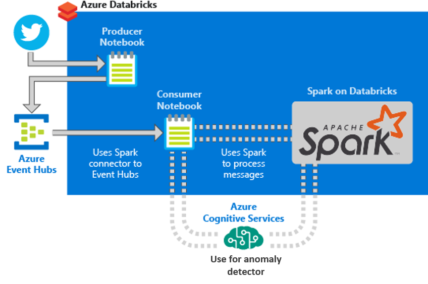

This tutorial covers the following tasks:

> [!div class="checklist"]
> * Create an Azure Databricks workspace
> * Create a Spark cluster in Azure Databricks
> * Create a Twitter app to access streaming data
> * Create notebooks in Azure Databricks
> * Attach libraries for Event Hubs and Twitter API
> * Create an Anomaly Detector resource and retrieve the access key
> * Send tweets to Event Hubs
> * Read tweets from Event Hubs
> * Run anomaly detection on tweets

> [!Note]
> * This tutorial introduces an approach to implementing the recommended [solution architecture](https://azure.microsoft.com/solutions/architecture/anomaly-detector-process/) for the Anomaly Detector API.
> * This tutorial cannot be completed with a free trial for the Anomaly Detector API, or Azure Databricks. 

Create an [Azure subscription](https://azure.microsoft.com/free/) if you don't have one.

## Prerequisites

- An [Azure Event Hubs namespace](https://docs.microsoft.com/azure/event-hubs/event-hubs-create) and event hub.

- The [connection string](../../../event-hubs/event-hubs-get-connection-string.md) to access the Event Hubs namespace. The connection string should have a similar format to:

    `Endpoint=sb://<namespace>.servicebus.windows.net/;SharedAccessKeyName=<key name>;SharedAccessKey=<key value>`. 

- The shared access policy name and policy key for Event Hubs.

See the Azure Event Hubs [quickstart](../../../event-hubs/event-hubs-create.md) for information about creating a namespace and event hub.

## Create an Azure Databricks workspace

In this section, you create an Azure Databricks workspace using the [Azure portal](https://portal.azure.com/).

1. In the Azure portal, select **Create a resource** > **Analytics** > **Azure Databricks**.

    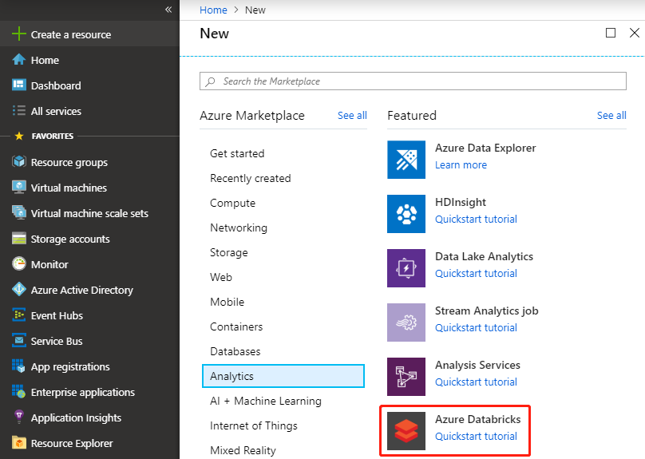

3. Under **Azure Databricks Service**, provide the following values to create a Databricks workspace:


    |Property  |Description  |
    |---------|---------|
    |**Workspace name**     | Provide a name for your Databricks workspace        |
    |**Subscription**     | From the drop-down, select your Azure subscription.        |
    |**Resource group**     | Specify whether you want to create a new resource group or use an existing one. A resource group is a container that holds related resources for an Azure solution. For more information, see [Azure Resource Group overview](../../../azure-resource-manager/management/overview.md). |
    |**Location**     | Select **East US 2** or one of any other available regions. See [Azure services available by region](https://azure.microsoft.com/regions/services/) for region availability.        |
    |**Pricing Tier**     |  Choose between **Standard** or **Premium**. Do NOT choose **Trial**. For more information on these tiers, see [Databricks pricing page](https://azure.microsoft.com/pricing/details/databricks/).       |

    Select **Create**.

4. The workspace creation takes a few minutes. 

## Create a Spark cluster in Databricks

1. In the Azure portal, go to the Databricks workspace that you created, and then select **Launch Workspace**.

2. You're redirected to the Azure Databricks portal. From the portal, select **New Cluster**.

    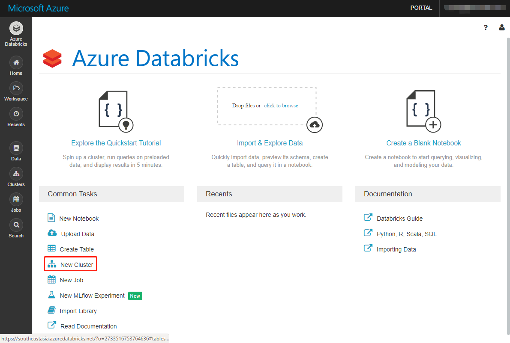

3. In the **New Cluster** page, provide the values to create a cluster.

    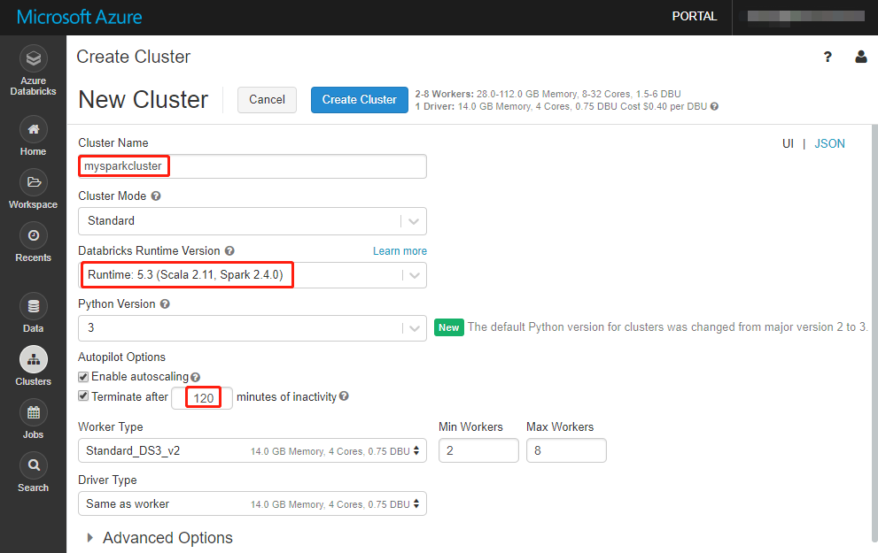

    Accept all other default values other than the following:

   * Enter a name for the cluster.
   * For this article, create a cluster with **5.2** runtime. Do NOT select **5.3** runtime.
   * Make sure the **Terminate after \_\_ minutes of inactivity** checkbox is selected. Provide a duration (in minutes) to terminate the cluster, if the cluster isn't being used.

     Select **Create cluster**. 
4. The cluster creation takes several minutes. Once the cluster is running, you can attach notebooks to the cluster and run Spark jobs.

## Create a Twitter application

To receive a stream of tweets, you must create an application in Twitter. Follow the steps to create a Twitter application and record the values that you need to complete this tutorial.

1. From a web browser, go to [Twitter Application Management](https://apps.twitter.com/), and select **Create New App**.

    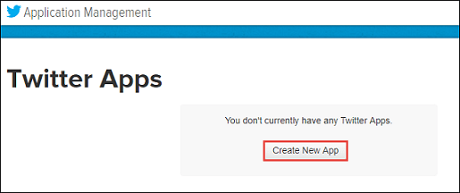

2. In the **Create an application** page, provide the details for the new app, and then select **Create your Twitter application**.

    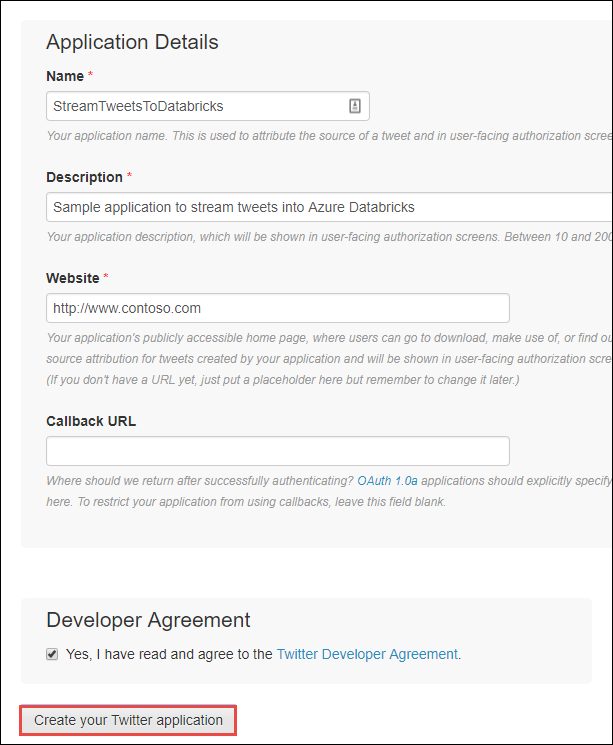

3. In the application page, select the **Keys and Access Tokens** tab and copy the values for **Consumer Key** and **Consumer Secret**. Also, select **Create my access token** to generate the access tokens. Copy the values for **Access Token** and **Access Token Secret**.

    

Save the values that you retrieved for the Twitter application. You need the values later in the tutorial.

## Attach libraries to Spark cluster

In this tutorial, you use the Twitter APIs to send tweets to Event Hubs. You also use the [Apache Spark Event Hubs connector](https://github.com/Azure/azure-event-hubs-spark) to read and write data into Azure Event Hubs. To use these APIs as part of your cluster, add them as libraries to Azure Databricks and then associate them with your Spark cluster. The following instructions show how to add the libraries to the **Shared** folder in your workspace.

1. In the Azure Databricks workspace, select **Workspace**, and then right-click **Shared**. From the context menu, select **Create** > **Library**.

   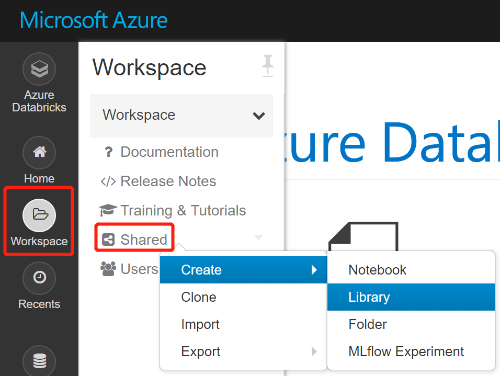

2. In the New Library page, for **Source** select **Maven**. For **Coordinates**, enter the coordinate for the package you want to add. Here is the Maven coordinates for the libraries used in this tutorial:

   * Spark Event Hubs connector - `com.microsoft.azure:azure-eventhubs-spark_2.11:2.3.10`
   * Twitter API - `org.twitter4j:twitter4j-core:4.0.7`

     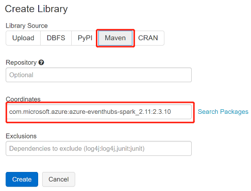

3. Select **Create**.

4. Select the folder where you added the library, and then select the library name.

    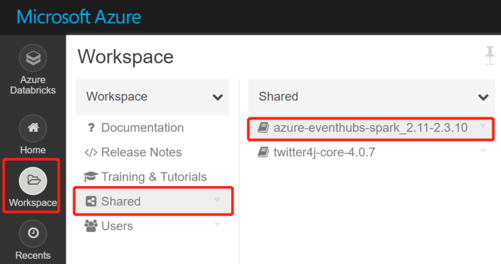

5. If there's no cluster in the library page, select **Clusters** and run the cluster you've created. Wait until the state shows 'Running' and then go back to the library page.
On the library page, select the cluster where you want to use the library, and then select **Install**. Once the library is successfully associated with the cluster, the status immediately changes to **Installed**.

    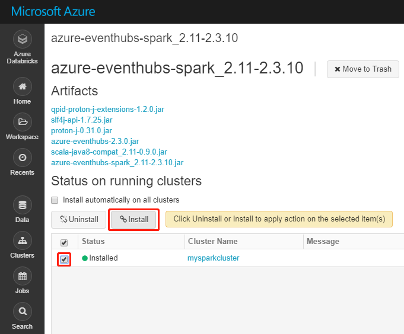

6. Repeat these steps for the Twitter package, `twitter4j-core:4.0.7`.

## Get a Cognitive Services access key

In this tutorial, you use the [Azure Cognitive Services Anomaly Detector APIs](../overview.md) to run anomaly detection on a stream of tweets in near real time. Before you use the APIs, you must create an Anomaly Detector resource on Azure and retrieve an access key to use the Anomaly Detector APIs.

1. Sign in to the [Azure portal](https://portal.azure.com/).

2. Select **+ Create a resource**.

3. Under Azure Marketplace, Select **AI + Machine Learning** > **See all** > **Cognitive Services - More** > **Anomaly Detector**. Or you could use [this link](https://ms.portal.azure.com/#create/Microsoft.CognitiveServicesAnomalyDetector) to go to the **Create** dialog box directly.

    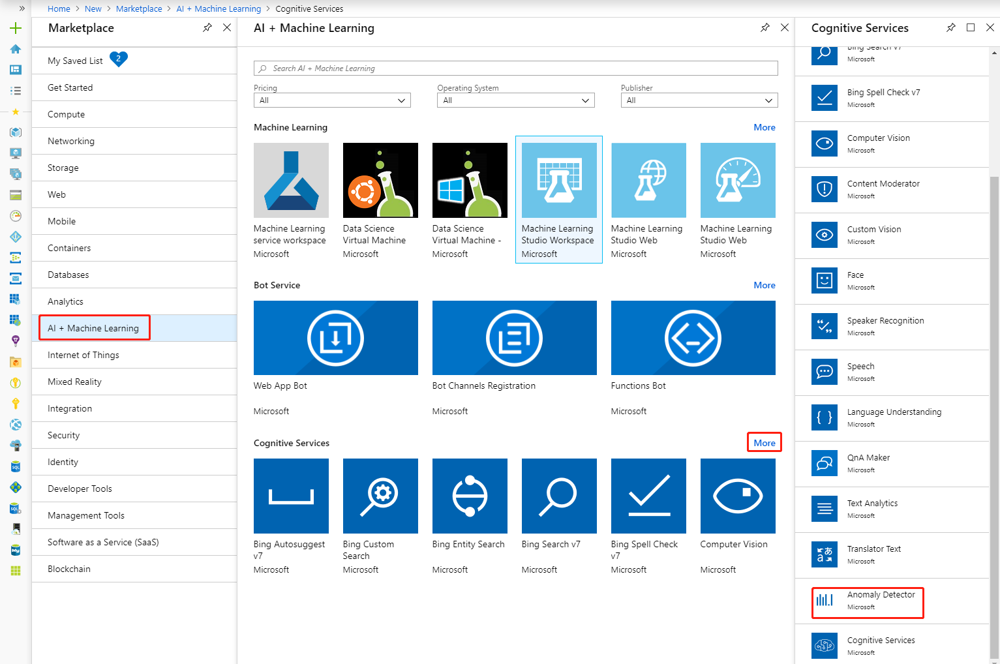

4. In the **Create** dialog box, provide the following values:

    |Value |Description  |
    |---------|---------|
    |Name     | A name for the Anomaly Detector resource.        |
    |Subscription     | The Azure subscription the resource will be associated with.        |
    |Location     | An Azure location.        |
    |Pricing tier     | A pricing tier for the service. For more information about Anomaly Detector pricing, see [pricing page](https://azure.microsoft.com/pricing/details/cognitive-services/anomaly-detector/).        |
    |Resource group     | Specify whether you want to create a new resource group or select an existing one.        |


     Select **Create**.

5. After the resource is created, from the **Overview** tab, copy and save the **Endpoint** URL, as shown in the screenshot. Then select **Show access keys**.

    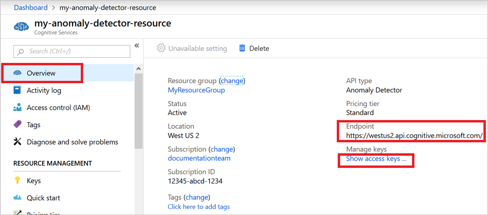

6. Under **Keys**, select the copy icon against the key you want to use. Save the access key.

    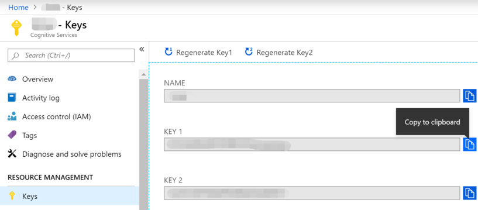

## Create notebooks in Databricks

In this section, you create two notebooks in Databricks workspace with the following names

- **SendTweetsToEventHub** - A producer notebook you use to get tweets from Twitter and stream them to Event Hubs.
- **AnalyzeTweetsFromEventHub** - A consumer notebook you use to read the tweets from Event Hubs and run anomaly detection.

1. In the Azure Databricks workspace, select **Workspace** from the left pane. From the **Workspace** drop-down, select **Create**, and then select **Notebook**.

    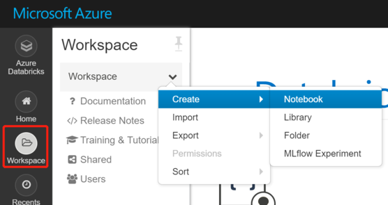

2. In the **Create Notebook** dialog box, enter **SendTweetsToEventHub** as name, select **Scala** as the language, and select the Spark cluster that you created earlier.

    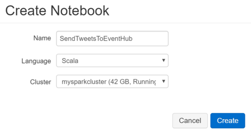

    Select **Create**.

3. Repeat the steps to create the **AnalyzeTweetsFromEventHub** notebook.

## Send tweets to Event Hubs

In the **SendTweetsToEventHub** notebook, paste the following code, and replace the placeholder with values for your Event Hubs namespace and Twitter application that you created earlier. This notebook extracts creation time and number of "Like"s from tweets with the keyword "Azure" and stream those as events into Event Hubs in real time.

```scala
//
// Send Data to Eventhub
//

import scala.collection.JavaConverters._
import com.microsoft.azure.eventhubs._
import java.util.concurrent._
import com.google.gson.{Gson, GsonBuilder, JsonParser}
import java.util.Date
import scala.util.control._
import twitter4j._
import twitter4j.TwitterFactory
import twitter4j.Twitter
import twitter4j.conf.ConfigurationBuilder

// Event Hub Config
val namespaceName = "[Placeholder: EventHub namespace]"
val eventHubName = "[Placeholder: EventHub name]"
val sasKeyName = "[Placeholder: EventHub access key name]"
val sasKey = "[Placeholder: EventHub access key key]"
val connStr = new ConnectionStringBuilder()
  .setNamespaceName(namespaceName)
  .setEventHubName(eventHubName)
  .setSasKeyName(sasKeyName)
  .setSasKey(sasKey)

// Connect to the Event Hub
val pool = Executors.newScheduledThreadPool(1)
val eventHubClient = EventHubClient.create(connStr.toString(), pool)

def sendEvent(message: String) = {
  val messageData = EventData.create(message.getBytes("UTF-8"))
  eventHubClient.get().send(messageData)
  System.out.println("Sent event: " + message + "\n")
}

case class MessageBody(var timestamp: Date, var favorite: Int)
val gson: Gson = new GsonBuilder().setDateFormat("yyyy-MM-dd'T'HH:mm:ss.SSS'Z'").create()

val twitterConsumerKey = "[Placeholder: Twitter consumer key]"
val twitterConsumerSecret = "[Placeholder: Twitter consumer seceret]"
val twitterOauthAccessToken = "[Placeholder: Twitter oauth access token]"
val twitterOauthTokenSecret = "[Placeholder: Twitter oauth token secret]"

val cb = new ConfigurationBuilder()
cb.setDebugEnabled(true)
  .setOAuthConsumerKey(twitterConsumerKey)
  .setOAuthConsumerSecret(twitterConsumerSecret)
  .setOAuthAccessToken(twitterOauthAccessToken)
  .setOAuthAccessTokenSecret(twitterOauthTokenSecret)

val twitterFactory = new TwitterFactory(cb.build())
val twitter = twitterFactory.getInstance()

// Getting tweets with keyword "Azure" and sending them to the Event Hub in realtime!

val query = new Query(" #Azure ")
query.setCount(100)
query.lang("en")

var finished = false
var maxStatusId = Long.MinValue
var preMaxStatusId = Long.MinValue
val innerLoop = new Breaks
while (!finished) {
  val result = twitter.search(query)
  val statuses = result.getTweets()
  var lowestStatusId = Long.MaxValue
  innerLoop.breakable {
    for (status <- statuses.asScala) {
      if (status.getId() <= preMaxStatusId) {
        preMaxStatusId = maxStatusId
        innerLoop.break
      }
      if(!status.isRetweet()) {
        sendEvent(gson.toJson(new MessageBody(status.getCreatedAt(), status.getFavoriteCount())))
      }
      lowestStatusId = Math.min(status.getId(), lowestStatusId)
      maxStatusId = Math.max(status.getId(), maxStatusId)
    }
  }
  
  if (lowestStatusId == Long.MaxValue) {
    preMaxStatusId = maxStatusId
  }
  Thread.sleep(10000)
  query.setMaxId(lowestStatusId - 1)
}

// Close connection to the Event Hub
eventHubClient.get().close()
pool.shutdown()
```

To run the notebook, press **SHIFT + ENTER**. You see an output as shown in the following snippet. Each event in the output is a combination of timestamp and number of "Like"s ingested into the Event Hubs.

    Sent event: {"timestamp":"2019-04-24T09:39:40.000Z","favorite":0}

    Sent event: {"timestamp":"2019-04-24T09:38:48.000Z","favorite":1}

    Sent event: {"timestamp":"2019-04-24T09:38:36.000Z","favorite":0}

    Sent event: {"timestamp":"2019-04-24T09:37:27.000Z","favorite":0}

    Sent event: {"timestamp":"2019-04-24T09:37:00.000Z","favorite":2}

    Sent event: {"timestamp":"2019-04-24T09:31:11.000Z","favorite":0}

    Sent event: {"timestamp":"2019-04-24T09:30:15.000Z","favorite":0}

    Sent event: {"timestamp":"2019-04-24T09:30:02.000Z","favorite":1}

    ...
    ...

## Read tweets from Event Hubs

In the **AnalyzeTweetsFromEventHub** notebook, paste the following code, and replace the placeholder with values for your Anomaly Detector resource that you created earlier. This notebook reads the tweets that you earlier streamed into Event Hubs using the **SendTweetsToEventHub** notebook.

First, write a client to call Anomaly detector. 
```scala

//
// Anomaly Detection Client
//

import java.io.{BufferedReader, DataOutputStream, InputStreamReader}
import java.net.URL
import java.sql.Timestamp

import com.google.gson.{Gson, GsonBuilder, JsonParser}
import javax.net.ssl.HttpsURLConnection

case class Point(var timestamp: Timestamp, var value: Double)
case class Series(var series: Array[Point], var maxAnomalyRatio: Double, var sensitivity: Int, var granularity: String)
case class AnomalySingleResponse(var isAnomaly: Boolean, var isPositiveAnomaly: Boolean, var isNegativeAnomaly: Boolean, var period: Int, var expectedValue: Double, var upperMargin: Double, var lowerMargin: Double, var suggestedWindow: Int)
case class AnomalyBatchResponse(var expectedValues: Array[Double], var upperMargins: Array[Double], var lowerMargins: Array[Double], var isAnomaly: Array[Boolean], var isPositiveAnomaly: Array[Boolean], var isNegativeAnomaly: Array[Boolean], var period: Int)

object AnomalyDetector extends Serializable {

  // Cognitive Services API connection settings
  val subscriptionKey = "[Placeholder: Your Anomaly Detector resource access key]"
  val endpoint = "[Placeholder: Your Anomaly Detector resource endpoint]"
  val latestPointDetectionPath = "/anomalydetector/v1.0/timeseries/last/detect"
  val batchDetectionPath = "/anomalydetector/v1.0/timeseries/entire/detect";
  val latestPointDetectionUrl = new URL(endpoint + latestPointDetectionPath)
  val batchDetectionUrl = new URL(endpoint + batchDetectionPath)
  val gson: Gson = new GsonBuilder().setDateFormat("yyyy-MM-dd'T'HH:mm:ss.SSS'Z'").setPrettyPrinting().create()

  def getConnection(path: URL): HttpsURLConnection = {
    val connection = path.openConnection().asInstanceOf[HttpsURLConnection]
    connection.setRequestMethod("POST")
    connection.setRequestProperty("Content-Type", "text/json")
    connection.setRequestProperty("Ocp-Apim-Subscription-Key", subscriptionKey)
    connection.setDoOutput(true)
    return connection
  }

  // Handles the call to Cognitive Services API.
  def processUsingApi(request: String, path: URL): String = {
    println(request)
    val encoded_text = request.getBytes("UTF-8")
    val connection = getConnection(path)
    val wr = new DataOutputStream(connection.getOutputStream())
    wr.write(encoded_text, 0, encoded_text.length)
    wr.flush()
    wr.close()

    val response = new StringBuilder()
    val in = new BufferedReader(new InputStreamReader(connection.getInputStream()))
    var line = in.readLine()
    while (line != null) {
      response.append(line)
      line = in.readLine()
    }
    in.close()
    return response.toString()
  }

  // Calls the Latest Point Detection API.
  def detectLatestPoint(series: Series): Option[AnomalySingleResponse] = {
    try {
      println("Process Timestamp: " + series.series.apply(series.series.length-1).timestamp.toString + ", size: " + series.series.length)
      val response = processUsingApi(gson.toJson(series), latestPointDetectionUrl)
      println(response)
      // Deserializing the JSON response from the API into Scala types
      val anomaly = gson.fromJson(response, classOf[AnomalySingleResponse])
      Thread.sleep(5000)
      return Some(anomaly)
    } catch {
      case e: Exception => {
        println(e)
        e.printStackTrace()
        return None
      }
    }
  }

  // Calls the Batch Detection API.
  def detectBatch(series: Series): Option[AnomalyBatchResponse] = {
    try {
      val response = processUsingApi(gson.toJson(series), batchDetectionUrl)
      println(response)
      // Deserializing the JSON response from the API into Scala types
      val anomaly = gson.fromJson(response, classOf[AnomalyBatchResponse])
      Thread.sleep(5000)
      return Some(anomaly)
    } catch {
      case e: Exception => {
        println(e)
        return None
      }
    }
  }
}
```

To run the notebook, press **SHIFT + ENTER**. You see an output as shown in the following snippet.

    import java.io.{BufferedReader, DataOutputStream, InputStreamReader}
    import java.net.URL
    import java.sql.Timestamp
    import com.google.gson.{Gson, GsonBuilder, JsonParser}
    import javax.net.ssl.HttpsURLConnection
    defined class Point
    defined class Series
    defined class AnomalySingleResponse
    defined class AnomalyBatchResponse
    defined object AnomalyDetector

Then prepare an aggregation function for future usage.
```scala
//
// User Defined Aggregation Function for Anomaly Detection
//

import org.apache.spark.sql.Row
import org.apache.spark.sql.expressions.{MutableAggregationBuffer, UserDefinedAggregateFunction}
import org.apache.spark.sql.types.{StructType, TimestampType, FloatType, MapType, BooleanType, DataType}
import scala.collection.immutable.ListMap

class AnomalyDetectorAggregationFunction extends UserDefinedAggregateFunction {
  override def inputSchema: StructType = new StructType().add("timestamp", TimestampType).add("value", FloatType)
  
  override def bufferSchema: StructType = new StructType().add("point", MapType(TimestampType, FloatType))
  
  override def dataType: DataType = BooleanType
  
  override def deterministic: Boolean = false
  
  override def initialize(buffer: MutableAggregationBuffer): Unit = {
    buffer(0) = Map()
  }
  
  override def update(buffer: MutableAggregationBuffer, input: Row): Unit = {
    buffer(0) = buffer.getAs[Map[java.sql.Timestamp, Float]](0) + (input.getTimestamp(0) -> input.getFloat(1))
  }
  
  override def merge(buffer1: MutableAggregationBuffer, buffer2: Row): Unit = {
    buffer1(0) = buffer1.getAs[Map[java.sql.Timestamp, Float]](0) ++ buffer2.getAs[Map[java.sql.Timestamp, Float]](0)
  }
  
  override def evaluate(buffer: Row): Any = {
    val points = buffer.getAs[Map[java.sql.Timestamp, Float]](0)
    if (points.size > 12) {
      val sorted_points = ListMap(points.toSeq.sortBy(_._1.getTime):_*)
      var detect_points: List[Point] = List()
      sorted_points.keys.foreach {
        key => detect_points = detect_points :+ new Point(key, sorted_points(key))
      }
      
      
      // 0.25 is maxAnomalyRatio. It represents 25%, max anomaly ratio in a time series.
      // 95 is the sensitivity of the algorithms.
      // Check Anomaly detector API reference (https://aka.ms/anomaly-detector-rest-api-ref)
      
      val series: Series = new Series(detect_points.toArray, 0.25, 95, "hourly")
      val response: Option[AnomalySingleResponse] = AnomalyDetector.detectLatestPoint(series)
      if (!response.isEmpty) {
        return response.get.isAnomaly
      }
    }
    
    return None
  }
}

```

To run the notebook, press **SHIFT + ENTER**. You see an output as shown in the following snippet.

    import org.apache.spark.sql.Row
    import org.apache.spark.sql.expressions.{MutableAggregationBuffer, UserDefinedAggregateFunction}
    import org.apache.spark.sql.types.{StructType, TimestampType, FloatType, MapType, BooleanType, DataType}
    import scala.collection.immutable.ListMap
    defined class AnomalyDetectorAggregationFunction

Then load data from event hub for anomaly detection. Replace the placeholder with values for your Azure Event Hubs that you created earlier.

```scala
//
// Load Data from Eventhub
//

import org.apache.spark.eventhubs._
import org.apache.spark.sql.types._
import org.apache.spark.sql.functions._

val connectionString = ConnectionStringBuilder("[Placeholder: EventHub namespace connection string]")
  .setEventHubName("[Placeholder: EventHub name]")
  .build

val customEventhubParameters =
  EventHubsConf(connectionString)
  .setConsumerGroup("$Default")
  .setMaxEventsPerTrigger(100)

val incomingStream = spark.readStream.format("eventhubs").options(customEventhubParameters.toMap).load()

val messages =
  incomingStream
  .withColumn("enqueuedTime", $"enqueuedTime".cast(TimestampType))
  .withColumn("body", $"body".cast(StringType))
  .select("enqueuedTime", "body")

val bodySchema = new StructType().add("timestamp", TimestampType).add("favorite", IntegerType)

val msgStream = messages.select(from_json('body, bodySchema) as 'fields).select("fields.*")

msgStream.printSchema

display(msgStream)

```

The output now resembles the following image. Note that your date in the table might be different from the date in this tutorial as the data is real time.
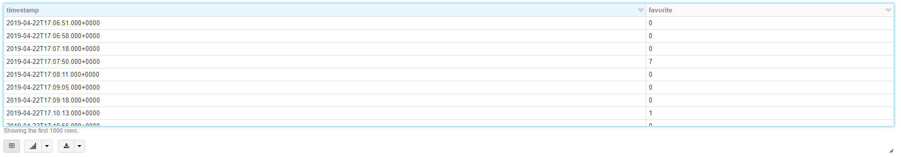

You have now streamed data from Azure Event Hubs into Azure Databricks at near real time using the Event Hubs connector for Apache Spark. For more information on how to use the Event Hubs connector for Spark, see the [connector documentation](https://github.com/Azure/azure-event-hubs-spark/tree/master/docs).


## Run anomaly detection on tweets

In this section, you run anomaly detection on the tweets received using the Anomaly detector API. For this section, you add the code snippets to the same **AnalyzeTweetsFromEventHub** notebook.

To do anomaly detection, first, you need to aggregate your metric count by hour.
```scala
//
// Aggregate Metric Count by Hour
//

// If you want to change granularity, change the groupBy window. 
val groupStream = msgStream.groupBy(window($"timestamp", "1 hour"))
  .agg(avg("favorite").alias("average"))
  .withColumn("groupTime", $"window.start")
  .select("groupTime", "average")

groupStream.printSchema

display(groupStream)
```
The output now resembles the following snippets.
```
groupTime                       average
2019-04-23T04:00:00.000+0000    24
2019-04-26T19:00:00.000+0000    47.888888888888886
2019-04-25T12:00:00.000+0000    32.25
2019-04-26T09:00:00.000+0000    63.4
...
...

```

Then get the aggregated output result to Delta. Because anomaly detection requires a longer history window, we're using Delta to keep the history data for the point you want to detect. 
Replace the "[Placeholder: table name]" with a qualified Delta table name to be created (for example, "tweets"). Replace "[Placeholder: folder name for checkpoints]" with a string value that's unique each time you run this code (for example, "etl-from-eventhub-20190605").
To learn more about Delta Lake on Azure Databricks, please refer to [Delta Lake Guide](https://docs.azuredatabricks.net/delta/index.html)


```scala
//
// Output Aggregation Result to Delta
//

groupStream.writeStream
  .format("delta")
  .outputMode("complete")
  .option("checkpointLocation", "/delta/[Placeholder: table name]/_checkpoints/[Placeholder: folder name for checkpoints]")
  .table("[Placeholder: table name]")

```

Replace the "[Placeholder: table name]" with the same Delta table name you've selected above.
```scala
//
// Show Aggregate Result
//

val twitterCount = spark.sql("SELECT COUNT(*) FROM [Placeholder: table name]")
twitterCount.show()

val twitterData = spark.sql("SELECT * FROM [Placeholder: table name] ORDER BY groupTime")
twitterData.show(200, false)

display(twitterData)
```
The output as below: 
```
groupTime                       average
2019-04-08T01:00:00.000+0000    25.6
2019-04-08T02:00:00.000+0000    6857
2019-04-08T03:00:00.000+0000    71
2019-04-08T04:00:00.000+0000    55.111111111111114
2019-04-08T05:00:00.000+0000    2203.8
...
...

```

Now the aggregated time series data is continuously ingested into the Delta. Then you can schedule an hourly job to detect the anomaly of latest point. 
Replace the "[Placeholder: table name]" with the same Delta table name you've selected above.

```scala
//
// Anomaly Detection
//

import java.time.Instant
import java.time.format.DateTimeFormatter
import java.time.ZoneOffset
import java.time.temporal.ChronoUnit

val detectData = spark.read.format("delta").table("[Placeholder: table name]")

// You could use Databricks to schedule an hourly job and always monitor the latest data point
// Or you could specify a const value here for testing purpose
// For example, val endTime = Instant.parse("2019-04-16T00:00:00Z")
val endTime = Instant.now()

// This is when your input of anomaly detection starts. It is hourly time series in this tutorial, so 72 means 72 hours ago from endTime.
val batchSize = 72
val startTime = endTime.minus(batchSize, ChronoUnit.HOURS)

val DATE_TIME_FORMATTER = DateTimeFormatter.ofPattern("yyyy-MM-dd HH:mm:ss").withZone(ZoneOffset.UTC);

val series = detectData.filter($"groupTime" <= DATE_TIME_FORMATTER.format(endTime))
  .filter($"groupTime" > DATE_TIME_FORMATTER.format(startTime))
  .sort($"groupTime")

series.createOrReplaceTempView("series")

//series.show()

// Register the function to access it
spark.udf.register("anomalydetect", new AnomalyDetectorAggregationFunction)

val adResult = spark.sql("SELECT '" + endTime.toString + "' as datetime, anomalydetect(groupTime, average) as anomaly FROM series")
adResult.show()
```
Result as below: 

```
+--------------------+-------+
|           timestamp|anomaly|
+--------------------+-------+
|2019-04-16T00:00:00Z|  false|
+--------------------+-------+
```

That's it! Using Azure Databricks, you have successfully streamed data into Azure Event Hubs, consumed the stream data using the Event Hubs connector, and then run anomaly detection on streaming data in near real time.
Although in this tutorial, the granularity is hourly, you can always change the granularity to meet your need. 

## Clean up resources

After you have finished running the tutorial, you can terminate the cluster. To do so, in the Azure Databricks workspace, select **Clusters** from the left pane. For the cluster you want to terminate, move the cursor over the ellipsis under **Actions** column, and select the **Terminate** icon and then select **Confirm**.

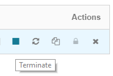

If you don't manually terminate the cluster it will automatically stop, provided you selected the **Terminate after \_\_ minutes of inactivity** checkbox while creating the cluster. In such a case, the cluster will automatically stop if it has been inactive for the specified time.

## Next steps

In this tutorial, you learned how to use Azure Databricks to stream data into Azure Event Hubs and then read the streaming data from Event Hubs in real time. Advance to the next tutorial to learn how to call the Anomaly Detector API and visualize anomalies using Power BI desktop. 

> [!div class="nextstepaction"]
>[Batch anomaly detection with Power BI desktop](batch-anomaly-detection-powerbi.md)
