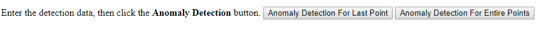

# Anomaly Finder Javascript application

Explore a Web application that uses the Anomaly Finder REST API to detect an anomaly. The example submits the time series data to the Anomaly Finder API with your subscription key, then gets Anomaly Finder result of time series data in batch from the API.

## Prerequisites

### Platform requirements

This tutorial has been developed using a simple text editor.

### Create an Anomaly Finder resource and get a subscription key 

- To use Anomaly Finder service, you need a subscription key, please refer to [Obtaining Subscription Keys](../How-to/get-subscription-key.md).

## Get and use the example

<a name="Step1"></a> 
### Download the tutorial project

Clone the [Cognitive Services JavaScript Anomaly Finder Tutorial](https://github.com/MicrosoftAnomalyDetection/javascript-sample-v2), or download the .zip file and extract it to an empty directory.

<a name="Step2"></a>

### Run the example

1. Put your **subscription key** into the Subscription Key field on detect function on anomaly-detection.html.
2. Put anomaly finder API endpoint, and verify that you are using the correct region in Subscription Region.
3. Open the **anomaly-detection.html** file in a Web browser.
4. Replace the sample data with your data points (Json) in Points field, or use the sample data directly.
5. You can choose anomaly detect way by click different button.

6. Click the anomaly finder button and verify the result in the right Response text box


<a name="Review"></a>
### Review and learn

Now you get a running application. Let's review how the example app integrates with Cognitive Services technology. This step will make it easier to either continue building on this app or develop your own app using Microsoft Anomaly Finder.
This example app makes use of the Anomaly Finder Restful API endpoint.
Reviewing how the Restful API gets used in the example application, let's look at a code snippet from anomaly-detection.html.

```JavaScript
function detectForEntirePoints() {
    var body = document.getElementById("requestTextArea").value;
    // Perform the REST API call.
    $.ajax({
        type: "post",
        url: entirePointsAPI,
        headers: {
            "Content-Type": "application/json",
            "Ocp-Apim-Subscription-Key": subscriptionKey
        },
        type: "POST",
        data: body,
        success: function (data) {
            // Show formatted JSON on webpage.
            $("#responseTextArea").val(JSON.stringify(data, null, 2));
        },
        error: function (request, status, error) {
            alert(request.responseText);
        }
    });
};
```

## Next steps

> [REST API reference](https://westus2.dev.cognitive.microsoft.com/docs/services/AnomalyFinderV2/operations/post-timeseries-entire-detect)
