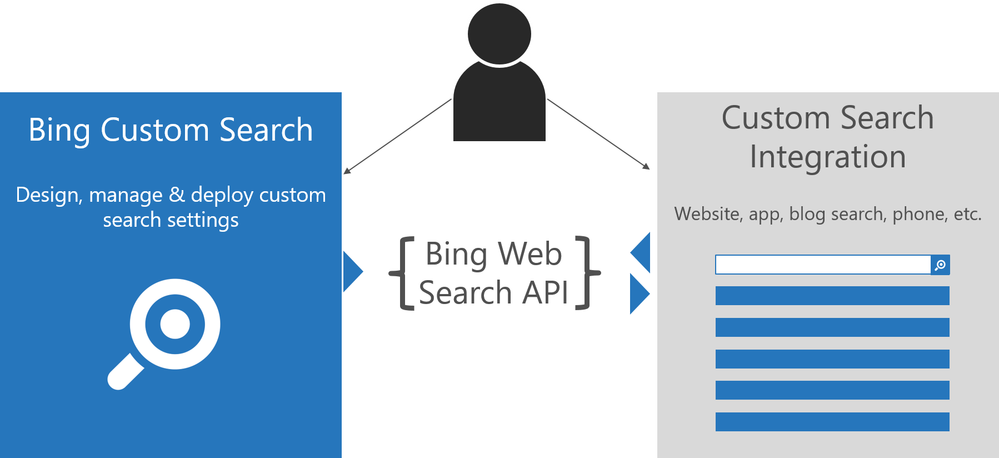

# Bing Custom Search - Free Preview

Bing Custom Search empowers businesses of any size, hobbyists, developers, and entrepreneurs  to create tailored search experiences for intents and topics that they really care about. The core technology works in three steps: 

1. Sign-up and start building your search in the Custom Search Portal.
2. Publish your Custom Search.
3. Integrate Your Search into your endpoint application of choice.

## Use cases
The most common custom search solutions supported by Bing Custom Search are building site search and topical search solutions. All solutions are retrievable via Bing Web Search API. Bing Web Search API returns a JSON file with the custom results, which can be integrated into many search endpoints. For example, internal websites, public websites, blogs, apps, etc. There are unlimited integration scenarios and end-user entry points for your custom search solutions.

## Free subscription keys
Upon sign-up, you are granted a free Azure subscription key.

## Supported Markets And Languages
- You decide which sites to search over. In this sense, Bing Custom Search is market and language agnostic.
- The built-in feature that suggests additional slices of the web for your search are English-sites only. 

## Needs beyond free trial quota
Bing Custom Search is in free preview. Check the pricing overview for further information on currently available features and quota.
If your search needs go beyond the quota of Bing Custom Search Free Preview, email bingcustomsearch@microsoft.com
