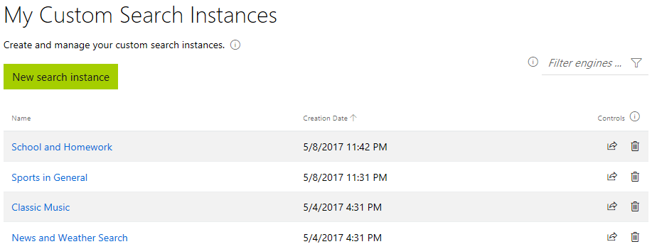

# Build a custom search and retrieve custom search results

This article provides information to help you quickly get started using Bing Custom Search to accomplish the following tasks:

1. Create a custom search instance
2. Define the slices of the web to search over
3. Adjust the ranking
4. Track custom search settings
5. Use published search settings
6. Programmatically retrieve custom search results


## Create a custom search instance 

After logging in, you see all your custom search instances that you have created so far.





A custom search instance contains all the settings that are required to define a custom search service tailored towards a scenario of your choice. For example, you might want to create a search service to find bike touring related content. You might want to create a custom search instance called **BikeTouring**.

Provide a meaningful name for your custom search instance. Confirm the name by clicking **configure**. You can change the name of your custom search instance later.


## Define the slices of the web to search over

> [!NOTE]
> All  custom search settings, that is, the slices that you want to search over, and your ranking controls, are automatically saved.

Next, define the right set of slices of the web to search over for your scenario. The custom slices can comprise:
		
* Domains, for example https://www.adventurecycling.org/
* Subdomains up to two subpaths, for example https://www.adventurecycling.org/resources/portrait-gallery/
* Web-pages, for example https://www.adventurecycling.org/resources/blog/the-best-of-2016-new-signs-new-routes-new-amtrak-bike-services/


To be able to search over your sites, they must be available online, and in Bing's web-index. 

If you own a site that you want to search over, which is not available in Bing's web-index, you can follow up with Bing directly. Consult the [Bing webmaster documentation](https://www.bing.com/webmaster/help/webmaster-guidelines-30fba23a).


### Add first slice
Start building your search by entering a domain, subdomain, or single webpage. To confirm your choice click **ADD**. 


You can omit the 'http', and 'https' prefixes. When you omit the 'www' prefix, Bing Custom Search does also match domains with different prefixes. For example, if you add _seattle.org_ to your search, it will also return results from _bagshaw.seattle.gov_ or _council.seattle.gov_. 


### Extend the slices to search over
To add more domains, subdomains, or webpages, select the row below your last entry. Specify your new entry there, followed by pressing **enter**. To remove an entry, click **delete** under Controls.


### Using standard Bing search
You can use standard Bing search to get inspirations of sites, subsites or web-pages that you want to add to your custom search instance. On the right-hand side, you see the search preview. Select from the drop-down menu next to the search icon Bing and submit a query.


You can see search results from Bing. Click **+** to add any of the returned results to your custom slice of the web that you want to search over.

### Using Site Suggestions
Once you have added at least three sites, or subsites to your search, Bing Custom Search generates site- and subsite suggestions that you might want to add to your search. You see them under the section **You might want to add**.

Make sure to press **Refresh** after having added new sites or ranking adjustments, as the suggestions are regenerated based on your settings. 

You can add relevant suggestions to your custom search by clicking **Add**. The selected site or subsite is added to the entries in the **Active** tab. You can now use it as any other site, subsite, or webpage that you added by hand.


## Adjust the ranking

Start validating your settings by searching over your defined subset of the web. On the right-hand side, you see the Search Preview. Enter a search term at the top, and press **enter** or click the search icon.

> [!NOTE]
> In case you do not see any result for your query, you might not have added enough websites to your custom slice of the web.
> As a result, no relevant search result can be found.


Next to each result you can see four different options to adjust the ranking for your custom search: 
* Pin-to-top, that is, for a specific query you define which specific web page appears on top of the results.
* Block, that is, sites, subsites, or web pages that you "block" are never shown in your custom search, regardless of the search query.
* Boost, that is, the site, subsite, or web pages that you "boost" are generically ranked higher among the search results that are retrieved, independently from the search query.
* Demote, that is, the site, subsite, or web pages selected for demoting are ranked lower among the search results that are retrieved for any search query.

### Creating pins
Adjusting the ranking to pin search results to the top for specific queries can be done in two ways:

1. Trigger a query on the search preview. Select from the results shown in the preview the web page that you want to pin on top for that query and click **Pin to top**.	
2. Go to the **Pinned** tab, and provide both exact URL, and the exact query, for which you want your URL to be shown on top.


You can track your pins in the **Pinned** tab. The pins are shown as 'exact query, exact URL'-pairs. To activate your pins, that is, make them retrievable via Bing Web Search API, you must click **Push Pins** on the bottom left of the portal.


### Using pins
When you work with pins:

* For a specific query, you can pin max. one URL to the top.
* In search preview, **Pin-to-top** adjustments show up immediately.
* Press **Push Pins** to activate your **Pin-to-top** adjustments. It takes around 15 minutes until a **Pin-to-top** adjustment is retrievable via Bing Web Search API. 
* Deleting a pin is not instantaneously reflected in the search preview. You can still see the former pinned URL on top for the specific query, until you use again the **Push Pin** function. Remember that it takes around 15 minutes until the new pins are activated. For tracking, you can view the status of your submitted pins.


## Track custom search settings

You can control the ranking via the tabs **Active**, **Blocked**, and **Pinned**. 

| Tab | Explanation |
|---|---|
|**Active**| Every time you add a boost, super boost or demote adjustment, you see a new entry in the **Active** tab. You can modify your adjustments at any time by using the options under **Ranking Adjust** and **Controls**. |
|**Blocked** | Every time you add a block adjustment, you see a new entry in the **Block** tab. You can deactivate a block rule by using the control **delete**. |
| **Pinned**| Every time you add a **pin-to-top** adjustment, it is added to the tab **Pinned**. |


### Understanding quota
* Per custom search instance, the maximum number of ranking adjustments as documented in the tabs **Active** and **Blocked** are capped to  400.
* Boosting and demoting count twice:
	* Adding a site to the **Active** tab counts as one ranking adjustment.
	* Boosting a site counts as two ranking adjustments: you whitelist a site first, then you boost it.
	* Demoting works similar like boosting, that is, demoting a site counts as two ranking adjustments.
	* Blocking is similar to whitelisting, that is, blocking a site counts as one ranking adjustment. 
* Furthermore, the maximum number of pins per custom search instance is limited to 200.

## Use published search settings
When you completed your custom search settings, click the **Custom Search Endpoint** icon that is shown next to the custom search instance name. 


You are routed to a page that shows you details on the Bing Web Search API endpoint for your custom search instance. To try out your search, specify a query and click **Test API**. You see on the right-hand side the algorithmic results from your custom search.


You can also validate your settings by calling your custom endpoint using different methodologies. In the UI, you find a Curl-based example in the box **API endpoint**. You can copy and paste the example in your Windows Command line to make a Bing Web Search API call and retrieve your custom search results.


## Programmatically retrieve custom search results
You can programmatically retrieve custom search results for users via Bing Web Search API. Requesting Bing Web Search API to obtain customized responses works the same way as requesting standard Bing web responses - with two differences:

1. The request URL has an additional parameter called `customconfig`.
2. The response contains the elementary and customizable elements of the Bing Web Search API output.

> [!NOTE]
> Bing Custom Search allows customizing web results only. It is not possible to retrieve, for example, customized image search results.


Read the [Bing Web Search API Use and Display requirements](https://docs.microsoft.com/azure/cognitive-services/bing-web-search/useanddisplayrequirements) to understand how to display the retrieved results.


### Request Parameters

#### Request URL
The request URL looks as follows:

```
https://api.cognitive.microsoft.com/bingcustomsearch/v5.0/search[?q][&customconfig][&count][&offset][&mkt][&safesearch]
```

| **Parameter** | Type | Required / Optional| Description |
| --- | --- | --- | ---|
| **q** | string | Required |The user's search query string |
| **customconfig** | number | Optional | Unique identifier for your custom search instance |
| **count** | number | Optional | The number of search results to return in the response. The actual number delivered may be less than requested.|
| **offset** | number | Optional | The zero-based offset that indicates the number of search results to skip before returning results.|
| **mkt** | string | Optional | The market where the results come from. Typically, it is the country where the user is making the request from. However, it could be a different country - if the user is not located in a country where Bing delivers results. The market must be specified with a hyphen between language and market. For example, en-US. |
| **safesearch** |string | Optional | A filter used to filter results for adult content.|


#### Request headers

| Parameter | Type | Required / Optional| Description |
| --- | --- | --- | ---|
| Ocp-Apim-Subscription-Key | string | Required | Subscription key, which provides access to this API. Found in your subscriptions. |


### Response Body
Bing Custom Search allows customizing web results only, which maps to the response field `webPages`. For example, images or news results cannot be customized. That's why they are not retrievable when calling Bing Web Search API with the `customconfig` parameter in the search request.

Below you see a JSON response of a Bing Web Search API call with a `customconfig` parameter. 

```
{
    "_type" : "SearchResponse",
    "queryContext" : {...},
    "webPages" : {...},
    "spellSuggestion" : {...},
    "rankingResponse" : {...}
}
```
