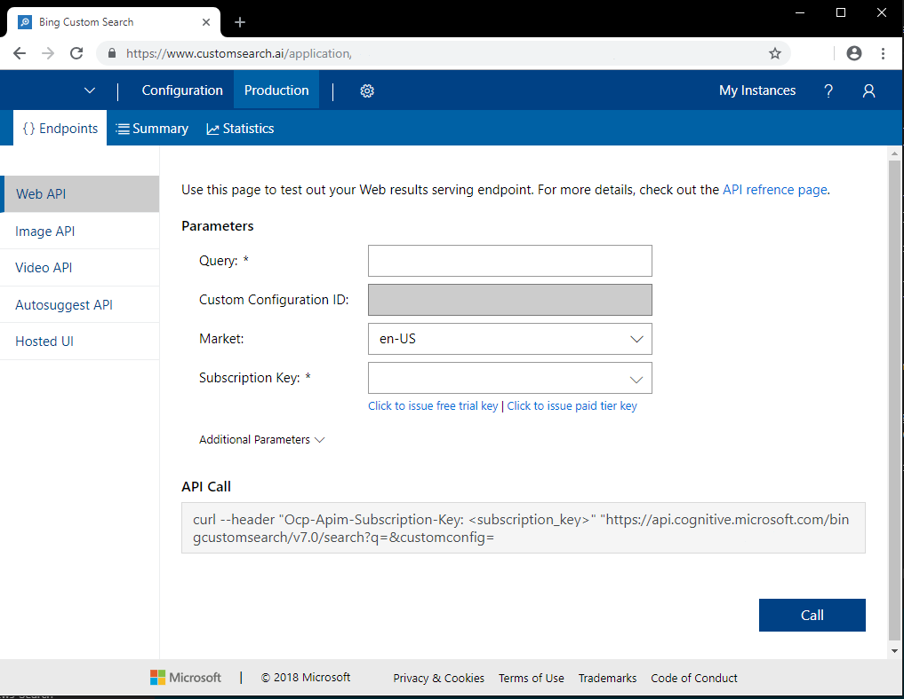

# Call your Bing Custom Search instance from the Portal

After you've configured your custom search experience, you can test it from within the Bing Custom Search [portal](https://customsearch.ai). 

## Create a search query 

After you've signed into the Bing Custom Search [portal](https://customsearch.ai), select your search instance and click the **Production** tab. Under **Endpoints**, select an API endpoint (for example, Web API). Your subscription determines what endpoints are shown.

To create a search query, enter the parameter values for your endpoint. Note that the parameters displayed in the portal may change depending on the endpoint you choose. See the [Custom Search API reference](https://docs.microsoft.com/rest/api/cognitiveservices-bingsearch/bing-custom-search-api-v7-reference#query-parameters) for more information. To change the subscription your search instance uses, add the appropriate subscription key, and update the appropriate market and/or language parameters.

Some important parameters are below:

|Parameter  |Description  |
|---------|---------|
|Query     | The search term to search for. Only available for Web, Image, Video, and Autosuggest endpoints |
|Custom Configuration ID | The configuration ID of the selected Custom Search instance. This field is read only. |
|Market     | The market that results will originate from. Only available for the Web, Image, Video, and Hosted UI endpoints.        |
|Subscription Key | The subscription key to test with. You can select a key from the dropdown list or enter one manually.          |

Clicking **Additional Parameters** reveals the following parameters:  

|Parameter  |Description  |
|---------|---------|
|Safe Search     | A filter used to filter webpages for adult content. Only available for the Web, Image, Video, and Hosted UI endpoints. Note that Bing Custom Video Search only supports two values: `moderate` and `strict`.        |
|User Interface Language    | The language used for user interface strings. For example, if you enable images and videos in Hosted UI, the **Image** and **Video** tabs use the specified language.        |
|Count     | The number of search results to return in the response. Available only for Web, Image, and Video endpoints.         |
|Offset    | The number of search results to skip before returning results. Available only for Web, Image, and Video endpoints.        |
    
After you've specified all required options, click **Call** to view the JSON response in the right pane. If you select the Hosted UI endpoint, you can test the search experience in the bottom pane.

## Change your Bing Custom Search subscription

You can change the subscription associated with your Bing Custom Search instance without creating a new instance. To have API calls sent and charged to a new subscription, create a new Bing Custom Search resource in the Azure portal. Use the new subscription key in your API requests, along with your instance's custom configuration ID.

## Next steps

- [Call your custom view with C#](./call-endpoint-csharp.md)
- [Call your custom view with Java](./call-endpoint-java.md)
- [Call your custom view with NodeJs](./call-endpoint-nodejs.md)
- [Call your custom view with Python](./call-endpoint-python.md)

- [Call your custom view with the C# SDK](./sdk-csharp-quick-start.md)
