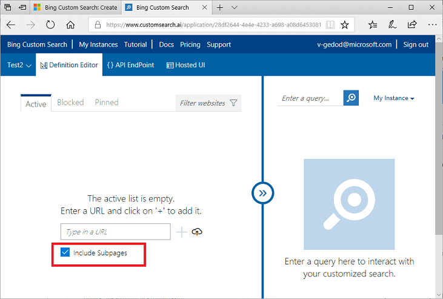
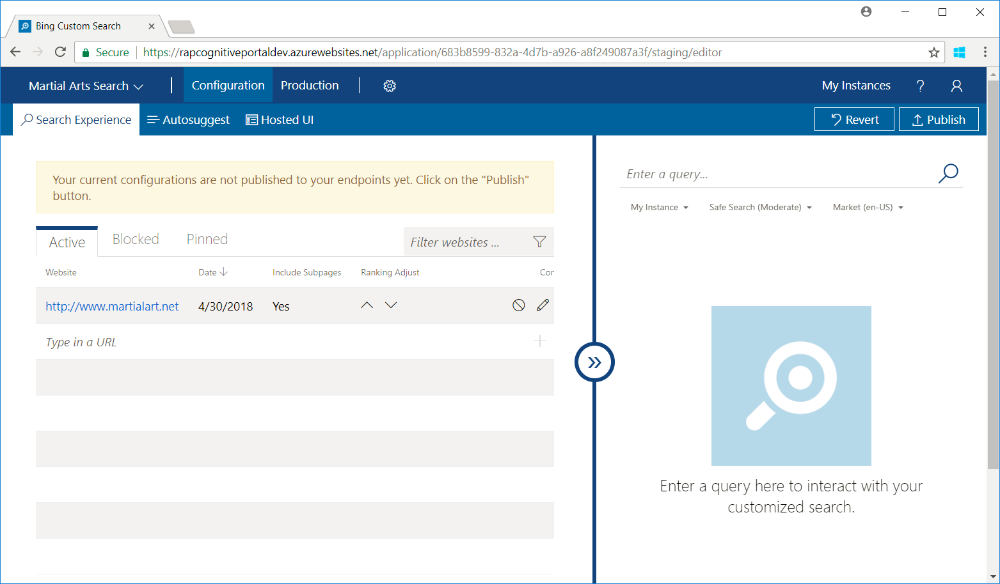
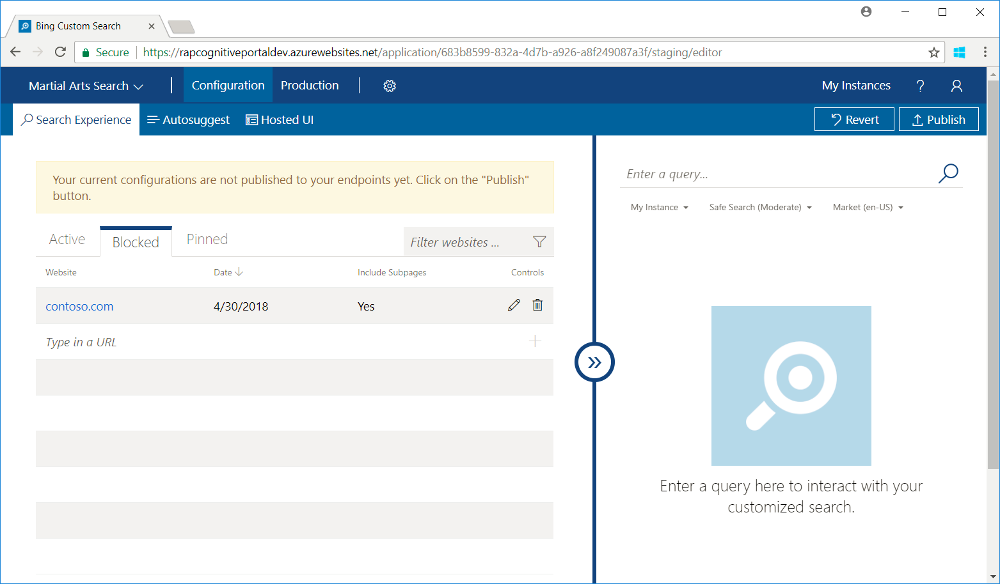
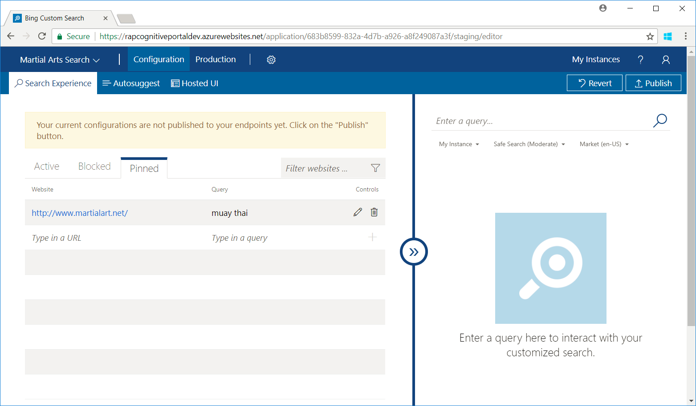
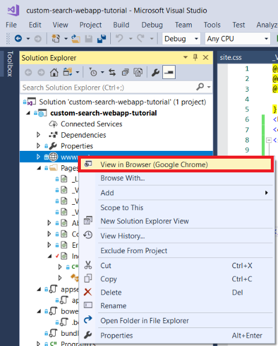

# Tutorial: Build a Custom Search web page

Bing Custom Search enables you to create tailored search experiences for topics that you care about. For example, if you own a martial arts website that provides a search experience, you can specify the domains, subsites, and webpages that Bing searches. Your users see search results tailored to the content they care about instead of paging through general search results that may contain irrelevant content. 

This tutorial demonstrates how to configure a custom search instance and integrate it into a new web page.

The tasks covered are:

> [!div class="checklist"]
> - Create a custom search instance
> - Add active entries
> - Add blocked entries
> - Add pinned entries
> - Integrate custom search into a web page

## Prerequisites

- To follow along with the tutorial, you need a subscription key for the Bing Custom Search API.  To get a key, see [Try Cognitive Services](https://azure.microsoft.com/try/cognitive-services/?api=bing-custom-search).
- If you don’t already have Visual Studio 2017 or later installed, you can download and use the **free** [Visual Studio 2019 Community Edition](https://www.visualstudio.com/downloads/).

## Create a custom search instance

To create a Bing Custom Search instance:

1. Open an internet browser.  
  
2. Navigate to the custom search [portal](https://customsearch.ai).  
  
3. Sign in to the portal using a Microsoft account (MSA). If you don’t have an MSA, click **Create a Microsoft account**. If it’s your first time using the portal, it will ask for permissions to access your data. Click **Yes**.  
  
4. After signing in, click **New custom search**. In the **Create a new custom search instance** window, enter a name that’s meaningful and describes the type of content the search returns. You can change the name at any time.  
  
     
  
5. Click OK, specify a URL and whether to include subpages of the URL.  
  
     


## Add active entries

To include results from specific websites or URLs, add them to the **Active** tab.

1.	On the **Configuration** page, click the **Active** tab and enter the URL of one or more websites you want to include in your search.

    

2.	To confirm that your instance returns results, enter a query in the preview pane on the right. Bing returns only results for public websites that it has indexed.

## Add blocked entries

To exclude results from specific websites or URLs, add them to the **Blocked** tab.

1. On the **Configuration** page, click the **Blocked** tab and enter the URL of one or more websites you want to exclude from your search.

    


2. To confirm that your instance doesn't return results from the blocked websites, enter a query in the preview pane on the right. 

## Add pinned entries

To pin a specific webpage to the top of the search results, add the webpage and query term to the **Pinned** tab. The **Pinned** tab contains a list of webpage and query term pairs that specify the webpage that appears as the top result for a specific query. The webpage is pinned only if the user’s query string matches the pin's query string based on pin's match condition. Only indexed webpages will be displayed in searches. See [Define your custom view](../define-your-custom-view.md#pin-slices-to-the-top-of-search-results) for more information.

1. On the **Configuration** page, click the **Pinned** tab and enter the webpage and query term of the webpage that you want returned as the top result.  
  
2. By default, the user's query string must exactly match your pin's query string for Bing to return the webpage as the top result. To change the match condition, edit the pin (click the pencil icon), click Exact in the **Query match condition** column, and select the match condition that's right for your application.  
  
    
  
3. To confirm that your instance returns the specified webpage as the top result, enter the query term you pinned in the preview pane on the right.

## Configure Hosted UI

Custom Search provides a hosted UI to render the JSON response of your custom search instance. To define your UI experience:

1. Click the **Hosted UI** tab.  
  
2. Select a layout.  
  
     
  
3. Select a color theme.  
  
     

   If you need to fine-tune the color theme to better integrate with your web app, click **Customize theme**. Not all color configurations apply to all layout themes. To change a color, enter the color's RGB HEX value (for example, #366eb8) in the corresponding text box. Or, click the color button and then click the shade that works for you. Always think about accessibility when selecting colors.
  
     

  
4. Specify additional configuration options.  
  
     
  
   To get advanced configurations, click **Show advanced configurations**. This adds configurations such as *Link target* to Web search options, *Enable filters* to Image and Video options, and *Search box text placeholder* to Miscellaneous options.

     
  
5. Select your subscription keys from the dropdown lists. Or, you can enter the subscription key manually. For information about getting keys, see [Try Cognitive Services](https://azure.microsoft.com/try/cognitive-services/?api=bing-custom-search-api).  
  
   

[!INCLUDE [publish or revert](../includes/publish-revert.md)]

<a name="consuminghostedui"></a>
## Consuming Hosted UI

There are two ways to consume the hosted UI.  

- Option 1: Integrate the provided JavaScript snippet into your application.
- Option 2: Use the HTML Endpoint provided.

The remainder of this tutorial illustrates **Option 1: Javascript snippet**.  

## Set up your Visual Studio solution

1. Open **Visual Studio** on your computer.  
  
2. On the **File** menu, select **New**, and then choose **Project**.  
  
3. In the **New Project** window, select **Visual C# / Web / ASP.NET Core Web Application**, name your project, and then click **OK**.  
  
     
  
4. In the **New ASP.NET Core Web Application** window, select **Web Application** and click **OK**.  
  
     

## Edit index.cshtml

1. In the **Solution Explorer**, expand **Pages** and double-click **index.cshtml** to open the file.  
  
     
  
2. In index.cshtml, delete everything starting from line 7 and below.  
  
   ```razor
   @page
   @model IndexModel
   @{
      ViewData["Title"] = "Home page";
   }    
   ```  
  
3. Add a line break element and a div to act as a container.  
  
   ```html
   @page
   @model IndexModel
   @{
      ViewData["Title"] = "Home page";
   }
   <br />
   <div id="customSearch"></div>
   ```  
  
4. In the **Hosted UI** page, scroll down to the section titled **Consuming the UI**. Click the *Endpoints* to access the JavaScript snippet. You can also get to the snippet by clicking **Production** and then the **Hosted UI** tab.
  
   <!-- Get new screenshot after prod gets new bits
     
   -->
  
5. Paste the script element into the container you added.  
  
   ``` html
   @page
   @model IndexModel
   @{
      ViewData["Title"] = "Home page";
   }
   <br />
   <div id="customSearch">
      <script type="text/javascript" 
          id="bcs_js_snippet"
          src="https://ui.customsearch.ai /api/ux/rendering-js?customConfig=<YOUR-CUSTOM-CONFIG-ID>&market=en-US&safeSearch=Moderate&version=latest&q=">
      </script>
   </div>
   ```  
  
6. In the **Solution Explorer**, right click on **wwwroot** and click **View in Browser**.  
  
     

Your new custom search web page should look similar to this:


Performing a search renders results like this:


## Next steps

> [!div class="nextstepaction"]
> [Call Bing Custom Search endpoint (C#)](../call-endpoint-csharp.md)
