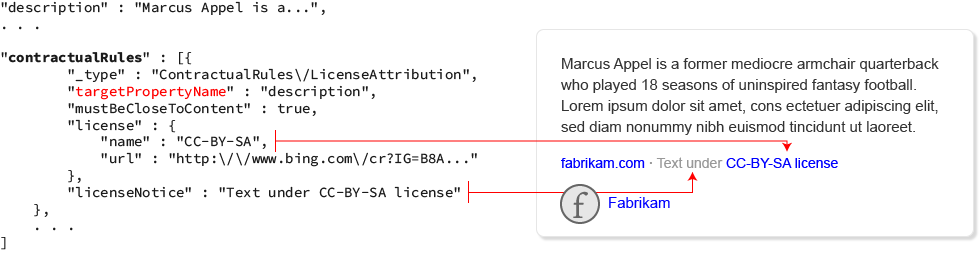
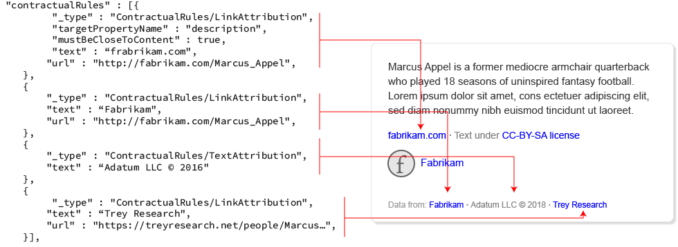

# Searching for entities with the Bing Entity API

## Suggest search terms with the Bing Autosuggest API

If you provide a search box where the user enters their search term, use the [Bing Autosuggest API](../../bing-autosuggest/get-suggested-search-terms.md) to improve the experience. The API returns suggested query strings based on partial search terms as the user types.

After the user enters their search term, URL encode the term before setting the [q](https://docs.microsoft.com/rest/api/cognitiveservices-bingsearch/bing-entities-api-v7-reference#query) query parameter. For example, if the user enters *Marcus Appel*, set `q` to *Marcus+Appel* or *Marcus%20Appel*.

If the search term contains a spelling mistake, the search response includes a [QueryContext](https://docs.microsoft.com/rest/api/cognitiveservices-bingsearch/bing-entities-api-v7-reference#querycontext) object. The object shows the original spelling and the corrected spelling that Bing used for the search.

```json
"queryContext": {
    "originalQuery": "hollo wrld",
    "alteredQuery": "hello world",
    "alterationOverrideQuery": "+hollo wrld",
    "adultIntent": false
}
```

## The Bing Entity Search API response

The API response contains a [SearchResponse](https://docs.microsoft.com/rest/api/cognitiveservices-bingsearch/bing-entities-api-v7-reference#searchresponse) object. If Bing finds an entity or place that's relevant, the object includes the `entities` field, `places` field, or both. Otherwise, the response object does not include either field.
> [!NOTE]
> Entity responses support multiple markets, but the Places response supports only US Business locations. 

The `entities` field is an [EntityAnswer](https://docs.microsoft.com/rest/api/cognitiveservices-bingsearch/bing-entities-api-v7-reference) object that contains a list of [Entity](https://docs.microsoft.com/rest/api/cognitiveservices-bingsearch/bing-entities-api-v7-reference#entity) objects (see the `value` field). The list may contain a single dominant entity, multiple disambiguation entities, or both. 

A dominant entity is returned when Bing believes it to be the only entity that satisfies the request (there is no ambiguity as to which entity satisfies the request). If multiple entities could satisfy the request, the list contains more than one disambiguation entity. For example, if the request uses the generic title of a movie franchise, the list likely contains disambiguation entities. But, if the request specifies a specific title from the franchise, the list likely contains a single dominant entity.

Entities include well-known personalities such as singers, actors, athletes, models, etc.; places and landmarks such as Mount Rainier or Lincoln Memorial; and things such as a banana, goldendoodle, book, or movie title. The [entityPresentationInfo](https://docs.microsoft.com/rest/api/cognitiveservices-bingsearch/bing-entities-api-v7-reference#entitypresentationinfo) field contains hints that identify the entity's type. For example, if it's a person, movie, animal, or attraction. For a list of possible types, see [Entity Types](https://docs.microsoft.com/rest/api/cognitiveservices-bingsearch/bing-entities-api-v7-reference#entity-types)

```json
"entityPresentationInfo": {
    "entityScenario": "DominantEntity",
    "entityTypeHints": ["Attraction"],
    "entityTypeDisplayHint": "Mountain"
}, ...
```

The following shows a response that includes a dominant and disambiguation entity.

```json
{
    "_type": "SearchResponse",
    "queryContext": {
        "originalQuery": "Mount Rainier"
    },
    "entities": {
        "value": [{
            "contractualRules": [{
                "_type": "ContractualRules/LicenseAttribution",
                "targetPropertyName": "description",
                "mustBeCloseToContent": true,
                "license": {
                    "name": "CC-BY-SA",
                    "url": "https://creativecommons.org/licenses/by-sa/3.0/"
                },
                "licenseNotice": "Text under CC-BY-SA license"
            },
            {
                "_type": "ContractualRules/LinkAttribution",
                "targetPropertyName": "description",
                "mustBeCloseToContent": true,
                "text": "contoso.com",
                "url": "http://contoso.com/mount_rainier"
            },
            {
                "_type": "ContractualRules/MediaAttribution",
                "targetPropertyName": "image",
                "mustBeCloseToContent": true,
                "url": "http://contoso.com/mount-rainier"
            }],
            "webSearchUrl": "https://www.bing.com/search?q=Mount%20Rainier...",
            "name": "Mount Rainier",
            "url": "http://www.northwindtraders.com/",
            "image": {
                "name": "Mount Rainier",
                "thumbnailUrl": "https://www.bing.com/th?id=A4ae343983daa4...",
                "provider": [{
                    "_type": "Organization",
                    "url": "http://contoso.com/mount_rainier"
                }],
                "hostPageUrl": "http://contoso.com/commons/7/72/mount_rain...",
                "width": 110,
                "height": 110
            },
            "description": "Mount Rainier is 14,411 ft tall and the highest mountain...",
            "entityPresentationInfo": {
                "entityScenario": "DominantEntity",
                "entityTypeHints": ["Attraction"]
            },
            "bingId": "38b9431e-cf91-93be-0584-c42a3ecbfdc7"
        },
        {
            "contractualRules": [{
                "_type": "ContractualRules/MediaAttribution",
                "targetPropertyName": "image",
                "mustBeCloseToContent": true,
                "url": "http://contoso.com/mount_rainier_national_park"
            }],
            "webSearchUrl": "https://www.bing.com/search?q=Mount%20Rainier%20National...",
            "name": "Mount Rainier National Park",
            "url": "http://worldwideimporters.com/",
            "image": {
                "name": "Mount Rainier National Park",
                "thumbnailUrl": "https://www.bing.com/th?id=A91bdc5a1b648a695a39...",
                "provider": [{
                    "_type": "Organization",
                    "url": "http://contoso.com/mount_rainier_national_park"
                }],
                "hostPageUrl": "http://contoso.com/en/7/7a...",
                "width": 50,
                "height": 50
            },
            "description": "Mount Rainier National Park is a United States National Park...",
            "entityPresentationInfo": {
                "entityScenario": "DisambiguationItem",
                "entityTypeHints": ["Organization"]
            },
            "bingId": "29d4b681-227a-3924-7bb1-8a54e8666b8c"
        }]
    }
}
```

The entity includes a `name`, `description`, and `image` field. When you display these fields in your user experience, you must attribute them. The `contractualRules` field contains a list of attributions that you must apply. The contractual rule identifies the field that the attribution applies to. For information about applying attribution, see [Attribution](#data-attribution).

```json
"contractualRules": [{
    "_type": "ContractualRules/LicenseAttribution",
    "targetPropertyName": "description",
    "mustBeCloseToContent": true,
    "license": {
        "name": "CC-BY-SA",
        "url": "https://creativecommons.org/licenses/by-sa/3.0/"
    },
    "licenseNotice": "Text under CC-BY-SA license"
},
{
    "_type": "ContractualRules/LinkAttribution",
    "targetPropertyName": "description",
    "mustBeCloseToContent": true,
    "text": "contoso.com",
    "url": "http://contoso.com/wiki/Mount_Rainier"
},
{
    "_type": "ContractualRules/MediaAttribution",
    "targetPropertyName": "image",
    "mustBeCloseToContent": true,
    "url": "http://contoso.com/wiki/Mount_Rainier"
}], ...
```

When you display the entity information (name, description, and image), you must also use the URL in the `webSearchUrl` field to link to the Bing search results page that contains the entity.

## Find places

The `places` field is a [LocalEntityAnswer](https://docs.microsoft.com/rest/api/cognitiveservices-bingsearch/bing-entities-api-v7-reference) object that contains a list of [Place](https://docs.microsoft.com/rest/api/cognitiveservices-bingsearch/bing-entities-api-v7-reference#place) objects (see the [Entity Types](https://docs.microsoft.com/rest/api/cognitiveservices-bingsearch/bing-entities-api-v7-reference#entity-types) for more information). The list contains one or more local entities that satisfy the request.

Places include restaurant, hotels, or local businesses. The [entityPresentationInfo](https://docs.microsoft.com/rest/api/cognitiveservices-bingsearch/bing-entities-api-v7-reference#entitypresentationinfo) field contains hints that identify the local entity's type. The list contains a list of hints such as Place, LocalBusiness, Restaurant. Each successive hint in the array narrows the entity's type. For a list of possible types, see [Entity Types](https://docs.microsoft.com/rest/api/cognitiveservices-bingsearch/bing-entities-api-v7-reference#entity-types)

```json
"entityPresentationInfo": {
    "entityScenario": "ListItem",
    "entityTypeHints": ["Place",
    "LocalBusiness",
    "Restaurant"]
}, ...
```
> [!NOTE]
> Entity responses support multiple markets, but the Places response supports only US Business locations. 

Local aware entity queries such as *restaurant near me* require the user's location to provide accurate results. Your requests should always use the X-Search-Location and X-MSEdge-ClientIP headers to specify the user's location. If Bing thinks the query would benefit from the user's location, it sets the `askUserForLocation` field of [QueryContext](https://docs.microsoft.com/rest/api/cognitiveservices-bingsearch/bing-entities-api-v7-reference#querycontext) to **true**. 

```json
{
    "_type": "SearchResponse",
    "queryContext": {
        "originalQuery": "Sinful Bakery and Cafe",
        "askUserForLocation": true
    },
    ...
}
```

A place result includes the place's name, address, telephone number, and URL to the entity's website. When you display the entity information, you must also use the URL in the `webSearchUrl` field to link to the Bing search results page that contains the entity.

```json
"places": {
    "value": [{
        "_type": "Restaurant",
        "webSearchUrl": "https://www.bing.com/search?q=Sinful%20Bakery...",
        "name": "Liberty's Delightful Sinful Bakery & Cafe",
        "url": "http://libertysdelightfulsinfulbakeryandcafe.com/",
        "entityPresentationInfo": {
            "entityScenario": "ListItem",
            "entityTypeHints": ["Place",
            "LocalBusiness",
            "Restaurant"]
        },
        "address": {
            "addressLocality": "Seattle",
            "addressRegion": "WA",
            "postalCode": "98112",
            "addressCountry": "US",
            "neighborhood": "Madison Park"
        },
        "telephone": "(800) 555-1212"
    }]
}
```

> [!NOTE]
> You, or a third party on your behalf, may not use, retain, store, cache, share, or distribute any data from the Entities API for the purpose of testing, developing, training, distributing or making available any non-Microsoft service or feature.  

## Data attribution

Bing Entity API responses contain information owned by third parties. You are responsible to ensure your use is appropriate, for example by complying with any creative commons license your user experience may rely on.

If an answer or result includes the `contractualRules`, `attributions`, or `provider` fields, you must attribute the data. If the answer does not include any of these fields, no attribution is required. If the answer includes the `contractualRules` field and the `attributions` and/or `provider` fields, you must use the contractual rules to attribute the data.

The following example shows an entity that includes a MediaAttribution contractual rule and an Image that includes a `provider` field. The MediaAttribution rule identifies the image as the target of the rule, so you'd ignore the image's `provider` field and instead use the MediaAttribution rule to provide attribution.  

```json
"value": [{
    "contractualRules": [
        ...
        {
            "_type": "ContractualRules/MediaAttribution",
            "targetPropertyName": "image",
            "mustBeCloseToContent": true,
            "url": "http://contoso.com/mount_rainier"
        }
    ],
    ...
    "image": {
        "name": "Mount Rainier",
        "thumbnailUrl": "https://www.bing.com/th?id=A46378861201...",
        "provider": [{
            "_type": "Organization",
            "url": "http://contoso.com/mount_rainier"
        }],
        "hostPageUrl": "http://www.graphicdesigninstitute.com/Uploaded...",
        "width": 110,
        "height": 110
    },
    ...
}]
```

If a contractual rule includes the `targetPropertyName` field, the rule applies only to the targeted field. Otherwise, the rule applies to the parent object that contains the `contractualRules` field.

In the following example, the `LinkAttribution` rule includes the `targetPropertyName` field, so the rule applies to the `description` field. For rules that apply to specific fields, you must include a line immediately following the targeted data that contains a hyperlink to the provider's website. For example, to attribute the description, include a line immediately following the description text that contains a hyperlink to the data on the provider's website, in this case create a link to contoso.com.

```json
"entities": {
    "value": [{
            ...
            "description": "Marcus Appel is a former American....",
            ...
            "contractualRules": [{
                    "_type": "ContractualRules/LinkAttribution",
                    "targetPropertyName": "description",
                    "mustBeCloseToContent": true,
                    "text": "contoso.com",
                    "url": "http://contoso.com/cr?IG=B8AD73..."
                 },
            ...
  
```

### License attribution

If the list of contractual rules includes a [LicenseAttribution](https://docs.microsoft.com/rest/api/cognitiveservices-bingsearch/bing-entities-api-v7-reference#licenseattribution) rule, you must display the notice on the line immediately following the content that the license applies to. The `LicenseAttribution` rule uses the `targetPropertyName` field to identify the property that the license applies to.

The following shows an example that includes a `LicenseAttribution` rule.



The license notice that you display must include a hyperlink to the website that contains information about the license. Typically, you make the name of the license a hyperlink. For example, if the notice is **Text under CC-BY-SA license** and CC-BY-SA is the name of the license, you would make CC-BY-SA a hyperlink.

### Link and text attribution

The [LinkAttribution](https://docs.microsoft.com/rest/api/cognitiveservices-bingsearch/bing-entities-api-v7-reference#linkattribution) and [TextAttribution](https://docs.microsoft.com/rest/api/cognitiveservices-bingsearch/bing-entities-api-v7-reference#textattribution) rules are typically used to identify the provider of the data. The `targetPropertyName` field identifies the field that the rule applies to.

To attribute the providers, include a line immediately following the content that the attributions apply to (for example, the targeted field). The line should be clearly labeled to indicate that the providers are the source of the data. For example, "Data from: contoso.com". For `LinkAttribution` rules, you must create a hyperlink to the provider's website.

The following shows an example that includes `LinkAttribution` and `TextAttribution` rules.



### Media attribution

If the entity includes an image and you display it, you must provide a click-through link to the provider's website. If the entity includes a [MediaAttribution](https://docs.microsoft.com/rest/api/cognitiveservices-bingsearch/bing-entities-api-v7-reference#mediaattribution) rule, use the rule's URL to create the click-through link. Otherwise, use the URL included in the image's `provider` field to create the click-through link.

The following shows an example that includes an image's `provider` field and contractual rules. Because the example includes the contractual rule, you ignore the image's `provider` field and apply the `MediaAttribution` rule.


### Search or search-like experience

Just like with Bing Web Search API, the Bing Entity Search API may only be used as a result of a direct user query or search, or as a result of an action within an app or experience that logically can be interpreted as a user’s search request. For illustration purposes, the following are some examples of acceptable search or search-like experiences.

- User enters a query directly into a search box in an app
- User selects specific text or image and requests “more information” or “additional information”
- User asks a search bot about a particular topic
- User dwells on a particular object or entity in a visual search type scenario

If you are not sure if your experience can be considered a search-like experience, it is recommended that you check with Microsoft.

## Throttling requests

[!INCLUDE [cognitive-services-bing-throttling-requests](../../../../includes/cognitive-services-bing-throttling-requests.md)]

## Next steps

* Try a [Quickstart](../quickstarts/csharp.md) to get started searching for entities with the Bing Entity Search API.
