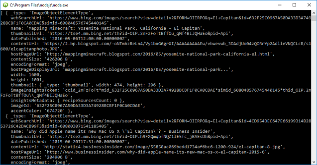

# Quickstart: Request and filter images using the SDK and Node.js

The Bing Image Search SDK contains the functionality of the REST API for image queries and parsing results. 

The [source code for Node Bing Image Search SDK samples](https://github.com/Azure-Samples/cognitive-services-node-sdk-samples/blob/master/Samples/imageSearch.js) is available on Git Hub.

## Application dependencies

To set up a console application using the Bing Image Search SDK, run `npm install azure-cognitiveservices-imagesearch` in your development environment.

## Image Search client
Get a [Cognitive Services access key](https://azure.microsoft.com/try/cognitive-services/) under *Search*. Create an instance of the `CognitiveServicesCredentials`:
```
const CognitiveServicesCredentials = require('ms-rest-azure').CognitiveServicesCredentials;
let credentials = new CognitiveServicesCredentials('YOUR-ACCESS-KEY');
```
Then, instantiate the client:
```
const ImageSearchAPIClient = require('azure-cognitiveservices-imagesearch');
let client = new ImageSearchAPIClient(credentials);
```
Use the client to search with a query text, in this case 'El Capitan':
```
client.imagesOperations.search('El Capitan', function (err, result, request, response) {
    if (err) throw err;
    console.log(result.value);
});

```
<!-- Need to sanitize result
The code prints `result.value` items to the console without parsing any text. The results will be:
- _type: 'ImageObjectElementType'


-->

## Next steps

[Cognitive services Node.js SDK samples](https://github.com/Azure-Samples/cognitive-services-node-sdk-samples)