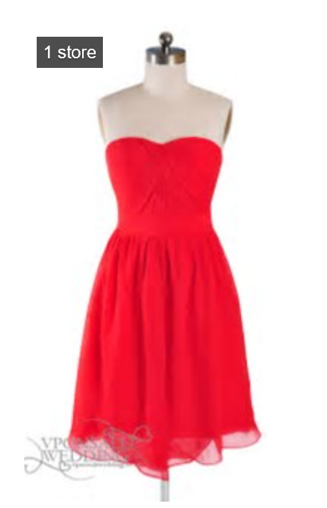

# Resizing and cropping thumbnail images

Upon processing a search query, Bing will generate thumbnail information for all images in its [response](https://docs.microsoft.com/azure/cognitive-services/bing-image-search/concepts/bing-image-search-get-images#bing-image-search-response-format). This information can be used to display all, or a subset of the returned thumbnails. If you display a subset, provide a option to view the remaining images.

<!-- Removing image until we can replace it with a sanatized version.

-->

If the user clicks the thumbnail, you can use [contentUrl](https://docs.microsoft.com/rest/api/cognitiveservices/bing-images-api-v7-reference#image-contenturl) to display the full-size image to the user. Be sure to attribute the image.

If `shoppingSourcesCount` or `recipeSourcesCount` are greater than zero, add badging, such as a shopping cart, to the thumbnail to indicate that shopping or recipes exist for the item in the image.

<!-- this is a sanitized version but we're removing all images for now until everything is sanitized.

-->

To get insights about the image, such as web pages that include the image or people that were recognized in the image, use [imageInsightsToken](https://docs.microsoft.com/rest/api/cognitiveservices/bing-images-api-v7-reference#image-imageinsightstoken). For details, see [Image Insights](image-insights.md).

## Resizing and cropping thumbnails

You can also resize and expand thumbnails, such as when a user's cursor hovers above it.
> [!NOTE]
> Be sure to attribute the image if you expand it. For example, by extracting the host from [hostPageDisplayUrl](https://docs.microsoft.com/rest/api/cognitiveservices/bing-images-api-v7-reference#image-hostpagedisplayurl) and displaying it below the image.

[!INCLUDE [cognitive-services-bing-resize-crop-thumbnails](../../../includes/cognitive-services-bing-resize-crop-thumbnails.md)]
