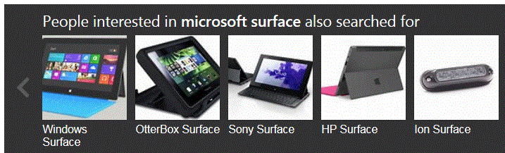
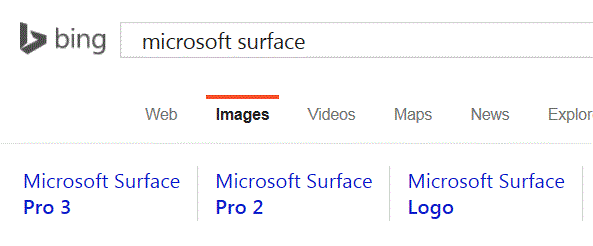

# Search the web for images

The Images Search API provides a similar (but not exact) experience to Bing.com/Images. The API lets you send a search query to Bing and get back a list of relevant images.  

If you're building an images-only search results page to find images that are relevant to the user's search query, call this API instead of calling the more general [Web Search API](../bing-web-search/search-the-web.md). If you want images and other types of content such as webpages, news, and videos, then call the Web Search API.


## Search query term

If you provide a search box where the user enters their search term, use the [Bing Autosuggest API](../bing-autosuggest/get-suggested-search-terms.md) to improve the experience. The API returns suggested query strings based on partial search terms as the user types.

After the user enters their query term, URL encode the term before setting the [q](https://docs.microsoft.com/rest/api/cognitiveservices/bing-images-api-v5-reference#query) query parameter. For example, if the user enters *sailing dinghies*, set `q` to *sailing+dinghies* or *sailing%20dinghies*.

  
## Getting images

To get images related to the user's search term from the web, send the following GET request:

```  
GET https://api.cognitive.microsoft.com/bing/v5.0/images/search?q=sailing+dinghies&mkt=en-us HTTP/1.1  
Ocp-Apim-Subscription-Key: 123456789ABCDE  
User-Agent: Mozilla/5.0 (compatible; MSIE 10.0; Windows Phone 8.0; Trident/6.0; IEMobile/10.0; ARM; Touch; NOKIA; Lumia 822)  
X-Search-ClientIP: 999.999.999.999  
X-Search-Location: lat:47.60357;long:-122.3295;re:100  
X-MSEdge-ClientID: <blobFromPriorResponseGoesHere>  
Host: api.cognitive.microsoft.com  
```  

> [!NOTE]
> V7 Preview request:

> ```  
> GET https://api.cognitive.microsoft.com/bing/v7.0/images/search?q=sailing+dinghies&mkt=en-us HTTP/1.1  
> Ocp-Apim-Subscription-Key: 123456789ABCDE  
> X-MSEdge-ClientIP: 999.999.999.999  
> X-Search-Location: lat:47.60357;long:-122.3295;re:100  
> X-MSEdge-ClientID: <blobFromPriorResponseGoesHere>  
> Host: api.cognitive.microsoft.com  
> ```  

All requests must be made from a server. You may not make calls from a client.  

If it's your first time calling any of the Bing APIs, don't include the client ID header. Only include the client ID if you've previously called a Bing API and Bing returned a client ID for the user and device combination.

To get images from a specific domain, use the [site:](http://msdn.microsoft.com/library/ff795613.aspx) query operator.  
  
```  
GET https://api.cognitive.microsoft.com/bing/v5.0/images/search?q=sailing+dinghies+site:contososailing.com&mkt=en-us HTTP/1.1  
```

The response contains an [Images](https://docs.microsoft.com/rest/api/cognitiveservices/bing-images-api-v5-reference#images) answer that contains a list of images that Bing thought were relevant to the query. Each [Image](https://docs.microsoft.com/rest/api/cognitiveservices/bing-images-api-v5-reference#image) object in the list includes the URL of the image, its size, its dimensions, and its encoding format. The image object also includes the URL of a thumbnail of the image and the thumbnail's dimensions.

```
        {
            "name" : "File:Rich Passage Minto Sailing Dinghy.jpg - Wikipedia",
            "webSearchUrl" : "https:\/\/www.bing.com\/cr?IG=73118C8B4E3...",
            "thumbnailUrl" : "https:\/\/tse1.mm.bing.net\/th?id=OIP.GNarK7m...",
            "datePublished" : "2011-10-29T11:26:00",
            "contentUrl" : "http:\/\/www.bing.com\/cr?IG=73118C8B4E3D4C3...",
            "hostPageUrl" : "http:\/\/www.bing.com\/cr?IG=73118C8B4E3D4C3687...",
            "contentSize" : "79239 B",
            "encodingFormat" : "jpeg",
            "hostPageDisplayUrl" : "en.wikipedia.org\/wiki\/File:Rich_Passage...",
            "width" : 526,
            "height" : 688,
            "thumbnail" : {
                "width" : 229,
                "height" : 300
            },
            "imageInsightsToken" : "ccid_GNarK7ma*mid_CCF85447ADA6...",
            "insightsSourcesSummary" : {
                "shoppingSourcesCount" : 0,
                "recipeSourcesCount" : 0
            },
            "imageId" : "CCF85447ADA6FFF9E96E7DF0B796F7A86E34593",
            "accentColor" : "376094"
        },
```
 
You could display a collage of all the image thumbnails or you could display a subset of the thumbnails. If you display a subset, provide the user the option to view the remaining images. You must display the images in the order provided in the response.  

You can also expand the thumbnail as the user hovers the cursor over it. Be sure to attribute the image if you expand it. For example, by extracting the host from [hostPageDisplayUrl](https://docs.microsoft.com/rest/api/cognitiveservices/bing-images-api-v5-reference#image-hostpagedisplayurl) and displaying it below the image. For information about resizing the thumbnail, see [Resizing and Cropping Thumbnails](./resize-and-crop-thumbnails.md).


If the user clicks the thumbnail, you can use [contentUrl](https://docs.microsoft.com/rest/api/cognitiveservices/bing-images-api-v5-reference#image-contenturl) to display the full-size image to the user. Be sure to attribute the image.

If `shoppingSourcesCount` or `recipeSourcesCount` are greater than zero, add badging, such as a shopping cart, to the thumbnail to indicate that shopping or recipes exist for the item in the image.


To get insights about the image, such as web pages that include the image or people that were recognized in the image, use [imageInsightsToken](https://docs.microsoft.com/rest/api/cognitiveservices/bing-images-api-v5-reference#image-imageinsightstoken). For details, see [Image Insights](./image-insights.md).


## Filtering images

 By default, the Images Search API returns all images that are relevant to the query. But if you want only images with a transparent background or images of a specific size, you'd use the following query parameters to filter the images that Bing returns.  
  
-   [aspect](https://docs.microsoft.com/rest/api/cognitiveservices/bing-images-api-v5-reference#aspect)—Filter images by aspect ratio (for example, standard or wide screen images)  
  
-   [color](https://docs.microsoft.com/rest/api/cognitiveservices/bing-images-api-v5-reference#color)—Filter images by dominant color or black and white  
  
-   [freshness](https://docs.microsoft.com/rest/api/cognitiveservices/bing-images-api-v5-reference#freshness)—Filter images by age (for example, images discovered by Bing in the past week)  
  
-   [height](https://docs.microsoft.com/rest/api/cognitiveservices/bing-images-api-v5-reference#height), [width](https://docs.microsoft.com/rest/api/cognitiveservices/bing-images-api-v5-reference#width)—Filter images by width and height  
  
-   [imageContent](https://docs.microsoft.com/rest/api/cognitiveservices/bing-images-api-v5-reference#imagecontent)—Filter images by content (for example, images that show only a person's face)  
  
-   [imageType](https://docs.microsoft.com/rest/api/cognitiveservices/bing-images-api-v5-reference#imagetype)—Filter images by type (for example, clip art, animated GIFs, or transparent backgrounds)  
  
-   [license](https://docs.microsoft.com/rest/api/cognitiveservices/bing-images-api-v5-reference#license)—Filter images by the type of license associated with the site  
  
-   [size](https://docs.microsoft.com/rest/api/cognitiveservices/bing-images-api-v5-reference#size)—Filter images by size, such as small images up to 200x200 pixels  
  
To get images from a specific domain, use the [site:](http://msdn.microsoft.com/library/ff795613.aspx) query operator. 

> [!NOTE] 
> Depending on the query, if you use the `site:` operator, there is the chance that the response contains adult content regardless of the [safeSearch](https://docs.microsoft.com/rest/api/cognitiveservices/bing-images-api-v7-reference#safesearch) setting. You should use `site:` only if you are aware of the content on the site and your scenario supports the possibility of adult content. 
  
The following example shows how to get small images from ContosoSailing.com that Bing has discovered in the past week.  
  
```  
GET https://api.cognitive.microsoft.com/bing/v5.0/images/search?q=sailing+dinghies+site:contososailing.com&size=small&freshness=week&mkt=en-us HTTP/1.1  
Ocp-Apim-Subscription-Key: 123456789ABCDE  
User-Agent: Mozilla/5.0 (compatible; MSIE 10.0; Windows Phone 8.0; Trident/6.0; IEMobile/10.0; ARM; Touch; NOKIA; Lumia 822)  
X-MSEdge-ClientIP: 999.999.999.999  
X-MSEdge-ClientID: <blobFromPriorResponseGoesHere>  
Host: api.cognitive.microsoft.com  
```  

> [!NOTE]
> V7 Preview request:

> ```  
> GET https://api.cognitive.microsoft.com/bing/v7.0/images/search?q=sailing+dinghies+site:contososailing.com&size=small&freshness=week&mkt=en-us HTTP/1.1  
> Ocp-Apim-Subscription-Key: 123456789ABCDE  
> X-MSEdge-ClientIP: 999.999.999.999  
> X-Search-Location: lat:47.60357;long:-122.3295;re:100  
> X-MSEdge-ClientID: <blobFromPriorResponseGoesHere>  
> Host: api.cognitive.microsoft.com  
> ```  

## Pivoting the query

If Bing can segment the original search query, the [Images](https://docs.microsoft.com/rest/api/cognitiveservices/bing-images-api-v5-reference#images) object contains the `pivotSuggestions` field. For example, if the original query was *Microsoft Surface*, Bing might segment the query into *Microsoft* and *Surface*.  
  
The following example shows the pivot suggestions for *Microsoft Surface*.  
  
```  
{  
    "_type" : "Images",  
    "webSearchUrl" : "https:\/\/www.bing.com\/images\/search?q=microsoft%20surface&FORM=OIIARP",  
    "totalEstimatedMatches" : 1000,  
    "value" : [...],  
    "queryExpansions" : [...],  
    "pivotSuggestions" : [{  
        "pivot" : "microsoft",  
        "suggestions" : [{  
            "text" : "OtterBox Surface",  
            "displayText" : "OtterBox",  
            "webSearchUrl" : "https:\/\/www.bing.com\/images\/search?q=OtterBox+Surface&FORM=IRQBPS",  
            "searchLink" : "https:\/\/api.cognitive.microsoft.com\/api\/v5\/images\/search?q=OtterBox...",  
                    "searchLink" : "https:\/\/api.cognitive.microsoft.com\/api...",
            "thumbnail" : {  
                "thumbnailUrl" : "https:\/\/tse3.mm.bing.net\/th?q=OtterBox+Surface..."  
            }  
        },  
        {  
            "text" : "Sony Surface",  
            "displayText" : "Sony",  
            "webSearchUrl" : "https:\/\/www.bing.com\/images\/search?q=Sony+Surface&FORM=IRQBPS",  
            "searchLink" : "https:\/\/api.cognitive.microsoft.com\/api\/v5\/images\/search?q=...",  
            "thumbnail" : {  
                "thumbnailUrl" : "https:\/\/tse3.mm.bing.net\/th?q=Sony+Surface&pid=Ap..."  
            }  
        },  
        ...  
        ]  
    },  
    {  
        "pivot" : "surface",  
        "suggestions" : [{  
            "text" : "Microsoft Surface4",  
            "displayText" : "Surface2",  
            "webSearchUrl" : "https:\/\/www.bing.com\/images\/search?q=Microsoft+Surface...",  
            "searchLink" : "https:\/\/api.cognitive.microsoft.com\/api\/v5\/images\/search?...",  
            "thumbnail" : {  
                "thumbnailUrl" : "https:\/\/tse4.mm.bing.net\/th?q=Microsoft..."  
            }  
        },  
        {  
            "text" : "Microsoft Tablet",  
            "displayText" : "Tablet",  
            "webSearchUrl" : "https:\/\/www.bing.com\/images\/search?q=Microsoft+Tablet&FORM=IRQBPS",  
            "searchLink" : "https:\/\/api.cognitive.microsoft.com\/api\/v5\/images\/search?...",  
            "thumbnail" : {  
                "thumbnailUrl" : "https:\/\/tse3.mm.bing.net\/th?q=Microsoft+Tablet..."  
            }  
        },  
        ...  
    }],  
    "nextOffsetAddCount" : 0  
}  
```  

You could then display to the user the optional query terms in case one of them interests them. For example,

- OtterBox Surface
- Sony Surface
- Microsoft Surface4
- Microsoft Tablet

The `pivotSuggestions` field contains the list of segments (pivots) that the original query was broken into. If the original query is Microsoft Surface, the pivots would be Microsoft and Surface. For each pivot, the response contains a list of [Query](https://docs.microsoft.com/rest/api/cognitiveservices/bing-images-api-v5-reference#query_obj) objects that contain suggested queries. The `text` field contains the suggested query and the `displayText` field contains the term that replaces the pivot in the original query. For example, Release Date of Surface.  

You can use the `text` and `thumbnail` fields to display the pivot query strings to the user in case the pivot query string is really what they're looking for. Make the thumbnail and text clickable using the `webSearchUrl` URL or `searchLink` URL. Use `webSearchUrl` to send the user to the Bing search results, or `searchLink` if you provide your own results page. 

The following shows an example of the pivot queries.  
  



## Expanding the query

If Bing can expand the query to narrow the original search, the [Images](https://docs.microsoft.com/rest/api/cognitiveservices/bing-images-api-v5-reference#images) object contains the `queryExpansions` field. For example, if the query was *Microsoft Surface*, the expanded queries might be: Microsoft Surface **Pro 3**, Microsoft Surface **RT**, Microsoft Surface **Phone**, and Microsoft Surface **Hub**.  

The following example shows the expanded queries for *Microsoft Surface*.  
  
```  
{  
    "_type" : "Images",  
    "webSearchUrl" : "https:\/\/www.bing.com\/images\/search?q=microsoft%20surface...",  
    "totalEstimatedMatches" : 1000,  
    "value" : [...],  
    "queryExpansions" :  [{  
        "text" : "Microsoft Surface Pro 3",  
        "displayText" : "Pro 3",  
        "webSearchUrl" : "https:\/\/www.bing.com\/images\/search?q=Microsoft+Surface+Pro+3...",  
        "searchLink" : "https:\/\/api.cognitive.microsoft.com\/api\/v5\/images\/search?q=Microsoft...",  
        "thumbnail" : {  
            "thumbnailUrl" : "https:\/\/tse4.mm.bing.net\/th?q=Microsoft+Surface+Pro+3..."  
        }  
    },  
    {  
        "text" : "Microsoft Surface RT",  
        "displayText" : "RT",  
        "webSearchUrl" : "https:\/\/www.bing.com\/images\/search?q=Microsoft+Surface+RT...",  
        "searchLink" : "https:\/\/api.cognitive.microsoft.com\/api\/v5\/images\/search?q=...",  
        "thumbnail" : {  
            "thumbnailUrl" : "https:\/\/tse4.mm.bing.net\/th?q=Microsoft+Surface+RT..."  
        }  
    },  
    {  
        "text" : "Microsoft Surface Phone",  
        "displayText" : "Phone",  
        "webSearchUrl" : "https:\/\/www.bing.com\/images\/search?q=Microsoft+Surface+Phone",  
        "searchLink" : "https:\/\/api.cognitive.microsoft.com\/api\/v5\/images\/search?q=...",  
        "thumbnail" : {  
            "thumbnailUrl" : "https:\/\/tse4.mm.bing.net\/th?q=Microsoft+Surface+Phone..."  
        }  
    }],  
    "pivotSuggestions" : [...],  
    "nextOffsetAddCount" : 0  
}  
```  


The `queryExpansions` field contains a list of [Query](https://docs.microsoft.com/rest/api/cognitiveservices/bing-images-api-v5-reference#query_obj) objects. The `text` field contains the expanded query and the `displayText` field contains the expansion term. You can use the `text` and `thumbnail` fields to display the expanded query strings to the user in case the expanded query string is really what they're looking for. Make the thumbnail and text clickable using the `webSearchUrl` URL or `searchLink` URL. Use `webSearchUrl` to send the user to the Bing search results, or `searchLink` if you provide your own results page. 

The following shows an example Bing implementation that uses expanded queries. If the user clicks the Microsoft Surface Pro 3 link, they're taken to the Bing search results page, which shows them images of the Pro 3.  




## Throttling requests

[!INCLUDE [cognitive-services-bing-throttling-requests](../../../includes/cognitive-services-bing-throttling-requests.md)]


## Next steps

To get started quickly with your first request, see [Making Your First Request](./quick-start.md).

Familiarize yourself with the [Images Search API Reference](https://docs.microsoft.com/rest/api/cognitiveservices/bing-images-api-v5-reference). The reference contains the list of endpoints, headers, and query parameters that you'd use to request search results. It also includes definitions of the response objects. 

To improve your search box user experience, see [Bing Autosuggest API](../bing-autosuggest/get-suggested-search-terms.md). As the user enters their query term, you can call this API to get relevant query terms that were used by others.

Be sure to read [Bing Use and Display Requirements](./useanddisplayrequirements.md) so you don't break any of the rules about using the search results.

When you call the Image Search API, Bing returns a list of results. The list is a subset of the total number of results that are relevant to the query. The response's `totalEstimatedMatches` field contains an estimate of the number of images that are available to view. For details about how you'd page through the remaining images, see [Paging Images](./paging-images.md).

