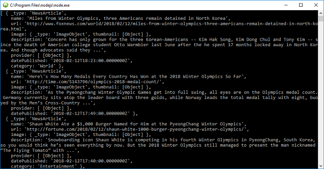

# Quickstart: Bing News Search SDK with Node

The Bing News Search SDK contains the functionality of the REST API for news queries and parsing results. 

The [source code for Node Bing News Search SDK samples](https://github.com/Azure-Samples/cognitive-services-node-sdk-samples/blob/master/Samples/newsSearch.js) is available on Git Hub.

## Application dependencies

To set up a console application using the Bing News Search SDK, run `npm install azure-cognitiveservices-newssearch` in your development environment.

## News Search client
Get a [Cognitive Services access key](https://azure.microsoft.com/try/cognitive-services/) under *Search*. Create an instance of the `CognitiveServicesCredentials`:
```
const CognitiveServicesCredentials = require('ms-rest-azure').CognitiveServicesCredentials;
let credentials = new CognitiveServicesCredentials('YOUR-ACCESS-KEY');
```
Then, instantiate the client:
```
const NewsSearchAPIClient = require('azure-cognitiveservices-newssearch');
let client = new NewsSearchAPIClient(credentials);
```
Use the client to search with a query text, in this case 'Winter Olympics':
```
client.newsOperations.search('Winter Olympics').then((result) => {
    console.log(result.value);
}).catch((err) => {
    throw err;
});

```
The code prints `result.value` items to the console without parsing any text. The results, if any per category, will include:
- _type: 'NewsArticle'
- _type: 'WebPage'
- _type: 'VideoObject'
- _type: 'ImageObject'

<!-- Remove until we can replace with santized version

-->

## Next steps

[Cognitive services Node.js SDK samples](https://github.com/Azure-Samples/cognitive-services-node-sdk-samples)
