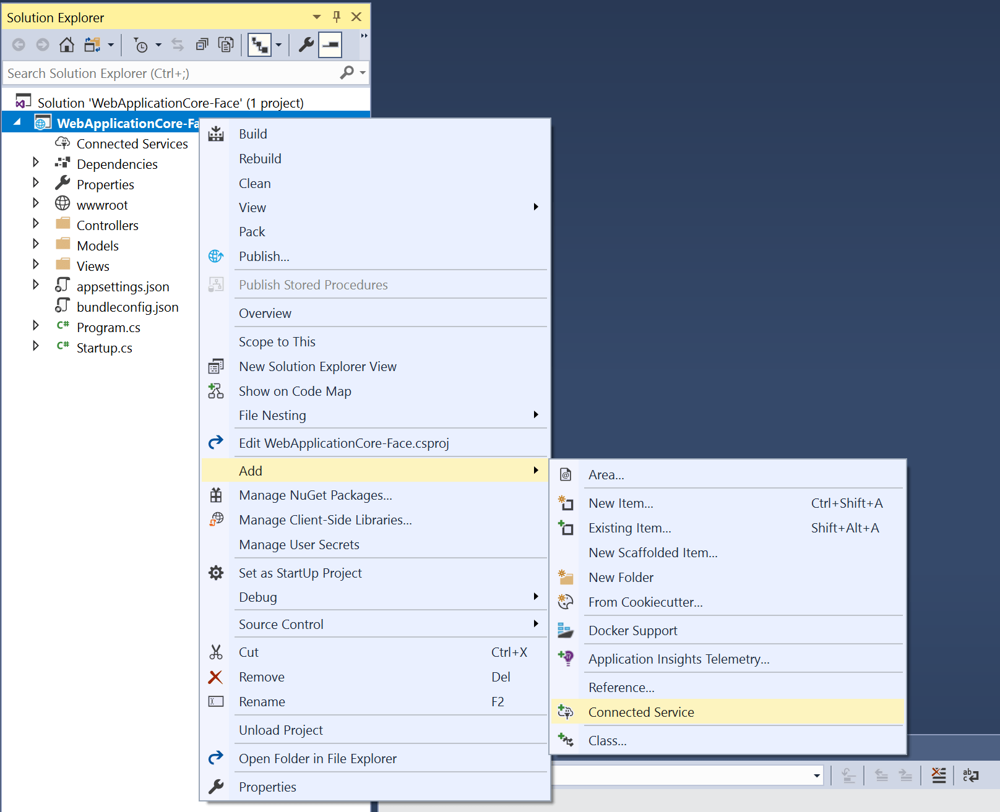
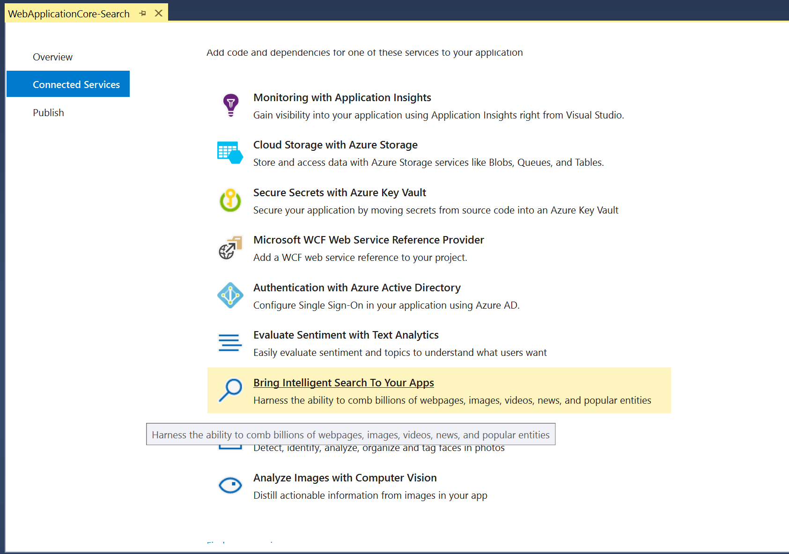
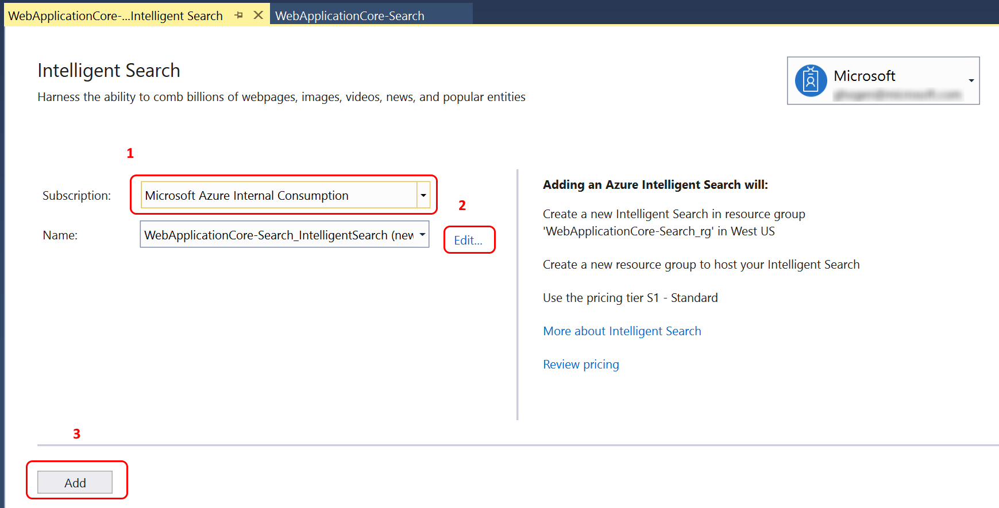
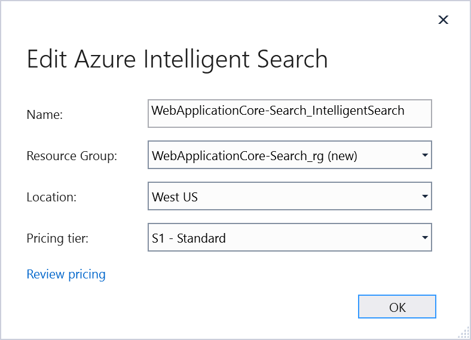
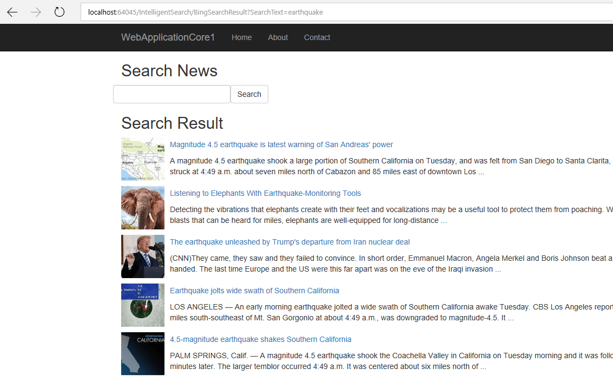

# Tutorial: Connect to Bing News Search API by using Connected Services in Visual Studio

By using Bing News Search, you can enable apps and services to harness the power of an ad-free search engine scoped to the web. Bing News Search is one of the search services available with Cognitive Services.

This article provides details for using the Visual Studio Connected Service feature for Bing News Search. The capability is available in Visual Studio 2017 15.7 or later, with the Cognitive Services extension installed.

## Prerequisites

- An Azure subscription. If you do not have one, you can sign up for a [free account](https://azure.microsoft.com/pricing/free-trial/).
- Visual Studio 2017 version 15.7, with the Web Development workload installed. [Download it now](https://aka.ms/vsdownload?utm_source=mscom&utm_campaign=msdocs).

[!INCLUDE [vs-install-cognitive-services-vsix](../../../includes/vs-install-cognitive-services-vsix.md)]

## Add support to your project for Bing News Search API

1. Create a new ASP.NET Core web project named MyWebApplication. Use the **Web Application (Model-View-Controller)** project template, with all the default settings. It’s important to name the project MyWebApplication, so the namespace matches when you copy code into the project. 

1. In **Solution Explorer**, choose **Add** > **Connected Service**.
   The Connected Service page appears, with services you can add to your project.

   

1. In the menu of available services, choose **Bring Intelligent Search To Your Apps**.

   

   If you've signed into Visual Studio, and have an Azure subscription associated with your account, a page appears with a dropdown list with your subscriptions. Select the subscription you want to use, and then choose a name for the Bing News Search API. You can also choose **Edit** to modify the automatically generated name.

   

1. Choose the resource group, and the pricing tier.

   

   If you want more details about the pricing tiers, select **Review pricing**.

1. Choose **Add** to add support for the Connected Service.
   Visual Studio modifies your project to add the NuGet packages, configuration file entries, and other changes to support a connection to the Bing News Search API. The output shows the log of what is happening to your project. You should see something like the following:

   ```output
   [5/4/2018 12:41:21.084 PM] Adding Intelligent Search to the project.
   [5/4/2018 12:41:21.271 PM] Creating new Intelligent Search...
   [5/4/2018 12:41:24.128 PM] Installing NuGet package 'Microsoft.Azure.CognitiveServices.Search.ImageSearch' version 1.2.0...
   [5/4/2018 12:41:24.135 PM] Installing NuGet package 'Microsoft.Azure.CognitiveServices.Search.NewsSearch' version 1.2.0...
   [5/4/2018 12:41:24.154 PM] Installing NuGet package 'Microsoft.Azure.CognitiveServices.Search.WebSearch' version 1.2.0...
   [5/4/2018 12:41:24.168 PM] Installing NuGet package 'Microsoft.Azure.CognitiveServices.Search.CustomSearch' version 1.2.0...
   [5/4/2018 12:41:24.187 PM] Installing NuGet package 'Microsoft.Azure.CognitiveServices.Search.VideoSearch' version 1.2.0...
   [5/4/2018 12:42:07.287 PM] Retrieving keys...
   [5/4/2018 12:42:07.741 PM] Updating appsettings.json setting: 'ServiceKey' = 'c271412f3e4c4e1dacc7c4145fa0572a'
   [5/4/2018 12:42:07.745 PM] Updating appsettings.json setting: 'ServiceEndPoint' = 'https://api.cognitive.microsoft.com/bing/v7.0'
   [5/4/2018 12:42:07.749 PM] Updating appsettings.json setting: 'Name' = 'WebApplicationCore-Search_IntelligentSearch'
   [5/4/2018 12:42:10.217 PM] Successfully added Intelligent Search to the project.
   ```

   The appsettings.json file now contains the following new settings:

   ```json
   "CognitiveServices": {
     "IntelligentSearch": {
       "ServiceKey": "<your service key>",
       "ServiceEndPoint": "https://api.cognitive.microsoft.com/bing/v7.0",
       "Name": "WebApplicationCore-Search_IntelligentSearch"
     }
   }
   ```
 
## Use the Bing News Search API to add search functionality to a web page

Now that you’ve added support for the Bing News Search API to your project, here’s how to use the API to add intelligent search to a web page.

1.  In *Startup.cs*, in the `ConfigureServices` method, add a call to `IServiceCollection.AddSingleton`. This makes the configuration object that contains the key settings available to the code in your project.
 
   ```csharp
        public void ConfigureServices(IServiceCollection services)
        {
            services.AddMvc();
            services.AddSingleton<IConfiguration>(Configuration);
        }
   ```


1. Add a new class file under the **Models** folder, called *BingNewsModel.cs*. If you named your project differently, use your own project's namespace, instead of MyWebApplication. Replace the contents with the following code:
 
    ```csharp
    using Microsoft.Azure.CognitiveServices.Search.NewsSearch.Models;
    using System;
    using System.Collections.Generic;
    using System.Linq;
    using System.Threading.Tasks;
    
    namespace MyWebApplication.Models
    {
        public class BingNewsModel
        {
            public News SearchResult { get; set; } 
            public string SearchText { get; set; }
        }
    }
    ```

   This model is used to store the results of a call to the Bing News Search service.
 
1. In the **Controllers** folder, add a new class file called *IntelligentSearchController.cs*. Replace the contents with the following code:

   ```csharp
    using System.Net.Http;
    using System.Threading.Tasks;
    using MyWebApplication.Models;
    using Microsoft.AspNetCore.Mvc;
    using Microsoft.Azure.CognitiveServices.Search.NewsSearch;
    using Microsoft.Extensions.Configuration;
    
    namespace MyWebApplication.Controllers
    {
        // A controller to handle News Search requests
        public class IntelligentSearchController : Controller
        {
            private IConfiguration configuration;
  
            // Set up the configuration that contains the keys
            // (from the appsettings.json file)
            // that you will use to access the service  
            public IntelligentSearchController(IConfiguration configuration)
            {
                this.configuration = configuration;
            }

            // Call the Bing News Search API and put the result in the model object.    
            public async Task<IActionResult> BingSearchResult(BingNewsModel model)
            {
                if (!string.IsNullOrWhiteSpace(model.SearchText))
                { 
                    INewsSearchAPI client = this.GetNewsSearchClient(new MyHandler());
                    model.SearchResult = await client.News.SearchAsync(model.SearchText);
                }
                return View(model);
            }
    
            // Forward requests to the Search endpoint to the BingSearchResult method
            [HttpPost("Search")]
            public IActionResult Search(BingNewsModel model)
            {
                return RedirectToAction("BingSearchResult", model);
            }

            // Get the search client object
            private INewsSearchAPI GetNewsSearchClient(DelegatingHandler handler)
            {
                string key =
                   configuration.GetSection("CognitiveServices")["IntelligentSearch:ServiceKey"];
    
                INewsSearchAPI client = new NewsSearchAPI(
                   new ApiKeyServiceClientCredentials(key), handlers: handler);
    
                return client;
            }
        }
    }
   ```

   In this code, the constructor sets up the configuration object that contains your keys. The method for the `Search` route is just a redirection to the `BingSearchResult` function. This calls the `GetNewsSearchClient` method to get the `NewsSearchAPI` client object.  The `NewsSearchAPI` client object contains the `SearchAsync` method, which actually calls the service and returns the results in the `SearchResult` model that you just created. 

1. Add a class, `MyHandler`, which was referenced in the preceding code. This delegates the asynchronous call to the search service to its base class, `DelegatingHandler`.

   ```csharp
    using System.Net.Http;
    using System.Threading.Tasks;
    using System.Threading;

    class MyHandler : DelegatingHandler
    {
        protected async override Task<HttpResponseMessage> SendAsync(
        HttpRequestMessage request, CancellationToken cancellationToken)
        {
            // Call the inner handler.
            var response = await base.SendAsync(request, cancellationToken);
            
            return response;
        }
    }
   ```

1. To add support for submitting searches and viewing the results, in the **Views** folder, create a new folder called **IntelligentSearch**. In this new folder, add a view *BingSearchResult.cshtml*. Copy in the following code:

    ```cshtml
    @using System
    @model MyWebApplication.Models.BingNewsModel
    
    @{
        ViewData["Title"] = "BingSearchResult";
    }
    
    <h2>Search News</h2>
    
    <div class="row">
        <section>
            <form asp-controller="IntelligentSearch" asp-action="Search" method="POST"
                  class="form-horizontal" enctype="multipart/form-data">
                <table width ="90%">
                    <tr>
                        <td>
                            <input type="text" name="SearchText" class="form-control" />
                        </td>
                        <td>
                            <button type="submit" class="btn btn-default">Search</button>
                        </td>
                    </tr>
                </table>
            </form>
        </section>
    </div>
    <h2>Search Result</h2=
    <table>
    @if (!string.IsNullOrEmpty(Model.SearchText)) {
        foreach (var item in Model.SearchResult.Value) {
        <tr>
            <td rowspan="2" width="90">
               
            </td>
            <td><a href=@item.Url>@item.Name</a></td>
        </tr>   
        <tr>
            <td>@item.Description</td>
        </tr>
        <tr height="10">
            <td/><td/>
         </tr>
        } }
     </table>
    <div>
        <hr />
        <p>
            <a asp-controller="Home" asp-action="Index">Return to Index</a>
        </p>
    </div>
    ```

1. Start the web application locally, enter the URL for the page you just created (/IntelligentSearch/BingSearchResult), and post a search request by using the Search button.

   
           
## Clean up resources

When the resource group is no longer needed, you can delete it. This deletes the cognitive service and related resources. To delete the resource group through the portal:

1. Enter the name of your resource group in the search box at the top of the portal. Select the resource group you want to delete.
2. Select **Delete resource group**.
3. In the **Type the Resource Group Name** box, enter the name of the resource group and select **Delete**.

## Next steps

To learn more about the Bing News Search API, see [What is Bing News Search?](index.yml).
