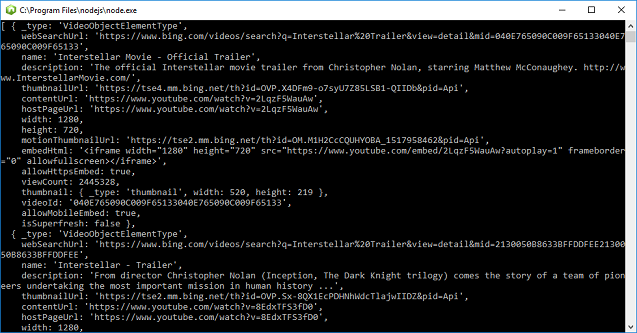

# Quickstart: Bing Video Search SDK with Node

The Bing Video Search SDK contains the functionality of the REST API for video queries and parsing results. 

The [source code for Node Bing Video Search SDK samples](https://github.com/Azure-Samples/cognitive-services-node-sdk-samples/blob/master/Samples/videoSearch.js) is available on Git Hub.

## Application dependencies

To set up a console application using the Bing Video Search SDK, run `npm install azure-cognitiveservices-videosearch` in your development environment.

## Video Search client
Get a [Cognitive Services access key](https://azure.microsoft.com/try/cognitive-services/) under *Search*. Create an instance of the `CognitiveServicesCredentials`:
```
const CognitiveServicesCredentials = require('ms-rest-azure').CognitiveServicesCredentials;
let credentials = new CognitiveServicesCredentials('YOUR-ACCESS-KEY');
```
Then, instantiate the client:
```
const VideoSearchAPIClient = require('azure-cognitiveservices-videosearch');
let client = new VideoSearchAPIClient(credentials);
```
Search for results.
```
client.videosOperations.search('Interstellar Trailer').then((result) => {
    console.log(result.value);
}).catch((err) => {
    throw err;
});

```

<!-- Remove until the response can be replace with a sanitized version.
The code prints `result.value` items to the console without parsing any text. The results will be:
- _type: 'VideoObjectElementType'


-->

## Next steps

[Cognitive services Node.js SDK samples](https://github.com/Azure-Samples/cognitive-services-node-sdk-samples)
