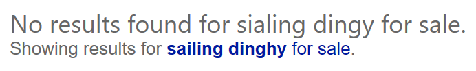

# Autosuggest Bing search terms in your application

If you provide a search box where the user enters their search term, use the [Bing Autosuggest API](../bing-autosuggest/get-suggested-search-terms.md) to improve the experience. The API returns suggested query strings based on partial search terms as the user types.

After the user enters a search term, it must be URL encoded before the [q](https://docs.microsoft.com/rest/api/cognitiveservices-bingsearch/bing-web-api-v7-reference#query) query parameter is set. For example, if the user enters *sailing dinghies*, set `q` to `sailing+dinghies` or `sailing%20dinghies`.

If the query term contains a spelling mistake, the search response includes a [QueryContext](https://docs.microsoft.com/rest/api/cognitiveservices-bingsearch/bing-web-api-v7-reference#querycontext) object. The object shows the original spelling and the corrected spelling that Bing used for the search.

```json
"queryContext": {
    "originalQuery": "sialing dingy for sale",
    "alteredQuery": "sailing dinghy for sale",
    "alterationOverrideQuery": "+sialing +dingy for sale"
}
```

You can use this information to let the user know that you modified their query string when you display the search results.

  

## Next steps  

* Review sample [Bing Web Search API responses](search-responses.md).  

## See also  

* [Bing Web Search API reference](https://docs.microsoft.com/rest/api/cognitiveservices-bingsearch/bing-web-api-v7-reference)
