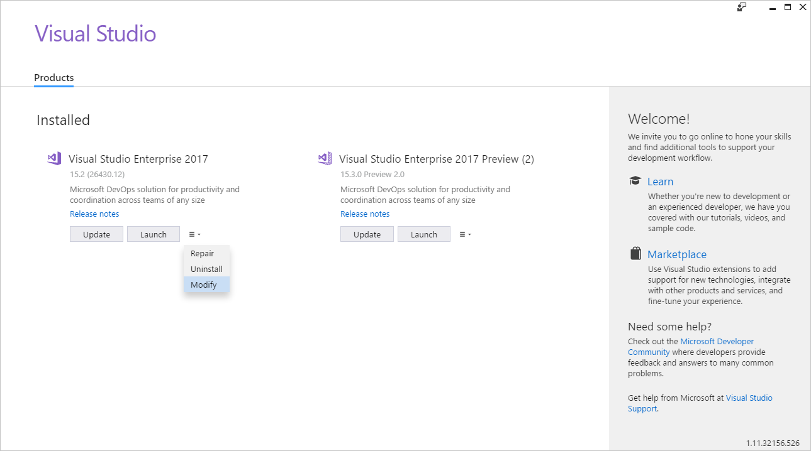
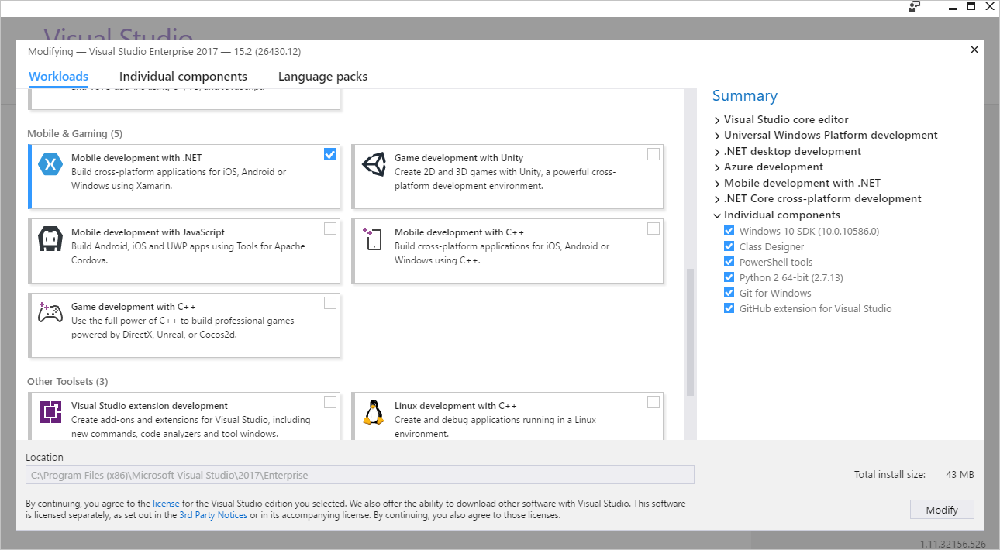
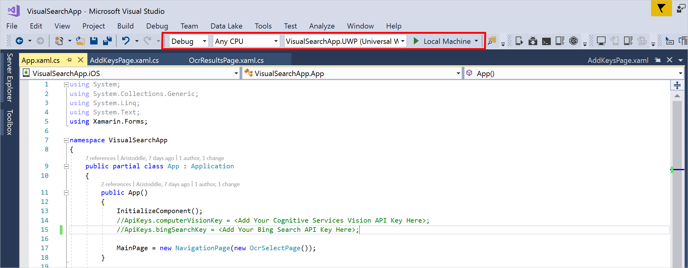
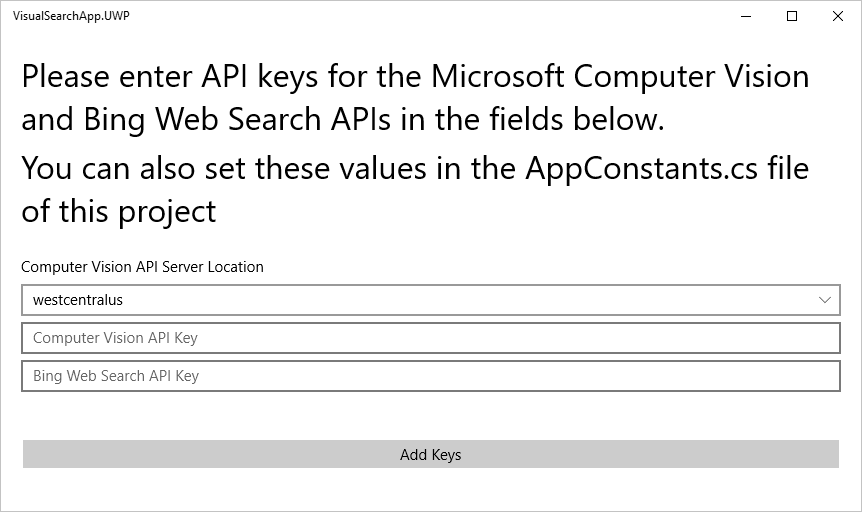
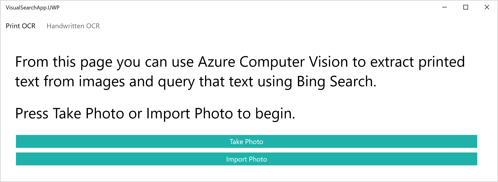
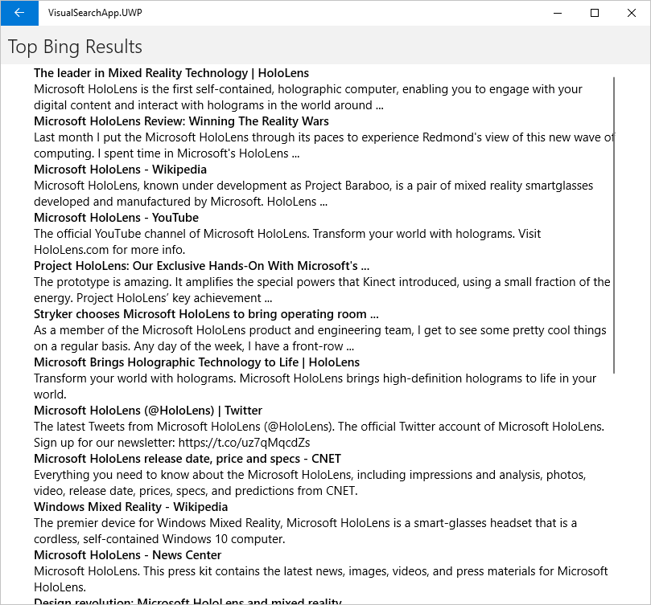
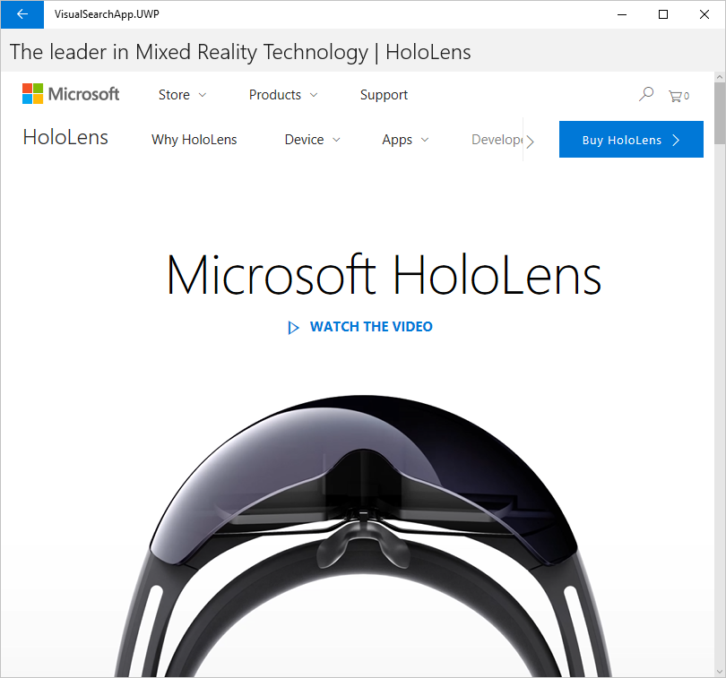

# Visual Search mobile app tutorial

## Introduction  
This tutorial explores the [Computer Vision API](https://azure.microsoft.com/services/cognitive-services/computer-vision/) and [Bing Web Search API](https://azure.microsoft.com/services/cognitive-services/bing-web-search-api/) endpoints and how they can be used to build a basic visual search application with [Xamarin.Forms](https://developer.xamarin.com/guides/xamarin-forms/).  Overall, this tutorial covers the following topics: 
* Setting up your system to develop Xamarin.Forms applications
* Using the [Xamarin Media Plugin](https://github.com/jamesmontemagno/MediaPlugin) to capture and import image data to a Xamarin.Forms application
* Formatting images and parsing text from them using the Computer Vision APIs
* Structuring and sending text-based requests to the Bing Web Search API
* Parsing responses from the Bing Web Search and Computer Vision APIs with [Json.NET](https://github.com/JamesNK/Newtonsoft.Json) (with LINQ and model object deserialization)
* Integrating these APIs into a C# based Xamarin.Forms application 


## Prerequisites
### Platform Requirements
This example was developed in Xamarin.Forms using [Visual Studio 2017 Community Edition](https://www.visualstudio.com/downloads/).  For more information about using Xamarin with Visual Studio, see the [Xamarin documentation](https://developer.xamarin.com/guides/cross-platform/getting_started/).

### Libraries  
This sample makes use of the following NuGet Packages:
* [Xamarin Media Plugin](https://github.com/jamesmontemagno/MediaPlugin)
* [Json.NET](https://github.com/JamesNK/Newtonsoft.Json)

### Cognitive Services
This sample utilizes the following Cognitive Services APIs:
* [Bing Web Search API](https://azure.microsoft.com/services/cognitive-services/bing-web-search-api/) 
* [Computer Vision API](https://azure.microsoft.com/services/cognitive-services/computer-vision/)

To attain 30-day trial keys to these APIs, see [this page](https://azure.microsoft.com/try/cognitive-services/).  For more information about attaining keys for professional use, see [Pricing](https://azure.microsoft.com/pricing/calculator/).

## Environment Setup  
### Installing Xamarin 
#### Windows   
With Visual Studio 2017 installed, open the Visual Studio Installer, select the hamburger menu associated with your Visual Studio installation, and select **Modify**.  

 

Now, scroll down to Mobile & Gaming, and make sure that you've enabled **Mobile Development with .NET**.  



Now, click **Modify** in the bottom right corner of the window, and wait for Xamarin to install.

#### macOS
Xamarin should come pre-packaged with Visual Studio for Mac.

## Building and Running the Sample
### Step 1: Download the sample
The sample can be found at [cognitive-services-xamarin-forms-computer-vision-search](https://azure.microsoft.com/resources/samples/cognitive-services-xamarin-forms-computer-vision-search/). You can download it using Visual Studio or directly from GitHub.

### Step 2: Install the sample
In Visual Studio, open `cognitive-services-xamarin-forms-computer-vision-search\VisualSearchApp.sln`.  It may take a few moments to initialize all of the required components.  

### Step 3: Install required NuGet packages
This application requires two NuGet packages to be installed: **Json.NET**, and the **Xamarin Media Plugin**.  You can open the NuGet Package Manager in `Tools > NuGet Package Manager > Manage NuGet Packages For Solution`, or by right-clicking on your solution and selecting *Manage NuGet Packages*.  

From here, search for and install the **Xamarin Media plugin** (Xam.Plugin.Media) and **Json.NET** (Newtonsoft.Json) packages.

### Step 4: Build the sample
Press **Ctrl+Shift+B**, or click **Build** on the ribbon menu, then select **Build Solution**.  This builds the solution for all available platforms.  If you wish to compile and test code for iOS while using a windows machine, reference [this guide](https://developer.xamarin.com/guides/ios/getting_started/installation/windows/) for help.

### Step 5: Configure your deployment
Before running the application, you need to select a target Configuration, Platform, and Project.  Xamarin.Forms applications compile to native code for Windows, Android, and iOS.  This guide includes screenshots of the Windows version of the sample.  However, all versions are functionally equivalent.  The deployment settings used in this guide are shown below.  



### Step 6: Run the app
1. After the build is complete and your target platform is selected, click the **Start** button in the toolbar or press **F5**.  This deploys your solution to your target platform.  

2. The application should launch and open to the following page (defined in the codebase at `AddKeysPage.xaml` and referenced in this guide as the Add Keys Page).  

     

   Here you can input your Computer Vision and Bing Web Search API keys.  The Computer Vision API call requires a reference to the server where the endpoint is hosted, so you will also need to enter this here. If you would like to skip this page in later compilations, you can manually add your keys and location in the `App.xaml.cs` page of the codebase. 

3. Adding a set of working API keys takes you to the following page (defined in the codebase at `OcrSelectPage.xaml` and referenced in this guide as the OCR Select Page.
   
     

   Here you can either import or capture a new photo and then pass that photo to the respective OCR service for processing. 

4. The next screen (defined in the codebase at `OcrResultsPage.xaml` and referenced in this guide as the OCR Results Page) displays the text extracted by the Computer Vision API.  

     
   
   Here you can select a line from the discovered text to find Bing search results for that query, or you can use the navigation bar to return to the OCR Select Page.  The image used in this guide can be found in the sample code repository at `SamplePhotos\TestImage.jpg`.

5. Selecting an item from the OCR Results Page takes you to the following screen (defined in the codebase at `WebResultsPage.xaml` and referenced in this guide as the Web Results Page).   

     

   Here you can see the results of querying the Bing Web Search API using the extracted text and open the linked pages within the application.  As before, you can also use the navigation bar to return to the OCR Results Page. 

6. Finally, selecting an item from the Web Results Page opens a WebView showing the content at that Bing result.  

     

   From here, you can interact with the website as if it were loaded within a standard browser.  You can also use the navigation bar to return to the Web Results Page. 

## Review and Learn
Now that the sample is up and running, let's jump in and explore exactly how it uses the APIs provided in Microsoft Cognitive Services.  Whether you're using this sample as a starting point for your own application or simply as a reference for the Cognitive Services APIs, it is valuable to walk through the application screen-by-screen to examine exactly how it works.

### Add Keys Page
The Add Keys Page is where the user inputs their API keys so that the Cognitive Services endpoints can be accessed later. The UI for this page is defined in `AddKeysPage.xaml`, and its primary logic is defined in `AddKeysPage.xaml.cs`.  While the specific parameters of our requests are discussed later, this is a great place to establish the basic structure for how the Cognitive Services endpoints can be reached from a C# codebase.  Throughout this sample, the basic structure of this interaction is as follows: 

1. Initialize *HttpResponseMessage* and *HttpClient* objects from *System.Net.Http*
2. Attach any desired headers (defined in each endpoint's API reference) to your *HttpClient* object
3. Send a GET or POST request with your data, adding any necessary parameters to your endpoint URI
4. Check that the response was successful
5. Pass the response on for further parsing

In the context of the key entry page, we're only checking to see if the HTTP request returned a 401 error, which would indicate that the API key was invalid.  In later functions, further checking and unpacking of the http response is done.  The function that checks the validity of the Bing Search API key follows:

```csharp
async Task CheckBingSearchKey(object sender = null, EventArgs e = null)
{
    HttpResponseMessage response;
    HttpClient SearchApiClient = new HttpClient();

    SearchApiClient.DefaultRequestHeaders.Add(AppConstants.OcpApimSubscriptionKey, BingSearchKeyEntry.Text);

    try
    {
        response = await SearchApiClient.GetAsync(AppConstants.BingWebSearchApiUrl + "q=test");

        if (response.StatusCode != System.Net.HttpStatusCode.Unauthorized)
        {
            BingSearchKeyEntry.BackgroundColor = Color.Green;
            AppConstants.BingWebSearchApiKey = BingSearchKeyEntry.Text;
            bingSearchKeyWorks = true;
        }
        else
        {
            BingSearchKeyEntry.BackgroundColor = Color.Red;
            bingSearchKeyWorks = false;
        }
    }
    catch( Exception exception )
    {
        BingSearchKeyEntry.BackgroundColor = Color.Red;
        Console.WriteLine($"ERROR: {exception.Message}");
    }
}
```


### OCR Select Page
The OCR Select Page has two important roles.  First, it is where the user determines what kind of OCR they intend to perform with their target photo.  Second, it is where the user captures or imports the image that they wish to process.  This second task is traditionally cumbersome in a cross-platform application as different logic has to be written for photo capture and import per platform.  However with the Xamarin Media Plugin, this can all be done with a few lines of code in the shared codebase.  

The following function provides an example of how to use the Xamarin Media Plugin for photo capture.  In it, we:
1. Ensure that a camera is available on the current device
2. Initialize a new *StoreCameraMediaOptions* object and use it to set where we want to save our captured image
3. Take an image, save it to the specified location, and attain a *MediaFile* object containing the image data
4. Unpack the *MediaFile* into a byte array
5. Return the byte array for further processing

Here's the function that uses the Xamarin Media Plugin for photo capture.  

```csharp
async Task<byte[]> TakePhoto()
{
    MediaFile photoMediaFile = null;
    byte[] photoByteArray = null;

    if (CrossMedia.Current.IsCameraAvailable)
    {
        var mediaOptions = new StoreCameraMediaOptions
        {
            PhotoSize = PhotoSize.Medium,
            AllowCropping = true,
            SaveToAlbum = true,
            Name = $"{DateTime.UtcNow}.jpg"
        };
        photoMediaFile = await CrossMedia.Current.TakePhotoAsync(mediaOptions);
        photoByteArray = MediaFileToByteArray(photoMediaFile);
    }
    else
    {
        await DisplayAlert("Error", "No camera found", "OK");
        Console.WriteLine($"ERROR: No camera found");
    }
    return photoByteArray;
}
```
The photo import utility works in a similar way, and can be found in `OcrSelectPage.xaml.cs`.  
> [!NOTE]
> The downscaling done by setting `PhotoSize = PhotoSize.Medium` on the *StoreCameraMediaOptions* object.  At the moment, the Handwritten OCR endpoint can only handle photos that are smaller than 4 MB.  This setting downscales the photo to 50% of its original size, which helps us avoid almost all file-size related issues.  If your device takes exceptionally high-quality photos and you are getting errors, you might try setting `PhotoSize = PhotoSize.Small` on this object.  


And here's the utility function used to convert a *MediaFile* into a byte array: 

```csharp
byte[] MediaFileToByteArray(MediaFile photoMediaFile)
{
    using (var memStream = new MemoryStream())
    {
        photoMediaFile.GetStream().CopyTo(memStream);
        return memStream.ToArray();
    }
}
```


### OCR Results Page
The OCR Results Page is where we extract text from the selected OCR endpoint and pull text from the endpoint response using the **Json.NET** [SelectToken Method](http://www.newtonsoft.com/json/help/html/SelectToken.htm).  The two OCR endpoints work differently, so it's valuable to discuss each of them.  

Because the Computer Vision API is only hosted in a few server locations, its URI endpoint must be constructed dynamically at runtime.  This is the function that sets the location of the URI endpoint.  It is part of the static *AppConstants* class found in `AppConstants.cs`. It either responds to user choice from the Add Keys Page or receives a hardcoded value set in `App.xaml.cs`. 

```csharp
public static void SetOcrLocation(string location)
{
    ComputerVisionApiOcrUrl = $"https://{location}.api.cognitive.microsoft.com/vision/v1.0/ocr?language=en&detectOrientation=true";
    ComputerVisionApiHandwritingUrl = $"https://{location}.api.cognitive.microsoft.com/vision/v1.0/recognizeText?handwriting=true";
}
```

Diving deeper into these endpoint calls, let's first look at the Computer Vision OCR URI. The Computer Vision OCR API is capable of parsing text from an undetermined language, but here we tell the endpoint to search for English text to improve results.  We also let the endpoint determine text orientation. Setting this flag to *false* might improve our parsing results, but in a mobile application orientation detection can be useful.  If you would like to learn more about the parameters affiliated with this endpoint, you can learn more from the [Print Optical Character Recognition API Reference](https://westus.dev.cognitive.microsoft.com/docs/services/56f91f2d778daf23d8ec6739/operations/56f91f2e778daf14a499e1fc).  


Next, we set the parameters for Handwritten OCR.  The Handwritten OCR endpoint is still in preview, and currently only works with English text.  Because of this, its only current parameter is a flag determining whether or not to parse handwritten text at all.  Although the handwritten API is able to parse both machine printed and handwritten text, `handwriting=false` yields better results on non-handwritten text.  Given that this application is optimized for English, we could have used only the Handwritten OCR endpoint for this sample, setting the flag to true or false depending on content type.  However, for the sake of illustration both endpoints were used.  If you would like to learn more about the parameters affiliated with this endpoint, you can learn more from the [Handwritten Optical Character Recognition API Reference](https://westus.dev.cognitive.microsoft.com/docs/services/56f91f2d778daf23d8ec6739/operations/587f2c6a154055056008f200).


Now, let's examine the functions that call the API.

*FetchPrintedWordList* uses the Computer Vision OCR endpoint to parse printed text from images.  The HTTP call here follows a similar structure to the call carried out in the Add Keys Page, but here we send an HTTP POST request instead of a GET request.  Because of this, we need to encode our photo (currently in memory as a byte array) into a *ByteArrayContent* object, and add a header to this *ByteArrayContent* object defining what kind of data we're sending to the Cognitive Services endpoint. You can read about other acceptable content types in the [API reference](https://westus.dev.cognitive.microsoft.com/docs/services/56f91f2d778daf23d8ec6739/operations/587f2c6a154055056008f200).  

```csharp
async Task<ObservableCollection<string>> FetchPrintedWordList()
{
    ObservableCollection<string> wordList = new ObservableCollection<string>();
    if (photo != null)
    {
        HttpResponseMessage response = null;
        using (var content = new ByteArrayContent(photo))
        {
            // The media type of the body sent to the API. 
            // "application/octet-stream" defines an image represented 
            // as a byte array
            content.Headers.ContentType = new MediaTypeHeaderValue("application/octet-stream");
            response = await visionApiClient.PostAsync(AppConstants.ComputerVisionApiOcrUrl, content);
        }

        string ResponseString = await response.Content.ReadAsStringAsync();
        JObject json = JObject.Parse(ResponseString);

        // Here, we pull down each "line" of text and then join it to 
        // make a string representing the entirety of each line.  
        // In the Handwritten endpoint, you are able to extract the 
        // "line" without any further processing.  If you would like 
        // to simply get a list of all extracted words,* you can do 
        // this with:
        // json.SelectTokens("$.regions[*].lines[*].words[*].text) 
        IEnumerable<JToken> lines = json.SelectTokens("$.regions[*].lines[*]");
        if (lines != null)
        {
            foreach (JToken line in lines)
            {
                IEnumerable<JToken> words = line.SelectTokens("$.words[*].text");
                if (words != null)
                {
                    wordList.Add(string.Join(" ", words.Select(x => x.ToString())));
                }
            }
        }
    }
    return wordList;
}
```
> [!TIP]
> Note the use of the **Json.NET** [SelectToken Method](http://www.newtonsoft.com/json/help/html/SelectToken.htm) here to extract text from the response object.  `SelectToken` is used here because we are only looking for a specific feature of the JSON response, which we can then pass on to the next function.  Elsewhere in the codebase, JSON responses are deserialized onto model objects defined in `ModelObjects.cs`.

Structurally, the primary difference between the Handwritten OCR and Print OCR request is that Handwritten OCR returns an HTTP 202 response, which signals that processing has begun and returns an endpoint that the client must check to attain the completed response once it is available.

```csharp
async Task<ObservableCollection<string>> FetchHandwrittenWordList()
{
    ObservableCollection<string> wordList = new ObservableCollection<string>();
    if (photo != null)
    {
        // Make the POST request to the handwriting recognition URL
        HttpResponseMessage response = null;
        using (var content = new ByteArrayContent(photo))
        {
            // The media type of the body sent to the API. 
            // "application/octet-stream" defines an image represented 
            // as a byte array
            content.Headers.ContentType = new MediaTypeHeaderValue("application/octet-stream");
            response = await visionApiClient.PostAsync(AppConstants.ComputerVisionApiHandwritingUrl, content);
        }

        // Fetch results
        IEnumerable<string> operationLocationValues;
        string statusUri = string.Empty;
        if (response.Headers.TryGetValues("Operation-Location", out operationLocationValues))
        {
            statusUri = operationLocationValues.FirstOrDefault();

            // Ping status URL, wait for processing to finish 
            JObject obj = await FetchResultFromStatusUri(statusUri);
            IEnumerable<JToken> strings = obj.SelectTokens("$.recognitionResult.lines[*].text");
            foreach (string s in strings)
            {
                wordList.Add((string)s);
            }
        }
    }
    return wordList;
}
```

This function handles the 202 response by pinging the URI extracted from the response's metadata either until a result is attained or the function times out.  It's important to note that this function is called asynchronously on its own thread as otherwise this method would lock down the application until processing was complete.

```csharp
// Takes in the url to check for handwritten text parsing results, and pings it per second until processing is finished
// Returns the JObject holding data for a successful parse
async Task<JObject> FetchResultFromStatusUri(string statusUri)
{
    JObject obj = null;
    int timeoutcounter = 0;
    HttpResponseMessage response = await visionApiClient.GetAsync(statusUri);
    string responseString = await response.Content.ReadAsStringAsync();
    obj = JObject.Parse(responseString);
    while ((!((string)obj.SelectToken("status")).Equals("Succeeded")) && (timeoutcounter++ < 60))
    {
        await Task.Delay(1000);
        response = await visionApiClient.GetAsync(statusUri);
        responseString = await response.Content.ReadAsStringAsync();
        obj = JObject.Parse(responseString);
    } 
    return obj;
}
```

### Web Results Page
Finally, we send this data to the Web Results Page, which constructs a [Bing Web Search API](https://azure.microsoft.com/services/cognitive-services/bing-web-search-api/) request, sends it to the Cognitive Services endpoint, and then deserializes the JSON response using the Json.NET [DeserializeObject](http://www.newtonsoft.com/json/help/html/DeserializeObject.htm) method.  

```csharp
async Task<WebResultsList> GetQueryResults()
{
    // URL-encode the query term
    var queryString = System.Net.WebUtility.UrlEncode(queryTerm);

    // Here we encode the URL that will be used for the GET request to 
    // find query results.  Its arguments are as follows:
    // 
    // - [count=20] This sets the number of webpage objects returned at 
    //   "$.webpages" in the JSON response.  Currently, the API asks for 
    //   20 webpages in the response
    //
    // - [mkt=en-US] This sets the market where the results come from.
    //   Currently, the API looks for english results based in the 
    //   United States.
    //
    // - [q=queryString] This sets the string queried using the Search 
    //   API.   
    //
    // - [responseFilter=Webpages] This filters the response to only 
    //   include Webpage results.  This tag can take a comma seperated 
    //   list of response types that you are looking for.  If left 
    //   blank, all responses (webPages, News, Videos, etc) are 
    //   returned.
    //
    // - [setLang=en] This sets the languge for user interface strings. 
    //   To learn more about UI strings, check the Web Search API 
    //   reference.
    //
    // - [API Reference] https://docs.microsoft.com/rest/api/cognitiveservices/bing-web-api-v5-reference
    string uri = AppConstants.BingWebSearchApiUrl + $"count=20&mkt=en-US&q={queryString}&responseFilter=Webpages&setLang=en";

    // Make the HTTP Request
    WebResultsList webResults = null;
    HttpResponseMessage httpResponseMessage = await searchApiClient.GetAsync(uri);
    var responseContentString = await httpResponseMessage.Content.ReadAsStringAsync();
    JObject json = JObject.Parse(responseContentString);
    JToken resultBlock = json.SelectToken("$.webPages");
    if (resultBlock != null)
    {
        webResults = JsonConvert.DeserializeObject<WebResultsList>(resultBlock.ToString());
    }
    return webResults;
}
```

It's important to acknowledge here that the Web Search API functions best when a maximal number of headers and parameters are used to personalize and optimize your call.  A few value and simple parameters are **mkt** and  **setLang**.


> [!NOTE]
> The Bing Web Search API query used in this sample was kept simple in order to keep the source code legible, simple, and extendable.  However in a professional application, there are a few additional headers that you Should add to your HTTP request for improved results.  They are as follows:  
> * User-Agent  
> * X-MSEdge-ClientID  
> * X-Search-ClientIP  
> * X-Search-Location  
>
> These parameters help the API provide optimal results.  You can learn more about these header values in the [Bing Web Search API Reference](https://docs.microsoft.com/rest/api/cognitiveservices/bing-web-api-v5-reference#headers)

## Related Topics
 * [C# Ranking Tutorial](./csharp-ranking-tutorial.md)
 * [Computer Vision Tutorial](../Computer-vision/Tutorials/CSharpTutorial.md)

## Next Steps
This application provides a general framework for a Xamarin.Forms application implementing basic visual search.  However, Microsoft Cognitive Services provides many utilities that could easily be integrated into this application.  For example, you could:
* Tack on [Bing Entity Search](https://azure.microsoft.com/services/cognitive-services/bing-entity-search-api/) to augment your web search results
* Swap in [Bing Custom Search](https://azure.microsoft.com/services/cognitive-services/bing-custom-search/) in place of Bing Web Search
* Use the [Bing Image Search](https://azure.microsoft.com/services/cognitive-services/bing-image-search-api/) image insights capability to learn more about your captured image and find similar images on the web
* Leverage [Bing Spell Check](https://azure.microsoft.com/services/cognitive-services/spell-check/) to further improve the quality of your parsed text
* Integrate the [Microsoft Translator](https://azure.microsoft.com/services/cognitive-services/translator-text-api/) to see your extracted text in different languages  
* Mix and match countless other services from the [Cognitive Services Portal](https://azure.microsoft.com/services/cognitive-services/) to build your own novel utilities