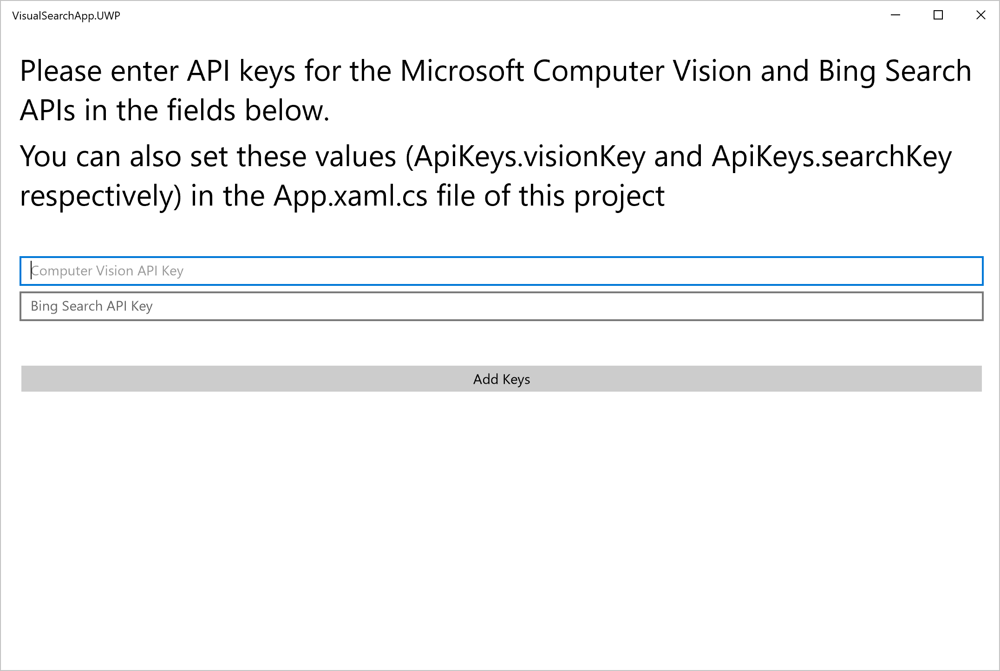
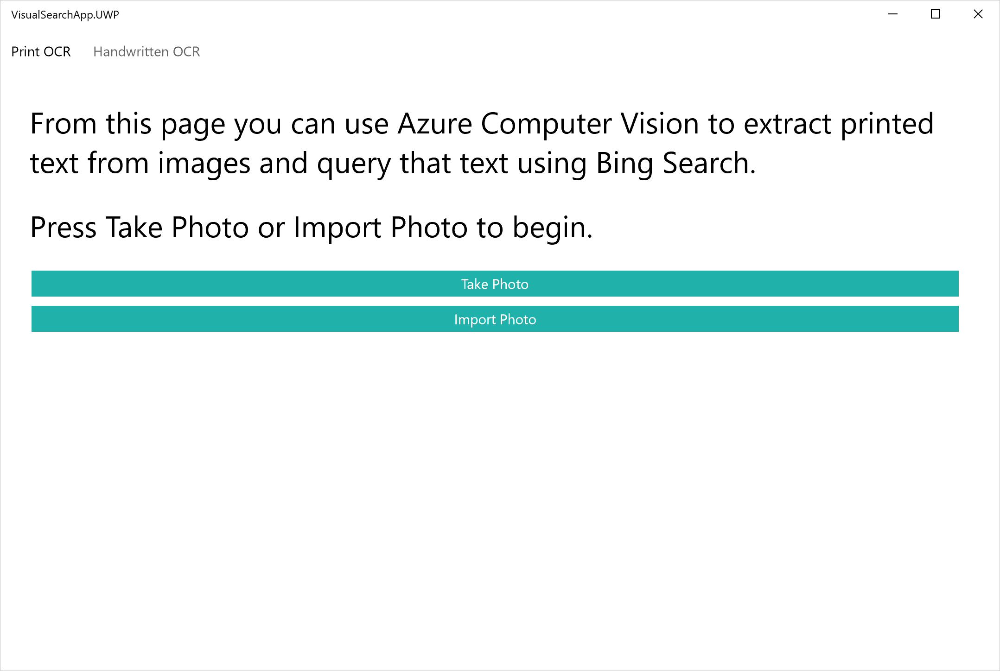
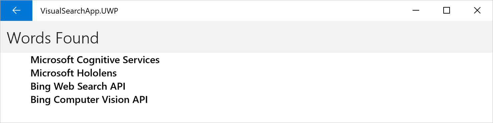

# Bing Web Search And Computer Vision API Tutorial: 

This tutorial explores the Azure Computer Vision and Bing Web Search API endpoints, and how they can be used to build a basic visual search application in Xamarin.Forms.  Overall, this tutorial covers the following topics: 
* Setting up your system for Xamarin.Forms development
* Using the Xamarin Media Plugin to capture and import image data in a Xamarin.Forms application
* Formatting images and parsing text from them using the Azure Computer Vision APIs
* Structuring and sending text-based requests to the Bing Web Search API
* Parsing responses from the Bing Web Search and Computer Vision APIs with the Json.NET parser (with LINQ and model object deserialization)
* Integrating these APIs into a C# based Xamarin.Forms application 

## Prerequisites
### Platform Requirements
This example was developed in Xamarin.Forms using [Visual Studio 2017 Community Edition](https://www.visualstudio.com/downloads/).  While this guide covers the basics of setting up and developing with Xamarin in Visual Studio, you can consult the [Xamarin documentation](https://developer.xamarin.com/guides/cross-platform/getting_started/) for more information.

### Imported Libraries:  
This sample makes use of the following NuGet Packages:
* [Xamarin Media Plugin](https://github.com/jamesmontemagno/MediaPlugin)
* [Json.NET parser](https://github.com/JamesNK/Newtonsoft.Json)

### Azure Services
This sample utilizes the following Cognitive APIs:
* [Bing Web Search API](https://azure.microsoft.com/en-us/services/cognitive-services/bing-web-search-api/) 
* [Azure Computer Vision API](https://azure.microsoft.com/en-us/services/cognitive-services/computer-vision/).  

To attain 30-day trial keys to these APIs, see [this page](https://azure.microsoft.com/en-us/try/cognitive-services/).  For more information about attaining keys for professional use, see [Pricing](https://azure.microsoft.com/en-us/pricing/calculator/).

## Environment Setup  
### Installing Xamarin 
#### Windows   
With Visual Studio 2017 installed, open the Visual Studio Installer, select the hamburger menu associated with your Visual Studio installation, and select "Modify."
 

Now, scroll down to Mobile & Gaming, and make sure that you've enabled "Mobile Development with .NET"

Now, click "Modify" in the bottom right corner of the window, and wait for Xamarin to install.

#### MacOS
Xamarin should come pre-packaged with Visual Studio for Mac.

## Building and running the sample app
### Step 0: Download the sample
The sample can be found at [XamFormsVisualSearch](https://github.com/Azure-Samples/XamFormsVisualSearch). You can download it using Visual Studio or directly from GitHub.

### Step 1: Install the sample
In Visual Studio, open *XamFormsVisualSearch\VisualSearchApp.sln*.  It may take a few moments to initialize all of the required components. 

### Step 2: Install required NuGet Packages
This application requires two NuGet packages to be installed: the Json.NET Parser, and the Xamarin Media Plugin.  You can open the NuGet Package Manager in *Tools > NuGet Package Manager > Manage NuGet Packages For Solution*, or by right clicking on your solution and selecting *Manage NuGet Packages*.  

From here, search and install the Xamarin Media plugin (*Xam.Plugin.Media*) and Json.NET (*Newtonsoft.Json*) packages.

### Step 3: Build the sample
Press *Ctrl+Shift+B*, or click *Build* on the ribbon menu, then select *Build Solution*.  This builds the solution for all available platforms.  If you wish to compile and test code for iOS while using a windows machine, you can reference [this guide](https://developer.xamarin.com/guides/ios/getting_started/installation/windows/") for help.

### Step 4: Configure your deployment
Before running the application, you need to select a target Configuration, Platform, and Project.  Xamarin.Forms applications compile to native code for Windows, Android, and iOS.  This guide includes screenshots from the Windows compilation of the codebase.  However, all compilations are functionally equivalent.  

### Step 5: Run the app
1) After the build is complete and your target platform is selected, click the **Start** button in the toolbar or press **F5**.  This deploys your solution to your target platform.  

2) The application should launch and open to the following page (defined in the codebase at *AddKeysPage.xaml*, and referenced in this guide as the Add Keys Page).    
Here you can input your Azure Computer Vision and Bing Web Search API keys.  If you would like to skip this page in later compilations, you can manually add your keys in the *App.xaml.cs* page of the codebase. 

3) Adding a set of working Azure keys takes you to the following page (defined in the codebase at *OcrSelectPage.xaml*, and referenced in this guide as the OCR Select Page).   
Here you can either import or capture a new photo and then pass that photo to the Print or Handwritten OCR service for processing. 

4) The next screen displays the text extracted by the Azure Computer Vision API (defined in the codebase at *OcrResultsPage.xaml*, and referenced in this guide as the OCR Results Page).    
Here you can select a line from the parsed text to find Bing search results for that content, or you can use the navigation bar to return to the OCR Select Page.

5) Selecting an item from the OCR Results Page takes you to the following screen (defined in the codebase at *WebResultsPage.xaml*, and referenced in this guide as the Web Results Page)   
Here you can see the results of querying the Bing Web Search API using the extracted text and open the linked pages within the application.  As before, you can also use the navigation bar to return to the OCR Results Page. 

6) Finally, selecting an item from the Web Results Page opens a WebView showing the content at that Bing result.  
  
From here, you can interact with the website as if it were loaded within a standard browser, or use the navigation bar to return to the Web Results Page. 

[!NOTE]
> The Handwritten OCR endpoint is in preview, and although functional at the time of this guide's writing, its outputs and functionality are subject to change.  Additionally, Microsoft receives the images that you upload and may use them to improve the Computer Vision API and related services.  By submitting an image, you confirm that you have followed our Developer Code of Conduct.  

## Review and Learn:
Now that the sample's up and running, let's jump in and explore exactly how it utilizes resources from the Azure toolkit.  Whether you're using this sample as a starting point for your own application or simply as a reference for the Cognitive Services APIs, it is valuable to walk through the application screen by screen and examine exactly how it works.

### Add Keys Page
The Add Keys Page is where the user inputs their Azure API keys so that the Cognitive Services endpoints can be accessed later. The UI for this page is defined in *AddKeysPage.xaml*, and its primary logic is defined in *AddKeysPage.xaml.cs*.  While the specific parameters of our test requests are discussed later, this is a great place to establish the basic structure for how the Azure endpoints can be reached from a C# codebase.  Throughout this sample, the basic structure of this interaction is as follows: 
1) Establish the URI for each endpoint in a reusable location, and attach to it the specific parameters you want to send with it
2) Initialize *HttpResponseMessage* and *HttpClient* objects from *System.Net.Http*
3) Attach any desired headers (defined in each endpoint's API reference) to your HttpClient object
5) Send a POST or GET request with your data
6) Check that the response was successful
7) Pass on the response for further parsing
 
Step 1 is carried out in the first few lines of our class.  Here, we initialize our endpoint URIs as constants to be accessed later.

    public partial class AddKeysPage : ContentPage
	{
        // booleans set when the keys are proven to work
        private bool computerVisionKeyWorks = false;
        private bool bingSearchKeyWorks = false;

        // URIs of the endpoints used in the test requests
        private const string ocrUri = "https://westcentralus.api.cognitive.microsoft.com/vision/v1.0/ocr?";
        private const string searchUri = "https://api.cognitive.microsoft.com/bing/v5.0/search?q=test";";
        //CLASS CONTINUES BELOW

Steps 2 through 6 are then executed within their respective functions.  In the context of the key entry page, we're only checking to see if the Http request returned a 401 error, which would indicate that the API key was invalid.  In later functions, further checking and unpacking of the http response is done.  The function that checks the validity of the Bing Search API key follows:

    // send a test GET request to see if the Bing Search API key is functional
    async Task CheckBingSearchKey(object sender = null, EventArgs e = null)
    {
        HttpResponseMessage response;
        HttpClient SearchApiClient = new HttpClient();

        SearchApiClient.DefaultRequestHeaders.Add("Ocp-Apim-Subscription-Key", BingSearchKeyEntry.Text);

        response = await SearchApiClient.GetAsync(searchUri);
        if ((int)response.StatusCode != 401)
        {
            BingSearchKeyEntry.BackgroundColor = Color.Green;
            ApiKeys.bingSearchKey = BingSearchKeyEntry.Text;
            bingSearchKeyWorks = true;
        }
        else
        {
            BingSearchKeyEntry.BackgroundColor = Color.Red;
            bingSearchKeyWorks = false;
        }
    }

### OCR Select Page:
The OCR Select Page has two main roles.  First, it is where the user determines what kind of OCR they intend to perform with their target photo.  Second, it is where the user captures or imports the image that they wish to process.  This second task is traditionally cumbersome in a cross-platform application, as different logic has to be written for photo capture and import photos per platform.  However with the Xamarin Media Plugin, this can all be done with a few lines of code in the shared codebase.  

The following function provides an example of how to use the Xamarin Media Plugin for photo capture.  In it, we:
1) Ensure that a camera is available on the current device.
2) Initialize a new StoreCameraMediaOptions object and use it to set where we want to save our captured image.
3) Take an image, save it to the specified location, and attain a MediaFile object containing the image data.
4) Unpack the MediaFile into a byte array.
5) Return the byte array for further processing.

Here's the function that uses the Xamarin Media Plugin for photo capture.  

    // Uses the Xamarin Media Plugin to take photos using the native camera application
    async Task<byte[]> TakePhoto()
    {
        MediaFile photoMediaFile = null;
        byte[] photoByteArray = null;

        if (CrossMedia.Current.IsCameraAvailable)
        {
            var mediaOptions = new StoreCameraMediaOptions
            {
                PhotoSize = PhotoSize.Medium,
                AllowCropping = true,
                SaveToAlbum = true,
                Name = $"{DateTime.UtcNow}.jpg"
            };
            photoMediaFile = await CrossMedia.Current.TakePhotoAsync(mediaOptions);
            photoByteArray = MediaFileToByteArray(photoMediaFile);
        }
        else
        {
            Device.BeginInvokeOnMainThread(() => {
                DisplayAlert("Error", "No camera found", "OK");
            });
        }

        return photoByteArray;
    }

And here's the utility function used to convert a MediaFile into a byte array: 

    byte[] MediaFileToByteArray(MediaFile photoMediaFile)
    {
        using (var memStream = new MemoryStream())
        {
            photoMediaFile.GetStream().CopyTo(memStream);
            return memStream.ToArray();
        }
    }

The photo import utility works in a similar way, and can be found in *OcrSelectPage.xaml.cs*  
[!NOTE]
>The downscaling done by setting **PhotoSize = PhotoSize.Medium** on the **mediaOptions** object.  At the moment, the Azure Handwritten OCR endpoint can only handle photos that are smaller than 4MB.  This setting downscales the photo to 50% of its original size, which helps us avoid almost all filesize-related issues.  If your device takes exceptionally high quality photos and you are getting errors, you might try setting **PhotoSize = PhotoSize.Small** here.  

### OCR Results Page
The OCR Results Page is where we extract text from each of the OCR endpoints and then pull text from the endpoint response using the Json.NET  [SelectToken Method](http://www.newtonsoft.com/json/help/html/SelectToken.htm).  The two OCR endpoints work differently, so it's valuable to step through each of them before going into parsing.

Let's first look at the Print OCR endpoint. The Azure Computer Vision OCR API is capable of parsing and text from an undetermined language, but here we tell the endpoint to search for English text to improve results.  We're also letting the endpoint determine text orientation. Setting this flag to false might improve our parsing results, but in a mobile application  orientation detection can be very useful.  If you would like to learn more about the parameters affiliated with this endpoint, you can learn more from the [Print Optical Character Recognition API Reference](https://westus.dev.cognitive.microsoft.com/docs/services/56f91f2d778daf23d8ec6739/operations/56f91f2e778daf14a499e1fc)  

    /* This is the url that will be passed into the POST request for parsing printed text.  It's parameters are as follows:
        * [language = en] Tells the system to look for english printed text.  Other options are unk (unknown), and a series of other languages listed on the API reference site.
        * [detectOrientation = True] This allows the system to attempt to rotate the photo to improve parse results.
        * 
        * [Note] This API is only available on Azure servers in the following domains: westus, eastus2, westcentralus, westeurope, souteheastasia. 
        * [API Reference] https://westus.dev.cognitive.microsoft.com/docs/services/56f91f2d778daf23d8ec6739/operations/56f91f2e778daf14a499e1fc
        */
    public const string ocrUri = "https://westcentralus.api.cognitive.microsoft.com/vision/v1.0/ocr?language=en&detectOrientation=true";

Next, we set the parameters for Handwritten OCR.  The Handwritten OCR endpoint is still in Preview, and currently only works with English text.  Because of this, its only current parameter is a flag determining whether or not to parse handwritten text at all.  Although the handwritten API is able to parse both machine printed and handwritten text, *handwriting=false* will yeild better results on non-handwritten text.  Given that my application is optimized for English, I could have used only the Handwritten OCR endpoint for this sample, setting the flag to true or false depending on content type.  However, for the sake of illustration both endpoints were used.  If you would like to learn more about the parameters affiliated with this endpoint, you can learn more from the [Handwritten Optical Character Recognition API Reference](https://westus.dev.cognitive.microsoft.com/docs/services/56f91f2d778daf23d8ec6739/operations/587f2c6a154055056008f200).

    /* This is the url that will be passed into the POST request for parsing handwritten text.  Its parameters are as follows:
        * [handwriting = True] This tells the system to try to parse handwritten text from the image.  If set to False, this API will perform processing similar to the print OCR endpoint. 
        * 
        * [Note] This API is only available on Azure servers in the following domains: westus, eastus2, westcentralus, westeurope, souteheastasia. 
        * [API Reference] https://westus.dev.cognitive.microsoft.com/docs/services/56f91f2d778daf23d8ec6739/operations/587f2c6a154055056008f200
        */
    public const string handwritingUri = "https://westcentralus.api.cognitive.microsoft.com/vision/v1.0/recognizeText?handwriting=true";

With that out of the way, we can jump into our API functions. 

*FetchPrintedWordList* uses the Azure Computer Vision OCR endpoint to parse printed text from images.  The Http call here follows a similar structure to the call carried out in the Add Keys Page, but here we send a HTTP POST request instead of a GET request.  Because of this, we need to encode our photo (currently in memory as a byte array) into a ByteArrayContent object, and add a header to this ByteArrayContent object defining the data that we're sending to Azure. You can read about other acceptable content types in the [API reference](https://westus.dev.cognitive.microsoft.com/docs/services/56f91f2d778daf23d8ec6739/operations/587f2c6a154055056008f200).  

[!TIP]
> Note the use of the Json.NET [SelectToken Method](http://www.newtonsoft.com/json/help/html/SelectToken.htm) here to extract text from the response object.  Elsewhere in the codebase, model object deserialization is employed.  However in this case it was easier to simply pull down each line of parsed text, extract each recognized string, and send that to the next system.  Also note that the returned strings are joined from a list of individually parsed words.  In the Handwritten OCR endpoint, you can either attain a string representing a "line" of text extracted from an image, or you can dig deeper and get a list of words per line.  In the standard OCR endpoint, only the list of words per line is returned.

    // Uses the Microsoft Computer Vision OCR API to parse printed text from the photo set in the constructor
    async Task<ObservableCollection<string>> FetchPrintedWordList()
    {
        ObservableCollection<string> wordList = new ObservableCollection<string>();
        if (photo != null)
        {
            HttpResponseMessage response = null;
            using (var content = new ByteArrayContent(photo))
            {
                // The media type of the body sent to the API. "application/octet-stream" defines an image represented as a byte array
                content.Headers.ContentType = new MediaTypeHeaderValue("application/octet-stream");
                response = await VisionApiClient.PostAsync(ocrUri, content);
            }

            if ((response != null) && ((int)response.StatusCode == 200))
            {
                string ResponseString = await response.Content.ReadAsStringAsync();
                JObject json = JObject.Parse(ResponseString);
                IEnumerable<JToken> lines = json.SelectTokens("$.regions[*].lines[*]");
                foreach (JToken line in lines)
                {
                    IEnumerable<JToken> words = line.SelectTokens("$.words[*].text");
                    wordList.Add(string.Join(" ", words.Select(x=> x.ToString())));
                }
            }
        }

        if (!wordList.Any())
        {
            Device.BeginInvokeOnMainThread(async () =>
            {
                await DisplayAlert("Error", "No words found.", "OK");
                await Task.Delay(TimeSpan.FromSeconds(0.1d));
                await Navigation.PopAsync(true);
            });
        }

        return wordList;
    }

Structurally, the primary difference between the Handwritten OCR and Print OCR request is that Handwritten OCR returns a HTTP 202 response, which signals that processing has begun and returns an endpoint that the client must check to attain their completed response.  

    // Uses the Microsoft Computer Vision Handwritten OCR API to parse handwritten text from the photo set in the constructor
    async Task<ObservableCollection<string>> FetchHandwrittenWordList()
    {
        ObservableCollection<string> wordList = new ObservableCollection<string>();
        if (photo != null)
        {
            HttpResponseMessage response = null;
            using (var content = new ByteArrayContent(photo))
            {
                // The media type of the body sent to the API. "application/octet-stream" defines an image represented as a byte array
                content.Headers.ContentType = new MediaTypeHeaderValue("application/octet-stream");
                response = await VisionApiClient.PostAsync(handwritingUri, content);
            }
            if ((response != null) && ((int)response.StatusCode == 202))
            {
                IEnumerable<string> values;
                string statusUri = string.Empty;
                if (response.Headers.TryGetValues("Operation-Location", out values))
                {
                    statusUri = values.FirstOrDefault();

                    // Open a new thread to intermittently ping the statusUri endpoint and wait for processing to finish
                    JObject obj = await FetchResultFromStatusUri(statusUri);

                    IEnumerable<JToken> strings = obj.SelectTokens("$.recognitionResult.lines[*].text");
                    foreach (string s in strings)
                    {
                        wordList.Add((string)s);
                    }
                }
            }
        }
        if (!wordList.Any())
        {
            Device.BeginInvokeOnMainThread(async () =>
            {
                await DisplayAlert("Error", "No words found.", "OK");
                await Task.Delay(TimeSpan.FromSeconds(0.1d));
                await Navigation.PopAsync(true);
            });
        }

        return wordList;
    }

This function handles the 202 response by pinging the URI extracted from the response's metadata either until a result is attained or the function times out.  It's important to note that this function is called asynchronously on its own thread as otherwise this method would lock down the applicatoin until processing was complete.

    // Takes in the url to check for handwritten text parsing results, and pings it per second until processing is finished
    // Returns the JObject holding data for a successful parse
    async Task<JObject> FetchResultFromStatusUri(string statusUri)
    {
        JObject obj = null;
        int timeoutcounter = 0;
        HttpResponseMessage response = await VisionApiClient.GetAsync(statusUri);
        string responseString = await response.Content.ReadAsStringAsync();
        obj = JObject.Parse(responseString);

        while ((!((string)obj.SelectToken("status")).Equals("Succeeded")) && (timeoutcounter++ < 60))
        {
            await Task.Delay(1000);
            response = await VisionApiClient.GetAsync(statusUri);
            responseString = await response.Content.ReadAsStringAsync();
            obj = JObject.Parse(responseString);
        }
        return obj;
    }

### Web Results Page
Finally, we send this data to the Web Results Page, which constructs [Bing Web Search API](https://azure.microsoft.com/en-us/services/cognitive-services/bing-web-search-api/) requests, sends them to Azure, and then deserializes the JSON response using the Json.NET [DeserializeObject](http://www.newtonsoft.com/json/help/html/DeserializeObject.htm) method.  

    async Task<WebResultsList> GetQueryResults()
    {
        WebResultsList webResults = new WebResultsList { name = queryTerm };
        try
        {
            var queryString = System.Net.WebUtility.UrlEncode(queryTerm);

            /* Here we encode the URL that will be used for the GET request to find query results.  Its arguments are as follows:
                * [count=20] This sets the number of webpage objects returned at "$.webpages" in the JSON response.  Currently, the API aks for 20 webpages in the response
                * [mkt=en-US] This sets the market where the results come from.  Currently, the API looks for english results based in the United States.
                * [q=queryString] This sets the string queried using the Search API.   
                * [responseFilter=Webpages] This filters the response to only include Webpage results.  This tag can take a comma seperated list of response types that you are looking for.  If left blank, all responses (webPages, News, Videos, etc) are returned.
                * [setLang=en] This sets the languge for user interface strings.  To learn more about UI strings, check the Web Search API reference.
                * 
                * [API Reference] https://docs.microsoft.com/en-us/rest/api/cognitiveservices/bing-web-api-v5-reference
                */
            string uri = SearchUri + $"count=20&mkt=en-US&q={queryString}&responseFilter=Webpages&setLang=en";

            HttpResponseMessage httpResponseMessage = await SearchApiClient.GetAsync(uri);
            var responseContentString = await httpResponseMessage.Content.ReadAsStringAsync();

            JObject json = JObject.Parse(responseContentString);
            JToken resultBlock = json.SelectToken("$.webPages");
            webResults = JsonConvert.DeserializeObject<WebResultsList>(resultBlock.ToString());
        }
        catch
        {
            Device.BeginInvokeOnMainThread(async () =>
            {
                await DisplayAlert("Error", "Error fetching results.", "OK");
                await Task.Delay(TimeSpan.FromSeconds(0.1d));
            });
        }
        return webResults;
    }

It's important to acknowledge here that the Web Search API functions best when a maximal number of case-specific headers and parameters are used to personalize and optimze your call.  Whatever your domain, you will want to spend some time considering how you would like to tailor results that you serve to your users.  The simplest way to ensure this is through utilizing parameters such as **mkt** and the **responseFilter**, but for certain applications it might be valuable to explore the [Bing Custom Search API](https://azure.microsoft.com/en-us/services/cognitive-services/bing-custom-search/).

[!NOTE]
> The Bing Web Search API query used in this sample was kept simple in order to keep the source code legible, simple and extendable.  However in a professional application, there are a few additional headers that you will want to add to your HTTP request for improved results.  They are as follows:  
> * User-Agent  
> * X-MSEdge-ClientID  
> * X-Search-ClientIP  
> * X-Search-Location  
>
> These paramters will help better tailor your results to the the specific needs of your users, and help your search system grow and evolve with the needs of your users over time.  You can learn more about these header values in the [Bing Web Search API Reference](https://docs.microsoft.com/en-us/rest/api/cognitiveservices/bing-web-api-v5-reference#headers)

## Looking Forward
This application provides a general framework for a Xamarin.Forms application implementing basic visual search.  However, Azure provides many utilities that could easily be integrated into this application.  For example, you could:
* Swap in [Bing Custom Search](https://azure.microsoft.com/en-us/services/cognitive-services/bing-custom-search/) in place of Bing Web Search
* Use the [Bing Image Search](https://azure.microsoft.com/en-us/services/cognitive-services/bing-image-search-api/) image insights capability to learn more about your captured image and find similar images on the web
* Leverage [Bing Spell Check](https://azure.microsoft.com/en-us/services/cognitive-services/spell-check/) to further improve the quality of your parsed text
* Integrate the [Microsoft Translator](https://azure.microsoft.com/en-us/services/cognitive-services/translator-text-api/) to see your extracted text in different languages  
* Mix and match countless other services from the [Azure Cognitive Services Portal](https://azure.microsoft.com/en-us/services/cognitive-services/). 

## Related Topics
 * [C# Ranking Tutorial](./csharp-ranking-tutorial.md)
 * [Computer Vision Tutorial](../Computer-vision/Tutorials/CSharpTutorial.md)