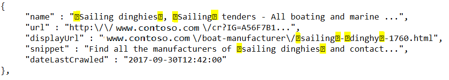
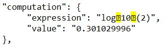

# Using decoration markers to highlight text

[!INCLUDE [Bing move notice](../bing-web-search/includes/bing-move-notice.md)]

Bing supports hit highlighting, which marks query terms (or other terms that Bing finds relevant) in the display strings of some answers. For example, a webpage result's `name`, `displayUrl`, and `snippet` fields might contain marked query terms. 

By default, Bing doesn't include highlighting markers in display strings. To enable the markers, include the `textDecorations` query parameter in your request and set it to `true`.

## Hit highlighting example

The following example shows a web result for `Sailing Dinghy`. Bing marked the beginning and end of the query term using the E000 and E001 Unicode characters.
  
 

Before displaying the result in your user interface, replace the Unicode characters with ones that are appropriate for your display format.

## Marker formatting

Bing provides the option of using either Unicode characters or HTML tags as markers. To specify which markers to use, include the [textFormat](/rest/api/cognitiveservices-bingsearch/bing-web-api-v7-reference#textformat) query parameter: 

| Value             | Marker                       |
|-------------------|------------------------------|
| `textFormat=Raw`  | Unicode characters (default) |
| `textFormat=HTML` | HTML characters              |

## Additional text decorations

Bing can return several different text decorations. For example, a `Computation` answer can contain subscript markers for the query term `log(2)` in the `expression` field.

 

If the request did not specify decorations, the `expression` field would contain `log10(2)`. 

If `textDecorations` is `true`, Bing may include the following markers in the display strings of answers. If there is no equivalent HTML tag, the table cell is empty.

|Unicode|HTML|Description
|-|-|-
|U+E000|\<b>|Marks the beginning of the query term (hit highlighting)
|U+E001|\</b>|Marks the end of the query term
|U+E002|\<i>|Marks the beginning of italicized content 
|U+E003|\</i>|Marks the end of italicized content
|U+E004|\ |Marks a line break
|U+E005||Marks the beginning of a phone number
|U+E006||Marks the end of a phone number
|U+E007||Marks the beginning of an address
|U+E008||Marks the end of an address
|U+E009|\&nbsp;|Marks a non-breaking space
|U+E00C|\<strong>|Marks the beginning of bold content
|U+E00D|\</strong>|Marks the end of bold content
|U+E00E||Marks the beginning of content whose background should be lighter than its surrounding background
|U+E00F||Marks the end of content whose background should be lighter than its surrounding background
|U+E010||Marks the beginning of content whose background should be darker than its surrounding background
|U+E011||Marks the end of content whose background should be darker than its surrounding background
|U+E012|\<del>|Marks the beginning of content that should be struck through
|U+E013|\</del>|Marks the end of content that should be struck through
|U+E016|\|Marks the beginning of subscript content
|U+E017|\|Marks the end of subscript content
|U+E018|\|Marks the beginning of superscript content
|U+E019|\|Marks the end of superscript content

## Next steps

* [What is the Bing Web Search API?](overview.md) 
* [Resize and crop thumbnails](resize-and-crop-thumbnails.md)
