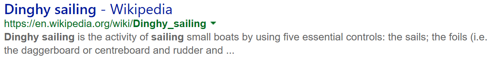
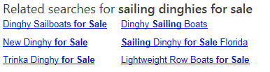
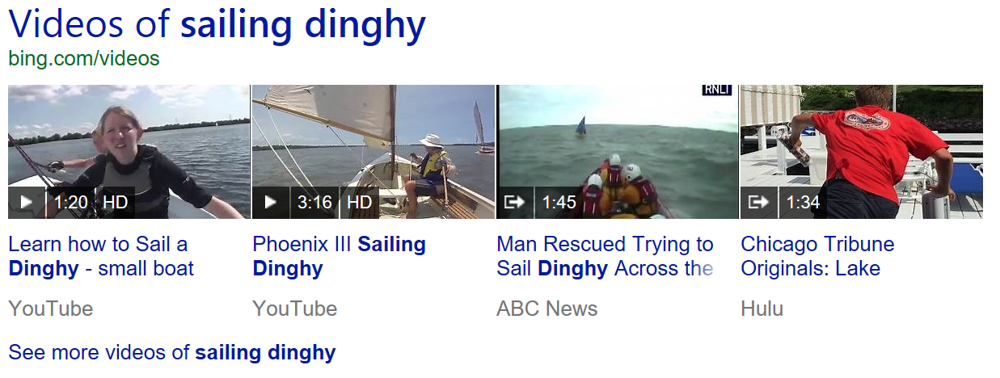
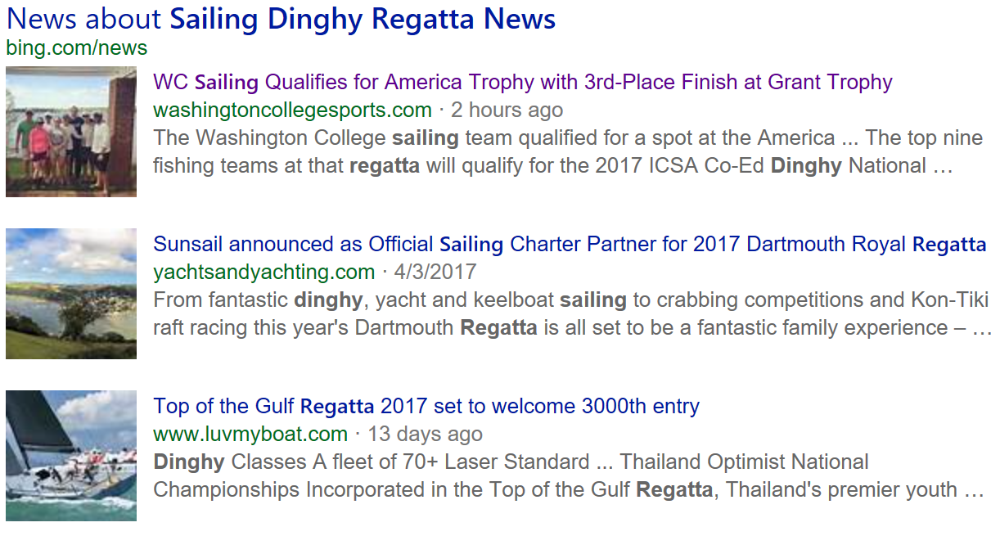

# Bing Web Search API response structure and answer types  

When you send Bing Web Search a search request, it returns a [`SearchResponse`](https://docs.microsoft.com/rest/api/cognitiveservices-bingsearch/bing-web-api-v7-reference#searchresponse) object in the response body. The object includes a field for each answer that Bing determined was relevant to query. This example illustrates a response object if Bing returned all answers:

```json
{
    "_type": "SearchResponse",
    "queryContext": {...},
    "webPages": {...},
    "images": {...},
    "relatedSearches": {...},
    "videos": {...},
    "news": {...},
    "spellSuggestion": {...},
    "computation": {...},
    "timeZone": {...},
    "rankingResponse": {...}
}, ...
```

Typically, Bing Web Search returns a subset of the answers. For example, if the query term was *sailing dinghies*, the response might include `webPages`, `images`, and `rankingResponse`. Unless you've used [responseFilter](https://docs.microsoft.com/rest/api/cognitiveservices-bingsearch/bing-web-api-v7-reference#responsefilter) to filter out webpages, the response always includes the `webpages` and `rankingResponse` answers.

[!INCLUDE [cognitive-services-bing-url-note](../../../includes/cognitive-services-bing-url-note.md)]

## Webpages answer

The [webPages](https://docs.microsoft.com/rest/api/cognitiveservices-bingsearch/bing-web-api-v7-reference#webanswer) answer contains a list of links to webpages that Bing Web Search determined were relevant to the query. Each [web page](https://docs.microsoft.com/rest/api/cognitiveservices-bingsearch/bing-web-api-v7-reference#webpage) in the list will include: the page's name, url, display URL, a short description of the content, and the date Bing found the content.

```json
{
    "id": "https:\/\/api.cognitive.microsoft.com\/api\/v7\/#WebPages.0",
    "name": "Dinghy sailing",
    "url": "https:\/\/www.bing.com\/cr?IG=3A43CA5...",
    "displayUrl": "https:\/\/en.contoso.com\/wiki\/Dinghy_sailing",
    "snippet": "Dinghy sailing is the activity of sailing small boats...",
    "dateLastCrawled": "2017-04-05T16:25:00"
}, ...
```

Use `name` and `url` to create a hyperlink that takes the user to the webpage.

<!-- Remove until this can be replaced with a sanitized version.
The following shows an example of how you might display the webpage in a search results page.


-->

## Images answer

The [images](https://docs.microsoft.com/rest/api/cognitiveservices-bingsearch/bing-images-api-v7-reference#images) answer contains a list of images that Bing thought were relevant to the query. Each [image](https://docs.microsoft.com/rest/api/cognitiveservices-bingsearch/bing-images-api-v7-reference#image) in the list includes the URL of the image, its size, its dimensions, and its encoding format. The image object also includes the URL of a thumbnail of the image and the thumbnail's dimensions.

```json
{
    "name": "Rich Passage Sailing Dinghy",
    "webSearchUrl": "https:\/\/www.bing.com\/cr?IG=3A43CA5CA64...",
    "thumbnailUrl": "https:\/\/tse1.mm.bing.net\/th?id=OIP....",
    "datePublished": "2011-10-29T11:26:00",
    "contentUrl": "http:\/\/upload.contoso.com\/sailing\/...",
    "hostPageUrl": "http:\/\/www.bing.com\/cr?IG=3A43CA5CA6464....",
    "contentSize": "79239 B",
    "encodingFormat": "jpeg",
    "hostPageDisplayUrl": "http:\/\/en.contoso.com\/wiki\/File...",
    "width": 526,
    "height": 688,
    "thumbnail": {
        "width": 229,
        "height": 300
    },
    "insightsSourcesSummary": {
        "shoppingSourcesCount": 0,
        "recipeSourcesCount": 0
    }
}, ...
```

Depending on the user's device, you'd typically display a subset of the thumbnails, with an option for the user to [page through](paging-webpages.md) the remaining images.

<!-- Remove until this can be replaced with a sanitized version.

-->

You can also expand the thumbnail as the user hovers the cursor over it. Be sure to attribute the image if you expand it. For example, by extracting the host from `hostPageDisplayUrl` and displaying it below the image. For information about resizing the thumbnail, see [Resizing and Cropping Thumbnails](./resize-and-crop-thumbnails.md).

<!-- Remove until this can be replaced with a sanitized version.

-->

If the user clicks the thumbnail, use `webSearchUrl` to take the user to Bing's search results page for images, which contains a collage of the images.

For details about the image answer and images, see [Image Search API](../bing-image-search/search-the-web.md).

## Related searches answer

The [relatedSearches](https://docs.microsoft.com/rest/api/cognitiveservices-bingsearch/bing-web-api-v7-reference#searchresponse-relatedsearches) answer contains a list of the most popular related queries made by other users. Each [query](https://docs.microsoft.com/rest/api/cognitiveservices-bingsearch/bing-web-api-v7-reference#query_obj) in the list includes a query string (`text`), a query string with hit highlighting characters (`displayText`), and a URL (`webSearchUrl`) to Bing's search results page for that query.

```json
{
    "text": "dinghy racing teams",
    "displayText": "dinghy racing teams",
    "webSearchUrl": "https:\/\/www.bing.com\/cr?IG=96C4CF214A0..."
}, ...
```

Use the `displayText` query string and the `webSearchUrl` URL to create a hyperlink that takes the user to the Bing search results page for the related query. You could also use the `text` query string in your own Web Search API query and display the results yourself.

For information about how to handle the highlighting markers in `displayText`, see [Hit Highlighting](../bing-web-search/hit-highlighting.md).

The following shows an example of the related queries usage in Bing.com.



## Videos answer

The [videos](https://docs.microsoft.com/rest/api/cognitiveservices-bingsearch/bing-video-api-v7-reference#videos) answer contains a list of videos that Bing thought were relevant to the query. Each [video](https://docs.microsoft.com/rest/api/cognitiveservices-bingsearch/bing-video-api-v7-reference#video) in the list includes the URL of the video, its duration, its dimensions, and its encoding format. The video object also includes the URL of a thumbnail of the video and the thumbnail's dimensions.

```json
{
    "name": "Sailing dinghy",
    "description": "Northwind Traders is a 12 foot gunter rigged...",
    "webSearchUrl": "https:\/\/www.bing.com\/cr?IG=1CAE739681D84...",
    "thumbnailUrl": "https:\/\/tse2.mm.bing.net\/th?id=OVP.wsKiL...",
    "datePublished": "2013-11-06T01:56:28",
    "publisher": [{
        "name": "Fabrikam"
    }],
    "contentUrl": "https:\/\/www.fabrikam.com\/watch?v=MrVBWZpJjX",
    "hostPageUrl": "https:\/\/www.bing.com\/cr?IG=1CAE739681D8400DB...",
    "encodingFormat": "mp4",
    "hostPageDisplayUrl": "https:\/\/www.fabrikam.com\/watch?v=MrBWZpJjXo",
    "width": 1280,
    "height": 720,
    "duration": "PT3M47S",
    "motionThumbnailUrl": "https:\/\/tse2.mm.bing.net\/th?id=OM.oa...",
    "embedHtml": "<iframe width=\"1280\" height=\"720\" src=\"http:\/\/www....><\/iframe>",
    "allowHttpsEmbed": true,
    "viewCount": 19089,
    "thumbnail": {
        "width": 300,
        "height": 168
    },
    "allowMobileEmbed": true,
    "isSuperfresh": false
}, ...
```

Depending on the user's device, you'd typically display a subset of the videos with an option for the user to view the remaining videos. You'd display a thumbnail of the video with the video's length, description (name), and attribution (publisher).

<!-- Remove until this can be replaced with a sanitized version.

-->

As the user hovers over the thumbnail you can use `motionThumbnailUrl` to play a thumbnail version of the video. Be sure to attribute the motion thumbnail when you display it.

<!-- Remove until this can be replaced with a sanitized version.

-->

If the user clicks the thumbnail, the following are the video viewing options:

- Use `hostPageUrl` to view the video on the host website (for example, YouTube)
- Use `webSearchUrl` to view the video in the Bing video browser
- Use `embedHtml` to embed the video in your own experience

For details about the video answer and videos, see [Video Search API](../bing-video-search/search-the-web.md).

## News answer

The [news](https://docs.microsoft.com/rest/api/cognitiveservices-bingsearch/bing-news-api-v7-reference#news) answer contains a list of news articles that Bing thought were relevant to the query. Each [news article](https://docs.microsoft.com/rest/api/cognitiveservices-bingsearch/bing-news-api-v7-reference#newsarticle) in the list includes the article's name, description, and URL to the article on the host's website. If the article contains an image, the object includes a thumbnail of the image.

```json
{
    "name": "WC Sailing Qualifies for America Trophy with...",
    "url": "http:\/\/www.bing.com\/cr?IG=3445EEF15DAF4FFFBF7...",
    "image": {
        "contentUrl": "http:\/\/www.contoso.com\/sports\/sail...",
        "thumbnail": {
            "contentUrl": "https:\/\/www.bing.com\/th?id=ON.1...",
            "width": 400,
            "height": 272
        }
    },
    "description": "The WC sailing team qualified for a...",
    "provider": [{
        "_type": "Organization",
        "name": "contoso.com"
    }],
    "datePublished": "2017-04-16T21:56:00"
}, ...
```

Depending on the user's device, you'd display a subset of the news articles with an option for the user to view the remaining articles. Use `name` and `url` to create a hyperlink that takes the user to the news article on the host's site. If the article includes an image, make the image clickable using `url`. Be sure to use `provider` to attribute the article.

<!-- Remove until this can be replaced with a sanitized version.
The following shows an example of how you might display articles in a search results page.


-->

For details about the news answer and news articles, see [News Search API](../bing-news-search/search-the-web.md).

## Computation answer

If the user enters a mathematical expression or a unit conversion query, the response may contain a [Computation](https://docs.microsoft.com/rest/api/cognitiveservices-bingsearch/bing-web-api-v7-reference#computation) answer. The `computation` answer contains the normalized expression and its result.

A unit conversion query is a query that converts one unit to another. For example, *How many feet in 10 meters?* or *How many tablespoons in a 1/4 cup?*

The following shows the `computation` answer for *How many feet in 10 meters?*

```json
"computation": {
    "id": "https:\/\/www.bing.com\/api\/v7\/#Computation",
    "expression": "10 meters",
    "value": "32.808399 feet"
}, ...
```

The following shows examples of mathematical queries and their corresponding `computation` answers.

```
Query: (5+3)(10/2)+8
Encoded query: %285%2B3%29%2810%2F2%29%2B8
```

```json
"computation": {
    "id": "https:\/\/www.bing.com\/api\/v7\/#Computation",
    "expression": "((5+3)*(10\/2))+8",
    "value": "48"
}
```

```
Query: sqrt(4^2+8^2)
Encoded query: sqrt%284^2%2B8^2%29
```

```json
"computation": {
    "id": "https:\/\/www.bing.com\/api\/v7\/#Computation",
    "expression": "sqrt((4^2)+(8^2))",
    "value": "8.94427191"
}
```

```
Query: 30 6/8 - 18 8/16
Encoded query: 30%206%2F8%20-%2018%208%2F16
```

```json
"computation": {
    "id": "https:\/\/www.bing.com\/api\/v7\/#WolframAlpha",
    "expression": "30 6\/8-18 8\/16",
    "value": "12.25"
}
```

```
Query: 8^2+11^2-2*8*11*cos(37)
Encoded query: 8^2%2B11^2-2*8*11*cos%2837%29
```

```json
"computation": {
        "id": "https:\/\/www.bing.com\/api\/v7\/#Computation",
        "expression": "(8^2)+(11^2)-(2*8*11*cos(37))",
        "value": "44.4401502"
}
```

A mathematical expression may contain the following symbols:

|Symbol|Description|
|------------|-----------------|
|+|Addition|
|-|Subtraction|
|/|Division|
|*|Multiplication|
|^|Power|
|!|Factorial|
|.|Decimal|
|()|Precedence grouping|
|[]|Function|

A mathematical expression may contain the following constants:

|Symbol|Description|
|------------|-----------------|
|Pi|3.14159...|
|Degree|Degree|
|i|Imaginary number|
|e|e, 2.71828...|
|GoldenRatio|Golden ratio, 1.61803...|

A mathematical expression may contain the following functions:

|Symbol|Description|
|------------|-----------------|
|Sort|Square root|
|Sin[x], Cos[x], Tan[x]<br />Csc[x], Sec[x], Cot[x]|Trigonometric functions (with arguments in radians)|
|ArcSin[x], ArcCos[x], ArcTan[x]<br />ArcCsc[x], ArcSec[x], ArcCot[x]|Inverse trigonometric functions (giving results in radians)|
|Exp[x], E^x|Exponential function|
|Log[x]|Natural logarithm|
|Sinh[x], Cosh[x], Tanh[x]<br />Csch[x], Sech[x], Coth[x]|Hyperbolic functions|
|ArcSinh[x], ArcCosh[x], ArcTanh[x]<br />ArcCsch[x], ArcSech[x], ArcCoth[x]|Inverse hyperbolic functions|

Mathematical expressions that contain variables (for example, 4x+6=18, where x is the variable) are not supported.

## TimeZone answer

If the user enters a time or date query, the response may contain a [TimeZone](https://docs.microsoft.com/rest/api/cognitiveservices-bingsearch/bing-web-api-v7-reference#timezone) answer. This answer supports implicit or explicit queries. An implicit query, such as *What time is it?*, returns the local time based on the user's location. An explicit query, such as *What time is it in Seattle?*, returns the local time for Seattle, WA.

The `timeZone` answer provides the name of the location, the current UTC date and time at the specified location, and the UTC offset. If the boundary of the location is within multiple time zones, the answer contains the current UTC date and time of all time zones within the boundary. For example, because Florida State falls within two time zones, the answer contains the local date and time of both time zones.  

If the query requests the time of a state or country/region, Bing determines the primary city within the location's geographical boundary and returns it in the `primaryCityTime` field. If the boundary contains multiple time zones, the remaining time zones are returned in the `otherCityTimes` field.

The following shows example queries that return the `timeZone` answer.

```
Query: What time is it?

"timeZone": {
    "id": "https:\/\/www.bing.com\/api\/v7\/#TimeZone",
    "primaryCityTime": {
        "location": "Redmond, Washington, United States",
        "time": "2015-10-27T08:38:12.1189231Z",
        "utcOffset": "UTC-7"
    }
}

Query: What time is it in the Pacific time zone?

"timeZone": {
    "id": "https:\/\/www.bing.com\/api\/v7\/#TimeZone",
    "primaryCityTime": {
        "location": "Pacific Time Zone",
        "time": "2015-10-23T12:33:19.0728146Z",
        "utcOffset": "UTC-7"
    }
}

Query: Time in Florida?

"timeZone": {
        "id": "https:\/\/www.bing.com\/api\/v7\/#TimeZone",
        "primaryCityTime": {
            "location": "Tallahassee, Florida, United States",
            "time": "2015-10-23T13:04:56.6774389Z",
            "utcOffset": "UTC-4"
        },
        "otherCityTimes": [{
            "location": "Pensacola",
            "time": "2015-10-23T12:04:56.6664294Z",
            "utcOffset": "UTC-5"
        }]
}

Query: What time is it in the U.S.

"timeZone": {
    "id": "https:\/\/www.bing.com\/api\/v7\/#TimeZone",
    "primaryCityTime": {
        "location": "Washington, D.C., United States",
        "time": "2015-10-23T15:27:59.8892745Z",
        "utcOffset": "UTC-4"
    },
    "otherCityTimes": [{
        "location": "Honolulu",
        "time": "2015-10-23T09:27:59.8892745Z",
        "utcOffset": "UTC-10"
    },
    {
        "location": "Anchorage",
        "time": "2015-10-23T11:27:59.8892745Z",
        "utcOffset": "UTC-8"
    },
    {
        "location": "Phoenix",
        "time": "2015-10-23T12:27:59.8892745Z",
        "utcOffset": "UTC-7"
    },
    {
        "location": "Los Angeles",
        "time": "2015-10-23T12:27:59.8942788Z",
        "utcOffset": "UTC-7"
    },
    {
        "location": "Denver",
        "time": "2015-10-23T13:27:59.8812681Z",
        "utcOffset": "UTC-6"
    },
    {
        "location": "Chicago",
        "time": "2015-10-23T14:27:59.8892745Z",
        "utcOffset": "UTC-5"
    }]
}
```

## SpellSuggestion answer

If Bing determines that the user may have intended to search for something different, the response includes a [SpellSuggestions](https://docs.microsoft.com/rest/api/cognitiveservices-bingsearch/bing-web-api-v7-reference#spellsuggestions) object. For example, if the user searches for *carlos pen*, Bing may determine that the user likely intended to search for Carlos Pena instead (based on past searches by others of *carlos pen*). The following shows an example spell response.

```json
"spellSuggestions": {
    "id": "https:\/\/www.bing.com\/api\/v7\/#SpellSuggestions",
    "value": [{
        "text": "carlos pena",
        "displayText": "carlos pena"
    }]
}, ...
```

## Response headers

Responses from the Bing Web Search API may contain the following headers:

|||
|-|-|
|`X-MSEdge-ClientID`|The unique ID that Bing has assigned to the user|
|`BingAPIs-Market`|The market that was used to fulfill the request|
|`BingAPIs-TraceId`|The log entry on the Bing API server for this request (for support)|

It is particularly important to persist the client ID and return it with subsequent requests. When you do this, the search will use past context in ranking search results and also provide a consistent user experience.

However, when you call the Bing Web Search API from JavaScript, your browser's built-in security features (CORS) might prevent you from accessing the values of these headers.

To gain access to the headers, you can make the Bing Web Search API request through a CORS proxy. The response from such a proxy has an `Access-Control-Expose-Headers` header that whitelists response headers and makes them available to JavaScript.

It's easy to install a CORS proxy to allow our [tutorial app](tutorial-bing-web-search-single-page-app.md) to access the optional client headers. First, if you don't already have it, [install Node.js](https://nodejs.org/en/download/). Then enter the following command at a command prompt.

```console
npm install -g cors-proxy-server
```

Next, change the Bing Web Search API endpoint in the HTML file to:\
`http://localhost:9090/https://api.cognitive.microsoft.com/bing/v7.0/search`

Finally, start the CORS proxy with the following command:

```console
cors-proxy-server
```

Leave the command window open while you use the tutorial app; closing the window stops the proxy. In the expandable HTTP Headers section below the search results, you can now see the `X-MSEdge-ClientID` header (among others) and verify that it is the same for each request.

## Response headers in production

The CORS proxy approach described in the previous answer is appropriate for development, testing, and learning.

In a production environment, you should host a server-side script on the same domain as the Web page that uses the Bing Web Search API. This script should make API calls upon request from the Web page JavaScript and pass all results, including headers, back to the client. Since the two resources (page and script) share an origin, CORS is not used and the special headers are accessible to the JavaScript on the Web page.

This approach also protects your API key from exposure to the public, since only the server-side script needs it. The script can use another method to make sure the request is authorized.

The following shows how Bing uses the spelling suggestion.

  

## Next steps  

* Review [request throttling](throttling-requests.md) documentation.  

## See also  

* [Bing Web Search API reference](https://docs.microsoft.com/rest/api/cognitiveservices-bingsearch/bing-web-api-v7-reference)
