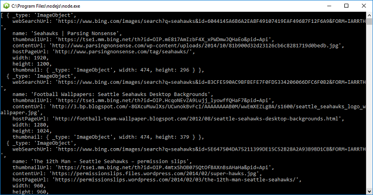

# Web Search SDK Node quickstart

The Bing Web Search SDK contains the functionality of the REST API for web queries and parsing results. 

## Application dependencies

To set up a console application using the Bing Web Search SDK, run `npm install azure-cognitiveservices-websearch` in your development environment.

## Web Search client
Get a [Cognitive Services access key](https://azure.microsoft.com/try/cognitive-services/) under *Search*. Create an instance of the `CognitiveServicesCredentials`:
```
const CognitiveServicesCredentials = require('ms-rest-azure').CognitiveServicesCredentials;
let credentials = new CognitiveServicesCredentials('YOUR-ACCESS-KEY');
```
Then, instantiate the client:
```
const WebSearchAPIClient = require('azure-cognitiveservices-websearch');
let webSearchApiClient = new WebSearchAPIClient(credentials);
```
Search for results:
```
webSearchApiClient.web.search('seahawks').then((result) => {
    let properties = ["images", "webPages", "news", "videos"];
    for (let i = 0; i < properties.length; i++) {
        if (result[properties[i]]) {
            console.log(result[properties[i]].value);
        } else {
            console.log(`No ${properties[i]} data`);
        }
    }
}).catch((err) => {
    throw err;
})

```
The code prints `result.value` items to the console without parsing any text.  The results, if any per category, will include:
- _type: 'ImageObject'
- _type: 'NewsArticle'
- _type: 'WebPage'
- _type: 'VideoObjectElementType'



## Next steps

[Cognitive services Node.js SDK samples](https://github.com/Azure-Samples/cognitive-services-node-sdk-samples)
