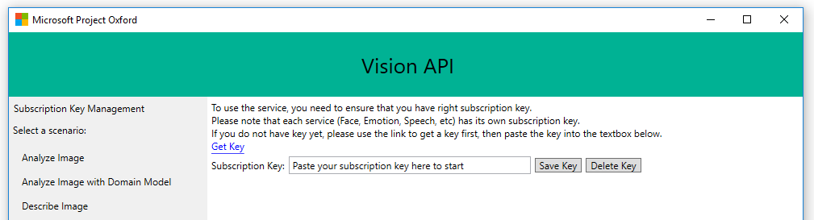
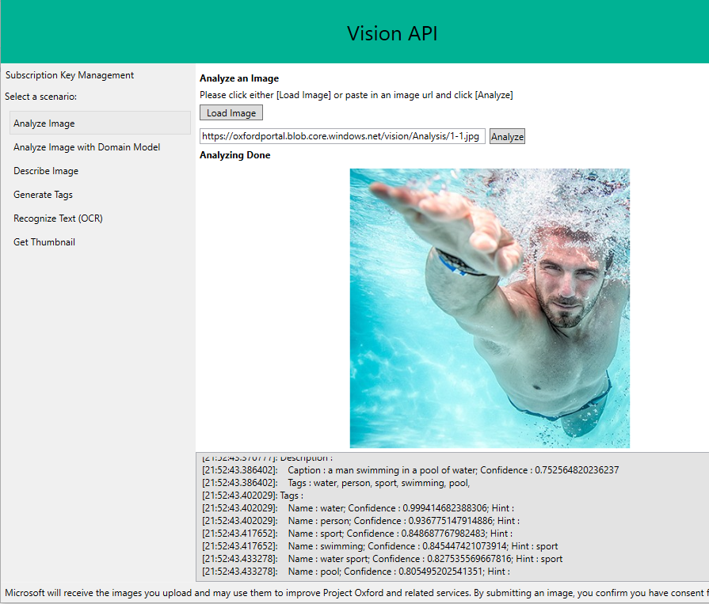

---
title: "Tutorial: Build an image processing app - C#"
titleSuffix: Computer Vision - Cognitive Services - Azure
description: Explore a basic Windows app that uses the Computer Vision API in Microsoft Cognitive Services. Perform OCR, create thumbnails, and work with visual features in an image.
services: cognitive-services
author: PatrickFarley
manager: nolachar
ms.service: cognitive-services
ms.component: computer-vision
ms.topic: article
ms.date: 08/28/2018
ms.author: pafarley
---

# Tutorial: Build an image processing app - C&#35;

Explore a basic Windows application that uses Computer Vision to perform optical character recognition (OCR), create smart-cropped thumbnails, plus detect, categorize, tag and describe visual features, including faces, in an image. The below example lets you submit an image URL or a locally stored file. You can use this open source example as a template for building your own app for Windows using the Computer Vision API and Windows Presentation Foundation (WPF), a part of .NET Framework.

> [!div class="checklist"]
> * Get the sample app from GitHub
> * Open and build the sample app in Visual Studio
> * Run the sample app and interact with it to perform various scenarios
> * Explore the various scenarios included with the sample app

## Prerequisites

Before exploring the sample app, ensure that you've met the following prerequisites:

* You must have [Visual Studio 2015](https://visualstudio.microsoft.com/downloads/) or later.
* You must have a subscription key for Computer Vision. To get a subscription key, see [Obtaining Subscription Keys](../Vision-API-How-to-Topics/HowToSubscribe.md).

## Get the sample app

The Computer Vision sample app is available on GitHub from the `Microsoft/Cognitive-Vision-Windows` repository. This repository also includes the `Microsoft/Cognitive-Common-Windows` repository as a Git submodule. You can recursively clone this repository, including the submodule, either by using the `git clone --recurse-submodules` command from the command line, or by using GitHub Desktop.

For example, to recursively clone the repository for the Computer Vision sample app from a command prompt, run the following command:

```Console
git clone --recurse-submodules https://github.com/Microsoft/Cognitive-Vision-Windows.git
```

> [!IMPORTANT]
> Do not download this repository as a ZIP. Git doesn't include submodules when downloading a repository as a ZIP.

### Get optional sample images

You can optionally use the sample images included with the [Face](../../Face/Overview.md) sample app, available on GitHub from the `Microsoft/Cognitive-Face-Windows` repository. That sample app includes a folder, `/Data`, which contains multiple images of people. You can recursively clone this repository, as well, by the methods described for the Computer Vision sample app.

For example, to recursively clone the repository for the Face sample app from a command prompt, run the following command:

```Console
git clone --recurse-submodules https://github.com/Microsoft/Cognitive-Face-Windows.git
```

## Open and build the sample app in Visual Studio

You must build the sample app first, so that Visual Studio can resolve dependencies, before you can run or explore the sample app. To open and build the sample app, do the following steps:

1. Open the Visual Studio solution file, `/Sample-WPF/VisionAPI-WPF-Samples.sln`, in Visual Studio.
1. Ensure that the Visual Studio solution contains two projects:  

   * SampleUserControlLibrary
   * VisionAPI-WPF-Samples  

   If the SampleUserControlLibrary project is unavailable, confirm that you've recursively cloned the `Microsoft/Cognitive-Vision-Windows` repository.
1. In Visual Studio, either press Ctrl+Shift+B or choose **Build** from the ribbon menu and then choose **Build Solution** to build the solution.

## Run and interact with the sample app

You can run the sample app, to see how it interacts with you and with the Computer Vision client library when performing various tasks, such as generating thumbnails or tagging images. To run and interact with the sample app, do the following steps:

1. After the build is complete, either press **F5** or choose **Debug** from the ribbon menu and then choose **Start debugging** to run the sample app.
1. When the sample app is displayed, choose **Subscription Key Management** from the navigation pane to display the Subscription Key Management page.
     
1. Enter your subscription key in **Subscription Key**.
1. Enter the endpoint URL, omitting the `/vision/v1.0`, of the Computer Vision resource for your subscription key in **Endpoint**.  
   For example, if you're using the subscription key from the Computer Vision free trial, enter the following endpoint URL for the West Central US Azure region:
   `https://westcentralus.api.cognitive.microsoft.com`
1. If you don't want to enter your subscription key and endpoint URL the next time you run the sample app, choose **Save Setting** to save the subscription key and endpoint URL to your computer. If you want to delete your previously-saved subscription key and endpoint URL, choose **Delete Setting**.

   > [!NOTE]
   > The sample app uses isolated storage, and `System.IO.IsolatedStorage`, to store your subscription key and endpoint URL.

1. Under **Select a scenario** in the navigation pane, select one of the scenarios currently included with the sample app:  

   | Scenario | Description |
   |----------|-------------|
   |Analyze Image | Uses the [Analyze Image](https://westcentralus.dev.cognitive.microsoft.com/docs/services/5adf991815e1060e6355ad44/operations/56f91f2e778daf14a499e1fa) operation to analyze a local or remote image. You can choose the visual features and language for the analysis, and see both the image and the results.  |
   |Analyze Image with Domain Model | Uses the [List Domain Specific Models](https://westcentralus.dev.cognitive.microsoft.com/docs/services/5adf991815e1060e6355ad44/operations/56f91f2e778daf14a499e1fd) operation to list the domain models from which you can select, and the [Recognize Domain Specific Content](https://westcentralus.dev.cognitive.microsoft.com/docs/services/5adf991815e1060e6355ad44/operations/56f91f2e778daf14a499e200) operation to analyze a local or remote image using the selected domain model. You can also choose the language for the analysis. |
   |Describe Image | Uses the [Describe Image](https://westcentralus.dev.cognitive.microsoft.com/docs/services/5adf991815e1060e6355ad44/operations/56f91f2e778daf14a499e1fe) operation to create a human-readable description of a local or remote image. You can also choose the language for the description. |
   |Generate Tags | Uses the [Tag Image](https://westcentralus.dev.cognitive.microsoft.com/docs/services/5adf991815e1060e6355ad44/operations/56f91f2e778daf14a499e1ff) operation to tag the visual features of a local or remote image. You can also choose the language used for the tags. |
   |Recognize Text (OCR) | Uses the [OCR](https://westcentralus.dev.cognitive.microsoft.com/docs/services/5adf991815e1060e6355ad44/operations/56f91f2e778daf14a499e1fc) operation to recognize and extract printed text from an image. You can either choose the language to use, or let Computer Vision auto-detect the language. |
   |Recognize Text V2 (English) | Uses the [Recognize Text](https://westcentralus.dev.cognitive.microsoft.com/docs/services/5adf991815e1060e6355ad44/operations/587f2c6a154055056008f200) and [Get Recognize Text Operation Result](https://westcentralus.dev.cognitive.microsoft.com/docs/services/5adf991815e1060e6355ad44/operations/587f2cf1154055056008f201) operations to asynchronously recognize and extract printed or handwritten text from an image. |
   |Get Thumbnail | Uses the [Get Thumbnail](https://westcentralus.dev.cognitive.microsoft.com/docs/services/5adf991815e1060e6355ad44/operations/56f91f2e778daf14a499e1fb) operation to generate a thumbnail for a local or remote image. |

   > [!IMPORTANT]
   > Microsoft receives the images you upload and may use them to improve Computer Vision API and related services. By submitting an image, you confirm that you have followed our [Developer Code of Conduct](https://azure.microsoft.com/support/legal/developer-code-of-conduct/).

   The following screenshot illustrates the page provided for the Analyze Image scenario, after analyzing a sample image.
   

## Explore the sample app

The Visual Studio solution for the Computer Vision sample app contains two projects:

* SampleUserControlLibrary  
  The SampleUserControlLibrary project provides functionality shared by multiple Cognitive Services samples. The project contains the following:
  * SampleScenarios  
    A UserControl that provides a standardized presentation, such as the title bar, navigation pane, and content pane, for samples. The Computer Vision sample app uses this control in the MainWindow.xaml window to display scenario pages and access information shared across scenarios, such as the subscription key and endpoint URL.
  * SubscriptionKeyPage  
    A Page that provides a standardized layout for entering a subscription key and endpoint URL for the sample app. The Computer Vision sample app uses this page to manage the subscription key and endpoint URL used by the scenario pages.
  * VideoResultControl  
    A UserControl that provides a standardized presentation for video information. The Computer Vision sample app doesn't use this control.
* VisionAPI-WPF-Samples  
  The main project for the Computer Vision sample app, this project contains all of the interesting functionality for Computer Vision. The project contains the following:
  * AnalyzeInDomainPage.xaml  
    The scenario page for the Analyze Image with Domain Model scenario.
  * AnalyzeImage.xaml  
    The scenario page for the Analyze Image scenario.
  * DescribePage.xaml  
    The scenario page for the Describe Image scenario.
  * ImageScenarioPage.cs  
    The ImageScenarioPage class, from which all of the scenario pages in the sample app are derived. This class manages functionality, such as providing credentials and formatting output, shared by all of the scenario pages.
  * MainWindow.xaml  
    The main window for the sample app, it uses the SampleScenarios control to present the SubscriptionKeyPage and scenario pages.
  * OCRPage.xaml  
    The scenario page for the Recognize Text (OCR) scenario.
  * RecognizeLanguage.cs  
    The RecognizeLanguage class, which provides information about the languages supported by the various methods in the sample app.
  * TagsPage.xaml  
    The scenario page for the Generate Tags scenario.
  * TextRecognitionPage.xaml  
    The scenario page for the Recognize Text V2 (English) scenario.
  * ThumbnailPage.xaml  
    The scenario page for the Get Thumbnail scenario.

### Explore the sample code

Key portions of sample code are framed with comment blocks that start with `KEY SAMPLE CODE STARTS HERE` and end with `KEY SAMPLE CODE ENDS HERE`, to make it easier for you to explore the sample app. These key portions of sample code contain the code most relevant to learning how to use the Computer Vision API client library to do various tasks. You can search for `KEY SAMPLE CODE STARTS HERE` in Visual Studio to move between the most relevant sections of code in the Computer Vision sample app. 

For example, the `UploadAndAnalyzeImageAsync` method, shown following and included in AnalyzePage.xaml, demonstrates how to use the client library to analyze a local image by invoking the `ComputerVisionClient.AnalyzeImageInStreamAsync` method.

```csharp
private async Task<ImageAnalysis> UploadAndAnalyzeImageAsync(string imageFilePath)
{
    // -----------------------------------------------------------------------
    // KEY SAMPLE CODE STARTS HERE
    // -----------------------------------------------------------------------

    //
    // Create Cognitive Services Vision API Service client.
    //
    using (var client = new ComputerVisionClient(Credentials) { Endpoint = Endpoint })
    {
        Log("ComputerVisionClient is created");

        using (Stream imageFileStream = File.OpenRead(imageFilePath))
        {
            //
            // Analyze the image for all visual features.
            //
            Log("Calling ComputerVisionClient.AnalyzeImageInStreamAsync()...");
            VisualFeatureTypes[] visualFeatures = GetSelectedVisualFeatures();
            string language = (_language.SelectedItem as RecognizeLanguage).ShortCode;
            ImageAnalysis analysisResult = await client.AnalyzeImageInStreamAsync(imageFileStream, visualFeatures, null, language);
            return analysisResult;
        }
    }

    // -----------------------------------------------------------------------
    // KEY SAMPLE CODE ENDS HERE
    // -----------------------------------------------------------------------
}
```

### Explore the client library

This sample app uses the Computer Vision API client library, a thin C# client wrapper for the Computer Vision API in Azure Cognitive Services. The client library is available from NuGet in the [Microsoft.Azure.CognitiveServices.Vision.ComputerVision](https://www.nuget.org/packages/Microsoft.Azure.CognitiveServices.Vision.ComputerVision/) package. When you built the Visual Studio application, you retrieved the client library from its corresponding NuGet package. You can also view the source code for the client library in the `/ClientLibrary` folder of the `Microsoft/Cognitive-Vision-Windows` repository.

The client library's functionality centers around the `ComputerVisionClient` class, in the `Microsoft.Azure.CognitiveServices.Vision.ComputerVision` namespace, while the models used by the `ComputerVisionClient` class when interacting with Computer Vision are found in the `Microsoft.Azure.CognitiveServices.Vision.ComputerVision.Models` namespace. In the various XAML scenario pages included with the sample app, you'll find the following `using` directives for those namespaces:

```csharp
// -----------------------------------------------------------------------
// KEY SAMPLE CODE STARTS HERE
// Use the following namespace for ComputerVisionClient.
// -----------------------------------------------------------------------
using Microsoft.Azure.CognitiveServices.Vision.ComputerVision;
using Microsoft.Azure.CognitiveServices.Vision.ComputerVision.Models;
// -----------------------------------------------------------------------
// KEY SAMPLE CODE ENDS HERE
// -----------------------------------------------------------------------
```

You'll learn more about the various methods included with the `ComputerVisionClient` class as you explore the scenarios included with the Computer Vision sample app.

## Explore the Analyze Image scenario

This scenario is managed by the AnalyzePage.xaml page. You can choose the visual features and language for the analysis, and see both the image and the results. The scenario page does this by using one of the following methods, depending on the source of the image:

* UploadAndAnalyzeImageAsync  
  This method is used for local images, in which the image must be encoded as a `Stream` and sent to Computer Vision by calling the `ComputerVisionClient.AnalyzeImageInStreamAsync` method.
* AnalyzeUrlAsync  
  This method is used for remote images, in which the URL for the image is sent to Computer Vision by calling the `ComputerVisionClient.AnalyzeImageAsync` method.

The `UploadAndAnalyzeImageAsync` method creates a new `ComputerVisionClient` instance, using the specified subscription key and endpoint URL. Because the sample app is analyzing a local image, it has to send the contents of that image to Computer Vision. It opens the local file specified in `imageFilePath` for reading as a `Stream`, then gets the visual features and language selected in the scenario page. It calls the `ComputerVisionClient.AnalyzeImageInStreamAsync` method, passing the `Stream` for the file, the visual features, and the language, then returns the result as an `ImageAnalysis` instance. The methods inherited from the `ImageScenarioPage` class present the returned results in the scenario page.

The `AnalyzeUrlAsync` method creates a new `ComputerVisionClient` instance, using the specified subscription key and endpoint URL. It gets the visual features and language selected in the scenario page. It calls the `ComputerVisionClient.AnalyzeImageInStreamAsync` method, passing the image URL, the visual features, and the language, then returns the result as an `ImageAnalysis` instance. The methods inherited from the `ImageScenarioPage` class present the returned results in the scenario page.

## Explore the Analyze Image with Domain Model scenario

This scenario is managed by the AnalyzeInDomainPage.xaml page. You can choose a domain model, such as `celebrities` or `landmarks`, and language to perform a domain-specific analysis of the image, and see both the image and the results. The scenario page uses the following methods, depending on the source of the image:

* GetAvailableDomainModelsAsync  
  This method gets the list of available domain models from Computer Vision and populates the `_domainModelComboBox` ComboBox control on the page, using the `ComputerVisionClient.ListModelsAsync` method.
* UploadAndAnalyzeInDomainImageAsync  
  This method is used for local images, in which the image must be encoded as a `Stream` and sent to Computer Vision by calling the `ComputerVisionClient.AnalyzeImageByDomainInStreamAsync` method.
* AnalyzeInDomainUrlAsync  
  This method is used for remote images, in which the URL for the image is sent to Computer Vision by calling the `ComputerVisionClient.AnalyzeImageByDomainAsync` method.

The `UploadAndAnalyzeInDomainImageAsync` method creates a new `ComputerVisionClient` instance, using the specified subscription key and endpoint URL. Because the sample app is analyzing a local image, it has to send the contents of that image to Computer Vision. It opens the local file specified in `imageFilePath` for reading as a `Stream`, then gets the language selected in the scenario page. It calls the `ComputerVisionClient.AnalyzeImageByDomainInStreamAsync` method, passing the `Stream` for the file, the name of the domain model, and the language, then returns the result as an `DomainModelResults` instance. The methods inherited from the `ImageScenarioPage` class present the returned results in the scenario page.

The `AnalyzeInDomainUrlAsync` method creates a new `ComputerVisionClient` instance, using the specified subscription key and endpoint URL. It gets the language selected in the scenario page. It calls the `ComputerVisionClient.AnalyzeImageByDomainAsync` method, passing the image URL, the visual features, and the language, then returns the result as an `DomainModelResults` instance. The methods inherited from the `ImageScenarioPage` class present the returned results in the scenario page.

## Explore the Describe Image scenario

This scenario is managed by the DescribePage.xaml page. You can choose a language to create a human-readable description of the image, and see both the image and the results. The scenario page uses the following methods, depending on the source of the image:

* UploadAndDescribeImageAsync  
  This method is used for local images, in which the image must be encoded as a `Stream` and sent to Computer Vision by calling the `ComputerVisionClient.DescribeImageInStreamAsync` method.
* DescribeUrlAsync  
  This method is used for remote images, in which the URL for the image is sent to Computer Vision by calling the `ComputerVisionClient.DescribeImageAsync` method.

The `UploadAndDescribeImageAsync` method creates a new `ComputerVisionClient` instance, using the specified subscription key and endpoint URL. Because the sample app is analyzing a local image, it has to send the contents of that image to Computer Vision. It opens the local file specified in `imageFilePath` for reading as a `Stream`, then gets the language selected in the scenario page. It calls the `ComputerVisionClient.DescribeImageInStreamAsync` method, passing the `Stream` for the file, the maximum number of candidates (in this case, 3), and the language, then returns the result as an `ImageDescription` instance. The methods inherited from the `ImageScenarioPage` class present the returned results in the scenario page.

The `DescribeUrlAsync` method creates a new `ComputerVisionClient` instance, using the specified subscription key and endpoint URL. It gets the language selected in the scenario page. It calls the `ComputerVisionClient.DescribeImageAsync` method, passing the image URL, the maximum number of candidates (in this case, 3), and the language, then returns the result as an `ImageDescription` instance. The methods inherited from the `ImageScenarioPage` class present the returned results in the scenario page.

## Explore the Generate Tags scenario

This scenario is managed by the TagsPage.xaml page. You can choose a language to tag the visual features of an image, and see both the image and the results. The scenario page uses the following methods, depending on the source of the image:

* UploadAndGetTagsForImageAsync  
  This method is used for local images, in which the image must be encoded as a `Stream` and sent to Computer Vision by calling the `ComputerVisionClient.TagImageInStreamAsync` method.
* GenerateTagsForUrlAsync  
  This method is used for remote images, in which the URL for the image is sent to Computer Vision by calling the `ComputerVisionClient.TagImageAsync` method.

The `UploadAndGetTagsForImageAsync` method creates a new `ComputerVisionClient` instance, using the specified subscription key and endpoint URL. Because the sample app is analyzing a local image, it has to send the contents of that image to Computer Vision. It opens the local file specified in `imageFilePath` for reading as a `Stream`, then gets the language selected in the scenario page. It calls the `ComputerVisionClient.TagImageInStreamAsync` method, passing the `Stream` for the file and the language, then returns the result as a `TagResult` instance. The methods inherited from the `ImageScenarioPage` class present the returned results in the scenario page.

The `GenerateTagsForUrlAsync` method creates a new `ComputerVisionClient` instance, using the specified subscription key and endpoint URL. It gets the language selected in the scenario page. It calls the `ComputerVisionClient.TagImageAsync` method, passing the image URL and the language, then returns the result as a `TagResult` instance. The methods inherited from the `ImageScenarioPage` class present the returned results in the scenario page.

## Explore the Recognize Text (OCR) scenario

This scenario is managed by the OCRPage.xaml page. You can choose a language to recognize and extract printed text from an image, and see both the image and the results. The scenario page uses the following methods, depending on the source of the image:

* UploadAndRecognizeImageAsync  
  This method is used for local images, in which the image must be encoded as a `Stream` and sent to Computer Vision by calling the `ComputerVisionClient.RecognizePrintedTextInStreamAsync` method.
* RecognizeUrlAsync  
  This method is used for remote images, in which the URL for the image is sent to Computer Vision by calling the `ComputerVisionClient.RecognizePrintedTextAsync` method.

The `UploadAndRecognizeImageAsync` method creates a new `ComputerVisionClient` instance, using the specified subscription key and endpoint URL. Because the sample app is analyzing a local image, it has to send the contents of that image to Computer Vision. It opens the local file specified in `imageFilePath` for reading as a `Stream`, then gets the language selected in the scenario page. It calls the `ComputerVisionClient.RecognizePrintedTextInStreamAsync` method, indicating that orientation is not detected and passing the `Stream` for the file and the language, then returns the result as an `OcrResult` instance. The methods inherited from the `ImageScenarioPage` class present the returned results in the scenario page.

The `RecognizeUrlAsync` method creates a new `ComputerVisionClient` instance, using the specified subscription key and endpoint URL. It gets the language selected in the scenario page. It calls the `ComputerVisionClient.RecognizePrintedTextAsync` method, indicating that orientation is not detected and passing the image URL and the language, then returns the result as an `OcrResult` instance. The methods inherited from the `ImageScenarioPage` class present the returned results in the scenario page.

## Explore the Recognize Text V2 (English) scenario

This scenario is managed by the TextRecognitionPage.xaml page. You can choose the recognition mode and a language to asynchronously recognize and extract either printed or handwritten text from an image, and see both the image and the results. The scenario page uses the following methods, depending on the source of the image:

* UploadAndRecognizeImageAsync  
  This method is used for local images, in which the image must be encoded as a `Stream` and sent to Computer Vision by calling the `RecognizeAsync` method and passing a parameterized delegate for the `ComputerVisionClient.RecognizeTextInStreamAsync` method.
* RecognizeUrlAsync  
  This method is used for remote images, in which the URL for the image is sent to Computer Vision by calling the `RecognizeAsync` method and passing a parameterized delegate for the `ComputerVisionClient.RecognizeTextAsync` method.
* RecognizeAsync
  This method handles the asynchronous calling for both the `UploadAndRecognizeImageAsync` and `RecognizeUrlAsync` methods, as well as polling for results by calling the `ComputerVisionClient.GetTextOperationResultAsync` method.

Unlike the other scenarios included in the Computer Vision sample app, this scenario is asynchronous, in that one method is called to start the process, but a different method is called to check on the status and return the results of that process. The logical flow in this scenario is somewhat different from that in the other scenarios.

The `UploadAndRecognizeImageAsync` method opens the local file specified in `imageFilePath` for reading as a `Stream`, then calls the `RecognizeAsync` method, passing:

* A lambda expression for a parameterized asynchronous delegate of the `ComputerVisionClient.RecognizeTextInStreamAsync` method, with the `Stream` for the file and the recognition mode as parameters, in `GetHeadersAsyncFunc`.
* A lambda expression for a delegate to get the `Operation-Location` response header value, in `GetOperationUrlFunc`.

The `RecognizeUrlAsync` method calls the `RecognizeAsync` method, passing:

* A lambda expression for a parameterized asynchronous delegate of the `ComputerVisionClient.RecognizeTextAsync` method, with the URL of the remote image and the recognition mode as parameters, in `GetHeadersAsyncFunc`.
* A lambda expression for a delegate to get the `Operation-Location` response header value, in `GetOperationUrlFunc`.

When the `RecognizeAsync` method is completed, both `UploadAndRecognizeImageAsync` and `RecognizeUrlAsync` methods return the result as a `TextOperationResult` instance. The methods inherited from the `ImageScenarioPage` class present the returned results in the scenario page.

The `RecognizeAsync` method calls the parameterized delegate for either the `ComputerVisionClient.RecognizeTextInStreamAsync` or `ComputerVisionClient.RecognizeTextAsync` method passed in `GetHeadersAsyncFunc` and waits for the response. The method then calls the delegate passed in `GetOperationUrlFunc` to get the `Operation-Location` response header value from the response. This value is the URL used to retrieve the results of the method passed in `GetHeadersAsyncFunc` from Computer Vision.

The `RecognizeAsync` method then calls the `ComputerVisionClient.GetTextOperationResultAsync` method, passing the URL retrieved from the `Operation-Location` response header, to get the status and result of the method passed in `GetHeadersAsyncFunc`. If the status doesn't indicate that the method completed, successfully or unsuccessfully, the `RecognizeAsync` method calls `ComputerVisionClient.GetTextOperationResultAsync` 3 more times, waiting 3 seconds between calls. The `RecognizeAsync` method returns the results to the method that called it.

## Explore the Get Thumbnail scenario

This scenario is managed by the ThumbnailPage.xaml page. You can indicate whether to use smart cropping, and specify desired height and width, to generate a thumbnail from an image, and see both the image and the results. The scenario page uses the following methods, depending on the source of the image:

* UploadAndThumbnailImageAsync  
  This method is used for local images, in which the image must be encoded as a `Stream` and sent to Computer Vision by calling the `ComputerVisionClient.GenerateThumbnailInStreamAsync` method.
* ThumbnailUrlAsync  
  This method is used for remote images, in which the URL for the image is sent to Computer Vision by calling the `ComputerVisionClient.GenerateThumbnailAsync` method.

The `UploadAndThumbnailImageAsync` method creates a new `ComputerVisionClient` instance, using the specified subscription key and endpoint URL. Because the sample app is analyzing a local image, it has to send the contents of that image to Computer Vision. It opens the local file specified in `imageFilePath` for reading as a `Stream`. It calls the `ComputerVisionClient.GenerateThumbnailInStreamAsync` method, passing the width, height, the `Stream` for the file, and whether to use smart cropping, then returns the result as a `Stream`. The methods inherited from the `ImageScenarioPage` class present the returned results in the scenario page.

The `RecognizeUrlAsync` method creates a new `ComputerVisionClient` instance, using the specified subscription key and endpoint URL. It calls the `ComputerVisionClient.GenerateThumbnailAsync` method, passing the width, height, the URL for the image, and whether to use smart cropping, then returns the result as a `Stream`. The methods inherited from the `ImageScenarioPage` class present the returned results in the scenario page.

## Clean up resources

When no longer needed, delete the folder into which you cloned the `Microsoft/Cognitive-Vision-Windows` repository. If you opted to use the sample images, also delete the folder into which you cloned the `Microsoft/Cognitive-Face-Windows` repository.

## Next steps

> [!div class="nextstepaction"]
> [Get started with Face API](../../Face/Tutorials/FaceAPIinCSharpTutorial.md)