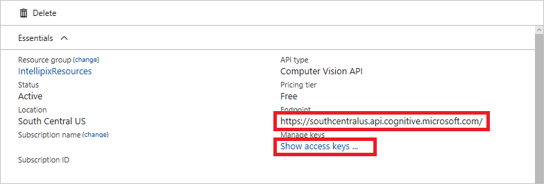
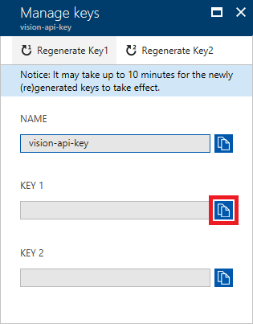
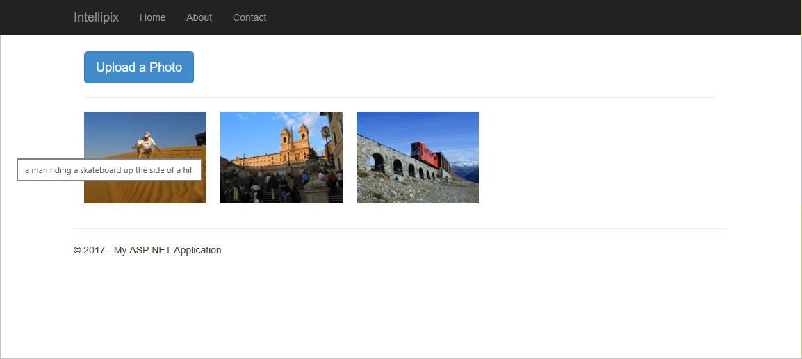
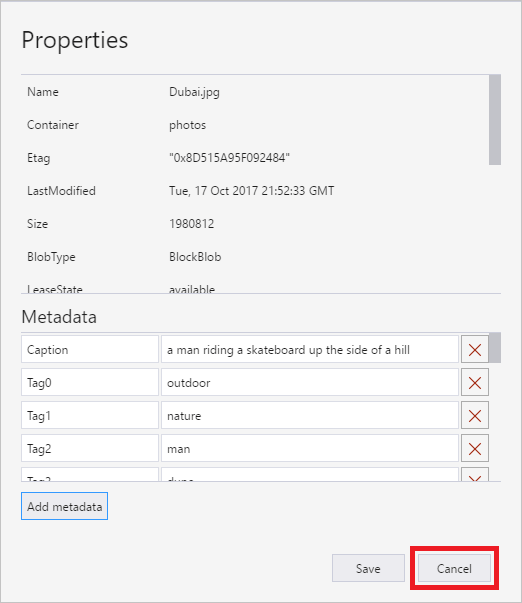

# Tutorial: Use Computer Vision to generate image metadata in Azure Storage

In this tutorial, you'll learn how to integrate the Azure Computer Vision service into a web app to generate metadata for uploaded images. This is useful for [digital asset management (DAM)](../Home.md#computer-vision-for-digital-asset-management) scenarios, such as if a company wants to quickly generate descriptive captions or searchable keywords for all of its images.

A full app guide can be found in the [Azure Storage and Cognitive Services Lab](https://github.com/Microsoft/computerscience/blob/master/Labs/Azure%20Services/Azure%20Storage/Azure%20Storage%20and%20Cognitive%20Services%20(MVC).md) on GitHub, and this tutorial essentially covers Exercise 5 of the lab. You may want to create the full application by following every step, but if you only want to learn how to integrate Computer Vision into an existing web app, read along here.

This tutorial shows you how to:

> [!div class="checklist"]
> * Create a Computer Vision resource in Azure
> * Perform image analysis on Azure Storage images
> * Attach metadata to Azure Storage images
> * Check image metadata using Azure Storage Explorer

If you don't have an Azure subscription, create a [free account](https://azure.microsoft.com/free/) before you begin. 

## Prerequisites

- [Visual Studio 2017 Community edition](https://www.visualstudio.com/products/visual-studio-community-vs.aspx) or higher, with the "ASP.NET and web development" and "Azure development" workloads installed.
- An Azure Storage account with a blob container set up for image storage (follow [Exercises 1 of the Azure Storage Lab](https://github.com/Microsoft/computerscience/blob/master/Labs/Azure%20Services/Azure%20Storage/Azure%20Storage%20and%20Cognitive%20Services%20(MVC).md#Exercise1) if you need help with this step).
- The Azure Storage Explorer tool (follow [Exercise 2 of the Azure Storage Lab](https://github.com/Microsoft/computerscience/blob/master/Labs/Azure%20Services/Azure%20Storage/Azure%20Storage%20and%20Cognitive%20Services%20(MVC).md#Exercise2) if you need help with this step).
- An ASP.NET web application with access to Azure Storage (follow [Exercise 3 of the Azure Storage Lab](https://github.com/Microsoft/computerscience/blob/master/Labs/Azure%20Services/Azure%20Storage/Azure%20Storage%20and%20Cognitive%20Services%20(MVC).md#Exercise3) to create such an app quickly).

## Create a Computer Vision resource

You'll need to create a Computer Vision resource for your Azure account; this resource manages your access to Azure's Computer Vision service. 

1. Follow the instructions in [Create an Azure Cognitive Services resource](../../cognitive-services-apis-create-account.md) to create a Computer Vision resource.

1. Then go to the menu for your resource group and click the Computer Vision API subscription that you just created. Copy the URL under **Endpoint** to somewhere you can easily retrieve it in a moment. Then click **Show access keys**.

    
    
    [!INCLUDE [Custom subdomains notice](../../../../includes/cognitive-services-custom-subdomains-note.md)]


1. In the next window, copy the value of **KEY 1** to the clipboard.

    

## Add Computer Vision credentials

Next, you'll add the required credentials to your app so that it can access Computer Vision resources

Open your ASP.NET web application in Visual Studio and navigate to the **Web.config** file at the root of the project. Add the following statements to the `<appSettings>` section of the file, replacing `VISION_KEY` with the key you copied in the previous step, and `VISION_ENDPOINT` with the URL you saved in the step before.

```xml
<add key="SubscriptionKey" value="VISION_KEY" />
<add key="VisionEndpoint" value="VISION_ENDPOINT" />
```

Then in the Solution Explorer, right-click the project and use the **Manage NuGet Packages** command to install the package **Microsoft.Azure.CognitiveServices.Vision.ComputerVision**. This package contains the types needed to call the Computer Vision API.

## Add metadata generation code

Next, you'll add the code that actually leverages the Computer Vision service to create metadata for images. These steps will apply to the ASP.NET app in the lab, but you can adapt them to your own app. What's important is that at this point you have an ASP.NET web application that can upload images to an Azure Storage container, read images from it, and display them in the view. If you're unsure about this step, it's best to follow [Exercise 3 of the Azure Storage Lab](https://github.com/Microsoft/computerscience/blob/master/Labs/Azure%20Services/Azure%20Storage/Azure%20Storage%20and%20Cognitive%20Services%20(MVC).md#Exercise3). 

1. Open the *HomeController.cs* file in the project's **Controllers** folder and add the following `using` statements at the top of the file:

    ```csharp
    using Microsoft.Azure.CognitiveServices.Vision.ComputerVision;
    using Microsoft.Azure.CognitiveServices.Vision.ComputerVision.Models;
    ```

1. Then, go to the **Upload** method; this method converts and uploads images to blob storage. Add the following code immediately after the block that begins with `// Generate a thumbnail` (or at the end of your image-blob-creation process). This code takes the blob containing the image (`photo`), and uses Computer Vision to generate a description for that image. The Computer Vision API also generates a list of keywords that apply to the image. The generated description and keywords are stored in the blob's metadata so that they can be retrieved later on.

    ```csharp
    // Submit the image to Azure's Computer Vision API
    ComputerVisionClient vision = new ComputerVisionClient(
        new ApiKeyServiceClientCredentials(ConfigurationManager.AppSettings["SubscriptionKey"]),
        new System.Net.Http.DelegatingHandler[] { });
    vision.Endpoint = ConfigurationManager.AppSettings["VisionEndpoint"];

    VisualFeatureTypes[] features = new VisualFeatureTypes[] { VisualFeatureTypes.Description };
    var result = await vision.AnalyzeImageAsync(photo.Uri.ToString(), features);

    // Record the image description and tags in blob metadata
    photo.Metadata.Add("Caption", result.Description.Captions[0].Text);

    for (int i = 0; i < result.Description.Tags.Count; i++)
    {
        string key = String.Format("Tag{0}", i);
        photo.Metadata.Add(key, result.Description.Tags[i]);
    }

    await photo.SetMetadataAsync();
    ```

1. Next, go to the **Index** method in the same file. This method enumerates the stored image blobs in the targeted blob container (as **IListBlobItem** instances) and passes them to the application view. Replace the `foreach` block in this method with the following code. This code calls **CloudBlockBlob.FetchAttributes** to get each blob's attached metadata. It extracts the computer-generated description (`caption`) from the metadata and adds it to the **BlobInfo** object, which gets passed to the view.
    
    ```csharp
    foreach (IListBlobItem item in container.ListBlobs())
    {
        var blob = item as CloudBlockBlob;
    
        if (blob != null)
        {
            blob.FetchAttributes(); // Get blob metadata
            var caption = blob.Metadata.ContainsKey("Caption") ? blob.Metadata["Caption"] : blob.Name;
    
            blobs.Add(new BlobInfo()
            {
                ImageUri = blob.Uri.ToString(),
                ThumbnailUri = blob.Uri.ToString().Replace("/photos/", "/thumbnails/"),
                Caption = caption
            });
        }
    }
    ```

## Test the app

Save your changes in Visual Studio and press **Ctrl+F5** to launch the application in your browser. Use the app to upload a few images, either from the "photos" folder in the lab's resources or from your own folder. When you hover the cursor over one of the images in the view, a tooltip window should appear and display the computer-generated caption for the image.



To view all of the attached metadata, use the Azure Storage Explorer to view the storage container you're using for images. Right-click any of the blobs in the container and select **Properties**. In the dialog, you'll see a list of key-value pairs. The computer-generated image description is stored in the item "Caption," and the search keywords are stored in "Tag0," "Tag1," and so on. When you're finished, click **Cancel** to close the dialog.



## Clean up resources

If you'd like to keep working on your web app, see the [Next steps](#next-steps) section. If you don't plan to continue using this application, you should delete all app-specific resources. To do delete resources, you can delete the resource group that contains your Azure Storage subscription and Computer Vision resource. This will remove the storage account, the blobs uploaded to it, and the App Service resource needed to connect with the ASP.NET web app. 

To delete the resource group, open the **Resource groups** tab in the portal, navigate to the resource group you used for this project, and click **Delete resource group** at the top of the view. You'll be asked to type the resource group's name to confirm you want to delete it, because once deleted, a resource group can't be recovered.

## Next steps

In this tutorial, you set up Azure's Computer Vision service in an existing web app to automatically generate captions and keywords for blob images as they're uploaded. Next, refer to the Azure Storage Lab, Exercise 6, to learn how to add search functionality to your web app. This takes advantage of the search keywords that the Computer Vision service generates.

> [!div class="nextstepaction"]
> [Add search to your app](https://github.com/Microsoft/computerscience/blob/master/Labs/Azure%20Services/Azure%20Storage/Azure%20Storage%20and%20Cognitive%20Services%20(MVC).md#Exercise6)
