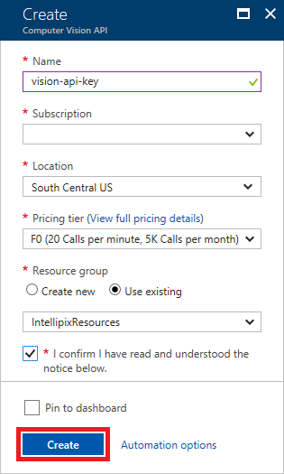
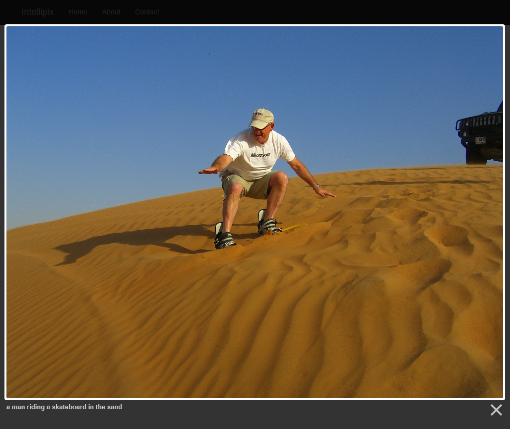

# Tutorial: Use Computer Vision to generate image metadata in Azure Storage

In this tutorial, you will learn how to integrate the Azure Computer Vision service into a web app to generate metadata for images. A full app guide can be found in the [Azure Storage and Cognitive Services Lab](https://github.com/Microsoft/computerscience/blob/master/Labs/Azure%20Services/Azure%20Storage/Azure%20Storage%20and%20Cognitive%20Services%20(MVC).md) on GitHub, and this tutorial essentially covers Step 5 of the lab. You may wish to create an end-to-end application by following every step, but if you'd just like to see how Computer Vision can be integrated into an existing web app, read along here.

This tutorial shows you how to:

> [!div class="checklist"]
> * Create a Computer Vision resource in Azure
> * Do image analysis on Azure Storage images
> * Attach metadata to Azure Storage images
> * Verify image metadata by using Azure Storage Explorer

If you don't have an Azure subscription, create a [free account](https://azure.microsoft.com/free/) before you begin. 

## Prerequisites

- Any edition of [Visual Studio 2015 or 2017](https://www.visualstudio.com/downloads/).
- An Azure storage account (follow [Exercises 1 and 2 of the Azure Storage Lab](https://github.com/Microsoft/computerscience/blob/master/Labs/Azure%20Services/Azure%20Storage/Azure%20Storage%20and%20Cognitive%20Services%20(MVC).md#Exercise1) if you need help with this step)
- An ASP.NET MVC web application with access to Azure Storage (follow [Exercise 3 of the Azure Storage Lab](https://github.com/Microsoft/computerscience/blob/master/Labs/Azure%20Services/Azure%20Storage/Azure%20Storage%20and%20Cognitive%20Services%20(MVC).md#Exercise3) to create such an app quickly).
- (optional) A


## Create a Computer Vision resource

Sign in to the [Azure portal](https://ms.portal.azure.com). Then click **+ Create a resource**, followed by **AI + Machine Learning** and **Computer Vision**.


Enter "vision-api-key" in the **Name** box and select **F0** as the **Pricing tier**. Select the same **Location** that you selected for the Azure Storage account. Under **Resource group**, select **Use existing** and select the same resource group as well. Check the **I confirm** box, and then click **Create**.



Return to the menu for your resource group and click the Computer Vision API subscription that you just created. Copy the URL under **Endpoint** to somewhere you can easily retrieve it in a moment. Then click **Show access keys**.


Copy the value of **KEY 1**


In the next exercise, you'll put the extra keywords to work by adding search to the app.

## Add Computer Vision credentials

You will store this data in metadata attached to each blob in the "photos" container.

Next, you will go to your app and add code that leverages the Computer Vision service to generate captions and search tags (keywords) for an image.


Open your ASP.NET web application in Visual Studio and navigate to the **Web.config** file at the root of the project. Add the following statements to the `<appSettings>` section of the file, replacing `VISION_KEY` with the key you copied in the previous step, and `VISION_ENDPOINT` with the URL you saved in the step before that:

```xml
<add key="SubscriptionKey" value="VISION_KEY" />
<add key="VisionEndpoint" value="VISION_ENDPOINT" />
```

If the endpoint URL you just added to **Web.config** doesn't end with "/vision/v1.0", add it. The complete URL should look something like this: https://eastus.api.cognitive.microsoft.com/vision/v1.0.

In Solution Explorer, right-click the project and use the **Manage NuGet Packages...** command to install the package **Microsoft.ProjectOxford.Vision**. This package contains types for calling the Computer Vision API. As usual, approve any changes and licenses that are presented to you.

    

## Add metadata generation code

Next, you will add the code that actually leverages the Computer Vision service. Depending on your web app, you may need to edit existing methods or create new methods. What's important is that at this point you have an ASP.NET web app that can upload images to Azure Storage, read those images, and display them in the view.

Open the file that contains the methods for uploading images to Azure Storage. In the lab, this is the *HomeController.cs* file in the project's **Controllers** folder. Add the following `using` statement at the top of the file:

```csharp
using Microsoft.ProjectOxford.Vision;
```

Then, go to the **Upload** (or whichever method uploads images), and add the following statements immediately after the block of code that begins with the comment "Generate a thumbnail and save it in the thumbnails container." This code passes the URL of the blob containing the image that was uploaded to the Computer Vision API, and requests that Computer Vision generate a description for the image. In addition to generating a description, the Computer Vision API also generates a list of keywords describing what it sees in the image. Your code stores the computer-generated description and the keywords in the blob's metadata so they can be retrieved later on.

```csharp
// Submit the image to Azure's Computer Vision API
VisionServiceClient vision = new VisionServiceClient(
    ConfigurationManager.AppSettings["SubscriptionKey"],
    ConfigurationManager.AppSettings["VisionEndpoint"]
);

VisualFeature[] features = new VisualFeature[] { VisualFeature.Description };
var result = await vision.AnalyzeImageAsync(photo.Uri.ToString(), features);

// Record the image description and tags in blob metadata
photo.Metadata.Add("Caption", result.Description.Captions[0].Text);

for (int i = 0; i < result.Description.Tags.Length; i++)
{
    string key = String.Format("Tag{0}", i);
    photo.Metadata.Add(key, result.Description.Tags[i]);
}

await photo.SetMetadataAsync();
```

Then go to the **Index** method in the same file (or whichever method you use to enumerate the images in Azure Storage and pass them to the view). Replace the `foreach` block in that method with the following code. TBD

```csharp
foreach (IListBlobItem item in container.ListBlobs())
{
    var blob = item as CloudBlockBlob;

    if (blob != null)
    {
        blob.FetchAttributes(); // Get blob metadata
        var caption = blob.Metadata.ContainsKey("Caption") ? blob.Metadata["Caption"] : blob.Name;

        blobs.Add(new BlobInfo()
        {
            ImageUri = blob.Uri.ToString(),
            ThumbnailUri = blob.Uri.ToString().Replace("/photos/", "/thumbnails/"),
            Caption = caption
        });
    }
}
```

The modified `foreach` block calls [CloudBlockBlob.FetchAttributes](https://msdn.microsoft.com/library/microsoft.windowsazure.storage.blob.cloudblockblob.fetchattributes(v=azure.10).aspx) to fetch the metadata for the blob. Then it extracts the computer-generated description from the metadata and adds it to the ```BlobInfo``` object passed to the view.

## Test the app

Use lightbox to ...

View an image's properties to see the attached caption and search tags.

1.  Save your changes and press **Ctrl+F5** to launch the application in your browser. Upload a few images from the "photos" folder in the lab resources.

1. Hover the cursor over one of the thumbnails. Confirm that a tooltip window appears containing the computer-generated caption for the image.


1. Click one of the thumbnails to display the original image in a lightbox. Confirm that the computer-generated caption appears at the bottom of the lightbox. Then dismiss the lightbox.




1. Want to see where the metadata generated by the Computer Vision API is stored? Use the Azure Storage Explorer to open the "photos" container. Right-click any of the blobs in the container and select **Properties**. In the ensuing dialog, you'll see the metadata attached to the blob. Each metadata item is a key-value pair. The computer-generated image description is stored in the item named "Caption," while the metadata items named "Tag0," "Tag1," and so on hold the additional keywords created for the image. When you're finished, click **Cancel** to close the dialog.


## Clean up resources

If you're not going to continue to use this application, delete
<resources> with the following steps:

1. From the left-hand menu...
2. ...click Delete, type...and then click Delete

## Next steps

Advance to the next article to learn how to create...
> [!div class="nextstepaction"]
> [Next steps button](contribute-get-started-mvc.md)
