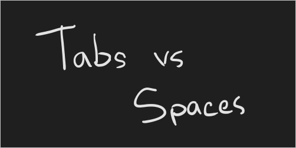

# Install and run Read containers (Preview)

Containers enable you to run the Computer Vision APIs in your own environment. Containers are great for specific security and data governance requirements. In this article you'll learn how to download, install, and run a Computer Vision container.

A single Docker container, *Read*, is available for Computer Vision. The *Read* container allows you to detect and extract *printed text* from images of various objects with different surfaces and backgrounds, such as receipts, posters, and business cards. Additionally, the *Read* container detects *handwritten text* in images and provides PDF, TIFF, and multi-page file support. For more information, see the [Read](concept-recognizing-text.md#read-api) API documentation.

If you don't have an Azure subscription, create a [free account](https://azure.microsoft.com/free/?WT.mc_id=A261C142F) before you begin.

## Prerequisites

You must meet the following prerequisites before using the containers:

|Required|Purpose|
|--|--|
|Docker Engine| You need the Docker Engine installed on a [host computer](#the-host-computer). Docker provides packages that configure the Docker environment on [macOS](https://docs.docker.com/docker-for-mac/), [Windows](https://docs.docker.com/docker-for-windows/), and [Linux](https://docs.docker.com/engine/installation/#supported-platforms). For a primer on Docker and container basics, see the [Docker overview](https://docs.docker.com/engine/docker-overview/).<br><br> Docker must be configured to allow the containers to connect with and send billing data to Azure. <br><br> **On Windows**, Docker must also be configured to support Linux containers.<br><br>|
|Familiarity with Docker | You should have a basic understanding of Docker concepts, like registries, repositories, containers, and container images, as well as knowledge of basic `docker` commands.| 
|Computer Vision resource |In order to use the container, you must have:<br><br>An Azure **Computer Vision** resource and the associated API key the endpoint URI. Both values are available on the Overview and Keys pages for the resource and are required to start the container.<br><br>**{API_KEY}**: One of the two available resource keys on the **Keys** page<br><br>**{ENDPOINT_URI}**: The endpoint as provided on the **Overview** page|

## Request access to the private container registry

Fill out and submit the [request form](https://aka.ms/cognitivegate) to request access to the container. 

[!INCLUDE [Request access to public preview](../../../includes/cognitive-services-containers-request-access.md)]

[!INCLUDE [Gathering required container parameters](../containers/includes/container-gathering-required-parameters.md)]

### The host computer

[!INCLUDE [Host Computer requirements](../../../includes/cognitive-services-containers-host-computer.md)]

### Advanced Vector Extension support

The **host** computer is the computer that runs the docker container. The host *must support* [Advanced Vector Extensions](https://en.wikipedia.org/wiki/Advanced_Vector_Extensions#CPUs_with_AVX2) (AVX2). You can check for AVX2 support on Linux hosts with the following command:

```console
grep -q avx2 /proc/cpuinfo && echo AVX2 supported || echo No AVX2 support detected
```
> [!WARNING]
> The host computer is *required* to support AVX2. The container *will not* function correctly without AVX2 support.

### Container requirements and recommendations

[!INCLUDE [Container requirements and recommendations](includes/container-requirements-and-recommendations.md)]

## Get the container image with `docker pull`

Container images for Read are available.

| Container | Container Registry / Repository / Image Name |
|-----------|------------|
| Read | `containerpreview.azurecr.io/microsoft/cognitive-services-read:latest` |

Use the [`docker pull`](https://docs.docker.com/engine/reference/commandline/pull/) command to download a container image.

### Docker pull for the Read container

```bash
docker pull containerpreview.azurecr.io/microsoft/cognitive-services-read:latest
```

[!INCLUDE [Tip for using docker list](../../../includes/cognitive-services-containers-docker-list-tip.md)]

## How to use the container

Once the container is on the [host computer](#the-host-computer), use the following process to work with the container.

1. [Run the container](#run-the-container-with-docker-run), with the required billing settings. More [examples](computer-vision-resource-container-config.md) of the `docker run` command are available. 
1. [Query the container's prediction endpoint](#query-the-containers-prediction-endpoint). 

## Run the container with `docker run`

Use the [docker run](https://docs.docker.com/engine/reference/commandline/run/) command to run the container. Refer to [gathering required parameters](#gathering-required-parameters) for details on how to get the `{ENDPOINT_URI}` and `{API_KEY}` values.

[Examples](computer-vision-resource-container-config.md#example-docker-run-commands) of the `docker run` command are available.

```bash
docker run --rm -it -p 5000:5000 --memory 16g --cpus 8 \
containerpreview.azurecr.io/microsoft/cognitive-services-read \
Eula=accept \
Billing={ENDPOINT_URI} \
ApiKey={API_KEY}
```

This command:

* Runs the Read container from the container image.
* Allocates 8 CPU core and 16 gigabytes (GB) of memory.
* Exposes TCP port 5000 and allocates a pseudo-TTY for the container.
* Automatically removes the container after it exits. The container image is still available on the host computer.

More [examples](./computer-vision-resource-container-config.md#example-docker-run-commands) of the `docker run` command are available. 

> [!IMPORTANT]
> The `Eula`, `Billing`, and `ApiKey` options must be specified to run the container; otherwise, the container won't start.  For more information, see [Billing](#billing).

[!INCLUDE [Running multiple containers on the same host](../../../includes/cognitive-services-containers-run-multiple-same-host.md)]

<!--  ## Validate container is running -->

[!INCLUDE [Container's API documentation](../../../includes/cognitive-services-containers-api-documentation.md)]

## Query the container's prediction endpoint

The container provides REST-based query prediction endpoint APIs. 

Use the host, `http://localhost:5000`, for container APIs.

### Asynchronous read

You can use the `POST /vision/v2.0/read/core/asyncBatchAnalyze` and `GET /vision/v2.0/read/operations/{operationId}` operations in concert to asynchronously read an image, similar to how the Computer Vision service uses those corresponding REST operations. The asynchronous POST method will return an `operationId` that is used as the identifer to the HTTP GET request.

From the swagger UI, select the `asyncBatchAnalyze` to expand it in the browser. Then select **Try it out** > **Choose file**. In this example, we'll use the following image:



When the asynchronous POST has run successfully, it returns an **HTTP 202** status code. As part of the response, there is an `operation-location` header that holds the result endpoint for the request.

```http
 content-length: 0
 date: Fri, 13 Sep 2019 16:23:01 GMT
 operation-location: http://localhost:5000/vision/v2.0/read/operations/a527d445-8a74-4482-8cb3-c98a65ec7ef9
 server: Kestrel
```

The `operation-location` is the fully qualified URL and is accessed via an HTTP GET. Here is the JSON response from executing the `operation-location` URL from the preceding image:

```json
{
  "status": "Succeeded",
  "recognitionResults": [
    {
      "page": 1,
      "clockwiseOrientation": 2.42,
      "width": 502,
      "height": 252,
      "unit": "pixel",
      "lines": [
        {
          "boundingBox": [ 56, 39, 317, 50, 313, 134, 53, 123 ],
          "text": "Tabs VS",
          "words": [
            {
              "boundingBox": [ 90, 43, 243, 53, 243, 123, 94, 125 ],
              "text": "Tabs",
              "confidence": "Low"
            },
            {
              "boundingBox": [ 259, 55, 313, 62, 313, 122, 259, 123 ],
              "text": "VS"
            }
          ]
        },
        {
          "boundingBox": [ 221, 148, 417, 146, 417, 206, 227, 218 ],
          "text": "Spaces",
          "words": [
            {
              "boundingBox": [ 230, 148, 416, 141, 419, 211, 232, 218 ],
              "text": "Spaces"
            }
          ]
        }
      ]
    }
  ]
}
```

### Synchronous read

You can use the `POST /vision/v2.0/read/core/Analyze` operation to synchronously read an image. When the image is read in its entirety, then and only then does the API return a JSON response. The only exception to this is if an error occurs. When an error occurs the following JSON is returned:

```json
{
    status: "Failed"
}
```

The JSON response object has the same object graph as the asynchronous version. If you're a JavaScript user and want type safety, the following types could be used to cast the JSON response as an `AnalyzeResult` object.

```typescript
export interface AnalyzeResult {
    status: Status;
    recognitionResults?: RecognitionResult[] | null;
}

export enum Status {
    NotStarted = 0,
    Running = 1,
    Failed = 2,
    Succeeded = 3
}

export enum Unit {
    Pixel = 0,
    Inch = 1
}

export interface RecognitionResult {
    page?: number | null;
    clockwiseOrientation?: number | null;
    width?: number | null;
    height?: number | null;
    unit?: Unit | null;
    lines?: Line[] | null;
}

export interface Line {
    boundingBox?: number[] | null;
    text: string;
    words?: Word[] | null;
}

export enum Confidence {
    High = 0,
    Low = 1
}

export interface Word {
  boundingBox?: number[] | null;
  text: string;
  confidence?: Confidence | null;
}
```

For an example use-case, see the <a href="https://aka.ms/ts-read-api-types" target="_blank" rel="noopener noreferrer">TypeScript sandbox here <span class="docon docon-navigate-external x-hidden-focus"></span></a> and select **Run** to visualize its ease-of-use.

## Stop the container

[!INCLUDE [How to stop the container](../../../includes/cognitive-services-containers-stop.md)]

## Troubleshooting

If you run the container with an output [mount](./computer-vision-resource-container-config.md#mount-settings) and logging enabled, the container generates log files that are helpful to troubleshoot issues that happen while starting or running the container.

[!INCLUDE [Cognitive Services FAQ note](../containers/includes/cognitive-services-faq-note.md)]

## Billing

The Cognitive Services containers send billing information to Azure, using the corresponding resource on your Azure account.

[!INCLUDE [Container's Billing Settings](../../../includes/cognitive-services-containers-how-to-billing-info.md)]

For more information about these options, see [Configure containers](./computer-vision-resource-container-config.md).

<!--blogs/samples/video course -->

[!INCLUDE [Discoverability of more container information](../../../includes/cognitive-services-containers-discoverability.md)]

## Summary

In this article, you learned concepts and workflow for downloading, installing, and running Computer Vision containers. In summary:

* Computer Vision provides a Linux container for Docker, encapsulating Read.
* Container images are downloaded from the "Container Preview" container registry in Azure.
* Container images run in Docker.
* You can use either the REST API or SDK to call operations in Read containers by specifying the host URI of the container.
* You must specify billing information when instantiating a container.

> [!IMPORTANT]
> Cognitive Services containers are not licensed to run without being connected to Azure for metering. Customers need to enable the containers to communicate billing information with the metering service at all times. Cognitive Services containers do not send customer data (for example, the image or text that is being analyzed) to Microsoft.

## Next steps

* Review [Configure containers](computer-vision-resource-container-config.md) for configuration settings
* Review [Computer Vision overview](Home.md) to learn more about recognizing printed and handwritten text
* Refer to the [Computer Vision API](//westus.dev.cognitive.microsoft.com/docs/services/5adf991815e1060e6355ad44/operations/56f91f2e778daf14a499e1fa) for details about the methods supported by the container.
* Refer to [Frequently asked questions (FAQ)](FAQ.md) to resolve issues related to Computer Vision functionality.
* Use more [Cognitive Services Containers](../cognitive-services-container-support.md)
