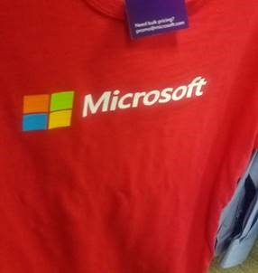

# Detect popular brands in images

Brand detection is a specialized mode of [object detection](concept-object-detection.md) that uses a database of thousands of global logos to identify commercial brands in images or video. You can use this feature, for example, to discover which brands are most popular on social media or most prevalent in media product placement.

The Computer Vision service detects whether there are brand logos in a given image; if so, it returns the brand name, a confidence score, and the coordinates of a bounding box around the logo.

The built-in logo database covers popular brands in consumer electronics, clothing, and more. If you find that the brand you're looking for is not detected by the Computer Vision service, you may be better served creating and training your own logo detector using the [Custom Vision](https://docs.microsoft.com/azure/cognitive-services/Custom-Vision-Service/) service.

## Brand detection example

The following JSON responses illustrate what Computer Vision returns when detecting brands in the example images.



```json
"brands":[  
   {  
      "name":"Microsoft",
      "rectangle":{  
         "x":20,
         "y":97,
         "w":62,
         "h":52
      }
   }
]
```

In some cases, the brand detector will pick up both the logo image and the stylized brand name as two separate logos.


```json
"brands":[  
   {  
      "name":"Microsoft",
      "rectangle":{  
         "x":58,
         "y":106,
         "w":55,
         "h":46
      }
   },
   {  
      "name":"Microsoft",
      "rectangle":{  
         "x":58,
         "y":86,
         "w":202,
         "h":63
      }
   }
]
```

## Use the API

The brand detection feature is part of the [Analyze Image](https://westcentralus.dev.cognitive.microsoft.com/docs/services/5adf991815e1060e6355ad44/operations/56f91f2e778daf14a499e1fa) API. You can call this API through a native SDK or through REST calls. Include `Brands` in the **visualFeatures** query parameter. Then, when you get the full JSON response, simply parse the string for the contents of the `"brands"` section.

* [Quickstart: Computer Vision .NET SDK](./quickstarts-sdk/client-library.md?pivots=programming-language-csharp)
* [Quickstart: Analyze an image (REST API)](./quickstarts/csharp-analyze.md)
