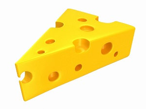
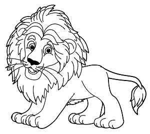

# Detecting image types

Computer Vision can analyze the content type of images by indicating whether an image is clip art, rating the likelihood on a scale, or a line drawing.

## Detecting clip art

Computer Vision analyzes an image and rates the likelihood of the image being clip art on a scale of 0 to 3, as described in the following table.

| Value | Meaning |
|-------|---------|
| 0 | Non-clip-art |
| 1 | Ambiguous |
| 2 | Normal-clip-art |
| 3 | Good-clip-art |

### Clip art detection examples

The following JSON responses illustrates what Computer Vision returns when rating the likelihood of the example images being clip art.



```json
{
    "imageType": {
        "clipArtType": 3,
        "lineDrawingType": 0
    },
    "requestId": "88c48d8c-80f3-449f-878f-6947f3b35a27",
    "metadata": {
        "height": 225,
        "width": 300,
        "format": "Jpeg"
    }
}
```


```json
{
    "imageType": {
        "clipArtType": 0,
        "lineDrawingType": 0
    },
    "requestId": "a9c8490a-2740-4e04-923b-e8f4830d0e47",
    "metadata": {
        "height": 200,
        "width": 300,
        "format": "Jpeg"
    }
}
```

## Detecting line drawings

Computer Vision analyzes an image and returns a boolean value indicating whether the image is a line drawing.

### Line drawing detection examples

The following JSON responses illustrates what Computer Vision returns when indicating whether the example images are line drawings.



```json
{
    "imageType": {
        "clipArtType": 2,
        "lineDrawingType": 1
    },
    "requestId": "6442dc22-476a-41c4-aa3d-9ceb15172f01",
    "metadata": {
        "height": 268,
        "width": 300,
        "format": "Jpeg"
    }
}
```


```json
{
    "imageType": {
        "clipArtType": 0,
        "lineDrawingType": 0
    },
    "requestId": "98437d65-1b05-4ab7-b439-7098b5dfdcbf",
    "metadata": {
        "height": 200,
        "width": 300,
        "format": "Jpeg"
    }
}
```

## Next steps

Learn concepts about [tagging images](concept-tagging-images.md) and [categorizing images](concept-categorizing-images.md).