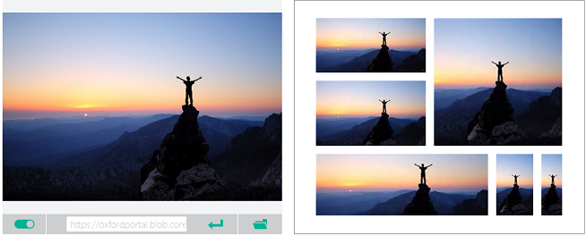

# Generating smart-cropped thumbnails with Computer Vision

A thumbnail is a reduced-size representation of an image. Thumbnails are used to represent images and other data in a more economical, layout-friendly way. The Computer Vision API uses smart cropping, together with resizing the image, to create intuitive thumbnails for a given image.

The Computer Vision thumbnail generation algorithm works as follows:

1. Remove distracting elements from the image and identify the _area of interest_&mdash;the area of the image in which the main object(s) appears.
1. Crop the image based on the identified _area of interest_.
1. Change the aspect ratio to fit the target thumbnail dimensions.

## Area of interest

When you upload an image, the Computer Vision API analyzes it to determine the *area of interest*. It can then use this region to determine how to crop the image. The cropping operation, however, will always match the desired aspect ratio if one is specified.

You can also get the raw bounding box coordinates of this same *area of interest* by calling the **areaOfInterest** API instead. You can then use this information to modify the original image however you wish.

## Examples

The generated thumbnail can vary widely depending on what you specify for height, width, and smart cropping, as shown in the following image.

The following table illustrates typical thumbnails generated by Computer Vision for the example images. The thumbnails were generated for a specified target height and width of 50 pixels, with smart cropping enabled.

| Image | Thumbnail |
|-------|-----------|
| |  |
| |  |
| |  |

## Next steps

Learn about [tagging images](concept-tagging-images.md) and [categorizing images](concept-categorizing-images.md).
