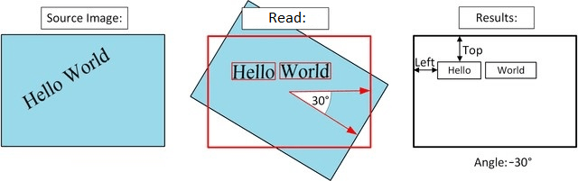
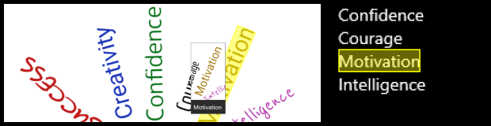
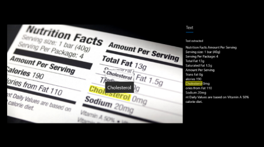
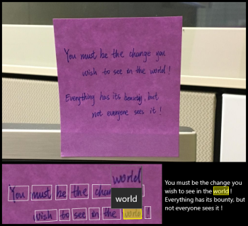
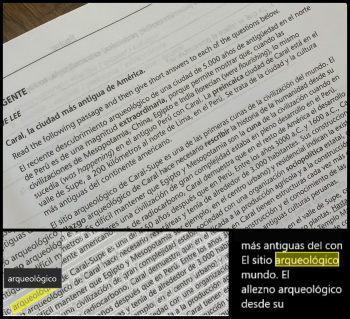
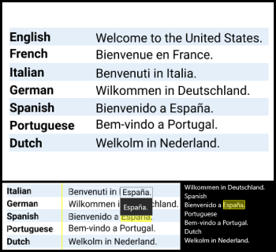

# Read text from images and documents

Computer Vision includes new deep-learning-based Optical Character Recognition (OCR) capabilities that extract printed or handwritten text from images and PDF documents. Computer Vision extracts text from both analog documents (images, scanned documents) and digitized documents. You can extract text from images in the wild, such as photos of license plates or containers with serial numbers, as well as from documents - invoices, bills, financial reports, articles, and more. This OCR functionality is available as part of the managed service in the cloud or on premises (containers). Also, it supports virtual networks and private endpoints to meet your enterprise grade compliance and privacy needs.

## Read API 

Computer Vision’s [Read API](https://westcentralus.dev.cognitive.microsoft.com/docs/services/computer-vision-v3-ga/operations/5d986960601faab4bf452005) is Microsoft’s latest OCR technology that extracts printed text (seven languages), handwritten text (English only), digits, and currency symbols from images and multi-page PDF documents. It's optimized to extract text from in-the-wild text-heavy images and multi-page PDF documents with mixed languages. It supports detecting printed and handwritten text (English only) in the same image or document. The full list of supported languages can be found on the [Language support for Computer Vision](https://docs.microsoft.com/azure/cognitive-services/computer-vision/language-support#text-recognition) page.

### How it works

The [Read API](https://westcentralus.dev.cognitive.microsoft.com/docs/services/computer-vision-v3-ga/operations/5d986960601faab4bf452005) supports text-heavy documents up to 2000 pages, and therefore executes asynchronously. The first step is to call the Read operation. The Read operation takes an image or PDF document as the input and returns an operation ID. 

The second step is to call the [Get Results](https://westcentralus.dev.cognitive.microsoft.com/docs/services/computer-vision-v3-ga/operations/5d9869604be85dee480c8750) operation. This operation takes in the operation ID that was created by the Read operation. It then returns the extracted text content from your image or document in the form of JSON. The JSON response maintains the original line groupings of recognized words. It includes the extracted text lines and their bounding box coordinates. Each text line includes all extracted words with their coordinates and a confidence scores.

If necessary, Read corrects the rotation of the recognized page by returning the rotational offset in degrees about the horizontal image axis, as seen in the following illustration.

Follow the [Extract printed and handwritten text](./QuickStarts/CSharp-hand-text.md) quickstart to implement OCR using C# and the REST API.

### Input requirements

The Read API takes the following inputs:
* Supported file formats: JPEG, PNG, BMP, PDF, and TIFF
* For PDF AND TIFF, up to 2000 pages are processed. For free tier subscribers, only the first two pages are processed.
* The file size must be less than 50 MB and dimensions at least 50 x 50 pixels and at most 10000 x 10000 pixels.
* The PDF dimensions must be at most 17 x 17 inches, corresponding to legal or A3 paper sizes and smaller.

### Text from images

The following Read API output shows the extracted text lines and words from an image with text at different angles, colors, and fonts

### Text from documents

In addition to images, the Read API takes a PDF document as input.

### Handwritten text in English

Right now, the Read operation supports extracting handwritten text exclusively in English.

### Printed text in supported languages

The Read API supports extracting printed text in English, Spanish, German, French, Italian, Portuguese, and Dutch languages. If your scenario requires supporting more languages, see the OCR API overview in this document. Refer to the list of all [supported languages](https://docs.microsoft.com/azure/cognitive-services/computer-vision/language-support#text-recognition)

### Mixed languages support

The Read API supports images and documents with multiple languages in them, commonly known as mixed language documents. It does so by classifying each text line in the document into the detected language before extracting the text contents.

### Data privacy and security

As with all the cognitive services, developers using the Read service should be aware of Microsoft policies on customer data. See the Cognitive Services page on the [Microsoft Trust Center](https://www.microsoft.com/en-us/trust-center/product-overview) to learn more.

### Deploy on-premises

Read is also available as a Docker container (preview) to enable you to deploy the new OCR capabilities in your own environment. Containers are great for specific security and data governance requirements. See [how to install and run Read containers.](https://docs.microsoft.com/azure/cognitive-services/computer-vision/computer-vision-how-to-install-containers)

## OCR API

The [OCR API](https://westus.dev.cognitive.microsoft.com/docs/services/5adf991815e1060e6355ad44/operations/56f91f2e778daf14a499e1fc) uses an older recognition model, supports only images, and executes synchronously, returning immediately with the detected text. It supports [more languages](https://docs.microsoft.com/azure/cognitive-services/computer-vision/language-support#text-recognition) than Read API.

## Next steps

- Learn about the [Read 3.0 REST API](https://westcentralus.dev.cognitive.microsoft.com/docs/services/computer-vision-v3-ga/operations/5d986960601faab4bf452005).
- Follow the [Extract text](./QuickStarts/CSharp-hand-text.md) quickstart to implement OCR using C#, Java, JavaScript, or Python along with REST API.
