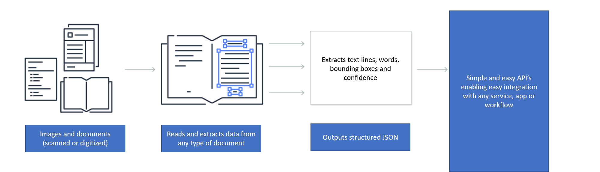

# Read text from images and documents

Computer Vision includes new deep learning based Optical Character Recognition (OCR) capabilities that extract printed or handwritten text from images and PDF documents. Computer Vision extract text from analog (images, scanned documents) and digitized document. Computer Vision API enables you to extract text from images in the wild such as photos of cars with license plates, containers with serial numbers and also from document - invoices, bills, financial reports, articles and lots more. Computer Vision is available as a managed service in the cloud or on premise (containers) and supports also virtual networks and private endpoints to meet your enterprise grade compliance and privacy needs. Computer vision also supports the ability to analyze images for insight to learn more check [here.](https://docs.microsoft.com/en-us/azure/cognitive-services/computer-vision/home#analyze-images-for-insight)

## Read API 

Computer Vision’s Read API is Microsoft’s latest OCR technology that extracts printed text, handwritten text (English only), digits, and currency symbols from images and PDF documents. It's optimized to extract text from images in-the-wild, images with visual noise, PDF documents that are either digital or scanned, and text heavy images. It supports printed and handwritten text (English), and mixed languages in the same image or document. The full list of supported languages can be found [here.](https://docs.microsoft.com/en-us/azure/cognitive-services/computer-vision/language-support#text-recognition)

### How it works

The [Read API](https://westcentralus.dev.cognitive.microsoft.com/docs/services/computer-vision-v3-ga/operations/5d986960601faab4bf452005) is asynchronous. The first step is to call the Read operation. The Read operation takes an image or PDF document as the input and returns an operation Id. 

The second step is to call the [Get Results](https://westcentralus.dev.cognitive.microsoft.com/docs/services/computer-vision-v3-ga/operations/5d9869604be85dee480c8750) operation to get the extracted text content from your image or document. The JSON response maintains the original line groupings of recognized words. It includes the extracted text lines and their bounding box coordinates. Each text line includes all extracted words with their coordinates and a confidence scores.

Follow the [Extract printed and handwritten text](./QuickStarts/CSharp-hand-text.md) quickstart to implement OCR using C# and the REST API.

### Input requirements

The Read API takes the following inputs:
* Supported file formats: JPEG, PNG, BMP, PDF, and TIFF
* For PDF AND TIFF, up to 2000 pages are processed. For free tier subscribers, only the first two pages are processed.
* The image file size must be less than 50 MB and dimensions at least 50 x 50 pixels and at most 10000 x 10000 pixels.
* The PDF dimensions must be at most 17 x 17 inches, corresponding to legal or A3 paper sizes and smaller.

### Text from images

The following Read API output shows the extracted text lines and words from an image with text at different angles, colors, and fonts

### Text from documents

In addition to images, the Read API takes a PDF document as input. The following example shows text extracted from a document. 

### Handwritten text in English

The Read operation supports extracting handwritten text in English only.

### Printed text and supported languages

The Read API supports extracting printed text in English, Spanish, German, French, Italian, Portuguese, and Dutch languages. If your scenario requires supporting more languages, see the OCR API overview in this document. Refer to the list of all [supported languages](https://docs.microsoft.com/en-us/azure/cognitive-services/computer-vision/language-support#text-recognition). The following image shows extracted Spanish text from the Read API. 

### Mixed languages in an image or document

The Read OCR technology supports extracting text from images and documents with mixed languages. It does so by classifying each text line in the document before extracting the text contents.

### Data privacy and security

As with all the cognitive services, developers using the Read service should be aware of Microsoft policies on customer data. See the Cognitive Services page on the [Microsoft Trust Center](https://www.microsoft.com/en-us/trust-center/product-overview) to learn more.

### Use the cloud API

If you are using a free-tier subscription, the Read API will only process the first two pages of a PDF or TIFF document. With a paid subscription, it will process up to 2000 pages.

### Deploy on-premises

Read is also available as a Docker container (preview) to enable you to deploy the new OCR capabilities in your own environment. Containers are great for specific security and data governance requirements. See [how to install and run Read containers.](https://docs.microsoft.com/en-us/azure/cognitive-services/computer-vision/computer-vision-how-to-install-containers)

## OCR API

The [OCR API](https://westus.dev.cognitive.microsoft.com/docs/services/5adf991815e1060e6355ad44/operations/56f91f2e778daf14a499e1fc) uses an older recognition model. It supports single images only, not PDFs, and returns an immediate response. It supports [more languages](https://docs.microsoft.com/en-us/azure/cognitive-services/computer-vision/language-support#text-recognition) than Read API.

## Next steps

- Learn about the [Read 3.0 REST API](https://westcentralus.dev.cognitive.microsoft.com/docs/services/computer-vision-v3-ga/operations/5d986960601faab4bf452005).
- Follow the [Extract printed and handwritten text](./QuickStarts/CSharp-hand-text.md) quickstart to implement OCR using C#, Java, Javascript, or Python along with REST API.
- Follow the [Computer Vision client library QuickStart](https://docs.microsoft.com/en-us/azure/cognitive-services/computer-vision/quickstarts-sdk/client-library?pivots=programming-language-csharp) to see how to integrate the Read API along with other Microsoft computer vision services into an application.
