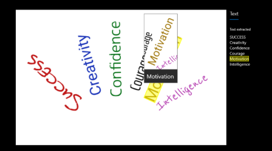
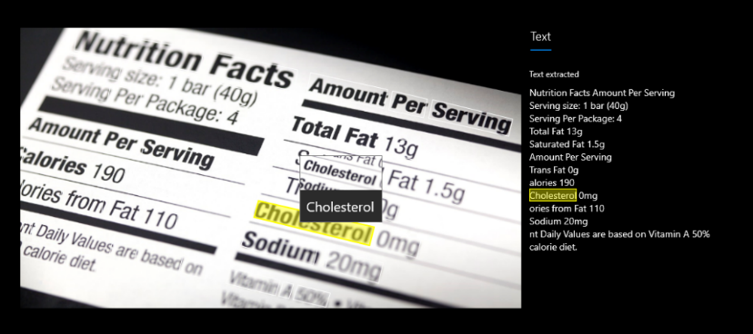
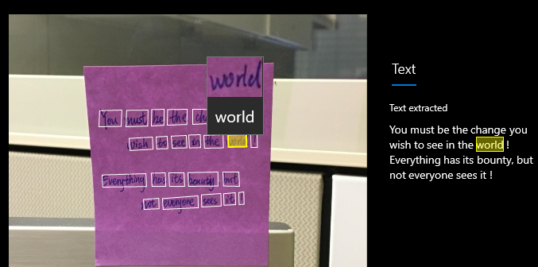
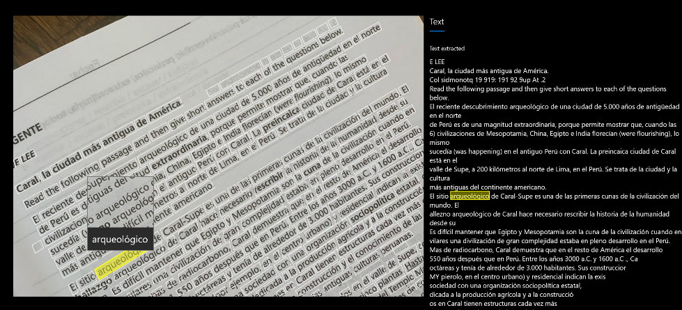
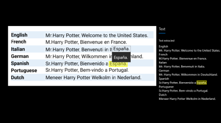

# OCR for printed and handwritten text

Computer Vision includes new deep learning based Optical Character Recognition (OCR) capabilities that extract printed or handwritten text from images and PDF documents. This is useful in a variety of scenarios such as note taking, medical records, security, and banking. The OCR APIs do not store and use your data for improving the models. In addition, Microsoft offers more options such as virtual networks and containers to help meet your compliance and privacy needs.

## Read API 

Computer Vision’s Read API is Microsoft’s latest OCR technology that extracts text from images and PDF documents. It's optimized for images with visual noise and text-heavy images such as PDF documents that are either digital or scanned. It supports printed and handwritten text (English) and mixed languages in the same image or document. 

### How it works

The Read API is asynchronous. The first step is to call the Read operation. The Read operation takes an image or PDF document as the input and returns an operation Id. 

The second step is to call the Get Results operation to get the extracted text content from your image or document. The JSON response maintains the original line groupings of recognized words. It includes the extracted text lines and their bounding box coordinates. Each text line includes all extracted words with their coordinates and a confidence scores.

### Input Limitations

The Read API takes the following inputs:
* Supported file formats: JPEG, PNG, BMP, PDF, and TIFF.
* For PDF AND TIFF, up to 2000 pages are processed (For free tier subscribers, only the first two pages are processed).
* The image file size must be less than 50 MB and dimensions at least 50 x 50 pixels and at most 10000 x 10000 pixels.
* The PDF dimensions must be at most 17 x 17 inches, corresponding to legal or A3 paper sizes and smaller.

### Text from images 

The following Read API output shows the extracted text lines and words from an image with text at different angles, colors, and fonts

### Text from documents

In addition to images, the Read API takes a PDF document as input. The following example shows text extracted from a document. 

### Handwritten text

The Read operation supports handwritten text in English language. It detects and extracts both print and handwritten text in any document.

### Supported languages

The Read API supports extracting printed text in English, Spanish, German, French, Italian, Portuguese, and Dutch languages. If your scenario requires supporting more languages, see the OCR API overview. The following image shows extracted Spanish text from the Read API. 

### Mixed languages

The Read OCR technology supports documents with mixed languages. It does so by automatically classifying each text line in the document with the dominant language. Therefore, it does not need a language identifier as an input parameter.

### Use the cloud API

If you are using a free-tier subscription, the Read API will only process the first two pages of a PDF or TIFF document. With a paid subscription, it will process up to 2000 pages. Also note that the API will detect a maximum of 300 lines per page.

### Deploy on-premises

Read is also available as a Docker container (preview) to enable you to deploy the new OCR capabilities in your own environment. Containers are great for specific security and data governance requirements. See [how to install and run Read containers.](https://docs.microsoft.com/en-us/azure/cognitive-services/computer-vision/computer-vision-how-to-install-containers)

## OCR API

The [OCR API](https://westus.dev.cognitive.microsoft.com/docs/services/5adf991815e1060e6355ad44/operations/56f91f2e778daf14a499e1fc) uses an older recognition model. It supports single images only, not PDFs, and returns an immediate response. It supports [more languages](https://docs.microsoft.com/en-us/azure/cognitive-services/computer-vision/language-support#text-recognition) than Read API.

## Next steps

Follow the [Extract printed and handwritten text](./QuickStarts/CSharp-hand-text.md) QuickStart to implement OCR using C# and the REST API.
