# Create a custom Image Analysis model

Image Analysis 4.0 allows you to train a custom model using your own training images and labels. By manually labeling your images, you can train a model to apply custom tags to images (image classification) or detect custom objects (object detection).

This guide shows you how to create and train a custom model, noting the few differences between classification and detection.

## Prerequisites

* Azure subscription - [Create one for free](https://azure.microsoft.com/free/cognitive-services)
* Once you have your Azure subscription, <a href="https://portal.azure.com/#create/Microsoft.CognitiveServicesComputerVision"  title="Create a Computer Vision resource"  target="_blank">create a Computer Vision resource </a> in the Azure portal to get your key and endpoint. After it deploys, select **Go to resource**.


## Starting the model customization flow

Begin by going to [Vision Studio](https://portal.vision.cognitive.azure.com/) and selecting the **Image analysis** tab. Then select either the **Extract common tags from images** tile or the **Detect common objects in images** tile, depending on whether you want to train an image classification model or object detection model. This guide will demonstrate a custom image classification model. 

The **Choose the model you want to try out** drop-down lets you select the Pretrained Vision model (ordinary Image Analysis) or a custom trained model. Since you don't have a custom model yet, select **Train a custom model**.

## Training your own custom model

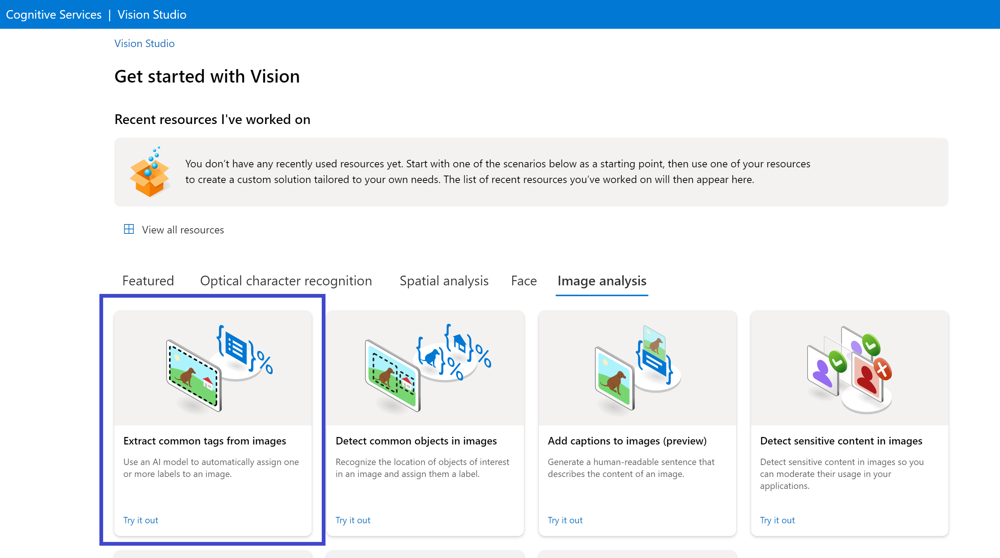

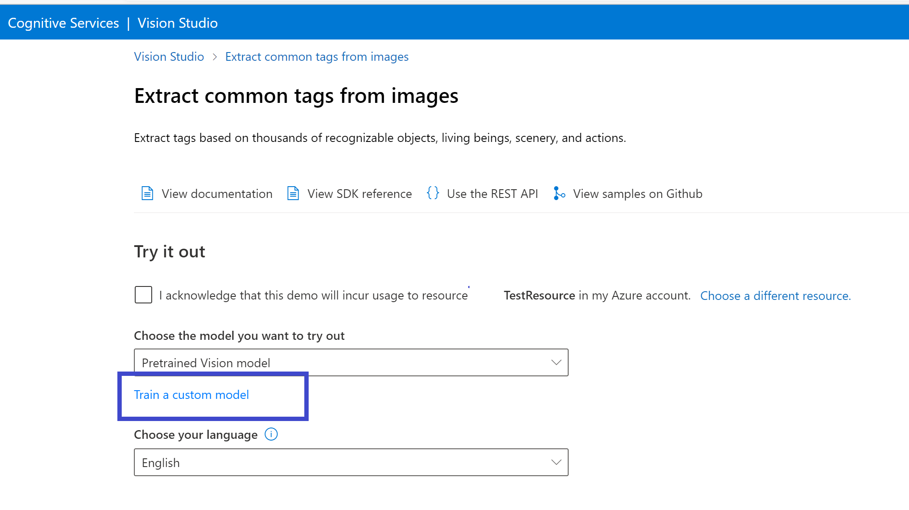

## Upload images to blob storage

If you don't have a storage account, learn how to create one [here](/azure/storage/common/storage-account-create?tabs=azure-portal).

## Adding a dataset from blob storage account

To train a custom model, you need to create a _dataset_ where you provide images with labels as training data. Select the **Datasets** tab to view your datasets.

To create a new dataset, select **add new dataset**. Enter a name and select a dataset type: If you'd like to do image classification, select `Multi-class image classification`. If you'd like to do object detection, select `Object detection`.

Then, select the container from the Azure Blob Storage account where you've stored the training images. Check the box to allow Vision Studio to read and write to the blob storage container. This is a necessary step to import labeled data. Create the dataset.


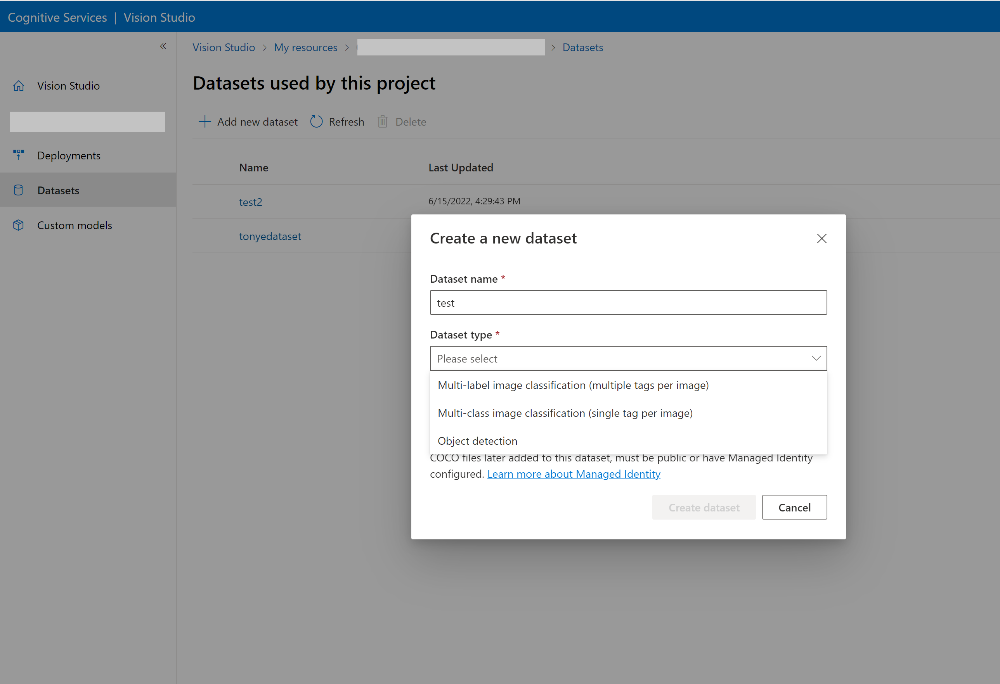


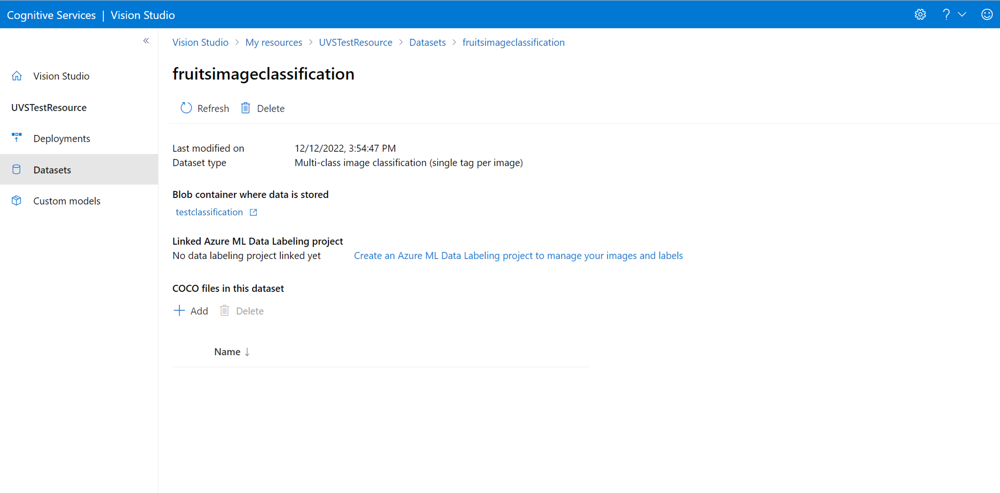

## Link the Dataset to an AML labeling project

You need a COCO file to convey the labeling information. 

To label the images in the dataset, you may link your dataset to an Azure Machine Learning labeling project. In the dataset details page, select **Add a new Data Labeling project**. This will open a new Azure portal tab where you can create the AML project.

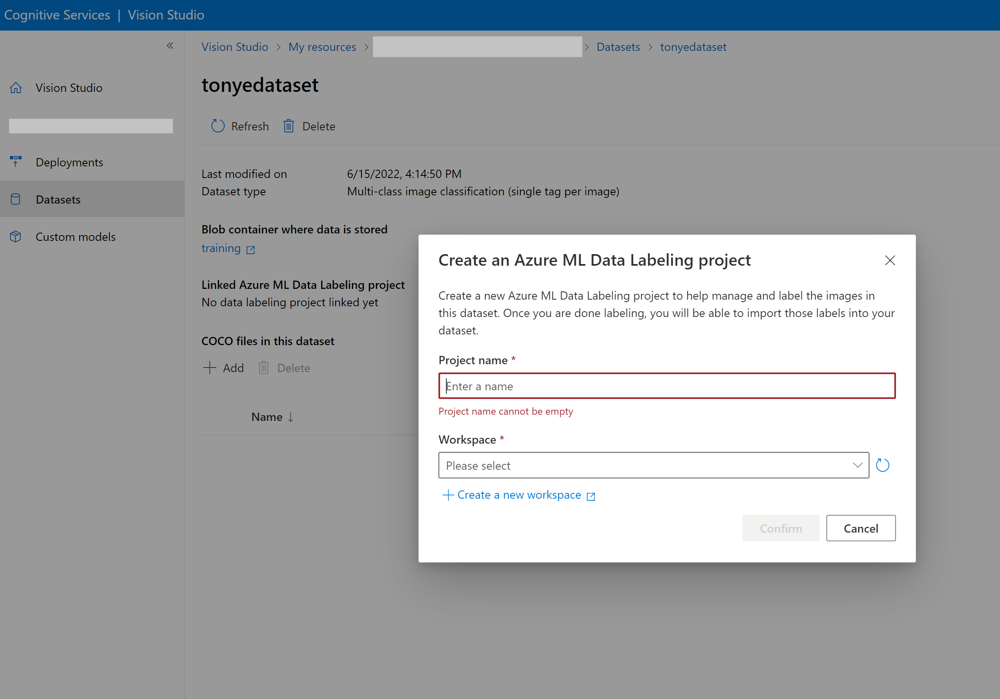

In the Vision studio tab, select the AML project you just create. The AML portal will open in a new browser tab. 

### Create labels

To start, follow the **Please add label classes** prompt to add label classes.

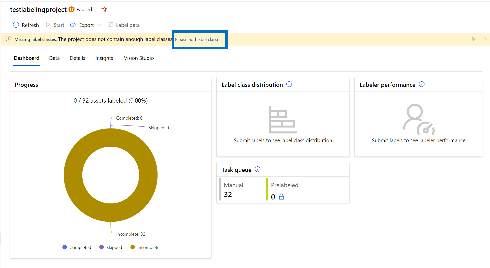

Once all label classes are added, save the labels, select **start** on the project, and select `Label data`.

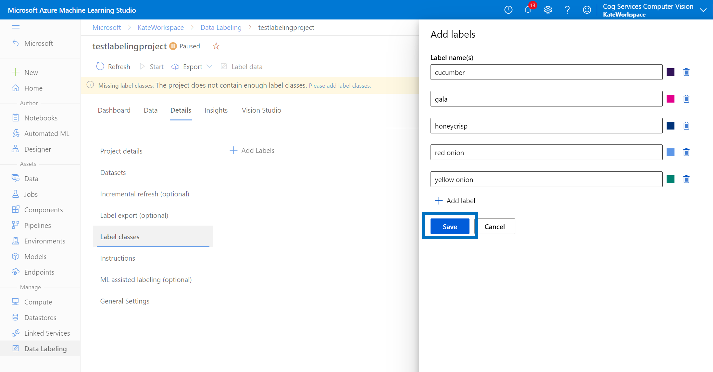
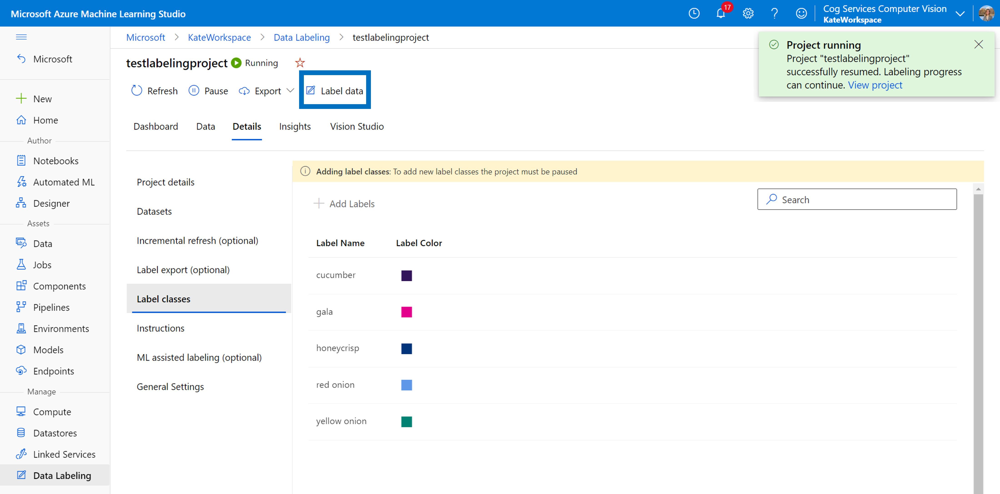

### Manually label training data

Choose `Start labeling` and follow the prompts to complete labeling of all data. When you're finished, return to the "Vision Studio" tab in your browser. You should now be able to import a COCO file. Select the one you just created.

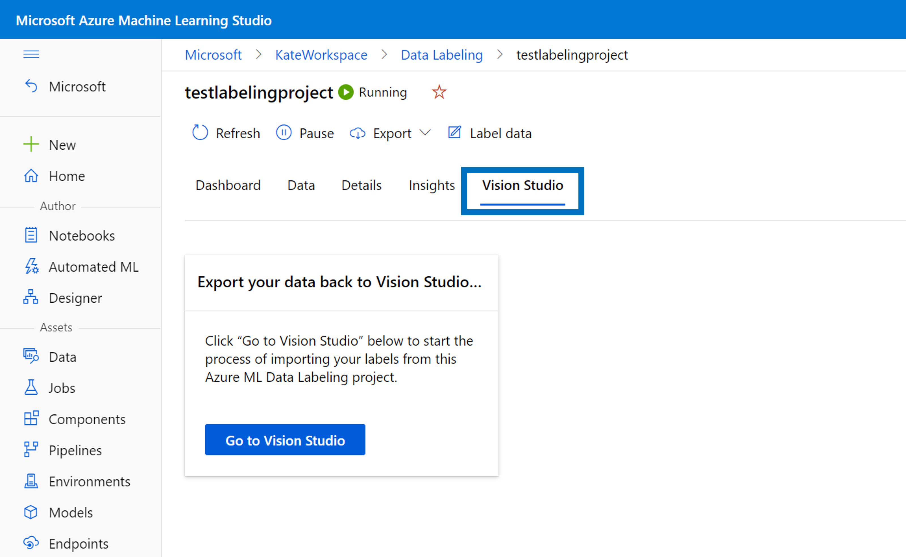

> [!NOTE]
> ## Import COCO files
>
> To import a COCO file, go to the dataset tab and click `Add COCO files to this datset`. You can choose to add a specific COCO file from a Blob storage account or to import from the COCO file from the AML labeling project that you used to label the images in the dataset. Once the COCO file is imported into the dataset, the dataset can be used for training a model.
>
> 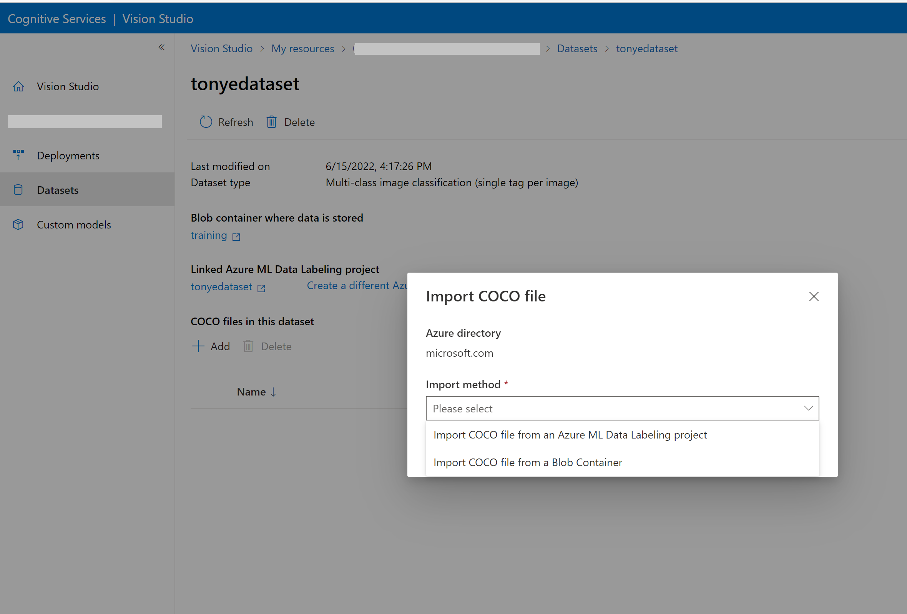
>
> ### About COCO file
>
> In order to train your custom model, you must have a COCO file that contains information about your training data and all of its labels. COCO file is a JSON file with specific fields - `images`, `annotations`, `categories` - that are mandatory for identifying and reading in the individual training data images. Your COCO file will have to look something like this:
>
> ```json
> {
>  "images": [
>    {
>      "id": 1,
>      "width": 500,
>      "height": 828,
>      "file_name": "0.jpg",
>      "absolute_url": "https://ginablobstorage1.blob.core.windows.net/cpgcontainer/0.jpg"
>    },
>     {
>       "id": 2,
>       "width": 754,
>       "height": 832,
>       "file_name": "1.jpg",
>       "absolute_url": "https://ginablobstorage1.blob.core.windows.net/cpgcontainer/1.jpg"
>     },
> 
>    ...
> 
>   ],
>   "annotations": [
>     {
>       "id": 1,
>       "category_id": 7,
>       "image_id": 1,
>       "area": 0.407,
>       "bbox": [
>         0.02663142641129032,
>         0.40691584277841153,
>         0.9524163571731749,
>         0.42766634515266866
>       ]
>     },
>     {
>       "id": 2,
>       "category_id": 9,
>       "image_id": 2,
>       "area": 0.27,
>       "bbox": [
>         0.11803319477782331,
>         0.41586723392402375,
>         0.7765206955096307,
>         0.3483334397217212
>       ]
>     },
>     ...
> 
>   ],
>   "categories": [
>     {
>       "id": 1,
>       "name": "vegall original mixed vegetables"
>     },
>     {
>       "id": 2,
>       "name": "Amy's organic soups lentil vegetable"
>     },
>     {
>       "id": 3,
>       "name": "Arrowhead 8oz"
>     },
> 
>     ...
> 
>   ]
> }
> ```
> 
> If you are generating your own COCO file from scratch, you need to make sure all mandatory fields are filled with the correct details. The following is a description of each field in a COCO file:
>
> ### "images": []
>
> | Key | Value | Description | Mandatory |
> |-|-|-|-|
> | id | integer | Uploaded image id | Yes |
> | width | integer | Width of the image in pixels  | Yes |
> | height | integer | Height of the image in pixels | Yes |
> | file name | string | a unique name for the image  | Yes |
> | absolute_url | string | Image path as an absolute URI to a blob in a blob container. The Computer Vision resource must have permission to read the annotation files and all referenced image files. | Yes |
> 
> #### Locating the `absolute_url`
>
> bThe value for `absolute_url` can be found in your container's blob properties:
> 
> 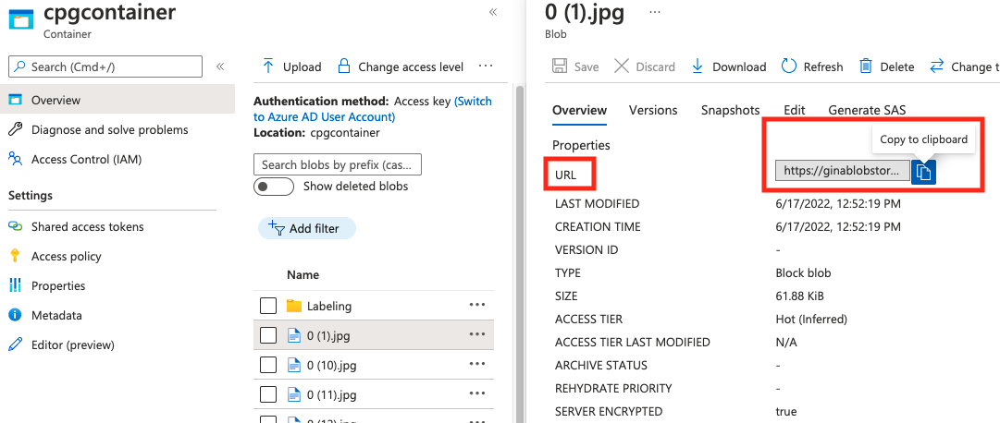
> 
> ### "annotations": []
> 
> | Key | Value (example) | Description | Mandatory |
> |-|-|-|-|
> | id | integer | ID of the annotation | Yes |
> | category_id | integer | ID of the category defined in the `categories` section | Yes |
> | image_id  | integer | ID of the image | Yes |
> | area | integer | Value of 'Width' x 'Height' (third and fourth values of `bbox`) | No |
> | bbox | float | Relative coordinates of the bounding box (0 to 1), in the order of 'Left', 'Top', 'Width', 'Height'  | Yes |
> 
> ### "categories": []
> 
> | Key | Value (example) | Description | Mandatory |
> |-|-|-|-|
> | id | integer | Unique id for each category (label class). These should be present in the `annotations` section. | Yes |
> | name| string | Name of the category (label class) | Yes |


## Train the custom model

To train a classifier model with your COCO file, select the **Custom models** tab and select `Add a new model`. Enter a name for the model and select `tbd` for Image classification.

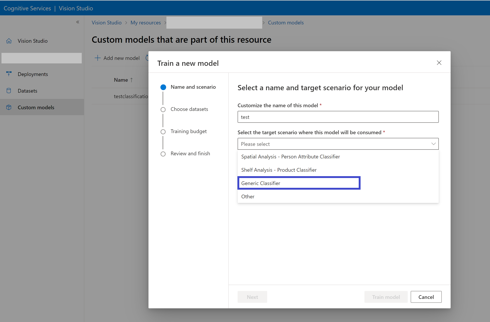

Select your datasets, which is now associated with the COCO file containing the labeling information.

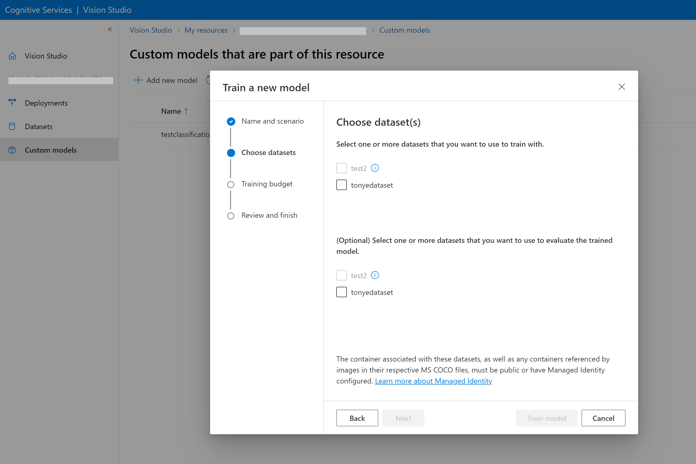

Select a budget and train the model. For this small example, you can use a `1 hour` budget.

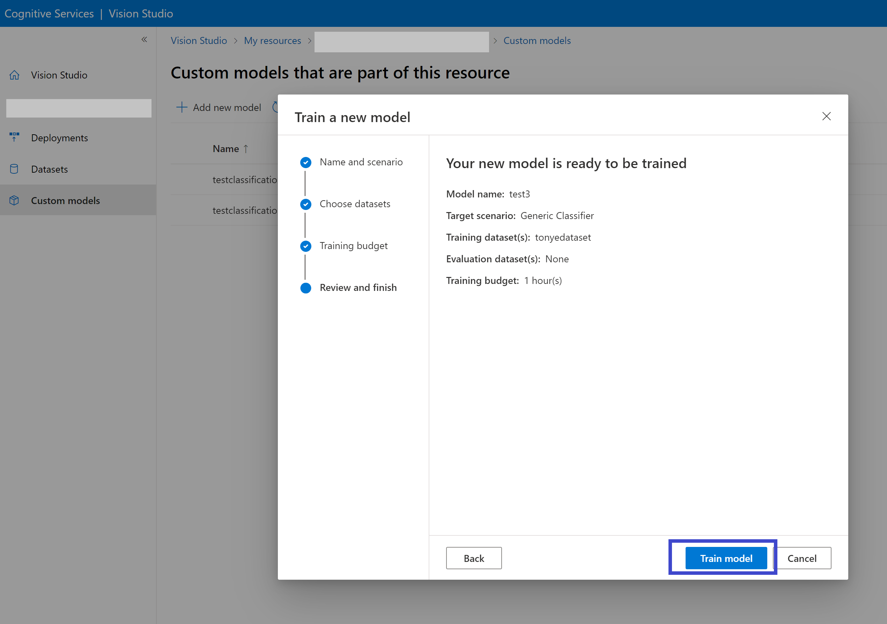

## Evaluate the trained model

After the training has completed, the model's performance is estimated based on data in the training dataset. You can optionally create evaluation datasets (using the same process as above) to use at this step for model evaluation.


## Use custom model to generate predictions

Once you've build a custom model, you can go back to the **Extract common tags from images** tile in Vision Studio and test it by uploading new images.

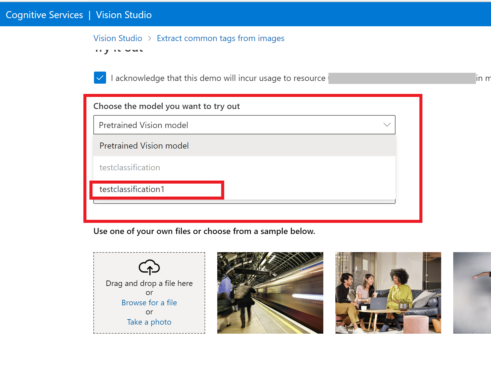

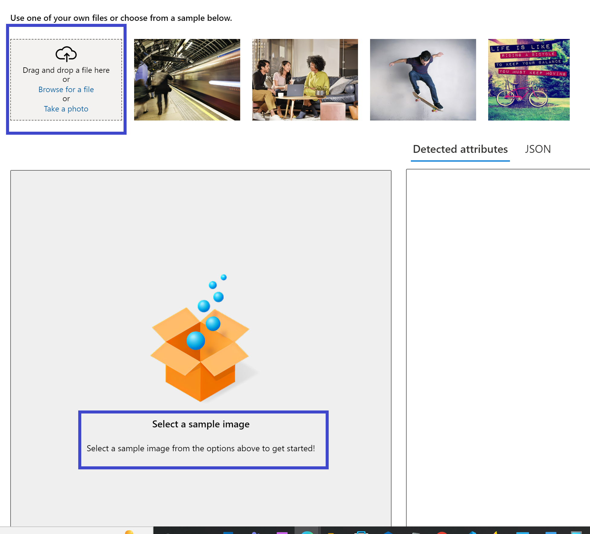

The prediction results will appear in the right column.

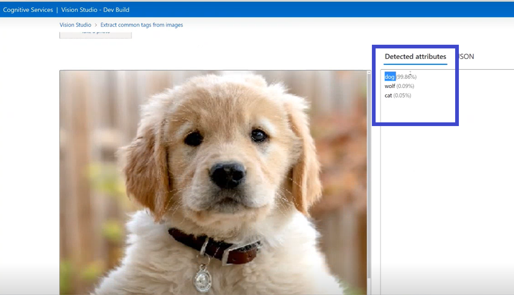


## Using REST API

datasets/name PUT registers a new dataset. the dataset JSON specifies details.

models/name PUT trains the custom model. the name param names the model. the model JSON specifies the dataset (and probably the model type)

models/name/evaluations/evalName PUT evaluates an existing model. uses ModelEvaluation JSON

imageanalysis/analyze POST you can specify a custom model in the _model-name_ param. Uses ImageURL JSON


## Next steps

In this guide, you created and trained a custom image classification model using Image Analysis. Next, learn more about the Analyze API, so you can query your custom model from an application.

* [Call the Analyze Image API](./call-analyze-image-40.md)
* See the [Model customization concepts](../concept-model-customization.md) guide for a broad overview of the feature and a list of frequently asked questions.