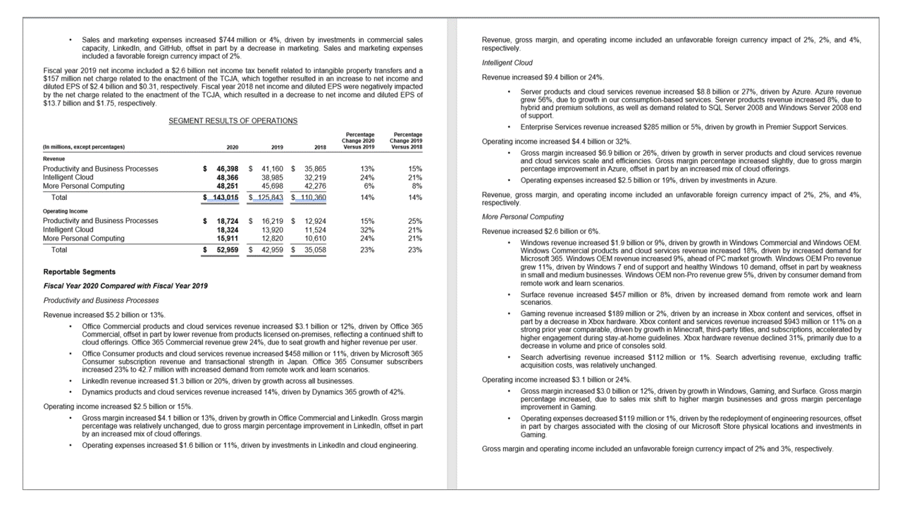

# What is Optical character recognition?

Optical character recognition (OCR) allows you to extract printed or handwritten text from images, such as photos of street signs and products, as well as from documents&mdash;invoices, bills, financial reports, articles, and more. Microsoft's OCR technologies support extracting printed text in [several languages](./language-support.md). 

Follow a [quickstart](./quickstarts-sdk/client-library.md) to get started with the REST API or a client SDK. Or, try out the capabilities of OCR quickly and easily in your browser using Vision Studio.

> [!div class="nextstepaction"]
> [Try Vision Studio](https://portal.vision.cognitive.azure.com/)

This documentation contains the following types of articles:
* The [quickstarts](./quickstarts-sdk/client-library.md) are step-by-step instructions that let you make calls to the service and get results in a short period of time. 
* The [how-to guides](./how-to/call-read-api.md) contain instructions for using the service in more specific or customized ways.
<!--* The [conceptual articles](how-to/call-read-api.md) provide in-depth explanations of the service's functionality and features.
* The [tutorials](./tutorials/storage-lab-tutorial.md) are longer guides that show you how to use this service as a component in broader business solutions. -->

For a more structured approach, follow a Learn module for OCR.
* [Read Text in Images and Documents with the Computer Vision Service](/learn/modules/read-text-images-documents-with-computer-vision-service/)

## Read API 

The Computer Vision [Read API](https://westus.dev.cognitive.microsoft.com/docs/services/computer-vision-v3-2/operations/5d986960601faab4bf452005) is Azure's latest OCR technology ([learn what's new](./whats-new.md)) that extracts printed text (in several languages), handwritten text (in several languages), digits, and currency symbols from images and multi-page PDF documents. It's optimized to extract text from text-heavy images and multi-page PDF documents with mixed languages. It supports extracting both printed and handwritten text in the same image or document.

## Input requirements

The **Read** call takes images and documents as its input. They have the following requirements:

* Supported file formats: JPEG, PNG, BMP, PDF, and TIFF
* For PDF and TIFF files, up to 2000 pages (only the first two pages for the free tier) are processed.
* The file size of images must be less than 500 MB (4 MB for the free tier) and dimensions at least 50 x 50 pixels and at most 10000 x 10000 pixels. PDF files do not have a size limit.
* The minimum height of the text to be extracted is 12 pixels for a 1024 x 768 image. This corresponds to about 8 font point text at 150 DPI.

## Supported languages
The Read API latest generally available (GA) model supports 164 languages for print text and 9 languages for handwritten text.

OCR for print text includes support for English, French, German, Italian, Portuguese, Spanish, Chinese, Japanese, Korean, Russian, Arabic, Hindi, and other international languages that use Latin, Cyrillic, Arabic, and Devanagari scripts.

OCR for handwritten text includes support for English, Chinese Simplified, French, German, Italian, Japanese, Korean, Portuguese, Spanish languages.

See [How to specify the model version](./how-to/call-read-api.md#determine-how-to-process-the-data-optional) to use the preview languages and features. Refer to the full list of [OCR-supported languages](./language-support.md#optical-character-recognition-ocr).

## Key features

The Read API includes the following features.

* Print text extraction in 164 languages
* Handwritten text extraction in nine languages
* Text lines and words with location and confidence scores
* No language identification required
* Support for mixed languages, mixed mode (print and handwritten)
* Select pages and page ranges from large, multi-page documents
* Natural reading order option for text line output (Latin only)
* Handwriting classification for text lines (Latin only)
* Available as Distroless Docker container for on-premises deployment

Learn [how to use the OCR features](./how-to/call-read-api.md).

## Use the cloud API or deploy on-premises
The Read 3.x cloud APIs are the preferred option for most customers because of ease of integration and fast productivity out of the box. Azure and the Computer Vision service handle scale, performance, data security, and compliance needs while you focus on meeting your customers' needs.

For on-premises deployment, the [Read Docker container (preview)](./computer-vision-how-to-install-containers.md) enables you to deploy the new OCR capabilities in your own local environment. Containers are great for specific security and data governance requirements.

> [!WARNING]
> The Computer Vision [RecognizeText](https://westus.dev.cognitive.microsoft.com/docs/services/5cd27ec07268f6c679a3e641/operations/587f2c6a1540550560080311) and [ocr](https://westus.dev.cognitive.microsoft.com/docs/services/computer-vision-v3-2/operations/56f91f2e778daf14a499f20d) operations are no longer maintained, and are in the process of being deprecated in favor of the new [Read API](#read-api) covered in this article. Existing customers should [transition to using Read operations](upgrade-api-versions.md).

## Data privacy and security

As with all of the Cognitive Services, developers using the Computer Vision service should be aware of Microsoft's policies on customer data. See the [Cognitive Services page](https://www.microsoft.com/trustcenter/cloudservices/cognitiveservices) on the Microsoft Trust Center to learn more.

## Next steps

- Get started with the [OCR (Read) REST API or client library quickstarts](./quickstarts-sdk/client-library.md).
- Learn about the [Read 3.2 REST API](https://westus.dev.cognitive.microsoft.com/docs/services/computer-vision-v3-2/operations/5d986960601faab4bf452005).
