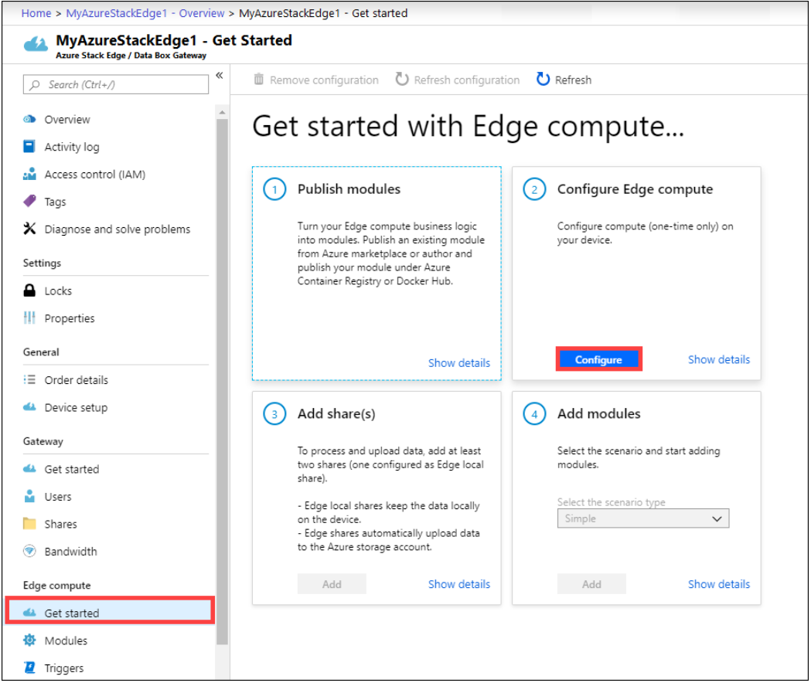
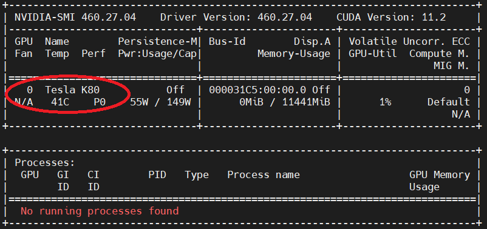

# Install and run the spatial analysis container (Preview)

The spatial analysis container enables you to analyze real-time streaming video to understand spatial relationships between people, their movement, and interactions with objects in physical environments. Containers are great for specific security and data governance requirements.

## Prerequisites

* Azure subscription - [Create one for free](https://azure.microsoft.com/free/cognitive-services)
* Once you have your Azure subscription, <a href="https://portal.azure.com/#create/Microsoft.CognitiveServicesComputerVision"  title="Create a Computer Vision resource"  target="_blank">create a Computer Vision resource <span class="docon docon-navigate-external x-hidden-focus"></span></a> in the Azure portal to get your key and endpoint. After it deploys, click **Go to resource**.
    * You will need the key and endpoint from the resource you create to run the spatial analysis container. You'll use your key and endpoint later.


### Spatial analysis container requirements

To run the spatial analysis container, you need a compute device with a [NVIDIA Tesla T4 GPU](https://www.nvidia.com/en-us/data-center/tesla-t4/). We recommend that you use [Azure Stack Edge](https://azure.microsoft.com/products/azure-stack/edge/) with GPU acceleration, however the container runs on any other desktop machine that meets the minimum requirements. We will refer to this device as the host computer.

#### [Azure Stack Edge device](#tab/azure-stack-edge)

Azure Stack Edge is a Hardware-as-a-Service solution and an AI-enabled edge computing device with network data transfer capabilities. For detailed preparation and setup instructions, see the [Azure Stack Edge documentation](https://docs.microsoft.com/azure/databox-online/azure-stack-edge-deploy-prep).

#### [Desktop machine](#tab/desktop-machine)

#### Minimum hardware requirements

* 4 GB system RAM
* 4 GB of GPU RAM
* 8 core CPU
* 1 NVIDIA Tesla T4 GPU
* 20 GB of HDD space

#### Recommended hardware

* 32 GB system RAM
* 16 GB of GPU RAM
* 8 core CPU
* 2 NVIDIA Tesla T4 GPUs
* 50 GB of SSD space

In this article, you will download and install the following software packages. The host computer must be able to run the following (see below for instructions):

* [NVIDIA graphics drivers](https://docs.nvidia.com/datacenter/tesla/tesla-installation-notes/index.html) and [NVIDIA CUDA Toolkit](https://docs.nvidia.com/cuda/cuda-installation-guide-linux/index.html)
* Configurations for [NVIDIA MPS](https://docs.nvidia.com/deploy/pdf/CUDA_Multi_Process_Service_Overview.pdf) (Multi-Process Service).
* [Docker CE](https://docs.docker.com/install/linux/docker-ce/ubuntu/#install-docker-engine---community-1) and [NVIDIA-Docker2](https://github.com/NVIDIA/nvidia-docker) 
* [Azure IoT Edge](https://docs.microsoft.com/azure/iot-edge/how-to-install-iot-edge-linux) runtime.

---

| Requirement | Description |
|--|--|
| Camera | The spatial analysis container is not tied to a specific camera brand. The camera device needs to: support Real-Time Streaming Protocol(RTSP) and H.264 encoding, be accessible to the host computer, and be capable of streaming at 15FPS and 1080p resolution. |
| Linux OS | [Ubuntu Desktop 18.04 LTS](http://releases.ubuntu.com/18.04/) must be installed on the host computer.  |


## Request approval to run the container

Fill out and submit the [request form](https://aka.ms/csgate) to request approval to run the container.

The form requests information about you, your company, and the user scenario for which you'll use the container. After you submit the form, the Azure Cognitive Services team will review it and email you with a decision.

> [!IMPORTANT]
> * On the form, you must use an email address associated with an Azure subscription ID.
> * The Computer Vision resource you use to run the container must have been created with the approved Azure subscription ID.

After you're approved, you will be able to run the container after downloading it from the Microsoft Container Registry (MCR), described later in the article.

You won't be able to run the container if your Azure subscription has not been approved.

## Set up the host computer

It is recommended that you use an Azure Stack Edge device for your host computer. Click **Desktop Machine** if you're configuring a different device.

#### [Azure Stack Edge device](#tab/azure-stack-edge)

### Configure compute on the Azure Stack Edge portal 
 
Spatial analysis uses the compute features of the Azure Stack Edge to run an AI solution. To enable the compute features, make sure that: 

* You've [connected and activated](https://docs.microsoft.com/azure/databox-online/azure-stack-edge-deploy-connect-setup-activate) your Azure Stack Edge device. 
* You have a Windows client system running PowerShell 5.0 or later, to access the device.  
* To deploy a Kubernetes cluster, you need to configure your Azure Stack Edge device via the **Local UI** on the [Azure portal](https://portal.azure.com/): 
  1. Enable the compute feature on your Azure Stack Edge device. To enable compute, go to the **Compute** page in the web interface for your device. 
  2. Select a network interface that you want to enable for compute, then click **Enable**. This will create a virtual switch on your device, on that network interface.
  3. Leave the Kubernetes test node IP addresses and the Kubernetes external services IP addresses blank.
  4. Click **Apply**. This operation may take about two minutes. 


### Set up an Edge compute role and create an IoT Hub resource

In the [Azure portal](https://portal.azure.com/), navigate to your Azure Stack Edge resource. On the **Overview** page or navigation list, click the Edge compute **Get started** button. In the **Configure Edge compute** tile, click **Configure**. 



In the **Configure Edge compute** page, choose an existing IoT Hub, or choose to create a new one. By default, a Standard (S1) pricing tier is used to create an IoT Hub resource. To use a free tier IoT Hub resource, create one and then select it. The IoT Hub resource uses the same subscription and resource group that is used by the Azure Stack Edge resource 

Click **Create**. The IoT Hub resource creation may take a couple of minutes. After the IoT Hub resource is created, the **Configure Edge compute** tile will update to show the new configuration. To confirm that the Edge compute role has been configured, select **View config** on the **Configure compute** tile.

When the Edge compute role is set up on the Edge device, it creates two devices: an IoT device and an IoT Edge device. Both devices can be viewed in the IoT Hub resource. The Azure IoT Edge Runtime will already be running on the IoT Edge device.         	 

> [!NOTE]
> * Currently only the Linux platform is supported for IoT Edge devices. For help troubleshooting the Azure Stack Edge device, see the [logging and troubleshooting](spatial-analysis-logging.md) article.
> * To learn more about how to configure an IoT Edge device to communicate through a proxy server, see [Configure an IoT Edge device to communicate through a proxy server](https://docs.microsoft.com/azure/iot-edge/how-to-configure-proxy-support#azure-portal)

###  Enable MPS on Azure Stack Edge 

1. Run a Windows PowerShell session as an Administrator. 

2. Make sure that the Windows Remote Management service is running on your client. In the PowerShell terminal, use the following command 
    
    ```powershell
    winrm quickconfig
    ```
    
    If you see warnings about a firewall exception, check your network connection type, and see the [Windows Remote Management](https://docs.microsoft.com/windows/win32/winrm/installation-and-configuration-for-windows-remote-management) documentation.

3. Assign a variable to the device IP address. 
    
    ```powershell
    $ip = "" Replace with the IP address of your device. 
    ```
    
4. To add the IP address of your device to the client’s trusted hosts list, use the following command: 
    
    ```powershell
    Set-Item WSMan:\localhost\Client\TrustedHosts $ip -Concatenate -Force 
    ```

5. Start a Windows PowerShell session on the device. 

    ```powershell
    Enter-PSSession -ComputerName $ip -Credential $ip\EdgeUser -ConfigurationName Minishell 
    ```

6. Provide the password when prompted. Use the same password that is used to sign into the local web UI. The default local web UI password is `Password1`.

Type `Start-HcsGpuMPS` to start the MPS service on the device. 

For help troubleshooting the Azure Stack Edge device, see [Troubleshooting the Azure Stack Edge device](spatial-analysis-logging.md#troubleshooting-the-azure-stack-edge-device) 

#### [Desktop machine](#tab/desktop-machine)

Follow these instructions if your host computer isn't an Azure Stack Edge device.

#### Install NVIDIA CUDA Toolkit and Nvidia graphics drivers on the host computer

Use the following bash script to install the required Nvidia graphics drivers, and CUDA Toolkit.

```bash
wget https://developer.download.nvidia.com/compute/cuda/repos/ubuntu1804/x86_64/cuda-ubuntu1804.pin
sudo mv cuda-ubuntu1804.pin /etc/apt/preferences.d/cuda-repository-pin-600
sudo apt-key adv --fetch-keys https://developer.download.nvidia.com/compute/cuda/repos/ubuntu1804/x86_64/7fa2af80.pub
sudo add-apt-repository "deb http://developer.download.nvidia.com/compute/cuda/repos/ubuntu1804/x86_64/ /"
sudo apt-get update
sudo apt-get -y install cuda
```

Reboot the machine, and run the following command.

```bash
nvidia-smi
```

You should see the following output.



### Install Docker CE and nvidia-docker2 on the host computer

Install Docker CE on the host computer.

```bash
sudo apt-get update
sudo apt-get install -y apt-transport-https ca-certificates curl gnupg-agent software-properties-common
curl -fsSL https://download.docker.com/linux/ubuntu/gpg | sudo apt-key add -
sudo add-apt-repository "deb [arch=amd64] https://download.docker.com/linux/ubuntu $(lsb_release -cs) stable"
sudo apt-get update
sudo apt-get install -y docker-ce docker-ce-cli containerd.io
```

Install the *nvidia-docker-2* software package.

```bash
distribution=$(. /etc/os-release;echo $ID$VERSION_ID)
curl -s -L https://nvidia.github.io/nvidia-docker/gpgkey | sudo apt-key add -
curl -s -L https://nvidia.github.io/nvidia-docker/$distribution/nvidia-docker.list | sudo tee /etc/apt/sources.list.d/nvidia-docker.list
sudo apt-get update
sudo apt-get install -y docker-ce nvidia-docker2
sudo systemctl restart docker
```

## Enable NVIDIA MPS on the host computer

> [!TIP]
> * Don't install MPS if your GPU compute capability is less than 7.x (pre Volta). See [CUDA Compatability](https://docs.nvidia.com/deploy/cuda-compatibility/index.html#support-title) for reference. 
> * Run the MPS instructions from a terminal window on the host computer. Not inside your Docker container instance.

For best performance and utilization, configure the host computer's GPU(s) for [NVIDIA Multiprocess Service (MPS)](https://docs.nvidia.com/deploy/pdf/CUDA_Multi_Process_Service_Overview.pdf). Run the MPS instructions from a terminal window on the host computer.

```bash
# Set GPU(s) compute mode to EXCLUSIVE_PROCESS
sudo nvidia-smi --compute-mode=EXCLUSIVE_PROCESS

# Cronjob for setting GPU(s) compute mode to EXCLUSIVE_PROCESS on boot
echo "SHELL=/bin/bash" > /tmp/nvidia-mps-cronjob
echo "PATH=/usr/local/sbin:/usr/local/bin:/sbin:/bin:/usr/sbin:/usr/bin" >> /tmp/nvidia-mps-cronjob
echo "@reboot   root    nvidia-smi --compute-mode=EXCLUSIVE_PROCESS" >> /tmp/nvidia-mps-cronjob

sudo chown root:root /tmp/nvidia-mps-cronjob
sudo mv /tmp/nvidia-mps-cronjob /etc/cron.d/

# Service entry for automatically starting MPS control daemon
echo "[Unit]" > /tmp/nvidia-mps.service
echo "Description=NVIDIA MPS control service" >> /tmp/nvidia-mps.service
echo "After=cron.service" >> /tmp/nvidia-mps.service
echo "" >> /tmp/nvidia-mps.service
echo "[Service]" >> /tmp/nvidia-mps.service
echo "Restart=on-failure" >> /tmp/nvidia-mps.service
echo "ExecStart=/usr/bin/nvidia-cuda-mps-control -f" >> /tmp/nvidia-mps.service
echo "" >> /tmp/nvidia-mps.service
echo "[Install]" >> /tmp/nvidia-mps.service
echo "WantedBy=multi-user.target" >> /tmp/nvidia-mps.service

sudo chown root:root /tmp/nvidia-mps.service
sudo mv /tmp/nvidia-mps.service /etc/systemd/system/

sudo systemctl --now enable nvidia-mps.service
```

## Configure Azure IoT Edge on the host computer

To deploy the spatial analysis container on the host computer, create an instance of an [Azure IoT Hub](https://docs.microsoft.com/azure/iot-hub/iot-hub-create-through-portal) service using the Standard (S1) or Free (F0) pricing tier. If your host computer is an Azure Stack Edge, use the same subscription and resource group that is used by the Azure Stack Edge resource.

Use the Azure CLI to create an instance of Azure IoT Hub. Replace the parameters where appropriate. Alternatively, you can create the Azure IoT Hub on the [Azure portal](https://portal.azure.com/).

```bash
curl -sL https://aka.ms/InstallAzureCLIDeb | sudo bash
az login
az account set --subscription <name or ID of Azure Subscription>
az group create --name "test-resource-group" --location "WestUS"

az iot hub create --name "test-iot-hub-123" --sku S1 --resource-group "test-resource-group"

az iot hub device-identity create --hub-name "test-iot-hub-123" --device-id "my-edge-device" --edge-enabled
```

If the host computer isn't an Azure Stack Edge device, you will need to install [Azure IoT Edge](https://docs.microsoft.com/azure/iot-edge/how-to-install-iot-edge-linux) version 1.0.9. Follow these steps to download the correct version:

Ubuntu Server 18.04:
```bash
curl https://packages.microsoft.com/config/ubuntu/18.04/multiarch/prod.list > ./microsoft-prod.list
```

Copy the generated list.
```bash
sudo cp ./microsoft-prod.list /etc/apt/sources.list.d/
```

Install the Microsoft GPG public key.

```bash
curl https://packages.microsoft.com/keys/microsoft.asc | gpg --dearmor > microsoft.gpg
sudo cp ./microsoft.gpg /etc/apt/trusted.gpg.d/
```

Update the package lists on your device.

```bash
sudo apt-get update
```

Install the 1.0.9 release:

```bash
sudo apt-get install iotedge=1.0.9* libiothsm-std=1.0.8*
```

Next, register the host computer as an IoT Edge device in your IoT Hub instance, using a [connection string](https://docs.microsoft.com/azure/iot-edge/how-to-register-device#register-in-the-azure-portal).

You need to connect the IoT Edge device to your Azure IoT Hub. You need to copy the connection string from the IoT Edge device you created earlier. Alternatively, you can run the below command in the Azure CLI.

```bash
az iot hub device-identity show-connection-string --device-id my-edge-device --hub-name test-iot-hub-123
```

On the host computer open  `/etc/iotedge/config.yaml` for editing. Replace `ADD DEVICE CONNECTION STRING HERE` with the connection string. Save and close the file. 
Run this command to restart the IoT Edge service on the host computer.

```bash
sudo systemctl restart iotedge
```

Deploy the spatial analysis container as an IoT Module on the host computer, either from the [Azure portal](https://docs.microsoft.com/azure/iot-edge/how-to-deploy-modules-portal) or [Azure CLI](https://docs.microsoft.com/azure/iot-edge/how-to-deploy-modules-cli). If you're using the portal, set the image URI to the location of your Azure Container Registry. 

Use the below steps to deploy the container using the Azure CLI.

---

### IoT Deployment manifest

To streamline container deployment on multiple host computers, you can create a deployment manifest file to specify the container creation options, and environment variables. You can find an example of a deployment manifest [for Azure Stack Edge](https://go.microsoft.com/fwlink/?linkid=2142179) and  [other desktop machines](https://github.com/Azure-Samples/cognitive-services-sample-data-files/blob/master/ComputerVision/spatial-analysis/DeploymentManifest_for_non_ASE_devices.json) on Github.

The following table shows the various Environment Variables used by the IoT Edge Module. You can also set them in the deployment manifest linked above, using the `env` attribute in `spatialanalysis`:

| Setting Name | Value | Description|
|---------|---------|---------|
| ARCHON_LOG_LEVEL | Info; Verbose | Logging level, select one of the two values|
| ARCHON_SHARED_BUFFER_LIMIT | 377487360 | Do not modify|
| ARCHON_PERF_MARKER| false| Set this to true for performance logging, otherwise this should be false| 
| ARCHON_NODES_LOG_LEVEL | Info; Verbose | Logging level, select one of the two values|
| OMP_WAIT_POLICY | PASSIVE | Do not modify|
| QT_X11_NO_MITSHM | 1 | Do not modify|
| API_KEY | your API Key| Collect this value from Azure portal from your Computer Vision resource. You can find it in the **Key and endpoint** section for your resource. |
| BILLING_ENDPOINT | your Endpoint URI| Collect this value from Azure portal from your Computer Vision resource. You can find it in the **Key and endpoint** section for your resource.|
| EULA | accept | This value needs to be set to *accept* for the container to run |
| DISPLAY | :1 | This value needs to be same as the output of `echo $DISPLAY` on the host computer. Azure Stack Edge devices do not have a display. This setting is not applicable|


> [!IMPORTANT]
> The `Eula`, `Billing`, and `ApiKey` options must be specified to run the container; otherwise, the container won't start.  For more information, see [Billing](#billing).

Once you update the Deployment manifest for [Azure Stack Edge devices](https://go.microsoft.com/fwlink/?linkid=2142179) or [a desktop machine](https://github.com/Azure-Samples/cognitive-services-sample-data-files/blob/master/ComputerVision/spatial-analysis/DeploymentManifest_for_non_ASE_devices.json) with your own settings and selection of operations, you can use the below [Azure CLI](https://docs.microsoft.com/azure/iot-edge/how-to-deploy-modules-cli) command to deploy the container on the host computer, as an IoT Edge Module.

```azurecli
az login
az extension add --name azure-iot
az iot edge set-modules --hub-name "<IoT Hub name>" --device-id "<IoT Edge device name>" --content DeploymentManifest.json --subscription "<subscriptionId>"
```

|Parameter  |Description  |
|---------|---------|
| `--hub-name` | Your Azure IoT Hub name. |
| `--content` | The name of the deployment file. |
| `--target-condition` | Your IoT Edge device name for the host computer. |
| `-–subscription` | Subscription ID or name. |

This command will start the deployment. Navigate to the page of your Azure IoT Hub instance in the Azure portal to see the deployment status. The status may show as *417 – The device’s deployment configuration is not set* until the device finishes downloading the container images and starts running.

## Validate that the deployment is successful

There are several ways to validate that the container is running. Locate the *Runtime Status* in the **IoT Edge Module Settings** for the spatial analysis module in your Azure IoT Hub instance on the Azure portal. Validate that the **Desired Value** and **Reported Value** for the *Runtime Status* is *Running*.


Once the deployment is complete and the container is running, the **host computer** will start sending events to the Azure IoT Hub. If you used the `.debug` version of the operations, you’ll see a visualizer window for each camera you configured in the deployment manifest. You can now define the lines and zones you want to monitor in the deployment manifest and follow the instructions to deploy again. 

## Configure the operations performed by spatial analysis

You will need to use [spatial analysis operations](spatial-analysis-operations.md) to configure the container to use connected cameras, configure the operations, and more. For each camera device you configure, the operations for spatial analysis will generate an output stream of JSON messages, sent to your instance of Azure IoT Hub.

## Redeploy or delete the deployment

If you need to update the deployment, you need to make sure your previous deployments are successfully deployed, or you need to delete IoT Edge device deployments that did not complete. Otherwise, those deployments will continue, leaving the system in a bad state. You can use the Azure portal, or the [Azure CLI](https://docs.microsoft.com/cli/azure/ext/azure-cli-iot-ext/iot/edge/deployment).

## Use the output generated by the container

If you want to start consuming the output generated by the container, see the following articles:

*	Use the Azure Event Hub SDK for your chosen programming language to connect to the Azure IoT Hub endpoint and receive the events. See [Read device-to-cloud messages from the built-in endpoint](https://docs.microsoft.com/azure/iot-hub/iot-hub-devguide-messages-read-builtin) for more information. 
*	Set up Message Routing on your Azure IoT Hub to send the events to other endpoints or save the events to Azure Blob Storage, etc. See [IoT Hub Message Routing](https://docs.microsoft.com/azure/iot-hub/iot-hub-devguide-messages-d2c) for more information. 

## Running spatial analysis with a recorded video file

You can use spatial analysis with both recorded or live video. To use spatial analysis for recorded video, try recording a video file and save it as an mp4 file. Create a blob storage account in Azure, or use an existing one. Then update the following blob storage settings in the Azure portal:
	1. Change **Secure transfer required** to **Disabled**
	2. Change **Allow Blob public access** to **Enabled**

Navigate to the **Container** section, and either create a new container or use an existing one. Then upload the video file to the container. Expand the file settings for the uploaded file, and select **Generate SAS**. Be sure to set the **Expiry Date** long enough to cover the testing period. Set **Allowed Protocols** to *HTTP* (*HTTPS* is not supported).

Click on **Generate SAS Token and URL** and copy the Blob SAS URL. Replace the starting `https` with `http` and test the URL in a browser that supports video playback.

Replace `VIDEO_URL` in the deployment manifest for your [Azure Stack Edge device](https://go.microsoft.com/fwlink/?linkid=2142179) or another [desktop machine](https://github.com/Azure-Samples/cognitive-services-sample-data-files/blob/master/ComputerVision/spatial-analysis/DeploymentManifest_for_non_ASE_devices.json) with the URL you created, for all of the graphs. Set `VIDEO_IS_LIVE` to `false`, and redeploy the spatial analysis container with the updated manifest. See the example below.

The spatial analysis module will start consuming video file and will continuously auto replay as well.


```json
"zonecrossing": {
  "operationId" : "cognitiveservices.vision.spatialanalysis-personcrossingpolygon",
  "version": 1,
  "enabled": true,
  "parameters": {
      "VIDEO_URL": "Replace http url here",
      "VIDEO_SOURCE_ID": "personcountgraph",
      "VIDEO_IS_LIVE": false,
        "VIDEO_DECODE_GPU_INDEX": 0,
      "DETECTOR_NODE_CONFIG": "{ \"gpu_index\": 0 }",
      "SPACEANALYTICS_CONFIG": "{\"zones\":[{\"name\":\"queue\",\"polygon\":[[0.3,0.3],[0.3,0.9],[0.6,0.9],[0.6,0.3],[0.3,0.3]], \"threshold\":35.0}]}"
    }
  },

```

## Troubleshooting

If you encounter issues when starting or running the container, see [telemetry and troubleshooting](spatial-analysis-logging.md) for steps for common issues. This article also contains information on generating and collecting logs and collecting system health.

## Billing

The spatial analysis container sends billing information to Azure, using a Computer Vision resource on your Azure account. The use of spatial analysis in public preview is currently free. 

Azure Cognitive Services containers aren't licensed to run without being connected to the metering / billing endpoint. You must enable the containers to communicate billing information with the billing endpoint at all times. Cognitive Services containers don't send customer data, such as the video or image that's being analyzed, to Microsoft.


## Summary

In this article, you learned concepts and workflow for downloading, installing, and running the spatial analysis container. In summary:

* Spatial analysis is a Linux container for Docker.
* Container images are downloaded from the Microsoft Container Registry.
* Container images run as IoT Modules in Azure IoT Edge.
* How to configure the container and deploy it on a host machine.

## Next steps

* [Deploy a People Counting web application](spatial-analysis-web-app.md)
* [Configure spatial analysis operations](spatial-analysis-operations.md)
* [Logging and troubleshooting](spatial-analysis-logging.md)
* [Camera placement guide](spatial-analysis-camera-placement.md)
* [Zone and line placement guide](spatial-analysis-zone-line-placement.md)
