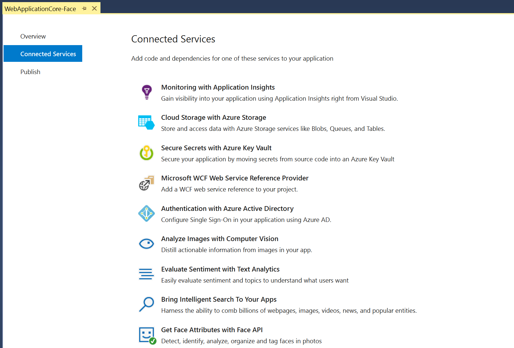
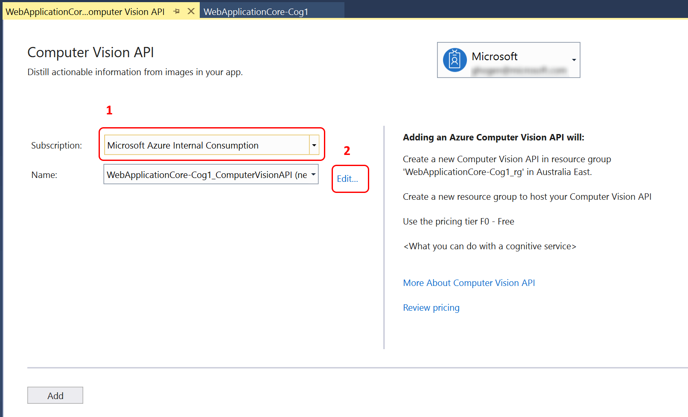
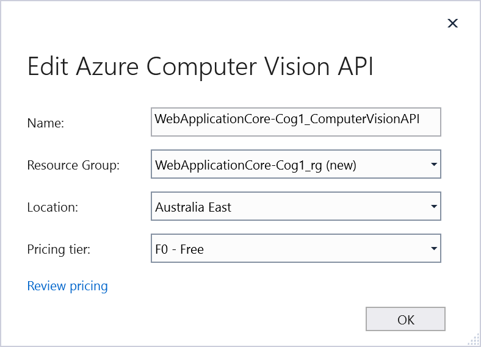
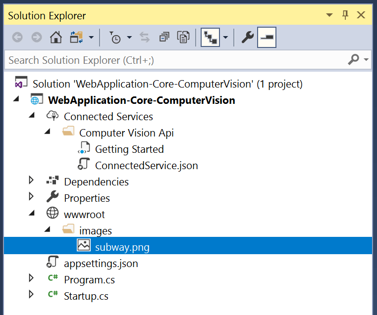
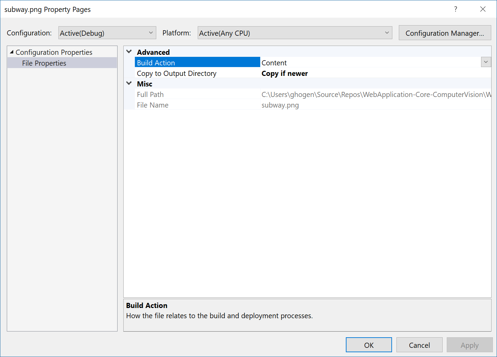
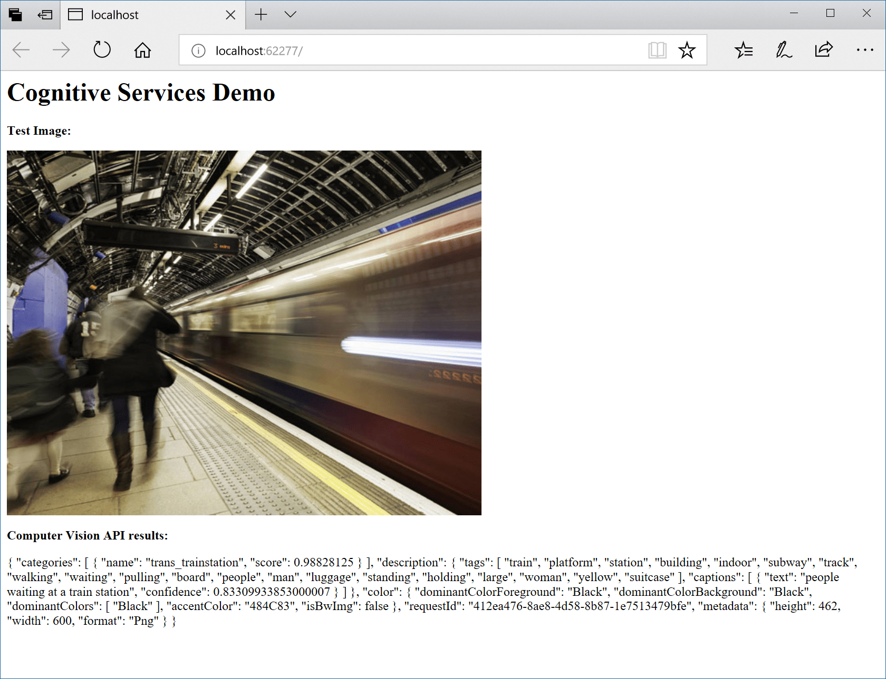

# Use Connected Services in Visual Studio to connect to the Computer Vision API

By using the Cognitive Services Computer Vision API, you can extract rich information to categorize and process visual data, and perform machine-assisted moderation of images to help curate your services.

This article and its companion articles provide details for using the Visual Studio Connected Service feature for Cognitive Services Computer Vision API. The capability is available in both Visual Studio 2017 15.7 or later, with the Cognitive Services extension installed.

## Prerequisites

- **An Azure subscription**. If you do not have one, you can sign up for a [free account](https://azure.microsoft.com/pricing/free-trial/).
- **Visual Studio 2017 version 15.7** with the **Web Development** workload installed. [Download it now](https://aka.ms/vsdownload?utm_source=mscom&utm_campaign=msdocs).

[!INCLUDE [vs-install-cognitive-services-vsix](../../../includes/vs-install-cognitive-services-vsix.md)]

## Add support to your project for Cognitive Services Computer Vision API

1. Create a new ASP.NET Core web project. Use the Empty project template. 

1. In **Solution Explorer**, choose **Add** > **Connected Service**.
   The Connected Service page appears with services you can add to your project.

   

1. In the menu of available services, choose **Cognitive Services Computer Vision API**.

   

   If you've signed into Visual Studio, and have an Azure subscription associated with your account, a page appears with a dropdown list with your subscriptions.

   

1. Select the subscription you want to use, and then choose a name for the Computer Vision API, or choose the Edit link to modify the automatically generated name, choose the resource group, and the Pricing Tier.

   

   Follow the link for details on the pricing tiers.

1. Choose Add to add supported for the Connected Service.
   Visual Studio modifies your project to add the NuGet packages, configuration file entries, and other changes to support a connection the Computer Vision API. The Output Window shows the log of what is happening to your project. You should see something like the following:

   ```output
   [4/26/2018 5:15:31.664 PM] Adding Computer Vision API to the project.
   [4/26/2018 5:15:32.084 PM] Creating new ComputerVision...
   [4/26/2018 5:15:32.153 PM] Creating new Resource Group...
   [4/26/2018 5:15:40.286 PM] Installing NuGet package 'Microsoft.Azure.CognitiveServices.Vision.ComputerVision' version 2.1.0.
   [4/26/2018 5:15:44.117 PM] Retrieving keys...
   [4/26/2018 5:15:45.602 PM] Changing appsettings.json setting: ComputerVisionAPI_ServiceKey=<service key>
   [4/26/2018 5:15:45.606 PM] Changing appsettings.json setting: ComputerVisionAPI_ServiceEndPoint=https://australiaeast.api.cognitive.microsoft.com/vision/v2.0
   [4/26/2018 5:15:45.609 PM] Changing appsettings.json setting: ComputerVisionAPI_Name=WebApplication-Core-ComputerVision_ComputerVisionAPI
   [4/26/2018 5:15:46.747 PM] Successfully added Computer Vision API to the project.
   ```
 
## Use the Computer Vision API to detect attributes of an image

1. Add the following using statements in Startup.cs.
 
   ```csharp
   using System.IO;
   using System.Text;
   using Microsoft.Extensions.Configuration;
   using System.Net.Http;
   using System.Net.Http.Headers;
   ```
 
1. Add a configuration field, and add a constructor that initializes the configuration field in the `Startup` class to enable configuration in your program.

   ```csharp
      private IConfiguration configuration;

      public Startup(IConfiguration configuration)
      {
          this.configuration = configuration;
      }
   ```

1. In the wwwroot folder in your project, add an images folder, and add an image file to your wwwroot folder. As an example, you can use one of the images on this [Computer Vision API page](https://azure.microsoft.com/services/cognitive-services/computer-vision/). Right-click on one of the images, save to your local hard drive, then in Solution Explorer, right-click on the images folder, and choosee **Add** > **Existing Item** to add it to your project. Your project should look something like this in Solution Explorer: 
  
    

1. Right-click on the image file, choose Properties, and then choose **Copy if newer**. 

    
 
1. Replace the Configure method with the following code to access the Computer Vision API and test an image.

   ```csharp
        // This method gets called by the runtime. Use this method to configure the HTTP request pipeline.
        public void Configure(IApplicationBuilder app, IHostingEnvironment env)
        {
            // TODO: Change this to your image's path on your site. 
            string imagePath = @"images/subway.png";

            // Enable static files such as image files. 
            app.UseStaticFiles();

            string visionApiKey = this.configuration["ComputerVisionAPI_ServiceKey"];
            string visionApiEndPoint = this.configuration["ComputerVisionAPI_ServiceEndPoint"];

            HttpClient client = new HttpClient();

            // Request headers.
            client.DefaultRequestHeaders.Add("Ocp-Apim-Subscription-Key", visionApiKey);

            // Request parameters. A third optional parameter is "details".
            string requestParameters = "visualFeatures=Categories,Description,Color&language=en";

            // Assemble the URI for the REST API Call.
            string uri = visionApiEndPoint + "/analyze" + "?" + requestParameters;

            HttpResponseMessage response;

            // Request body. Posts an image you've added to your site's images folder. 
            var fileInfo = env.WebRootFileProvider.GetFileInfo(imagePath);
            byte[] byteData = GetImageAsByteArray(fileInfo.PhysicalPath);

            string contentString = string.Empty;
            using (ByteArrayContent content = new ByteArrayContent(byteData))
            {
                // This example uses content type "application/octet-stream".
                // The other content types you can use are "application/json" and "multipart/form-data".
                content.Headers.ContentType = new MediaTypeHeaderValue("application/octet-stream");

                // Execute the REST API call.
                response = client.PostAsync(uri, content).Result;

                // Get the JSON response.
                contentString = response.Content.ReadAsStringAsync().Result;
            }

            if (env.IsDevelopment())
            {
                app.UseDeveloperExceptionPage();
            }

            app.Run(async (context) =>
            {
                await context.Response.WriteAsync("<h1>Cognitive Services Demo</h1>");
                await context.Response.WriteAsync($"<p><b>Test Image:</b></p>");
                await context.Response.WriteAsync($"<div></div>");
                await context.Response.WriteAsync($"<p><b>Computer Vision API results:</b></p>");
                await context.Response.WriteAsync("<p>");
                await context.Response.WriteAsync(JsonPrettyPrint(contentString));
                await context.Response.WriteAsync("<p>");
            });
        }

   ```
    The code here constructs a HTTP request with the URI and the image as binary content for a call to the Computer Vision REST API.

1. Add the helper functions GetImageAsByteArray and JsonPrettyPrint.

   ```csharp
        /// <summary>
        /// Returns the contents of the specified file as a byte array.
        /// </summary>
        /// <param name="imageFilePath">The image file to read.</param>
        /// <returns>The byte array of the image data.</returns>
        static byte[] GetImageAsByteArray(string imageFilePath)
        {
            FileStream fileStream = new FileStream(imageFilePath, FileMode.Open, FileAccess.Read);
            BinaryReader binaryReader = new BinaryReader(fileStream);
            return binaryReader.ReadBytes((int)fileStream.Length);
        }

        /// <summary>
        /// Formats the given JSON string by adding line breaks and indents.
        /// </summary>
        /// <param name="json">The raw JSON string to format.</param>
        /// <returns>The formatted JSON string.</returns>
        static string JsonPrettyPrint(string json)
        {
            if (string.IsNullOrEmpty(json))
                return string.Empty;

            json = json.Replace(Environment.NewLine, "").Replace("\t", "");

            string INDENT_STRING = "    ";
            var indent = 0;
            var quoted = false;
            var sb = new StringBuilder();
            for (var i = 0; i < json.Length; i++)
            {
                var ch = json[i];
                switch (ch)
                {
                    case '{':
                    case '[':
                        sb.Append(ch);
                        if (!quoted)
                        {
                            sb.AppendLine();
                        }
                        break;
                    case '}':
                    case ']':
                        if (!quoted)
                        {
                            sb.AppendLine();
                        }
                        sb.Append(ch);
                        break;
                    case '"':
                        sb.Append(ch);
                        bool escaped = false;
                        var index = i;
                        while (index > 0 && json[--index] == '\\')
                            escaped = !escaped;
                        if (!escaped)
                            quoted = !quoted;
                        break;
                    case ',':
                        sb.Append(ch);
                        if (!quoted)
                        {
                            sb.AppendLine();
                        }
                        break;
                    case ':':
                        sb.Append(ch);
                        if (!quoted)
                            sb.Append(" ");
                        break;
                    default:
                        sb.Append(ch);
                        break;
                }
            }
            return sb.ToString();
        }
   ```

1. Run the web application and see what Computer Vision API found in your image.

     

## Clean up resources

When no longer needed, delete the resource group. This deletes the cognitive service and related resources. To delete the resource group through the portal:

1. Enter the name of your resource group in the Search box at the top of the portal. When you see the resource group used in this QuickStart in the search results, select it.
2. Select **Delete resource group**.
3. In the **TYPE THE RESOURCE GROUP NAME:** box type in the name of the resource group and select **Delete**.

## Next steps

Learn more about the Computer Vision API by reading the [Computer Vision API Documentation](Home.md).
