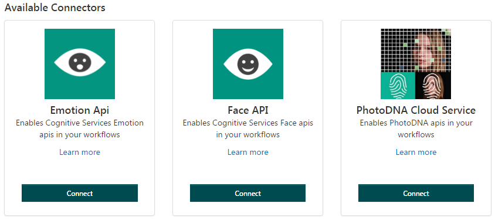
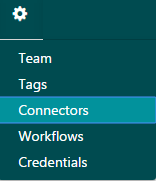
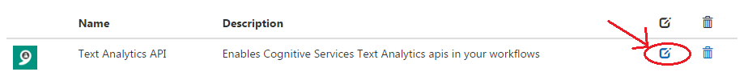
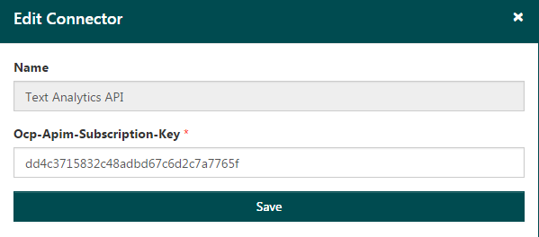
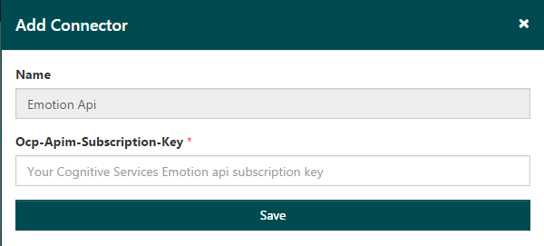

# About Connectors #

Workflows can use other APIs, not just the Content Manager API. However, other APIs first need to be connected to Content Manager using a Connector: the Connector provides a link to the other API.

Content Moderator includes Connectors by default, including these Connectors.

## Verifying your credentials ## 

Before you start defining a workflow, make sure you have valid credentials for the API you intend to use.

1.	Select Connectors from the Settings tab in the Review Tool Dashboard.

2.	Click the Edit symbol next to the connector for which you want credentials.

3.	The subscription key displays. If you make any edits, click Save when you are done.

 
## Adding a Connector ##

1.	Before you add a connector, you will need a subscription key. From the Settings > Credentials window, copy the Ocp-Admin-Subscription-Key.

2.	Click Connectors. From the available connectors displayed in the Review Tool Dashboard, click Connect. A window opens, asking for your subscription key.

3.	Paste the key you just copied into the Ocp-Admin-Subscription-Key field, then click Save.
