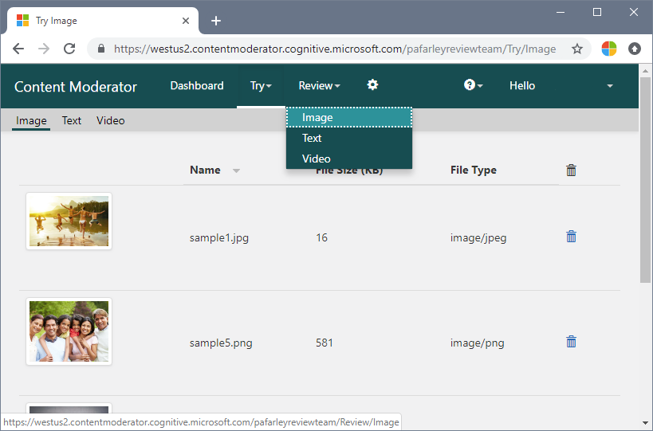
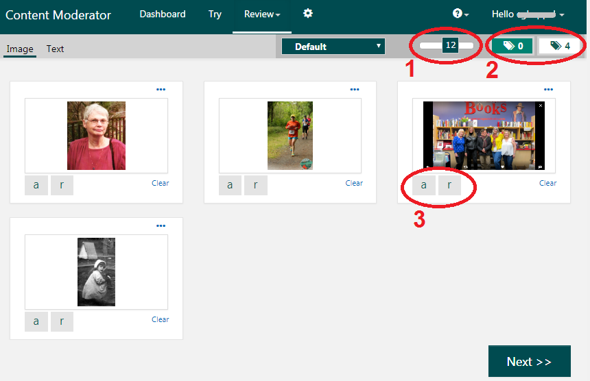
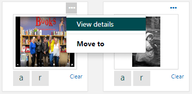
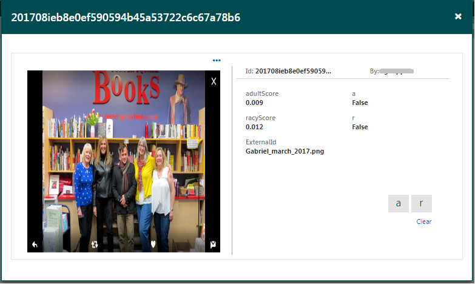

# Create human reviews

In this guide, you'll learn how to set up [reviews](../review-api.md#reviews) on the Review tool website. Reviews store and display content for human moderators to assess. Moderators can alter the applied tags and apply their own custom tags as appropriate. When a user completes a review, the results are sent to a specified callback endpoint, and the content is removed from the site.

## Prerequisites

- Sign in or create an account on the Content Moderator [Review tool](https://contentmoderator.cognitive.microsoft.com/) site.

## Image reviews

1. Go to the [Review tool](https://contentmoderator.cognitive.microsoft.com/), select the **Try** tab, and upload some images to review.
1. Once the uploaded images have finished processing, go to the **Review** tab and select **Image**.

    

    The images display with any labels that have been assigned by the automatic moderation process. The images you've submitted through the Review tool are not visible to other reviewers.

1. Optionally, move the **Reviews to display** slider (1) to adjust the number of images that are displayed on the screen. Click on the **tagged** or **untagged** buttons (2) to sort the images accordingly. Click on a tag panel (3) to toggle it on or off.

    

1. To see more information on an image, click on the ellipsis in the thumbnail and select **View details**. You can assign an image to a subteam with the **Move to** option (see the [teams](./configure.md#manage-team-and-subteams) section to learn more about subteams).

    

1. Browse the image moderation information on the details page.

    

1. Once you have reviewed and updated the tag assignments as needed, click **Next** to submit your reviews. After you submit, you have about five seconds to click the **Prev** button to return to the previous screen and review images again. After that, the images are no longer in the Submit queue and the **Prev** button is no longer available.

## Text reviews

Text reviews function similarly to image reviews. Instead of uploading content, you simply write or paste in text (up to 1,024 characters). Then, Content Moderator analyzes the text and applies tags (in addition to other moderation information, such as profanity and personal data). In text reviews, you can toggle the applied tags and/or apply custom tags before submitting the review.

## Next steps

In this guide, you learned how to set up and use reviews from the Content Moderator [Review tool](https://contentmoderator.cognitive.microsoft.com). Next, see the [REST API guide](../try-review-api-review.md) or the [.NET SDK guide](../moderation-reviews-quickstart-dotnet.md) to learn how to create reviews programmatically.