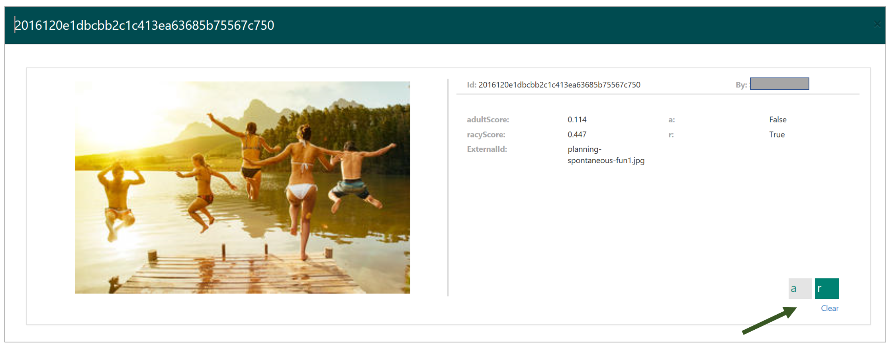
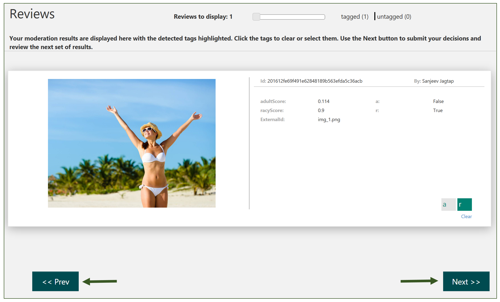

# Review moderated images #

Click the **Review** TAB to browse the auto-moderated images that are ready for review. Any labels assigned to the images are based on the default score thresholds for tagging the images. These thresholds are configurable.

Note that the images that you see on your screen are not available to other reviewers in your team while you are reviewing them.

## Zoom in/Zoom out to adjust the number of images ##

You can move the Reviews to display slider at the top of the screen to adjust the number of images displayed on the screen. Click on the tagged or untagged links to sort the images by tagged or untagged status respectively. Click the tags to toggle their selection status. You can also select any custom tags that you may have created.

## Click a thumbnail to view details ##

If you have thumbnails showing on your screen, click a thumbnail to bring up the detailed view. Click the tags to toggle their selection status. You can also select any custom tags that you may have created.

## Submit image reviews ##

Once you have reviewed and updated the tag selections, click the **Next** button to submit your reviews.

After you submit, you have about 5 seconds to use the Previous button to go back to your previous screen if you wanted to review them again. After that, the images will be out of the Submit queue and the **Previous** button will disappear from the screen.
