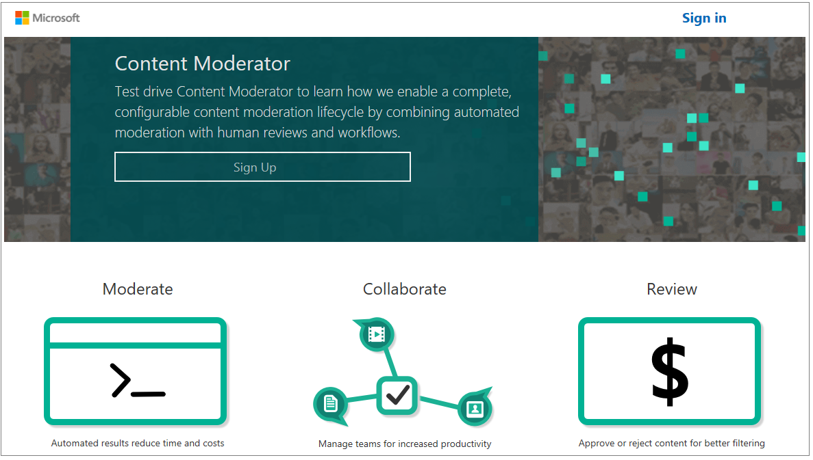
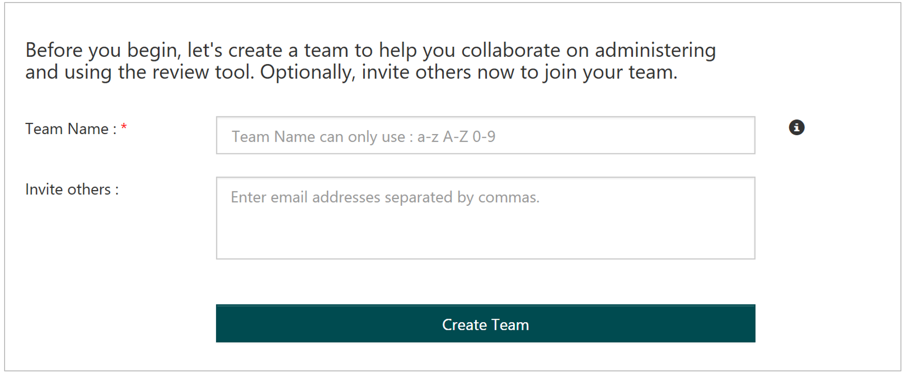

# Sign Up for Content Moderator #
Navigate to the [Content Moderator sign up](http://contentmoderator.cognitive.microsoft.com/Account/Signup) page. You can either sign up with your Microsoft account or create an account on the Content Moderator web site.

## Name Your Team ##
Provide a name for your review team. Optionally, you can invite your colleagues to join your team.

