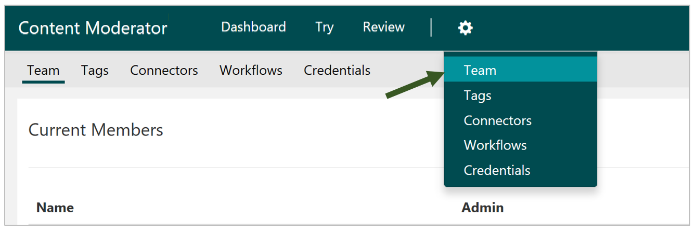
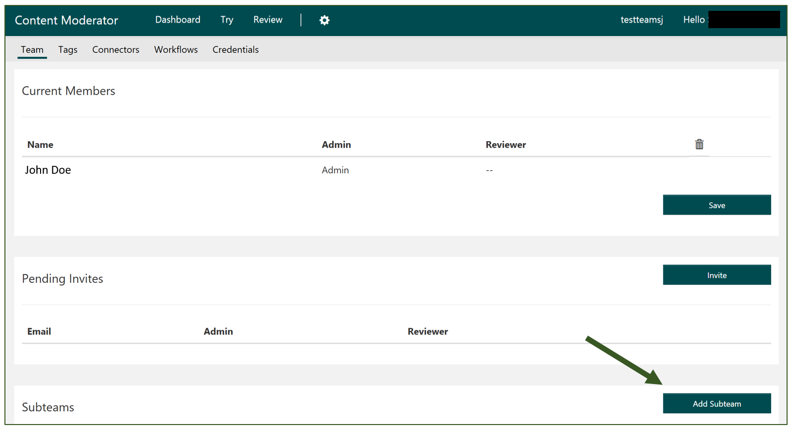

--
title: Teams and subteams in the Content Moderator API | Microsoft Docs
description: Learn how to use teams and subteams in the Content Moderator API for Cognitive Services.
services: cognitive-services
author: sanjeev3
manager: mikemcca

ms.service: cognitive-services
ms.technology: content-moderator
ms.topic: article
ms.date: 06/22/2017
ms.author: sajagtap
---

# Team and Subteams #

You must create a Team before using Content Moderator. When you sign up and name your team, this team will become your default team. 
You can only have one team in the Review tool. However, you can create multiple subteams. Subteams are useful for creating escalation teams or teams dedicated to reviewing specific categories of content. For example, you may want send adult content to a different team for more review.

This topic explains how to create subteams, and quickly assign reviews on the fly. However, you can use [Workflows](workflows.md) to assign reviews based on specific criteria.

## Go to the Teams Setting ##

To get started on creating a subteam, select the **Teams** option under Settings.

## Create subteams ##

The Default team contains all potential reviewers; subteams are subsets of the default team. You cannot assign someone to a subteam if they are not already members of the default team, so you need to add any reviewers to the default team now. Click the Invite button on the Team page.

### 1. Create a subteam.
Scroll down the Team page to the Subteam section. Click the Add Subteam button. 

### 2. Name your subteam.
Enter your subteam name in the dialog, then click Save.

### 3. Assign members from your default team.
Click the Add Member button to assign members from your default team to one or more subteams. You can only add existing users to a subteam. For adding new users who are not in the review tool, invite them by using the "Invite" button on the Team Settings page.

## Assign reviews to your subteams ##

Once you have your subteams created and team members assigned, you can start assigning image and text reviews to those subteams. This is done from the Review window.
If you want to assign an individual image to a subteam, click the ellipsis in the upper-right corner of the image, select Move to, and select a subteam.

## Switch between subteams to review assigned content ##

If you are a member of one or more subteams, you can switch between those subteams from the Review Tools Dashboard. To see all of the current pending reviews belonging to a subteam, select Choose Subteam from the Image tab.

