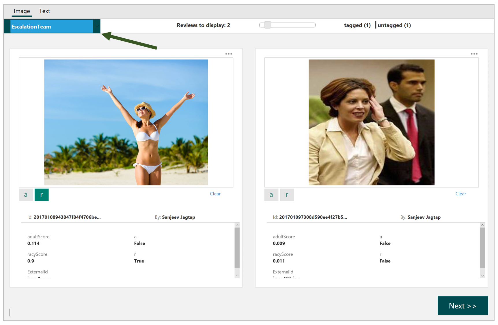

# Team and Subteams #

When you sign up and name your team, that creates your default team. In addition, you can create **subteams** within the review tool. Subteams are useful for creating escalation teams or teams dedicated to reviewing specific categories of content, for example, adult content.

## Go to the Teams Setting ##

To get started on creating a subteam, select the **Teams** option under Settings.

## Use the Subteam command ##

Scroll down the page and use the "**Add Subteam**" button to bring up the name dialog.

## Name your subteam ##

Enter your subteam name in the dialog. 

## Assign members from your default team ##

Use the "**Add Member**" option to assign members from your default team to one or more subteams. You can only add existing users to a subteam. For adding new users who are not in the review tool, invite them by using the "Invite" button on the Team Settings page.

## Assign reviews to your subteam ##

Once you have your subteams created and team members assigned, you can start assigning image and text reviews to those subteams. The following screen shows from where you can do so during the review process.

For images:

## Switch between subteams to review assigned content ##

If you are a member of one or more subteams, you can switch between your subteams as shown in the following screenshot.

## Review content within a subteam ##

Once you have your subteam selected, you will see all assigned and still pending content reviews for your attention.

