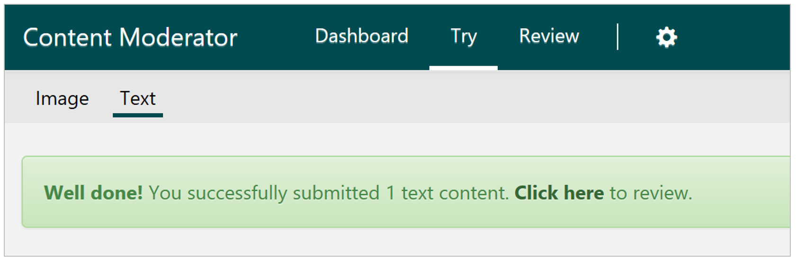
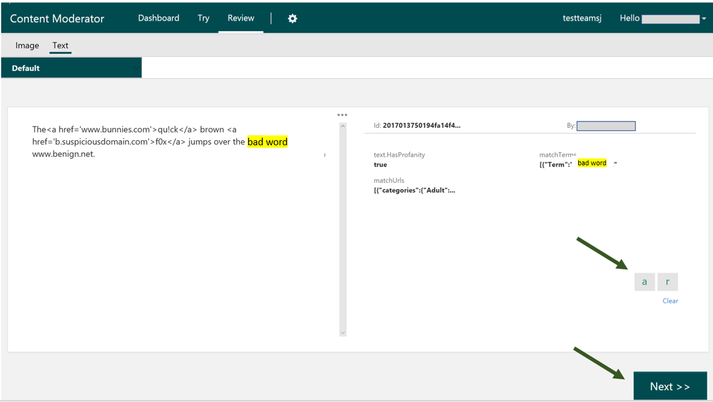

# Text Moderation Reviews #

## Select or enter the text to review ##

Click the **Try** TAB and select the "Text" option to bring up the Text Moderation start screen. Enter any text upto a maximum of 1024 characters or use the default sample text to submit for automated text moderation.

## Get ready to review results ##

The review tool will call the text moderation API and generate text reviews with the detected tags and match scores results within the review tool for your team's attention.

## Review text results ##

You will see detailed results including the detected tags and terms returned by the text moderation API show up on your screen. Click the tags to toggle their selection status. You can also work with any custom tags that you may have created.

