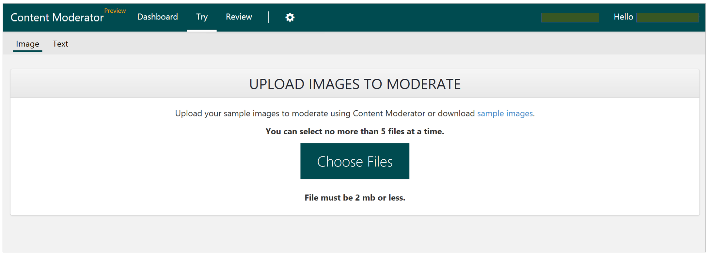
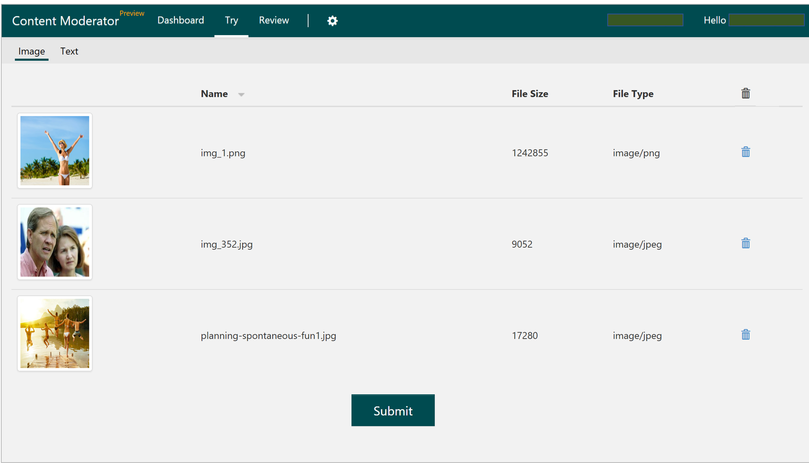

# Upload Images #

To explore the user interface, upload up to five images at a time, each image not to exceed 2 MB in file size. Be sure to check your file sizes before uploading.

## Submit for Moderation ##
If you end up uploading more than five images at a time, use the Trashcan icon to remove unwanted images. Then, submit the images for automated moderation.

