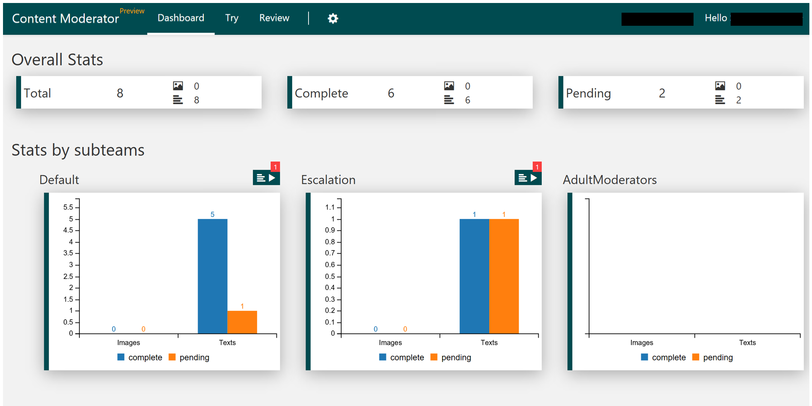

# View Dashboard #

Click the **Dashboard** TAB to see key metrics for all content review done within the tool. You can see total, completed, and in-progress reviews for images and text. You can see metrics for your default team and for your subteams.

