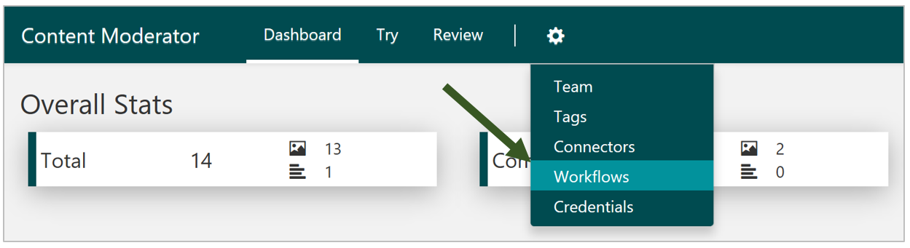
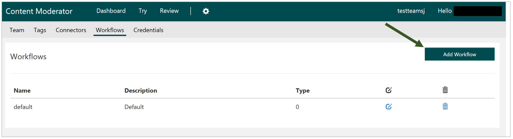
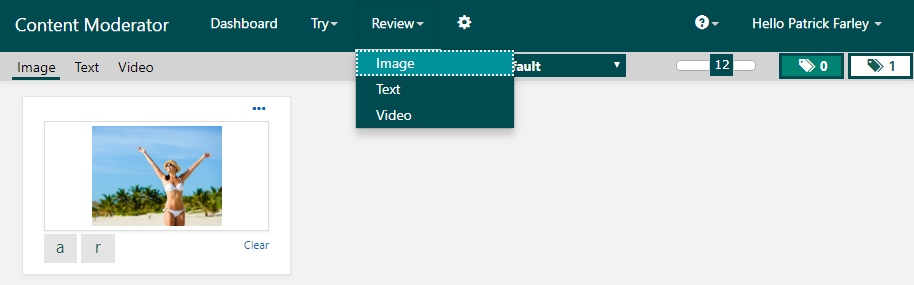

# Define and use moderation workflows

In this guide, you'll learn how to set up and use [workflows](../review-api.md#workflows) on the [Review tool](https://contentmoderator.cognitive.microsoft.com) website. Workflows are cloud-based customized filters that you can use to handle content more efficiently. Workflows can connect to a variety of services to filter content in different ways and then take the appropriate action. This guide shows you how to use the Content Moderator connector (which is included by default) to filter content and set up human reviews in a typical moderation scenario.

## Create a new workflow

Go to the [Content Moderator Review tool](https://contentmoderator.cognitive.microsoft.com/) and sign in. On the **Settings** tab, select **Workflows**.

On the next screen, select **Add Workflow**.

### Assign a name and description

Name your workflow, enter a description, and choose whether the workflow will handle images or text.

### Define evaluation criteria

On the next screen, go to the **If** section. In the top dropdown menu, choose **Condition**. This will allow you to configure the condition on which the workflow will take action. If you want to use multiple conditions, choose **Combination** instead. 

Next, select a connector. This example uses **Content Moderator**. Depending on the connector you choose, you will get different options for data output. See the [Connectors](./configure.md#connectors) section of the Review tool settings guide to learn how to set up other connectors.

Choose the desired output to use and set the conditions to check it against.

### Define the action

Go to the **Then** section, where you select an action. The following example creates an image review and assigns a tag. Optionally, you can add an alternative (Else) path and set an action for that as well.

### Save the workflow

Note the workflow name; you need the name to start a moderation job with the Workflow API (see below). Finally, save the workflow using the **Save** button at the top of the page.

## Test the workflow

Now that you have defined a custom workflow, test it with sample content. Go to **Workflows** and select the corresponding **Execute Workflow** button.

Save this [sample image](https://moderatorsampleimages.blob.core.windows.net/samples/sample2.jpg) to your local drive. Then select **Choose File(s)** and upload the image to the workflow.

### Track progress

You can view the progress of the workflow in the next popup window.

### Verify workflow action

Go to the **Image** tab under **Review** and verify that there is a newly created image review.

## Next steps

In this guide, you learned how to set up and use moderation workflows from the Content Moderator [Review tool](https://contentmoderator.cognitive.microsoft.com). Next, see the [REST API guide](../try-review-api-workflow.md) to learn how to create workflows programmatically.
